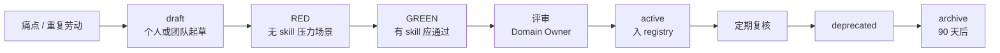

# 企业开发者如何管理和维护 Skills：一套完整的治理方法论

当 Agent 编程从个人尝鲜变成团队默认姿势，**Skills 会从「个人备忘录」变成组织资产**。个人可以靠直觉堆几十个 skill；企业不行——没有分层、分类和生命周期，三个月后会变成：**没人知道该 invoke 哪个、同名 skill 互相打架、过期规范还在误导 AI、安全红线藏在某个同事的 ~/.cursor 里**。

本文给出一套可落地的 **Skills 治理方法论**：用 **治理层级（Scope）** 和 **职能分类（Domain）** 两个正交维度组织资产，再补上 **类型、生命周期、冲突规则、目录约定与成熟度模型**。不绑定某一家 IDE，但以 Cursor / Claude Code / Codex 等「Markdown Skill + 规则文件」生态为默认语境。

---

## 先对齐：Skills 在企业里到底是什么

**Skill** 是把「老手 tacit knowledge」写成 Agent 可检索、可执行的 **SOP / 参考指南**——不是一次性聊天记录，也不是万能 prompt。

和相邻概念的分界：

| 概念 | 管什么 | 典型载体 | 与 Skill 的关系 |
| --- | --- | --- | --- |
| **Rules** | 始终生效的硬约束（风格、禁止项） | `.cursor/rules/*.mdc`、`AGENTS.md` | 约束行为边界；Skill 教 **怎么做** |
| **CLAUDE.md / 项目说明** | 本仓库的固定上下文 | 仓库根目录 | 项目级「常开背景」；细流程进 Skill |
| **Skill** | 按场景触发的流程、模式、领域知识 | `SKILL.md` + 可选 references | **按需加载**，靠 `description` 被发现 |
| **MCP / 工具** | 可执行的外部能力 | MCP server、CLI | Skill 描述 **何时调用哪类工具** |
| **Plan / Spec** | 单次任务的方案与验收 | `docs/specs/`、issue | 任务级；可沉淀为 Skill |

企业治理的核心问题不是「要不要写 Skill」，而是：**谁写、放哪一层、归哪一类、怎么更新、冲突听谁的、怎么证明它有效**。

---

## 方法论总览：两个正交维度 + 四条治理原则

### 两个维度

```text
                    职能分类（Domain）
                    安全 / 交付 / 业务 / …
                           ↑
                           │
         L0 平台通用 ──────┼────── L1 企业
         L2 事业部   ──────┼────── L3 团队
         L4 项目     ──────┼────── L5 个人
                           │
                           ↓
                    治理层级（Scope）
```

- **治理层级（Scope）**：这份 Skill **对谁生效、谁负责维护**——从平台通用到个人定制。
- **职能分类（Domain）**：这份 Skill **解决哪类问题**——安全、提效、写代码、业务域等；**同一 Skill 可打多个标签**。

两个维度独立：**「企业级支付安全 Skill」= Scope L1 + Domain 安全 + Domain 业务（支付）**。

### 四条治理原则

1. **默认可发现**：每个正式 Skill 必须有清晰的 `name`、`description`（第三人称 + 触发词），并进入目录（Registry）。
2. **显式优先级**：层级越高、越贴近合规的 Skill，在冲突时 **覆盖** 低层（除非明确标注 `extends` / `overrides`）。
3. **可验证**：关键 Skill（安全、发布、资金类）上线前用 **压力场景** 做 RED-GREEN 验证（对 Skill 做 TDD）。
4. **可退役**：Skill 和代码一样要 **deprecate → archive**，避免僵尸规范。

---

## 维度一：治理层级（Scope）

### 六级模型

| 层级 | 代号 | 范围 | 典型路径 / 分发方式 | 所有者 | 变更节奏 |
| --- | --- | --- | --- | --- | --- |
| **L0 平台通用** | `platform` | 全宇宙开发者 | Cursor 内置、`skills.sh`、Superpowers、厂商文档 | 平台 / 社区 | 随工具链升级 |
| **L1 企业** | `enterprise` | 全公司 | 企业 Skills 仓库、内部 npm/git submodule、MDM 下发 | 工程效能 / 架构委员会 + 安全 | 季度评审 + 紧急补丁 |
| **L2 事业部 / 部门** | `division` | 业务线、职能部门 | `org-skills/payment/`、`org-skills/growth/` | 事业部 TL + 领域专家 | 月度 |
| **L3 团队** | `team` | 小队、Feature Team | 团队 mono-repo 或 `team-skills` 包 | Tech Lead | 双周～月度 |
| **L4 项目** | `project` | 单个代码仓库 | `.cursor/skills/`、`.claude/skills/` | 仓库 Maintainer | 随项目迭代 |
| **L5 个人** | `personal` | 个人所有项目 | `~/.cursor/skills/`、`~/.agents/skills/` | 个人 | 随时（不进企业目录） |

**Cursor 内置**：`~/.cursor/skills-cursor/` 为只读（loop、create-skill 等），**勿与 L5 个人目录混用**。

### 各层该放什么

**L0 — 平台通用**

- 与具体公司无关：TDD、systematic-debugging、通用 frontend-design、官方 `create-skill`。
- **企业动作**：建 **白名单 / 推荐清单**，不随意 fork 改内容；升级时做兼容性冒烟。

**L1 — 企业**

- 全公司必须遵守：**安全红线**、**合规**（PCI、隐私）、**发布与变更纪律**、**通用 Code Review 标准**、**事件响应**。
- **禁止**把「某团队去年的一次性方案」升 L1；L1 变更要走 **架构 + 安全会签**。

**L2 — 事业部 / 部门**

- 领域语言、领域模块边界、跨团队接口契约、事业部专用工具链（如支付收单、增长实验平台）。
- 例：`payment-new-module`、`deepgrow-payment-quickstart`、事业部 UI 规范。

**L3 — 团队**

- 团队分支策略、review 节奏、子 Agent 用法、团队约定的 plan 模板、与 Jira/Linear 的衔接话术。
- 比 L2 更 **细、更频繁变**；从 L1/L2 **继承**，用 `extends` 注明。

**L4 — 项目**

- 本仓库目录结构、模块 skill、本项目的 editorial pass、本项目的 verify 清单。
- **最适合**「只有这个 repo 才成立」的知识；仓库内可见，随 PR 演进。

**L5 — 个人**

- 个人效率脚本、个人文风、实验性 skill。
- **默认不进入企业目录**；若反复被同事抄，走 **晋升流程** → L3 或 L4。

### 层级优先级（冲突时听谁的）

默认覆盖链（从高到低）：

```text
L1 企业（合规、安全） > L2 事业部 > L3 团队 > L4 项目 > L5 个人 > L0 平台通用
```

例外须 **显式声明**：

- `extends: enterprise-security-baseline` — 继承并追加，不推翻红线。
- `overrides: team-review-checklist` — 仅当 L4 仓库获得 TL 书面批准，且不得违反 L1。

**L0 特殊规则**：平台内置 skill 不能被企业「删除」，只能 **不安装 / 禁用自动 invoke**，并用 L1 skill 补充约束。

### 层级晋升与降级

| 方向 | 触发条件 | 流程 |
| --- | --- | --- |
| **晋升** ↑ | 3+ 团队、6+ 月复用；或合规强制 | 作者申请 → Domain Owner 评审 → 写入上层目录 → 下层标 `deprecated: use xxx` |
| **降级** ↓ | 仅单团队使用、上层过度设计 | 迁回 L3/L4，上层只留链接 |
| **退役** | 流程废弃、工具下线 | `status: deprecated` + 替代 skill + 90 天删除 |

---

## 维度二：职能分类（Domain）

分类是 **目录标签**，不是文件夹硬切——一个 Skill 可属多类。建议用 **主分类 + 最多 2 个副分类**。

### 分类体系（推荐 12 类）

| 代号 | 分类 | 回答的问题 | 典型 Skill 举例 |
| --- | --- | --- | --- |
| **D01** | `delivery` 交付纪律 | 改动怎么推进、何时算做完 | brainstorming、verification-before-completion |
| **D02** | `implementation` 实现与代码 | 怎么写、怎么改、怎么审 | security（Go）、frontend-code-review |
| **D03** | `architecture` 系统与模块 | 边界、契约、演进 | payment-new-module、openapi-spec-generation |
| **D04** | `domain` 业务领域 | 领域规则、名词、验收 | 支付清算规则、风控策略 |
| **D05** | `security` 安全与合规 | 红线、威胁建模、审计 | 密钥处理、PCI 范围、依赖漏洞 |
| **D06** | `quality` 质量与测试 | TDD、回归、压测 | test-driven-development、webapp-testing |
| **D07** | `productivity` 提效与协作 | 工具链、文档、沟通 | feishu-cli、lark-doc、commit 规范 |
| **D08** | `design` 体验与界面 | UI、交互、文案 | frontend-design、frontend-copy-review |
| **D09** | `platform` 基础设施 | CI/CD、云、可观测 | aliyun-observability、api-server |
| **D10** | `integration` 集成与接口 | MCP、OpenAPI、第三方 | MCP 封装、webhook 对接 |
| **D11** | `operations` 运维与响应 | 发布、回滚、on-call | 事故 runbook、变更窗口 |
| **D12** | `content` 内容与文档 | 博文、规格、知识库 | zblog-editorial-pass、writing-plans |

### 与「开发者四层能力」的映射

若你已采用 [开发者四层能力模型](./developer-four-layers-model.md)（写代码 / 设计系统 / 交付纪律 / 理解业务），Domain 标签可与四层 **交叉索引**，便于培训和缺口分析：

| 开发者四层 | 主要 Domain | 说明 |
| --- | --- | --- |
| Layer 1 写代码 | D02、D06 | 实现 + 测试调试 |
| Layer 2 设计系统 | D03、D10 | 结构 + 契约 |
| Layer 3 交付纪律 | D01、D06、D11 | 流程 + 验证门禁 |
| Layer 4 理解业务 | D04、D05 | 领域规则 + 合规 |

四层是 **人的能力地图**；Domain 是 **Skill 资产标签**——一个 `payment-refund` skill 可能同时标 D04 + D05 + D03。

### 分类决策树（新 Skill 归哪类）

```text
是否描述「必须/禁止」且审计相关？ ──是──→ 主类 D05，Scope 至少 L1 会签
是否单次项目目录/模块独有？ ──是──→ 主类 D03 或 D02，Scope L4
是否教「做完之前要跑什么证据」？ ──是──→ 主类 D01
是否领域名词/业务规则？ ──是──→ 主类 D04，Scope L2 起
否则：实现技巧 → D02；工具操作 → D07；UI → D08
```

---

## Skill 类型（与分类正交的第三轴）

借鉴 Superpowers `writing-skills`，企业目录里建议标 **type**：

| 类型 | 特征 | 刚性 | 示例 |
| --- | --- | --- | --- |
| **gate** 门禁 | 不做完 X 不能 claim done | 高（Rigid） | verification-before-completion |
| **workflow** 工作流 | 分步骤、有检查清单 | 中高 | brainstorming → writing-plans |
| **technique** 技法 | 具体做法、可变通 | 中 | systematic-debugging |
| **pattern** 模式 | 思维方式、权衡 | 低（Flexible） | 模块拆分模式 |
| **reference** 参考 | API、字段、链接汇总 | 低 | OpenAPI 片段、内部平台 URL |

**治理建议**：`gate` 与 `security` 类必须 L1/L2 维护；`reference` 可 L4 维护但需注明 `owner` 和 `last-verified`。

---

## 企业目录与命名约定

### 推荐 monorepo 布局（L1～L3）

```text
org-agent-skills/                    # 企业 Skills 主仓库
├── registry.yaml                    # 全量目录：name, scope, domain, owner, status
├── enterprise/                      # L1
│   ├── security-baseline/
│   │   └── SKILL.md
│   └── release-discipline/
│       └── SKILL.md
├── divisions/
│   ├── payment/                     # L2
│   │   ├── pci-scope/
│   │   └── new-module-wizard/
│   └── growth/
├── teams/
│   ├── checkout-squad/              # L3
│   └── risk-squad/
├── templates/
│   └── SKILL.template.md
└── scripts/
    ├── validate-skills.sh           # frontmatter、description 长度
    └── pressure-test/               # 对 gate 类 skill 做场景测试
```

### 项目内（L4）

```text
your-service/
├── .cursor/
│   ├── rules/                       # 始终生效
│   └── skills/
│       └── service-module-layout/
│           ├── SKILL.md
│           └── reference.md
├── AGENTS.md 或 CLAUDE.md           # 指向必用 skill 列表
└── docs/agent/
    └── skills-index.md              # 本仓库 skill 索引（可选）
```

### 命名规范

- `name`：`kebab-case`，带 scope 前缀可选：`enterprise-security-baseline`、`payment-refund-rules`。
- 避免泛名：`helper`、`utils`、`misc` 不准入库。
- 版本：在 `registry.yaml` 用 semver；`SKILL.md` 内可写 `version: 1.2.0`（可选字段）。

### registry.yaml 最小字段

```yaml
skills:
  - name: enterprise-security-baseline
    scope: enterprise
    domains: [security, delivery]
    type: gate
    owner: security-platform@corp
    status: active          # draft | active | deprecated
    replaces: []            # 本 skill 替代了谁
    superseded_by: null
    min_tooling: [cursor, claude-code]
    last_reviewed: 2026-06-01
```

---

## 生命周期：从草稿到退役



### 各阶段准入

| 阶段 | 准入条件 |
| --- | --- |
| **draft** | 有明确触发场景；作者 + 初审人 |
| **active** | 通过 RED-GREEN；`description` 含触发词；owner 明确；L1/L2 需会签 |
| **deprecated** | 有 `superseded_by`；下游 README 已更新 |
| **archive** | 无 active 引用；审计留存 |

### 维护节奏

| Scope | 复核频率 | 复核内容 |
| --- | --- | --- |
| L1 | 每季度 + 合规事件后 | 法规、工具链、事故复盘 |
| L2 | 每月 | 领域规则是否仍与产品一致 |
| L3 | 每双周站会可抽查 | 团队流程是否仍执行 |
| L4 | 每个大版本 / 架构变更 | 目录、模块边界是否匹配 |
| L5 | 个人自负 | 不纳入企业 SLA |

---

## 角色与 RACI

| 活动 | 工程师 | Tech Lead | Domain Owner | 安全/合规 | 效能平台 |
| --- | --- | --- | --- | --- | --- |
| 起草 L4/L5 skill | **R** | A | C | I | I |
| 晋升 L2/L1 | C | **R** | **A** | C（D05 必须） | C |
| registry 维护 | I | C | C | C | **R/A** |
| 压力测试 gate 类 | C | C | **A** | **R** | C |
| 工具链分发安装 | I | I | I | I | **R** |

R=执行 A=负责 C=协商 I=知会

---

## 发现、安装与调用纪律

### 发现

1. **Registry 搜索**：按 `domain`、`scope`、`tag` 过滤。
2. **项目入口**：`AGENTS.md` 列出本仓库 **必用** skill（如 `verification-before-completion`）。
3. **description 质量**：第三人称 + 「Use when…」+ 触发词——这是企业级 **最高 ROI** 治理点。

### 安装策略

| 策略 | 适用 |
| --- | --- |
| **全局推荐** | L0 白名单 + L1 强制包 |
| **团队可选** | L3 通过内部 marketplace / git sparse checkout |
| **项目锁定** | L4 随 repo 走；CI 校验 `registry.lock`（可选） |

### 调用纪律（与 using-superpowers 对齐）

- 有 1% 可能适用 → 先 invoke 再动手。
- **gate** 类 skill：**硬门槛**，不可跳过。
- 对话里显式点名 skill，便于审计与学习。

---

## 质量保障：对 Skill 做 TDD

企业级 **gate / security** skill 上线前：

1. **RED**：构造压力场景（时间紧、用户催、简单任务）→ 无 skill 时 Agent 违规记录。
2. **GREEN**：写最小 SKILL.md 堵住 recorded rationalizations。
3. **REFACTOR**：补 loophole，再跑一轮。

场景库放在 `scripts/pressure-test/scenarios/`，与 CI 可选集成（夜间跑）。

---

## 反模式（企业最常见）

| 反模式 | 后果 | 对策 |
| --- | --- | --- |
| 把所有东西塞进一个巨型 skill | 上下文爆炸、永不触发 | 按 Domain 拆分；reference 外置 |
| 只有 L5 没有 L1 | 合规靠自觉 | 安全/发布升格 L1 |
| 复制粘贴 Superpowers 改两字就 L1 | 升级地狱 | L0 只引用；企业增量写 `extends` |
| skill 与 rules 重复 | 双倍 token、不一致 | rules 写禁止；skill 写流程 |
| 无 deprecated | 新人 invoke 僵尸 skill | registry 强制 `status` |
| description 写「帮助用户…」 | 发现失败 | 第三人称 + 触发词模板 |

---

## 成熟度模型（自检）

| 等级 | 特征 |
| --- | --- |
| **M0 野生** | 个人散落 skill，无目录 |
| **M1 项目化** | 重点 repo 有 L4 `.cursor/skills` |
| **M2 团队化** | L3 清单 + 命名规范 |
| **M3 企业化** | L1 registry + owner + 季度评审 |
| **M4 可验证** | gate 类压力测试进 CI |
| **M5 可度量** | invoke 日志、缺陷归因、skill 覆盖率仪表盘 |

多数公司 **M2→M3** 是性价比最高的投入点。

---

## 落地路线图（90 天）

**第 1–30 天：盘点与基线**

- 扫一遍 L0 已装 skill + 员工 L5 高频抄送榜。
- 发布 L1 **最小集**（3～5 个）：安全红线、发布验证、review、事故上报、依赖漏洞。
- 建 `registry.yaml`（哪怕先 10 条）。

**第 31–60 天：分层与分类**

- 各事业部收 L2 **领域 skill** 清单；去重。
- 定命名、frontmatter、`extends` 语法。
- 选 2 个 **gate** skill 做压力测试样板。

**第 61–90 天：运营化**

- 晋升流程跑通一例（L4→L3 或 L3→L2）。
- 季度评审日历 + Domain Owner 名册。
- 新人 onboarding：「必装 L0/L1 + 本团队 L3 + 本仓库 L4」一页纸。

---

## 小结

1. **两个维度**：Scope（谁维护、冲突优先级）× Domain（解决什么问题）；再加 **type**（刚性程度）。
2. **六级 Scope**：L0 平台 → L1 企业 → L2 事业部 → L3 团队 → L4 项目 → L5 个人；合规和安全 **只升不降**。
3. **十二类 Domain** 够覆盖安全、提效、代码、UI、系统、模块、业务等；与开发者四层能力 **交叉索引**，不互相替代。
4. **registry + 生命周期 + RACI** 比「多写几个 SKILL.md」更重要。
5. **对 gate/security 做 TDD 式验证**，避免 Skill 变成乐观文档。
6. 从 **M2 团队清单** 走到 **M3 企业 registry**，通常是企业最先该买的单。

Skills 治理的本质，是把 AI 编程从「每人一套 prompt 巫术」收成 **可继承、可审计、可演进** 的组织能力——和当年把 CI、Code Review、架构决策记录制度化的路一样，只是载体从 Wiki 变成了 Agent 读得懂的 SKILL.md。
