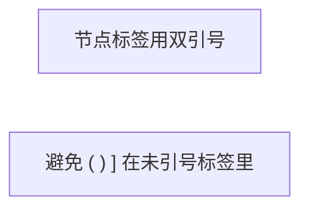

# zblog：Markdown / VuePress 版式

栈：VuePress 2 + vuepress-theme-hope；数学 KaTeX；图 Mermaid。规则文件：`.cursor/rules/zblog-markdown-posts.mdc`。

## 中文与加粗

markdown-it 下 `**` 贴汉字常失效：

```markdown
✅ 解释 **非线性（激活函数）** 为什么
❌ 解释**非线性（激活函数）**为什么
```

表格单元格、公式旁：优先 `<strong>…</strong>`。

## 数学（KaTeX）

- 行内：`$x$` 或 `\(x\)` —— **`$` 两侧不要空格**
- 独立：`$$...$$` 或 `\[...\]`
- 配置：`delimiters: 'all'`（见 `CLAUDE.md`）

## 折叠块里的公式

原生 `<details>` **不会**再跑 Markdown/KaTeX。用主题容器：

```markdown
::: details 要点

主要在矩阵 \(W\) 与 \(\mathbf{b}\) 的元素里。

:::
```

## Mermaid

```markdown

```

- 节点标签：**`["双引号"]`**
- 运算用 ASCII：`sigma`、`1/2`、`*`；复杂式子放正文 KaTeX，图下可注 LaTeX 对应
- 节点 id：避免单独 `L`、`A` 等歧义 id → 用 `loss`、`agent` 等

## 站内链接

Hope 博客路由生成 `.html`：

```markdown
[姊妹篇](./mainstream-ai-coding-tools-comparison.html)
```

勿链到 `.md` 路径作为读者点击目标。

## 静态资源

- 目录：`docs/.vuepress/public/`
- 引用：`/images/example.png`（站点根绝对路径）

## Hope 容器（常用）

```markdown
::: tip 提示
简短可操作建议
:::

::: warning 注意
合规、安全、不可逆操作
:::
```

## 发布前快检

- [ ] 随机抽含 `**` 的中文句预览是否加粗成功
- [ ] 含公式的 `::: details` 在 `pnpm dev` 下渲染正常
- [ ] Mermaid 无语法报错（构建控制台）
- [ ] 站内链可点击到目标文

## 详细示例

见 [reference.md](reference.md)（Mermaid 反例、长表加粗）。
