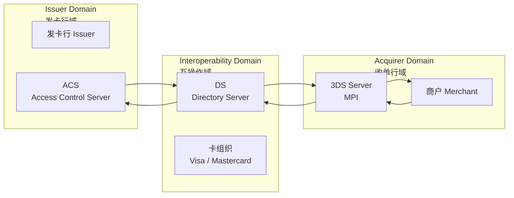
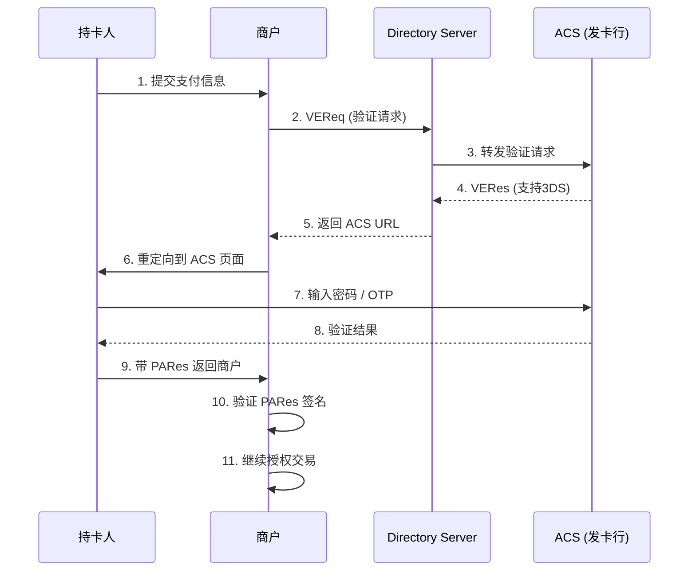
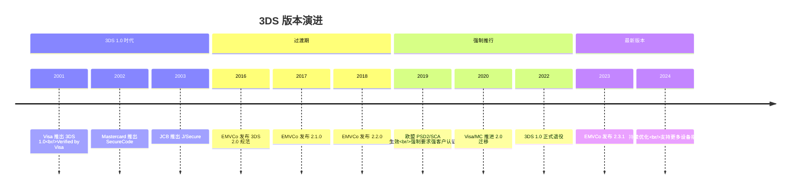
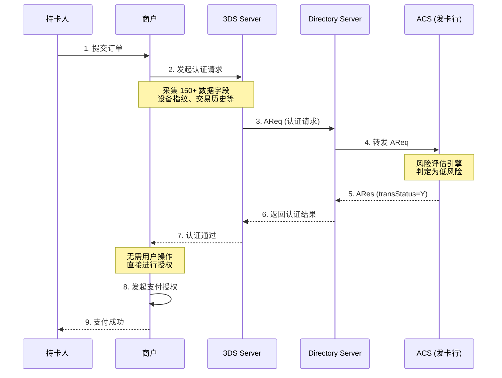
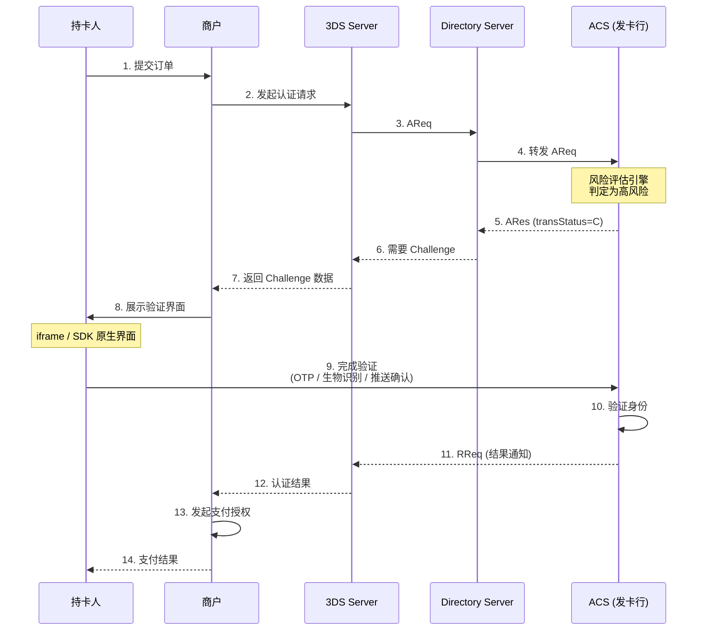
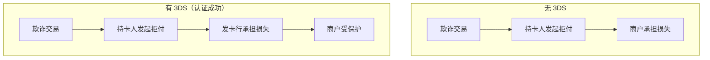
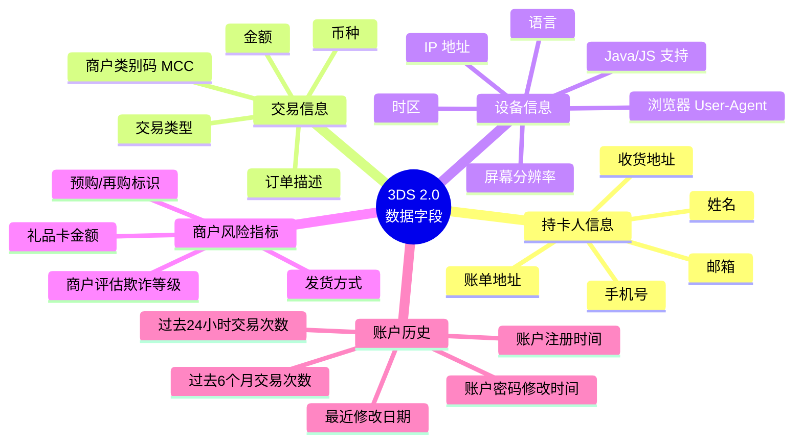
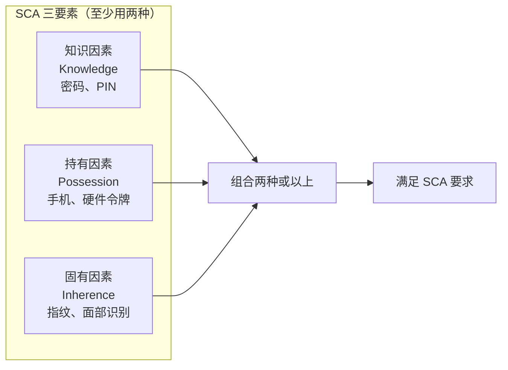
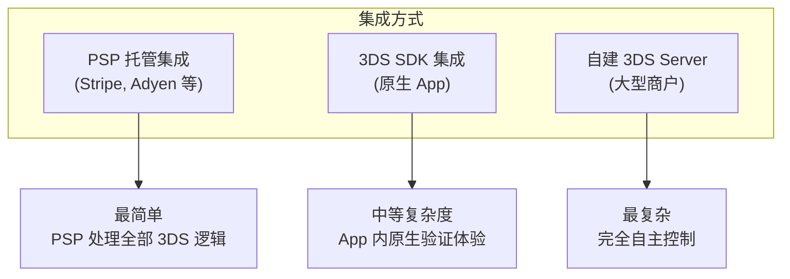
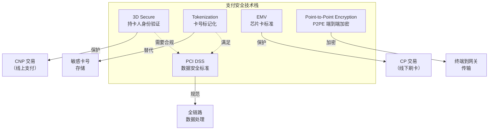

3D Secure（3DS）是信用卡和借记卡在线支付的身份验证协议，由 EMVCo 维护。它在传统的"商户-收单机构"双方模型之上增加了**发卡行验证**这一层，因此称为 **3-Domain**（三域）。本文从协议原理、版本演进、集成实践三个维度做全面梳理。

## 什么是 3D Secure？

3DS 的核心目标是：在 CNP（Card Not Present，无卡交易）场景下验证持卡人身份，降低欺诈风险，同时通过**责任转移（Liability Shift）**保护商户利益。

### 三个域

"3D" 指协议涉及的三个安全域：



| 域 | 参与方 | 职责 |
|---|--------|------|
| 发卡行域（Issuer Domain） | 发卡行、ACS | 验证持卡人身份，决定是否批准交易 |
| 互操作域（Interoperability Domain） | 卡组织、DS | 路由认证请求，维护 BIN 范围和 ACS 信息 |
| 收单行域（Acquirer Domain） | 商户、3DS Server（MPI） | 发起认证请求，收集设备和交易数据 |

### 各卡组织的 3DS 品牌名

| 卡组织 | 品牌名 | 说明 |
|--------|--------|------|
| Visa | **Visa Secure**（原 Verified by Visa） | 市场占有率最高 |
| Mastercard | **Mastercard Identity Check**（原 SecureCode） | 全球覆盖广 |
| American Express | **American Express SafeKey** | AMEX 交易专用 |
| Discover | **ProtectBuy** | 北美为主 |
| JCB | **J/Secure** | 日本及亚太市场 |
| UnionPay | **UnionPay 3DS** | 中国银联 |

## 版本演进

### 3DS 1.0（2001-2016）

3DS 1.0 由 Visa 在 2001 年推出，开创了在线支付验证的先河，但存在明显的用户体验问题。



**1.0 的主要问题**：

| 问题 | 具体表现 |
|------|----------|
| 体验差 | 弹出窗口或页面重定向，中断支付流程 |
| 移动端不友好 | 未针对移动设备设计，页面适配差 |
| 高弃单率 | 额外验证步骤导致 10-15% 的用户放弃交易 |
| 安全性有限 | 静态密码容易被钓鱼攻击窃取 |
| 无风险评估 | 对所有交易一视同仁，缺乏风险分级 |

### 3DS 2.0（2016 至今）

EMVCo 在 2016 年发布 3DS 2.0 规范，核心理念是**基于风险的智能认证（Risk-Based Authentication）**。



### 版本对比

| 特性 | 3DS 1.0 | 3DS 2.0 |
|------|---------|---------|
| 认证方式 | 静态密码 / OTP | 基于风险的智能认证 |
| 用户体验 | 页面重定向，弹窗 | 无感验证（Frictionless） |
| 移动端支持 | 不支持原生 SDK | 原生 SDK（iOS/Android） |
| 数据维度 | ~15 个字段 | **150+ 个字段** |
| 认证结果 | 通过 / 拒绝 | 通过 / 拒绝 / 尝试 / 信息 |
| App 内支付 | 不支持 | 原生支持 |
| 非支付认证 | 不支持 | 支持（绑卡验证等） |
| 设备指纹 | 无 | 浏览器 / 设备信息采集 |
| 商户主动豁免 | 不支持 | 支持 TRA / 低风险豁免 |

## 3DS 2.0 核心流程

3DS 2.0 最重要的改进是引入了 **Frictionless Flow（无摩擦流程）**和 **Challenge Flow（质询流程）**两种路径。

### Frictionless Flow（无摩擦流程）

发卡行根据风险评估直接批准交易，持卡人无需任何额外操作，实现"无感支付"。



**Frictionless 触发条件**（发卡行视角）：

- 设备指纹匹配已知设备
- 交易金额在持卡人正常范围内
- 商户信誉良好，历史欺诈率低
- 持卡人行为模式正常
- 地理位置与常用地一致

### Challenge Flow（质询流程）

发卡行判定交易风险较高，需要持卡人进行额外验证。



### 3DS 2.0 认证状态码

| transStatus | 含义 | 说明 |
|-------------|------|------|
| Y | 认证成功 | 完全认证，责任转移到发卡行 |
| N | 认证失败 | 发卡行拒绝，商户不应继续交易 |
| U | 技术不可用 | 认证无法完成（网络问题等） |
| A | 尝试处理 | 发卡行未参与3DS，但有尝试记录 |
| C | 需要质询 | 发卡行要求进行 Challenge |
| R | 拒绝 | 发卡行拒绝认证（疑似欺诈） |
| I | 仅信息 | 非支付认证（如绑卡验证） |

### 责任转移（Liability Shift）

责任转移是 3DS 的核心商业价值——当 3DS 认证成功后，如果发生欺诈拒付（Chargeback），责任从商户转移到发卡行。



| 认证结果 | 责任方 | ECI 值（Visa/MC） |
|----------|--------|-------------------|
| 认证成功（Y） | 发卡行 | 05 / 02 |
| 尝试处理（A） | 发卡行 | 06 / 01 |
| 认证失败（N） | 商户 | 07 / 00 |
| 技术不可用（U） | 商户 | 07 / 00 |

> **ECI（Electronic Commerce Indicator）** 是交易认证等级的标识，附在授权请求中发送给收单行和卡组织。

## 3DS 2.0 关键数据字段

3DS 2.0 最大的技术突破是将传输数据从 1.0 的约 15 个字段扩展到 **150+ 个字段**，使发卡行能做更精准的风险评估。

### 核心数据分类



### 关键请求字段（AReq）

| 字段 | 类型 | 必选 | 说明 |
|------|------|------|------|
| threeDSServerTransID | String | 是 | 3DS Server 交易 ID |
| dsTransID | String | 是 | DS 分配的交易 ID |
| messageVersion | String | 是 | 协议版本（如 "2.2.0"） |
| deviceChannel | String | 是 | 渠道：01=App, 02=Browser, 03=3RI |
| acctNumber | String | 是 | 卡号（PAN） |
| cardExpiryDate | String | 是 | 有效期 YYMM |
| purchaseAmount | String | 是 | 交易金额 |
| purchaseCurrency | String | 是 | 币种（ISO 4217） |
| purchaseDate | String | 是 | 交易日期时间 |
| merchantName | String | 是 | 商户名称 |
| mcc | String | 是 | 商户类别码 |
| notificationURL | String | 条件 | Challenge 完成回调地址 |
| threeDSRequestorURL | String | 条件 | 商户 URL |
| browserUserAgent | String | 条件 | 浏览器 UA（Browser 渠道） |
| browserIP | String | 条件 | 持卡人 IP |
| browserLanguage | String | 条件 | 浏览器语言 |
| browserScreenHeight | String | 条件 | 屏幕高度 |
| browserScreenWidth | String | 条件 | 屏幕宽度 |

## SCA 与 PSD2

### 什么是 SCA？

**SCA（Strong Customer Authentication，强客户认证）** 是欧盟 PSD2 指令的核心要求，从 2019 年开始强制执行。SCA 要求在线支付必须使用**至少两种**认证因素：



### SCA 豁免场景

并非所有交易都需要 SCA，以下场景可申请豁免：

| 豁免类型 | 条件 | 说明 |
|----------|------|------|
| 低金额交易 | < €30（累计 < €100 或连续 < 5 笔） | 小额免认证 |
| 交易风险分析（TRA） | 欺诈率低于阈值 | PSP 欺诈率达标可豁免 |
| 可信商户白名单 | 持卡人主动添加 | 用户信任的商户 |
| 定期付款 | 固定金额的订阅 | 首笔需 SCA，后续豁免 |
| 企业支付 | B2B 安全支付协议 | 专用支付渠道 |
| 邮购/电话订购 | MOTO 交易 | 不在 SCA 范围内 |

### TRA 豁免的欺诈率要求

| 交易金额 | 最低欺诈率要求 |
|----------|---------------|
| ≤ €100 | < 0.13% |
| ≤ €250 | < 0.06% |
| ≤ €500 | < 0.01% |

## 技术集成

### 集成方式概览



| 集成方式 | 适用场景 | 复杂度 | PCI DSS 要求 |
|----------|----------|--------|-------------|
| PSP 托管 | 中小商户 | 低 | SAQ A / A-EP |
| 3DS SDK | 有原生 App 的商户 | 中 | SAQ A-EP / D |
| 自建 3DS Server | 大型支付平台 | 高 | SAQ D + Level 1 |

### 浏览器端集成（TypeScript）

以下是基于 PSP 托管模式的 3DS 集成示例：

```typescript
// services/threeDSService.ts

interface ThreeDSAuthRequest {
  transactionId: string;
  cardNumber: string;
  expiryMonth: string;
  expiryYear: string;
  amount: number;
  currency: string;
  browserInfo: BrowserInfo;
}

interface BrowserInfo {
  userAgent: string;
  language: string;
  colorDepth: number;
  screenHeight: number;
  screenWidth: number;
  timeZoneOffset: number;
  javaEnabled: boolean;
  javascriptEnabled: boolean;
  acceptHeader: string;
  ipAddress?: string;
}

interface ThreeDSAuthResponse {
  transStatus: 'Y' | 'N' | 'C' | 'U' | 'A' | 'R';
  eci: string;
  authenticationValue: string; // CAVV
  dsTransId: string;
  acsUrl?: string;        // Challenge 时使用
  creq?: string;          // Challenge Request 数据
  challengeRequired: boolean;
}

// 采集浏览器信息（3DS 2.0 必需）
function collectBrowserInfo(): BrowserInfo {
  return {
    userAgent: navigator.userAgent,
    language: navigator.language,
    colorDepth: screen.colorDepth,
    screenHeight: screen.height,
    screenWidth: screen.width,
    timeZoneOffset: new Date().getTimezoneOffset(),
    javaEnabled: false,
    javascriptEnabled: true,
    acceptHeader: 'text/html,application/json',
  };
}

// 发起 3DS 认证
async function initiate3DSAuth(
  paymentData: Omit<ThreeDSAuthRequest, 'browserInfo'>
): Promise<ThreeDSAuthResponse> {
  const browserInfo = collectBrowserInfo();

  const response = await fetch('/api/v1/3ds/auth', {
    method: 'POST',
    headers: { 'Content-Type': 'application/json' },
    body: JSON.stringify({ ...paymentData, browserInfo }),
  });

  if (!response.ok) throw new Error('3DS 认证请求失败');
  return response.json();
}

// 处理 Challenge Flow
function handleChallenge(acsUrl: string, creq: string): Promise<string> {
  return new Promise((resolve, reject) => {
    // 创建隐藏的 iframe 展示 Challenge 界面
    const iframe = document.createElement('iframe');
    iframe.id = 'threeds-challenge';
    iframe.style.cssText = 'width:400px;height:600px;border:none;';

    const container = document.getElementById('challenge-container');
    if (!container) return reject(new Error('Challenge 容器未找到'));
    container.appendChild(iframe);

    // 提交 CReq 到 ACS
    const form = document.createElement('form');
    form.method = 'POST';
    form.action = acsUrl;
    form.target = iframe.id;

    const input = document.createElement('input');
    input.type = 'hidden';
    input.name = 'creq';
    input.value = creq;
    form.appendChild(input);

    document.body.appendChild(form);
    form.submit();
    document.body.removeChild(form);

    // 监听 Challenge 完成回调
    const messageHandler = (event: MessageEvent) => {
      if (event.data?.type === 'threeds-challenge-complete') {
        window.removeEventListener('message', messageHandler);
        container.removeChild(iframe);
        resolve(event.data.transStatus);
      }
    };
    window.addEventListener('message', messageHandler);

    // 超时处理
    setTimeout(() => {
      window.removeEventListener('message', messageHandler);
      if (document.getElementById('threeds-challenge')) {
        container.removeChild(iframe);
      }
      reject(new Error('3DS Challenge 超时'));
    }, 300_000); // 5 分钟超时
  });
}

// 完整的 3DS 支付流程
async function processPaymentWith3DS(paymentData: {
  cardNumber: string;
  expiryMonth: string;
  expiryYear: string;
  amount: number;
  currency: string;
  transactionId: string;
}): Promise<{ success: boolean; transactionId: string }> {
  // Step 1: 发起 3DS 认证
  const authResult = await initiate3DSAuth(paymentData);

  // Step 2: 根据认证结果处理
  switch (authResult.transStatus) {
    case 'Y': // Frictionless 通过
    case 'A': // 尝试处理
      return completePayment(paymentData.transactionId, authResult);

    case 'C': // 需要 Challenge
      if (!authResult.acsUrl || !authResult.creq) {
        throw new Error('Challenge 数据不完整');
      }
      const challengeResult = await handleChallenge(
        authResult.acsUrl,
        authResult.creq
      );
      if (challengeResult === 'Y') {
        return completePayment(paymentData.transactionId, authResult);
      }
      throw new Error('3DS 验证未通过');

    case 'N': // 认证失败
    case 'R': // 拒绝
      throw new Error('发卡行拒绝该交易');

    case 'U': // 技术不可用
      // 根据业务策略决定是否继续（无责任转移）
      throw new Error('3DS 认证暂不可用');

    default:
      throw new Error(`未知的认证状态: ${authResult.transStatus}`);
  }
}

async function completePayment(
  transactionId: string,
  authResult: ThreeDSAuthResponse
): Promise<{ success: boolean; transactionId: string }> {
  const response = await fetch('/api/v1/payments/authorize', {
    method: 'POST',
    headers: { 'Content-Type': 'application/json' },
    body: JSON.stringify({
      transactionId,
      eci: authResult.eci,
      cavv: authResult.authenticationValue,
      dsTransId: authResult.dsTransId,
    }),
  });

  if (!response.ok) throw new Error('支付授权失败');
  return response.json();
}
```

### 后端 3DS Server 实现（Golang）

```go
package threeds

import (
	"context"
	"crypto/tls"
	"encoding/json"
	"fmt"
	"net/http"
	"time"
)

// AuthRequest 3DS 认证请求
type AuthRequest struct {
	// 交易信息
	ThreeDSServerTransID string `json:"threeDSServerTransID"`
	AcctNumber           string `json:"acctNumber"`
	CardExpiryDate       string `json:"cardExpiryDate"` // YYMM
	PurchaseAmount       string `json:"purchaseAmount"`
	PurchaseCurrency     string `json:"purchaseCurrency"` // ISO 4217
	PurchaseDate         string `json:"purchaseDate"`     // YYYYMMDDHHMMSS

	// 商户信息
	MerchantName    string `json:"merchantName"`
	MCC             string `json:"mcc"`
	AcquirerBIN     string `json:"acquirerBIN"`
	AcquirerID      string `json:"acquirerMerchantID"`

	// 设备信息（浏览器渠道）
	DeviceChannel      string `json:"deviceChannel"` // 01=App, 02=Browser
	BrowserUserAgent   string `json:"browserUserAgent,omitempty"`
	BrowserIP          string `json:"browserIP,omitempty"`
	BrowserLanguage    string `json:"browserLanguage,omitempty"`
	BrowserColorDepth  string `json:"browserColorDepth,omitempty"`
	BrowserScreenH     string `json:"browserScreenHeight,omitempty"`
	BrowserScreenW     string `json:"browserScreenWidth,omitempty"`
	BrowserTZ          string `json:"browserTZ,omitempty"`
	BrowserJavaEnabled bool   `json:"browserJavaEnabled,omitempty"`

	// 持卡人信息（可选，但有助于风险评估）
	Email              string `json:"email,omitempty"`
	HomePhone          string `json:"homePhone,omitempty"`
	MobilePhone        string `json:"mobilePhone,omitempty"`
	CardholderName     string `json:"cardholderName,omitempty"`

	// SCA 豁免请求
	ThreeDSRequestorChallengeInd string `json:"threeDSRequestorChallengeInd,omitempty"`

	// 回调地址
	NotificationURL string `json:"notificationURL"`
	MessageVersion  string `json:"messageVersion"` // "2.2.0"
}

// AuthResponse 3DS 认证响应
type AuthResponse struct {
	ThreeDSServerTransID string `json:"threeDSServerTransID"`
	DSTransID            string `json:"dsTransID"`
	ACSTransID           string `json:"acsTransID"`
	TransStatus          string `json:"transStatus"` // Y, N, C, U, A, R
	ECI                  string `json:"eci"`
	AuthenticationValue  string `json:"authenticationValue"` // CAVV
	MessageVersion       string `json:"messageVersion"`

	// Challenge 相关
	ACSUrl    string `json:"acsURL,omitempty"`
	CReq      string `json:"creq,omitempty"`

	// 错误信息
	ErrorCode    string `json:"errorCode,omitempty"`
	ErrorMessage string `json:"errorMessage,omitempty"`
}

// ChallengeInd 质询偏好指示
const (
	ChallengeIndNoPreference    = "01" // 无偏好
	ChallengeIndNoChallenge     = "02" // 请求不质询（Frictionless）
	ChallengeIndPreferChallenge = "03" // 偏好质询
	ChallengeIndMandateChallenge = "04" // 强制质询
)

// ThreeDSServer 3DS Server 核心结构
type ThreeDSServer struct {
	dsURL      string // Directory Server URL
	httpClient *http.Client
	merchantID string
	acquirerID string
}

func NewThreeDSServer(dsURL, merchantID, acquirerID string, tlsCert tls.Certificate) *ThreeDSServer {
	return &ThreeDSServer{
		dsURL:      dsURL,
		merchantID: merchantID,
		acquirerID: acquirerID,
		httpClient: &http.Client{
			Timeout: 30 * time.Second,
			Transport: &http.Transport{
				TLSClientConfig: &tls.Config{
					Certificates: []tls.Certificate{tlsCert},
					MinVersion:   tls.VersionTLS12,
				},
			},
		},
	}
}

// Authenticate 发起 3DS 认证
func (s *ThreeDSServer) Authenticate(ctx context.Context, req *AuthRequest) (*AuthResponse, error) {
	req.MessageVersion = "2.2.0"
	req.AcquirerID = s.acquirerID

	body, err := json.Marshal(req)
	if err != nil {
		return nil, fmt.Errorf("marshal request: %w", err)
	}

	httpReq, err := http.NewRequestWithContext(ctx, http.MethodPost, s.dsURL+"/auth", bytes.NewReader(body))
	if err != nil {
		return nil, fmt.Errorf("create request: %w", err)
	}
	httpReq.Header.Set("Content-Type", "application/json")

	resp, err := s.httpClient.Do(httpReq)
	if err != nil {
		return nil, fmt.Errorf("send to DS: %w", err)
	}
	defer resp.Body.Close()

	var authResp AuthResponse
	if err := json.NewDecoder(resp.Body).Decode(&authResp); err != nil {
		return nil, fmt.Errorf("decode response: %w", err)
	}

	return &authResp, nil
}

// ShouldProceedWithPayment 根据认证结果判断是否继续交易
func ShouldProceedWithPayment(transStatus string) (proceed bool, liabilityShift bool) {
	switch transStatus {
	case "Y": // 认证成功
		return true, true
	case "A": // 尝试处理
		return true, true
	case "C": // 需要 Challenge（等待 Challenge 完成）
		return false, false
	case "U": // 技术不可用（商户自行决定）
		return true, false
	case "N", "R": // 认证失败 / 拒绝
		return false, false
	default:
		return false, false
	}
}
```

需要补充 `bytes` 包的引入：

```go
import (
	"bytes"
	// ... 其他 import
)
```

### Challenge 回调处理

```go
package handler

import (
	"encoding/json"
	"net/http"
)

// ChallengeNotification ACS Challenge 完成回调
type ChallengeNotification struct {
	ThreeDSServerTransID string `json:"threeDSServerTransID"`
	ACSTransID           string `json:"acsTransID"`
	TransStatus          string `json:"transStatus"`
	AuthenticationValue  string `json:"authenticationValue"`
	ECI                  string `json:"eci"`
}

// HandleChallengeResult 处理 Challenge 回调（POST /api/v1/3ds/challenge-result）
func HandleChallengeResult(w http.ResponseWriter, r *http.Request) {
	var notification ChallengeNotification
	if err := json.NewDecoder(r.Body).Decode(&notification); err != nil {
		http.Error(w, "invalid request", http.StatusBadRequest)
		return
	}

	proceed, liabilityShift := threeds.ShouldProceedWithPayment(notification.TransStatus)

	if proceed {
		// 使用 ECI + CAVV 继续支付授权
		authResult := &PaymentAuthData{
			TransactionID:       notification.ThreeDSServerTransID,
			ECI:                 notification.ECI,
			CAVV:                notification.AuthenticationValue,
			LiabilityShift:      liabilityShift,
		}
		// 调用收单行授权接口
		_ = processAuthorization(authResult)
	}

	// 返回 HTML 页面，通过 postMessage 通知父窗口
	w.Header().Set("Content-Type", "text/html")
	w.Write([]byte(`
		<html><body><script>
			window.parent.postMessage({
				type: 'threeds-challenge-complete',
				transStatus: '` + notification.TransStatus + `'
			}, '*');
		</script></body></html>
	`))
}

type PaymentAuthData struct {
	TransactionID  string
	ECI            string
	CAVV           string
	LiabilityShift bool
}

func processAuthorization(data *PaymentAuthData) error {
	// 调用支付网关/收单行的授权接口
	// 在授权请求中附带 ECI 和 CAVV
	return nil
}
```

## 3DS 在主要 PSP 中的集成

使用第三方 PSP 时，大部分 3DS 逻辑由 PSP 处理，商户只需要正确集成 SDK。

### Stripe

```typescript
// Stripe 3DS 集成示例
import { loadStripe } from '@stripe/stripe-js';

const stripe = await loadStripe('pk_test_xxx');

// 创建 PaymentIntent（后端）
// POST /api/create-payment-intent
// Stripe 会自动判断是否需要 3DS

// 前端确认支付
const { error, paymentIntent } = await stripe.confirmCardPayment(
  clientSecret, // 从后端获取
  {
    payment_method: {
      card: cardElement,
      billing_details: { name: '持卡人姓名' },
    },
  }
);

// Stripe 自动处理 3DS：
// - Frictionless: 直接返回 succeeded
// - Challenge: 自动弹出验证窗口
if (error) {
  console.error('支付失败:', error.message);
} else if (paymentIntent.status === 'succeeded') {
  console.log('支付成功');
}
```

### Adyen

```typescript
// Adyen 3DS 集成示例
import AdyenCheckout from '@adyen/adyen-web';

const checkout = await AdyenCheckout({
  environment: 'test',
  clientKey: 'test_xxx',
  session: {
    id: sessionId,       // 从后端获取
    sessionData: data,
  },
  onPaymentCompleted: (result) => {
    // 支付完成（包括 3DS 验证）
    console.log('支付结果:', result.resultCode);
  },
  onError: (error) => {
    console.error('支付错误:', error);
  },
});

// Adyen Drop-in 自动处理 3DS
checkout.create('dropin').mount('#payment-container');
```

## 常见问题与最佳实践

### 降低 Challenge 率的策略

高 Challenge 率意味着更多用户需要额外验证，可能导致弃单。以下策略有助于提高 Frictionless 比率：

| 策略 | 说明 |
|------|------|
| 提供完整数据 | 填充尽可能多的可选字段（邮箱、手机、地址等） |
| 准确的设备指纹 | 正确采集浏览器/设备信息 |
| 使用 TRA 豁免 | 在允许的金额范围内申请低风险豁免 |
| 白名单商户 | 引导用户将商户添加到信任列表 |
| 历史交易数据 | 提供持卡人在商户的交易历史 |
| 正确的 MCC | 确保商户类别码准确 |

### 3DS 测试

| 卡组织 | 测试环境 | 说明 |
|--------|----------|------|
| Visa | 3DS Sandbox | 提供测试卡号和模拟 ACS |
| Mastercard | MC 3DS Test Platform | 模拟各种认证场景 |
| EMVCo | 3DS Test Platform | 标准合规性测试 |
| Stripe | Test Mode | `4000002500003155` 触发 3DS |
| Adyen | Test Environment | 支持模拟各种 transStatus |

### 常见错误码

| 错误码 | 含义 | 处理建议 |
|--------|------|----------|
| 101 | 消息格式错误 | 检查必填字段和数据格式 |
| 203 | 无法识别的卡BIN | 确认卡号正确且在DS支持范围内 |
| 301 | ACS 技术故障 | 根据业务策略决定是否降级处理 |
| 305 | ACS 不可用 | 重试或降级 |
| 402 | DS 不可用 | 联系卡组织确认 DS 状态 |
| 405 | 超时 | 检查网络连接和超时配置 |

## 3DS 与其他支付安全技术的关系



| 技术 | 解决的问题 | 应用场景 |
|------|-----------|----------|
| 3D Secure | 持卡人身份验证 | 线上支付（CNP） |
| PCI DSS | 数据安全合规 | 全链路数据处理 |
| Tokenization | 卡号替代存储 | 订阅、复购场景 |
| EMV | 卡片真伪验证 | 线下 POS 交易 |
| P2PE | 传输加密 | POS 终端到网关 |

## 推荐阅读

### 官方与权威资源

| 来源 | 文章 | 说明 |
|------|------|------|
| EMVCo | [EMV 3DS Specification](https://www.emvco.com/emv-technologies/3d-secure/) | 官方规范文档 |
| EMVCo | [3DS Testing Platform](https://www.emvco.com/emv-technologies/3d-secure/testing/) | 测试平台信息 |
| Visa | [Visa Secure 文档](https://developer.visa.com/capabilities/3ds) | Visa 3DS 开发文档 |
| Mastercard | [Identity Check 文档](https://developer.mastercard.com/product/3d-secure/) | MC 3DS 开发文档 |
| PCI SSC | [PCI 3DS Core Security Standard](https://www.pcisecuritystandards.org/document_library/) | 3DS 安全标准 |

### 技术深度文章

| 来源 | 文章 | 重点内容 |
|------|------|----------|
| Stripe | [3D Secure 认证指南](https://stripe.com/docs/payments/3d-secure) | PSP 集成实践 |
| Adyen | [3D Secure 2 指南](https://docs.adyen.com/online-payments/3d-secure/) | 详细的集成文档 |
| Checkout.com | [3DS2 Authentication](https://www.checkout.com/docs/payments/authenticate-payments) | 认证流程详解 |
| Ravelin | [3DS2 Optimization](https://www.ravelin.com/blog/3ds2-optimization) | 优化 Frictionless 比率 |

### 中文技术资源

| 来源 | 文章 | 说明 |
|------|------|------|
| 蚂蚁金服 | 3D Secure 技术解析 | 支付宝国际化实践 |
| 拉卡拉 | 跨境支付 3DS 接入 | 国内 PSP 实践 |

### 相关标准与规范

| 标准 | 说明 |
|------|------|
| EMV 3DS 2.3.1 | 最新 3DS 协议规范 |
| PSD2/SCA | 欧盟强客户认证指令 |
| PCI 3DS | 3DS 组件的安全标准 |
| ISO 8583 | 金融交易消息格式 |
| ISO 4217 | 货币代码标准 |

## 总结

3D Secure 从 1.0 到 2.0 的演进，体现了支付安全从"一刀切"到"智能风控"的转变。核心要点：

1. **Frictionless 优先**：3DS 2.0 的核心价值在于通过丰富的数据实现无感验证
2. **数据是关键**：提供越完整的数据，Frictionless 比率越高，用户体验越好
3. **责任转移**：3DS 认证成功后，欺诈拒付责任从商户转移到发卡行
4. **SCA 合规**：对于欧洲市场，3DS 2.0 是满足 PSD2/SCA 的标准方案
5. **选择合适的集成方式**：中小商户优先使用 PSP 托管方案，降低集成和合规成本

> 3DS 不是支付安全的全部，而是与 PCI DSS、Tokenization、P2PE 等技术共同构成完整的支付安全体系。

---

**相关文章**：
- [PCI DSS 入门指南](/posts/pci-dss-overview.html)
- [PCI DSS 技术实现指南](/posts/pci-dss-implementation.html)
