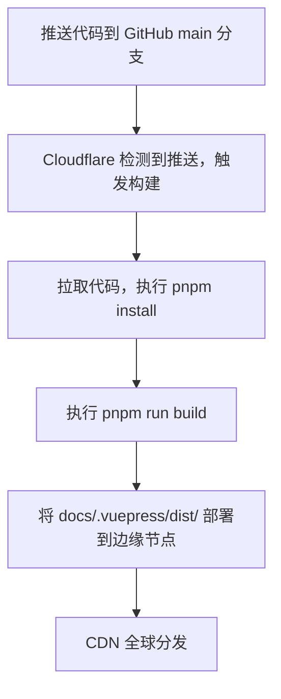

## 部署架构


## Cloudflare Pages 配置

| 配置项 | 值 |
|--------|-----|
| 构建命令 | `pnpm run build` |
| 输出目录 | `docs/.vuepress/dist` |
| Node.js 版本 | 22.x |
| 包管理器 | pnpm |

## 域名配置

| 域名 | 类型 | 指向 |
|------|------|------|
| www.zhaofutao.cn | CNAME | Cloudflare Pages |
| zhaofutao.cn | CNAME | Cloudflare Pages |

## 部署流程



## 部署命令

```bash
# 本地预览
pnpm run dev

# 构建
pnpm run build

# 提交并部署
git add .
git commit -m "更新内容"
git push origin main
```

## HTTPS 配置

Cloudflare Pages 自动提供：
- SSL 证书自动申请
- 证书自动续期
- HTTP/2 支持
- HTTP/3（QUIC）支持

## 其他部署方案

### Vercel

```
Build Command: pnpm run build
Output Directory: docs/.vuepress/dist
```

### GitHub Pages

```yaml
# .github/workflows/deploy.yml
name: Deploy
on:
  push:
    branches: [main]
jobs:
  deploy:
    runs-on: ubuntu-latest
    steps:
      - uses: actions/checkout@v4
      - uses: actions/setup-node@v4
        with:
          node-version: '22'
      - run: pnpm install
      - run: pnpm run build
      - uses: peaceiris/actions-gh-pages@v4
        with:
          github_token: ${{ secrets.GITHUB_TOKEN }}
          publish_dir: docs/.vuepress/dist
```

## 常见问题

### 构建失败

1. 查看 Cloudflare 构建日志
2. 检查 Node.js 版本兼容性
3. 确认依赖完整（`pnpm install`）

### 更新未生效

1. 确认 git push 成功
2. 检查 Cloudflare 部署状态
3. 清除 Cloudflare 缓存
