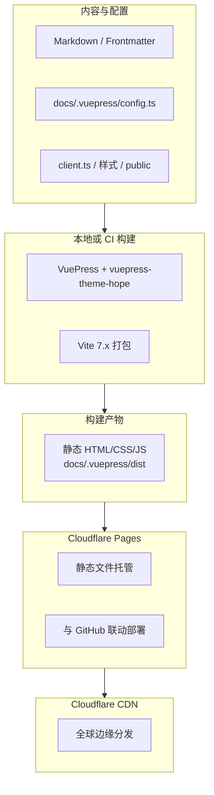
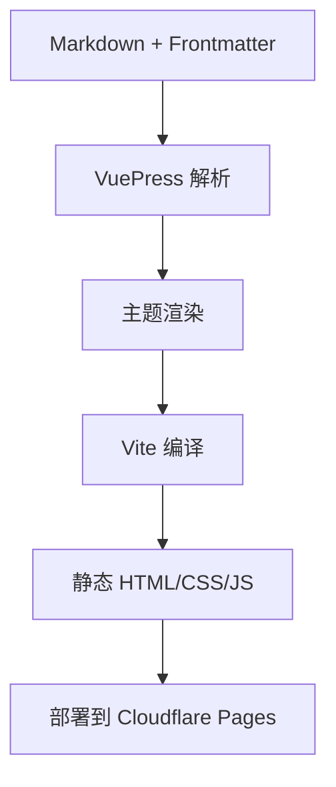

## 技术栈

| 组件 | 版本 | 说明 |
|------|------|------|
| VuePress | 2.0.0-rc.26 | 静态站点生成器 |
| vuepress-theme-hope | 2.0.0-rc.102 | 博客主题 |
| Vue | 3.5.x | 前端框架 |
| Vite | 7.x | 构建工具（由 `@vuepress/bundler-vite` 引入） |
| TypeScript | 5.x | 配置语言 |
| Sass | 1.77.x | 样式预处理器 |
| KaTeX | ^0.16.x | 数学公式（主题 `markdown.math`） |
| Mermaid | ^11.x | 图表（主题 `markdown.mermaid`） |
| @vuepress/plugin-slimsearch | 2.0.0-rc.121 | 全文搜索（替代已弃用的 searchPro） |

站点级插件（`config.ts` 根级 `plugins`）：`@vuepress/plugin-google-analytics`、`vuepress-plugin-copy-page`。主题内还启用了 PWA、SEO、sitemap、公告等，详见仓库 `docs/.vuepress/config.ts`。

根配置中 `shouldPrefetch: false`，避免 PWA 与链接预取策略冲突。

## 架构图

部署侧数据流：**源码在本地或 CI 上构建**，产物才是托管对象（边缘节点不跑 VuePress）。



## 主题功能

vuepress-theme-hope 提供以下内置功能：

### 博客功能
- 文章列表（`/posts/`）
- 分类页面（`/category/`）
- 标签页面（`/tag/`）
- 时间线（`/timeline/`）

### SEO 功能
- sitemap.xml 自动生成
- robots.txt 自动生成
- Open Graph meta 标签

### 其他功能
- 暗黑模式
- 图片点击放大（PhotoSwipe）
- 代码块复制按钮
- 响应式布局
- RSS/Atom/JSON Feed 支持
- Markdown 内 **Mermaid** 与 **KaTeX**（`$...$` / `$$...$$`、`\(...\)` / `\[...\]` 等，见主题配置）
- 全文搜索（**SlimSearch**，主题 `plugins.slimsearch`）

## 构建流程



## 目录结构

```
my-blog/
├── docs/
│   ├── .vuepress/
│   │   ├── config.ts      # 主配置
│   │   ├── client.ts      # 客户端增强（如 copy-page 入口）
│   │   ├── styles/        # 样式
│   │   ├── public/        # 静态资源
│   │   ├── .cache/        # 构建缓存（勿提交）
│   │   ├── .temp/         # 临时文件（勿提交）
│   │   └── dist/          # 构建输出（勿提交）
│   ├── _posts/            # 博客文章
│   ├── about/             # 关于页面
│   └── README.md          # 首页
├── package.json
└── node_modules/
```

## 自定义插件

### Copy Page 插件

博客集成了 `vuepress-plugin-copy-page` 插件，方便将文章复制为 Markdown 格式供 LLM 使用。

功能：
- 在文章标题旁显示"Copy page"按钮
- 支持复制整篇文章的 Markdown 源码
- 支持在新标签页预览 Markdown

## 常用命令

```bash
pnpm run dev      # 启动开发服务器
pnpm run build    # 构建生产版本
```

## 相关链接

- [VuePress 2 文档](https://v2.vuepress.vuejs.org/zh/)
- [vuepress-theme-hope 文档](https://theme-hope.vuejs.press/zh/)
