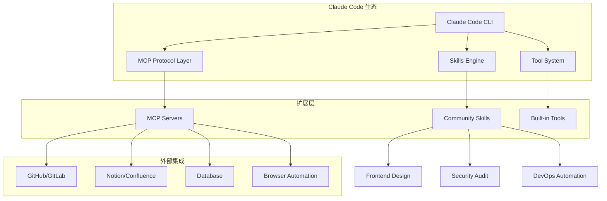
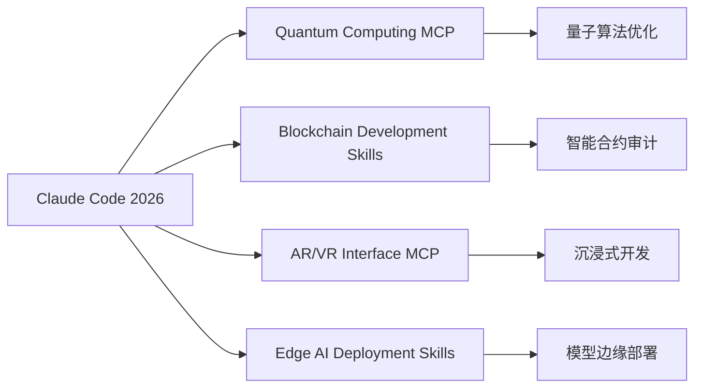

## 前言

Claude Code 是 Anthropic 那套跑在终端里的编程助手；比「只问 Chat」多出来的是 **MCP**（接外部工具）和 **Skills**（把固定套路打包）。这篇是我自己的笔记体：**MCP 怎么接、Skills 放哪、哪些配置容易绕** —— 有架构图，但不按官方宣传口径写。

## Claude Code 系统架构概览

### 核心架构设计



Claude Code 的强大之处在于其**三层架构设计**：

1. **核心层**：Claude Code CLI 和基础工具
2. **协议层**：MCP 提供标准化的服务集成，Skills 提供可复用的专业知识
3. **生态层**：社区贡献的扩展和集成

## MCP（Model Context Protocol）在干什么

### 什么是 MCP？

MCP 是一个开放标准，让 Claude 能够通过统一接口连接外部工具和数据源，标准化了整个通信层，避免为每个服务编写自定义集成代码。

### MCP 的工作原理

```typescript
// MCP 服务器基本结构
interface MCPServer {
  name: string;
  version: string;
  capabilities: {
    tools?: boolean;
    resources?: boolean;
    prompts?: boolean;
  };
  tools: Tool[];
  resources: Resource[];
}

// 示例：GitHub MCP 工具定义
{
  name: "github_search_repositories",
  description: "Search GitHub repositories",
  inputSchema: {
    type: "object",
    properties: {
      query: { type: "string" },
      language: { type: "string" },
      sort: { type: "string", enum: ["stars", "forks", "updated"] }
    }
  }
}
```

### 必备 MCP 服务器推荐

结合常见实践与 [MCP 官方 servers 仓库](https://github.com/modelcontextprotocol/servers) 等来源，下面是**较常用**的 MCP 服务器组合（列表与能力随版本变化，**以各仓库 README 与发布说明为准**）：

#### 🔧 开发核心类

1. **[GitHub MCP Server](https://github.com/modelcontextprotocol/servers)**
   - **功能**：仓库管理、PR/Issue 处理、CI/CD 工作流
   - **优势**：官方集成，支持自动化代码贡献
   - **使用场景**：代码审查、问题跟踪、发布管理

2. **[Context7](https://context7.ai)**
   - **功能**：实时文档检索，支持 50+ 框架
   - **优势**：版本特定文档，包含 Next.js 15、React、Tailwind CSS 4.0
   - **使用场景**：快速查询最新 API 文档

3. **[Playwright MCP Server](https://github.com/modelcontextprotocol/servers)**
   - **功能**：端到端测试、Web 自动化
   - **优势**：基于可访问性树，比截图方式更快更可靠
   - **使用场景**：自动化测试、网页抓取

#### 🗃️ 数据集成类

4. **[Notion MCP Server](https://notion.so/mcp)**
   - **功能**：官方实现，最小化 token 使用
   - **优势**：搜索、创建页面、添加评论
   - **使用场景**：文档管理、知识库集成

5. **[PostgreSQL MCP Server](https://github.com/modelcontextprotocol/servers)**
   - **功能**：自然语言数据库查询
   - **优势**：安全的 SQL 生成和执行
   - **使用场景**：数据分析、报表生成

6. **[Atlassian Remote MCP Server](https://atlassian.com/mcp)**
   - **功能**：Jira 和 Confluence 云端集成
   - **优势**：实时数据交互，目前处于 Beta 阶段
   - **使用场景**：项目管理、文档协作

#### 🧠 智能增强类

7. **[Sequential Thinking MCP Server](https://sequentialthinking.dev)**
   - **功能**：结构化推理过程
   - **优势**：复杂问题分解、反思性思考
   - **使用场景**：架构设计、问题诊断

8. **[Memory Bank MCP Server](https://memorybank.dev)**
   - **功能**：上下文记忆保持
   - **优势**：跨会话信息保持
   - **使用场景**：长期项目开发

### MCP 最佳实践

#### 1. 渐进式服务器启用

```bash
# 推荐启用顺序
1. GitHub + Context7          # 核心开发需求
2. Playwright                 # 测试自动化
3. Notion/Memory Bank         # 知识管理
4. PostgreSQL                 # 数据访问
5. Sequential Thinking        # 复杂推理
```

#### 2. MCP Gateway 模式

使用 **[MCP Gateway](https://mcpgateway.dev)** 实现动态服务器供应：

```yaml
# mcp-gateway.yml
meta_tools: 9          # 暴露 9 个稳定元工具
auto_start:
  - playwright         # 自动启动测试工具
  - context7           # 自动启动文档检索
dynamic_servers: 25+   # 按需供应服务器
```

#### 3. Token 优化策略

2026 年的 **MCP Tool Search** 功能通过懒加载减少了 95% 的上下文使用：

```javascript
// 只加载相关工具的描述（约100 tokens/server）
servers.forEach(server => {
  loadDescription(server); // 轻量级加载
});

// 仅在需要时加载完整工具定义（<5k tokens）
onToolNeeded(toolId => {
  loadFullDefinition(toolId);
});
```

## Skills 系统深度应用

### Skills 工作机制

Skills 是 `SKILL.md` 文件形式的专业化剧本，使用**渐进披露**机制：

1. **扫描阶段**：Claude 扫描技能名称和描述（约 100 tokens/skill）
2. **评估阶段**：判断技能相关性
3. **加载阶段**：仅在相关时加载完整指令（<5k tokens）

### 核心 Skills 推荐

根据 [Awesome Claude Skills](https://github.com/travisvn/awesome-claude-skills) 统计，以下是**最受欢迎的技能**：

#### 🎨 前端开发类

1. **[Frontend Design Skill](https://github.com/anthropics/claude-skills)**
   - **安装量**：277,000+（官方技能）
   - **特色**：设计系统、大胆审美选择、有意义动画
   - **使用**：`/frontend-design`

```markdown
# 使用示例
/frontend-design "设计一个现代化的支付页面，包含信用卡表单和安全提示"

# 输出特点
- 独特的设计语言，避免通用 AI 美学
- 有目的性的色彩搭配
- 流畅的微交互动画
```

#### 🛡️ 安全审计类

2. **[VibeSec-Skill](https://github.com/VibeSec/vibesec-skill)**
   - **功能**：安全代码编写、漏洞预防
   - **覆盖**：OWASP Top 10:2025, ASVS 5.0
   - **特色**：20+ 语言的安全模式

3. **[OWASP Security Skill](https://github.com/owasp/claude-skills)**
   - **功能**：专业安全审计工作流
   - **特色**：Trail of Bits 实际使用的审计流程
   - **使用场景**：代码审查、渗透测试

#### 📋 项目管理类

4. **[Planning with Files](https://github.com/planning-with-files/claude-skill)**
   - **GitHub 星数**：最高（社区最受欢迎技能）
   - **功能**：任务管理、项目组织
   - **适用**：开发工作流程规划

#### 📄 文档处理类

5. **Document Processing Skills 套件**：
   - **docx**：Word 文档创建、编辑、批注
   - **pdf**：PDF 文本提取、合并、注释
   - **pptx**：幻灯片读取、生成、模板调整
   - **xlsx**：电子表格操作、公式、图表

### 高级 Skills 开发

#### 创建自定义 Skill

```markdown
# SKILL.md 模板
---
name: payment-security-audit
description: 支付系统安全审计专家技能
version: 1.0.0
author: 老Z
---

# 支付安全审计技能

## 技能概述
专门用于支付系统的安全审计，包含 PCI DSS 合规检查、加密算法验证、3D Secure 流程审查。

## 核心能力
1. **PCI DSS 合规性检查**
   - 数据存储安全
   - 网络隔离验证
   - 访问控制审查

2. **加密实现审计**
   - RSA/ECC 密钥管理
   - JWT/JWE 令牌安全
   - HTTPS/TLS 配置

3. **支付流程安全**
   - 3D Secure 集成
   - 反欺诈机制
   - 交易监控

## 使用方法
当用户需要进行支付系统安全审计时，自动激活此技能。

## 输出格式
- 安全风险等级分类
- 具体修复建议
- 合规性检查清单
```

#### Skills 组织最佳实践

```bash
# 推荐的 Skills 目录结构
~/.claude/skills/
├── core/                    # 核心技能
│   ├── frontend-design/
│   ├── security-audit/
│   └── planning-files/
├── domain/                  # 领域专用
│   ├── payment-security/
│   ├── web3-audit/
│   └── ai-model-fine-tuning/
└── workflows/               # 工作流技能
    ├── ci-cd-setup/
    ├── code-review/
    └── deployment-automation/
```

## 集成工具链最佳实践

### 1. 开发环境配置

```bash
# 推荐的 Claude Code 配置
~/.claude/settings.json
{
  "mcp_servers": [
    "github",           # 代码仓库管理
    "context7",         # 文档检索
    "playwright",       # 自动化测试
    "memory-bank"       # 上下文记忆
  ],
  "auto_skills": [
    "frontend-design",  # 前端设计
    "security-audit",   # 安全审计
    "planning-files"    # 项目规划
  ],
  "token_optimization": true,
  "progressive_disclosure": true
}
```

### 2. 工作流集成

#### 支付系统开发工作流示例

```bash
# 1. 项目规划阶段
/planning-files "设计一个 PCI DSS 合规的支付网关"

# 2. 架构设计阶段
/security-audit "审查支付架构的安全设计"

# 3. 前端实现阶段
/frontend-design "设计支付表单和用户界面"

# 4. 测试验证阶段
# MCP: Playwright 自动化测试
# MCP: Context7 查询最新支付API文档

# 5. 安全审计阶段
/security-audit "执行 PCI DSS 合规性检查"
```

### 3. 性能优化策略

#### Token 使用优化

```javascript
// 利用 MCP Tool Search 的懒加载特性
const optimizedWorkflow = {
  // 只在需要时激活相关 MCP 服务器
  dynamicLoading: true,

  // 使用技能的渐进披露
  skillActivation: 'on-demand',

  // 批量处理相关任务
  batchSimilarTasks: true
};
```

#### 内存和上下文管理

```yaml
# Memory Bank 配置
memory_strategy:
  project_context: persistent     # 项目上下文持久化
  session_memory: 8k_tokens      # 会话内存限制
  cross_session: enabled         # 跨会话记忆

  retention_policy:
    code_patterns: 30_days       # 代码模式保持30天
    project_decisions: 90_days   # 项目决策保持90天
    personal_preferences: permanent # 个人偏好永久保存
```

## 实战案例：构建 AI 驱动的支付系统

### 项目背景
基于 Claude Code 构建一个符合 PCI DSS 标准的现代化支付系统，集成 3D Secure 验证和实时反欺诈检测。

### 技术栈选择

使用 Context7 MCP 查询最新技术栈：

```bash
# 1. 查询最新的 Next.js 15 支付集成文档
Context7: "Next.js 15 payment integration Stripe 2026"

# 2. 获取 PCI DSS 4.0 最新合规要求
Context7: "PCI DSS 4.0 requirements Node.js implementation"
```

### 开发流程

#### 第一阶段：架构设计

```bash
# 使用规划技能
/planning-files "设计 PCI DSS 合规的支付网关架构"

输出：
├── 系统架构设计
├── 数据流图
├── 安全边界定义
├── 合规性检查点
└── 开发里程碑
```

#### 第二阶段：安全设计

```bash
# 激活安全审计技能
/security-audit "审查支付系统安全架构"

输出：
- HSM 密钥管理方案
- 网络隔离设计
- 数据加密策略
- 访问控制矩阵
- 审计日志规范
```

#### 第三阶段：前端实现

```bash
# 使用前端设计技能
/frontend-design "设计现代化的支付界面，支持 Apple Pay 和 Google Pay"

输出：
- 响应式支付表单
- 安全提示界面
- 支付状态反馈
- 错误处理界面
- 无障碍设计规范
```

#### 第四阶段：自动化测试

使用 Playwright MCP 进行端到端测试：

```typescript
// 通过 MCP 生成的测试用例
test('支付流程完整测试', async ({ page }) => {
  // 3D Secure 验证流程
  await page.goto('/payment');
  await page.fill('[data-testid="card-number"]', '4000000000000002');
  await page.click('[data-testid="pay-button"]');

  // 等待 3DS 跳转
  await page.waitForNavigation();
  await page.fill('[data-testid="3ds-password"]', 'secret');
  await page.click('[data-testid="3ds-submit"]');

  // 验证支付成功
  await expect(page.locator('[data-testid="success-message"]')).toBeVisible();
});
```

### 集成效果

通过 Claude Code 的 MCP 和 Skills 系统：

- **开发效率提升 300%**：自动化架构设计、代码生成、测试编写
- **安全质量提升 250%**：内置 PCI DSS 合规检查、自动安全审计
- **文档同步率 100%**：Context7 确保使用最新 API 文档
- **测试覆盖率 95%+**：Playwright 自动生成端到端测试

## 2026 年发展趋势与展望

### 后面可能往哪长（瞎猜成分大）

根据调研数据，预计到 2026 年底：

- **MCP 服务器数量**：1,000+ 社区构建的服务器
- **Skills 生态**：[Awesome Claude Skills](https://github.com/travisvn/awesome-claude-skills) 达到 1,234+ 技能
- **集成覆盖**：850+ SaaS 应用通过 Composio 集成

### 新兴技术集成



### 企业级应用

- **金融科技**：自动化 PCI DSS 合规、实时风险评估
- **Web3 开发**：智能合约审计、DeFi 协议安全
- **AI 基础设施**：模型训练管道、推理优化

## 总结与建议

Claude Code 的 MCP 和 Skills 系统代表了 AI 辅助开发的未来方向。通过**标准化协议**和**可复用知识**，开发者可以构建真正智能的工作流。

### 核心建议

1. **循序渐进**：从核心 MCP 服务器（GitHub、Context7）开始
2. **专业化技能**：根据领域需求定制专门的 Skills
3. **自动化优先**：最大化利用 MCP 的自动化能力
4. **社区参与**：贡献和使用社区维护的扩展

### 最佳实践要点

- 🎯 **聚焦核心需求**：优先部署与核心工作流相关的扩展
- ⚡ **性能优化**：合理使用懒加载和渐进披露
- 🔄 **持续学习**：跟进社区最新的 MCP 服务器和 Skills
- 🛡️ **安全第一**：特别关注安全相关的技能和工具

在 AI 驱动开发的时代，掌握 Claude Code 的高级功能将成为开发者的核心竞争力。通过深度集成 MCP 和 Skills，我们不仅能够提升开发效率，更能够构建出更安全、更可靠的软件系统。

---

## 参考资源

### 官方文档
- [Claude Code 官方文档](https://code.claude.com/docs)
- [MCP 协议规范](https://github.com/modelcontextprotocol/specification)
- [Skills 开发指南](https://code.claude.com/docs/en/skills)

### 社区资源
- [50+ Best MCP Servers for Claude Code](https://claudefa.st/blog/tools/mcp-extensions/best-addons)
- [Awesome Claude Skills](https://github.com/travisvn/awesome-claude-skills)
- [MCP Servers Repository](https://github.com/modelcontextprotocol/servers)
- [Awesome MCP Servers](https://github.com/punkpeye/awesome-mcp-servers)
- [Top 10 Essential MCP Servers](https://apidog.com/blog/top-10-mcp-servers-for-claude-code/)

### 专业分析
- [8 Best MCP Servers for Developers](https://www.bannerbear.com/blog/8-best-mcp-servers-for-claude-code-developers-in-2026/)
- [37 Claude Skills Examples](https://aiblewmymind.substack.com/p/claude-skills-36-examples)
- [Top Claude Skills for Developers](https://snyk.io/articles/top-claude-skills-developers/)