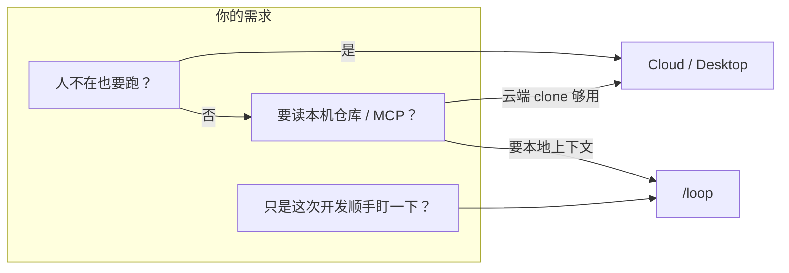
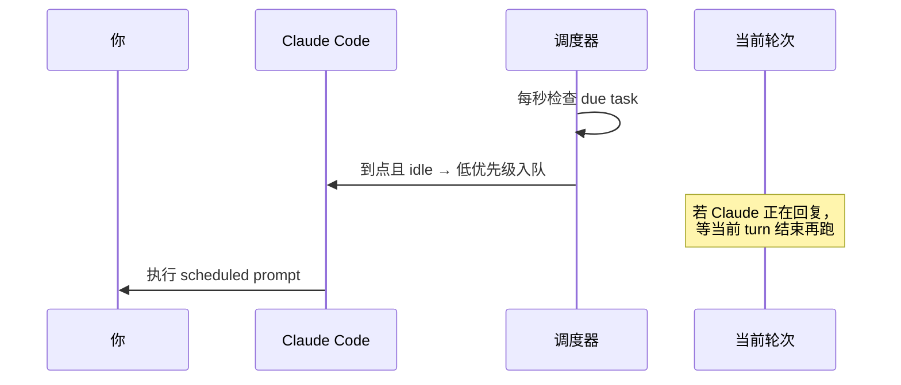

Claude Code 里你盯着部署、等 CI、刷 PR 评论，往往要 **隔几分钟手动敲同一句 prompt**——「看看 build 好了没」「有没有新的 review」。`/loop` 就是干这个的：**在当前会话里，按固定或自适应间隔，自动把 prompt 再跑一遍**。

它和系统 cron、GitHub Actions 定时、Claude Desktop 后台任务 **不是一回事**。这篇按 **官方 scheduled tasks 文档** 把 `/loop` 的用法、边界和选型说清楚；MCP / Skills 基础见 [Claude Code 进阶](./claude-code-advanced-usage-guide.html)，按题型怎么下指令见 [问题分工方法论](./claude-code-problem-solving-methodology.html)。

> 官方参考：[Run prompts on a schedule](https://code.claude.com/docs/en/scheduled-tasks)（要求 Claude Code **v2.1.72+**，`claude --version` 可查）

---

## 先分清：三种「定时跑 Prompt」

Anthropic 把「定时任务」拆成三条路，**别混用**：

| | **Cloud（Routines）** | **Desktop 定时任务** | **`/loop`** |
| --- | --- | --- | --- |
| 跑在哪 | Anthropic 云端 | 本机 | 本机 |
| 要不要开电脑 | 否 | 是 | 是 |
| 要不要 **开着会话** | 否 | 否 | **是** |
| 重启后是否还在 | 是 | 是 | `--resume` 可恢复未过期的 |
| 本地文件 / MCP | 否（fresh clone） | 是 | **继承当前会话** |
| 最短间隔 | 1 小时 | 1 分钟 | 1 分钟 |



**一句话选型**：人在终端里干活、需要 **同一仓库上下文** 反复问同一件事 → `/loop`；要 **关机也跑** 或 **团队无人值守** → Cloud Routines、Desktop 或 GitHub Actions `schedule`。

::: warning 最容易误解的一点

`/loop` **不是** 本机 cron 守护进程。关终端、会话退出，循环就停（`--resume` 可拉回 **7 天内未过期** 的 recurring 任务；**Background Bash / Monitor 任务不会随 resume 恢复**）。想「睡一觉早上自动发简报」，别指望 `/loop`。

:::

---

## `/loop` 是什么

`/loop` 是 Claude Code **内置 bundled skill**，底层走 cron 调度工具（`CronCreate` / `CronList` / `CronDelete`）。你在 CLI 里输入斜杠命令，Claude 把间隔转成 **5 字段 cron**，注册任务，返回 **8 位 job ID**。

**和 `/goal` 的分工**（官方文档并列提到）：`/goal` 是 **条件满足前一直转**（turn after turn）；`/loop` 是 **按钟点或自适应间隔** 再触发。要 **事件驱动**（CI 失败直接推消息）可走 Channels，而不是自己 30 秒 poll 一次。

---

## 四种用法（取决于你传什么参数）

官方规则：**interval 和 prompt 都可省略**，组合决定行为。

| 你传的 | 示例 | 行为 |
| --- | --- | --- |
| 间隔 + prompt | `/loop 5m check the deploy` | **固定** cron 周期 |
| 只有 prompt | `/loop check the deploy` | Claude **每轮自选** 1 分钟～1 小时延迟 |
| 只有间隔 / 空 | `/loop 15m` 或 `/loop` | 跑 **内置维护 prompt** 或你的 `loop.md` |
| prompt 是另一条命令 | `/loop 20m /review-pr 1234` | 定时 **重跑别的 skill / 斜杠命令** |

### 1）固定间隔：盯部署、盯 CI

```text
/loop 5m check if the deployment finished and tell me what happened
```

间隔写法灵活：

- 前缀：`30s`、`5m`、`2h`、`1d`
- 后缀：`check the build every 2 hours`

**秒会进位到分钟**（cron 粒度 1 分钟）。`7m`、`90m` 这类 **对不齐 cron 步长** 的间隔，Claude 会 **就近取整并告诉你实际 cadence**。

### 2）动态间隔：让 Claude 自己决定「多久后再看」

```text
/loop check whether CI passed and address any review comments
```

不传间隔时，每轮结束后 Claude 根据观察选延迟：**build 还在跑 → 短等；PR 已 quiet → 长等**。延迟和理由会打在当轮末尾。

动态模式可能直接用 **Monitor 工具** 跑后台脚本、按行流式回传——比傻 poll 往往 **更省 token、更及时**。任务仍会出现在 scheduled task 列表里，**7 天到期** 规则一样适用。

::: tip Bedrock / Vertex / Foundry

这三类部署上：**无 interval 的 prompt-only `/loop` 固定为每 10 分钟**；**裸 `/loop` 只打 usage，不跑维护 prompt**；**不读 `loop.md`**。以你环境官方说明为准。

:::

### 3）裸 `/loop`：内置「分支保姆」

只敲 `/loop`（或 `/loop 15m` 固定节奏）时，用 **内置维护 prompt**，每轮大致顺序：

1. 继续对话里 **未做完** 的事
2. 照顾 **当前分支 PR**：review 评论、红 CI、冲突
3. 若没事：**bug hunt / 简化** 等清理 pass

**不会** 擅自开新需求；push、删分支等 **不可逆操作** 只在 transcript 里 **已授权** 的延续上才做。

### 4）`loop.md`：换掉默认维护内容

用项目或用户级 Markdown **替换裸 `/loop` 的默认 prompt**（**不是** 任务列表文件）：

| 路径 | 作用域 |
| --- | --- |
| `.claude/loop.md` | 项目级，**优先** |
| `~/.claude/loop.md` | 用户级，项目未定义时用 |

示例（release 分支健康检查）：

```markdown
Check the `release/next` PR. If CI is red, pull the failing job log,
diagnose, and push a minimal fix. If new review comments have arrived,
address each one and resolve the thread. If everything is green and
quiet, say so in one line.
```

**改文件下一轮生效**；命令行里带了 prompt 时 **忽略 loop.md**。正文超过约 25KB 会截断——写短、写可执行。

要 **同时** 跑多条定时 prompt：分别 `/loop 5m …`、`/loop 20m …`，或自然语言让 Claude 建多个 cron job。

---

## 可组合：定时重跑任意斜杠命令

```text
/loop 20m /review-pr 1234
/loop 15m scan error logs and create PRs for fixable bugs
```

任意已保存的 **skill / 斜杠命令** 都能当 loop 的 payload——定时任务变成 **轻量编排**：你定 cadence，Claude 每轮执行那条命令链。

---

## 一次性提醒（不是 `/loop`）

自然语言即可，走 **单次 cron**，跑完自删：

```text
remind me at 3pm to push the release branch
in 45 minutes, check whether the integration tests passed
```

Claude 会钉到 **具体分钟** 并确认触发时间。

---

## 管理任务

对话里直接说：

```text
what scheduled tasks do I have?
cancel the deploy check job
```

底层工具：

| 工具 | 作用 |
| --- | --- |
| `CronCreate` | 新建（cron 表达式 + prompt + 是否 recurring） |
| `CronList` | 列出 ID、schedule、prompt |
| `CronDelete` | 按 ID 取消 |

单会话 **最多 50 个** scheduled task。

**停掉正在等的 `/loop`**：按 `Esc`——清掉 pending wakeup，下一轮不再 fire（用自然语言建的 cron **不受 Esc 影响**，要单独 cancel）。

动态模式下，Claude 也可在任务 **可证明完成** 后 **不再 schedule 下一轮**；固定间隔会一直跑到你停或 **满 7 天**。

---

## 调度器怎么跑（知道这些少踩坑）



要点：

- **低优先级**：插在你 **两轮对话之间**，不会打断正在生成的回复。
- **忙时错过**：长请求占满时间窗时，**不会** 按错过次数补跑多次，idle 后 **补一次**。
- **时区**：cron 按 **本机本地时区**，不是 UTC。
- **Jitter**：多会话同时 `:00` 打 API 会抖——recurring 最多 **延后 30 分钟**（或间隔一半）；整点 one-shot 可能 **提前最多 90 秒**。offset 由 task ID 决定，**同一任务稳定**。要准点可选 `:03` 这类非 `:00`/`:30` 分钟。
- **7 天 expiry**：recurring 创建后 **7 天** 自动删（最后一轮仍会跑）。要更长：重建任务，或改 Cloud / Desktop。

环境变量 **`CLAUDE_CODE_DISABLE_CRON=1`** 可 **整包关掉** cron 与 `/loop`（已注册任务也不再 fire）。

---

## 适用场景与反模式

### 适合

| 场景 | 示例 |
| --- | --- |
| 部署 / 集成测试进行中 | `/loop 5m check deploy status` |
| 等 PR CI + review | `/loop check CI and address comments` |
| 长会话里分支维护 | 裸 `/loop` 或自定义 `loop.md` |
| 开发中临时提醒 | `in 45 minutes, …` |

### 不适合

| 场景 | 更合适的方案 |
| --- | --- |
| 关机、关终端也要跑 | Desktop 定时 / Cloud Routines / `claude -p` + 系统 cron |
| 精确到秒的监控 | CI webhook、PagerDuty、Channels 事件推送 |
| 跑一周无人看管 | 7 天 expiry；用 GitHub Actions `schedule` |
| 高频空转 | 间隔太短 **烧 token**（5 分钟 loop 一天 ≈ 288 次）；先长后短 |

::: warning 成本

固定短间隔 + 长会话 = prompt 次数线性涨。订阅额度或 API 账单都会有感。**先 15m～30m 试**，确认值得再收紧。

:::

---

## 和 Cursor `/loop` 的关系（别混）

Cursor Agent 也有名为 **loop** 的 skill（`/loop 5m /foo`），思路类似：**会话内周期性唤醒 Agent**。实现上 Cursor 侧常用 **shell sentinel + 后台 sleep**，且 **cloud 环境禁用**。

| | Claude Code `/loop` | Cursor loop skill |
| --- | --- | --- |
| 产品 | Anthropic CLI | Cursor IDE Agent |
| 调度 | 内置 cron 工具 + 可选 Monitor | 终端 sleep / 动态 watcher |
| 文档 | [scheduled-tasks](https://code.claude.com/docs/en/scheduled-tasks) | Cursor 内置 skill |

两边 **命令长得像，引擎不同**；本文只讲 Claude Code。

---

## 实操清单

1. **确认版本** ≥ 2.1.72。
2. **先固定间隔试跑**：`/loop 10m echo status of main branch CI`（换成你真要盯的事）。
3. **`CronList` 或自然语言列任务**，记下 job ID。
4. 长期维护 release → 写 **`.claude/loop.md`**，日常只敲 `/loop`。
5. 要无人值守 → **别升级 `/loop`**，改 Desktop / Actions。
6. 结束会话前 **cancel 或 Esc**，避免忘了 7 天内还在烧轮次。

---

## 小结

- **`/loop` = 会话内定时重跑 prompt**，继承当前仓库与 MCP，适合 **人在终端、顺手盯进度**。
- **四种模式**：固定间隔、动态间隔、内置维护、`loop.md` 自定义；还可 **`/loop 20m /other-command`** 做编排。
- **不是 cron 替代品**：关会话就停、7 天过期、最多 50 任务；长期自动化用 Cloud / Desktop / GitHub Actions。
- **调度细节**：turn 之间执行、busy 只补一次、本地时区 + jitter；`Esc` 停 pending loop。
- **和 `/goal`、Channels 分工**：interval poll vs 条件驱动 vs 事件推送，按场景选。

把 `/loop` 当成 **开发会话里的值班同事**——你在写别的代码，它按钟点帮你看一眼 deploy 和 PR；下班关终端，值班也下班。要 **24×7 的 AI cron**，换一层基础设施就行。

---

## 参考

- [Run prompts on a schedule（官方）](https://code.claude.com/docs/en/scheduled-tasks)
- [Claude Code 进阶：MCP、Skills 与自用习惯](./claude-code-advanced-usage-guide.html)
- [Claude Code 怎么处理不同问题](./claude-code-problem-solving-methodology.html)
