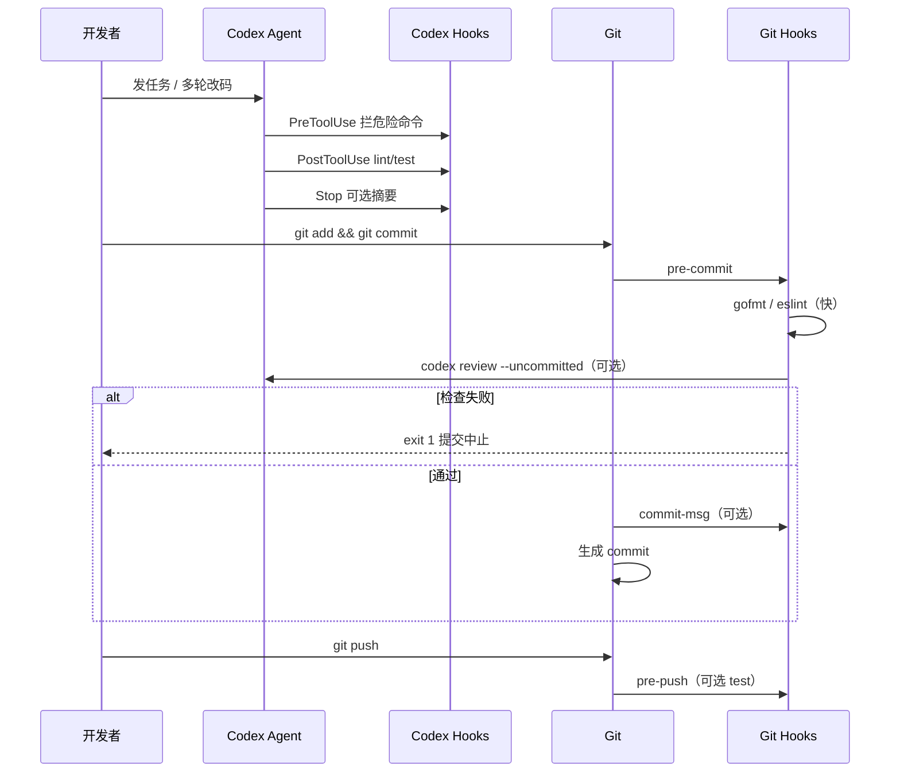
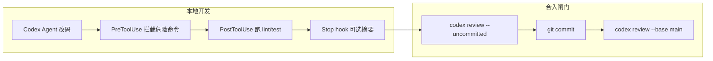

用 OpenAI **Codex**（终端 CLI / IDE 扩展那条产品线）写代码时，「审查」其实有两条腿：**`codex review`** 是专门跑代码评审的子命令；**Hooks** 则是在 Agent 循环里插脚本的生命周期框架。官方文档里 Hooks 还有一层 **Review and trust**——第一次启用某个 hook 脚本前，要在 CLI 里审一眼、点信任，和 Git 里的 review 不是一回事，但名字挨在一起，初学者很容易混。

这篇把三件事拆开讲清楚，并给几条能直接抄的配置：**提交前 diff 审查**、**Agent 跑完再扫一遍**、**危险命令拦截**。姊妹篇：[主流 AI 编程工具怎么选](./mainstream-ai-coding-tools-comparison.html)（Codex 产品线 vs Copilot 里的 Codex 档位）。Claude Code 侧的分型与验证节奏见 [问题处理方法论](./claude-code-problem-solving-methodology.html)。

> 官方参考：[Codex Hooks](https://developers.openai.com/codex/hooks) · [codex review（CLI）](https://openai-codex.mintlify.app/cli/review) · [Codex CLI](https://developers.openai.com/codex/cli/)

## 先分清三个「Review」

| 名称 | 是什么 | 典型入口 |
| --- | --- | --- |
| **`codex review`** | 非交互式 **代码评审模式**（类似 `codex exec`） | `codex review --uncommitted` |
| **Hooks 的 Review / trust** | 对 **hook 脚本定义** 做人工确认，防恶意命令 | CLI 里 `/hooks` |
| **Git pre-commit hook** | 你自己写的 shell，**可以**在里面调用 `codex review` | `.git/hooks/pre-commit` |

下面按：**Review 子命令 → Codex Hooks → 信任流程 → 与 Git Hooks 协作 → 组合玩法 → 分栈实践 → 和 Cursor 对照** 展开。

## `codex review`：专用代码审查命令

`codex review` 把 Codex 切到 **只审不改** 的流水线：读 diff / commit / 分支差异，按提示词或默认策略输出评审意见。行为上接近 `codex exec`（非交互、适合 CI 和脚本），而不是 TUI 里一边聊一边改文件。

### 常用审查范围

```bash
# 工作区未提交改动（提交前最常用）
codex review --uncommitted

# 当前分支相对 main 的增量（PR 场景）
codex review --base main

# 单个 commit
codex review --commit HEAD
codex review --commit abc123 --commit-title "Fix auth redirect"
```

### 自定义审查重点

审查标准可以写在参数里，或从 stdin 读入：

```bash
codex review --uncommitted "重点看 SQL 注入、鉴权边界和密钥硬编码"

echo "检查错误处理、重复代码和测试是否跟上" | codex review -
```

### 输出与退出码（别误用）

```bash
# 默认打到 stderr；落盘用 -o
codex review --uncommitted -o pre-commit-review.md

# CI 解析用 JSON Lines
codex review --base main --json > pr-review.jsonl
```

**重要**：退出码 **0 / 1 表示 review 命令是否跑成功**，**不表示**「代码有没有通过审查」。有没有 blocker，要读报告正文。若你想 **发现严重问题就阻断提交**，得自己在脚本里解析 `-o` 的文件或 `--json` 事件，再 `exit 1`——官方 pre-commit 示例里 `codex review` 失败才拦提交，指的是 **命令执行失败**，不是「AI 提了 3 条建议」。

### 和日常 `codex` 会话的区别

| 维度 | 交互式 `codex` | `codex review` |
| --- | --- | --- |
| 目的 | 实现需求、改文件、跑命令 | 只评审，不替你合 PR |
| 交互 | TUI / 多轮 | 单次非交互 |
| 输入 | 自然语言任务 | diff / commit / `--base` |
| 适合 | 开发 | 提交前、PR、定时审计 |

选型上：**写代码用 Agent**；**合入前用 review**。两者模型族可以一致（如 GPT‑5.x / Codex 向档位），账单仍跟 ChatGPT 套餐或 API 方案走，别和裸 Chat 混账（见 [主流编程模型族](./mainstream-coding-llm-families.html)）。

## Codex Hooks：在 Agent 循环里插脚本

Hooks 是 Codex 的 **可扩展事件总线**：在「要调工具之前」「工具跑完之后」「用户提交 prompt」「本轮结束」等节点，执行你指定的 **command** 脚本。典型用途官方写得很直白：日志上报、拦 API Key 误粘贴、会话结束做规范检查、按目录改 system 提示等。

默认 **开启**。要关可在 `config.toml` 里：

```toml
[features]
hooks = false
```

（旧键 `codex_hooks` 仍可用，已标 deprecated。）

### 配置放在哪

Codex 会在多层配置里 **合并** 所有匹配的 hook，高优先级层 **不会覆盖** 低层的 hook 定义：

- 用户级：`~/.codex/hooks.json` 或 `~/.codex/config.toml` 内联 `[hooks]`
- 项目级：`<repo>/.codex/hooks.json`（项目 `.codex` 需 **信任** 后才会加载项目 hook）
- 插件：插件包内的 `hooks/hooks.json` 或 manifest 指定路径

同一层里 **`hooks.json` 与内联 `[hooks]` 并存** 时 Codex 会合并并 **启动告警**——建议一层只保留一种写法。

### 事件一览（写 review 相关逻辑时最常用）

| 事件 | 触发时机 | `matcher` | 能干什么 |
| --- | --- | --- | --- |
| `PreToolUse` | 工具执行 **前** | 工具名（如 `Bash`、`apply_patch`） | **拦截/改权限**（`permissionDecision`） |
| `PermissionRequest` | 弹出审批时 | 工具名 | 自动 deny / allow |
| `PostToolUse` | 工具执行 **后** | 工具名 | `continue: false` 可 **打断本轮** |
| `UserPromptSubmit` | 用户发送 prompt | 忽略 matcher | 注入上下文、改 prompt |
| `Stop` | 一轮结束 | 忽略 matcher | `continue: false` 可 **让 Agent 再跑一轮** |
| `SessionStart` | 会话启动/恢复 | `startup` \| `resume` 等 | 注入 `additionalContext` |
| `PreCompact` / `PostCompact` | 上下文压缩前后 | `manual` \| `auto` | 审计压缩策略 |

**并发**：同一事件下多个匹配的 command hook **并行启动**，一个 hook **不能** 阻止另一个启动；若要「全局只跑一个审查」，在脚本里自己做锁或合并逻辑。

**异步**：配置里的 `async: true` 目前 **不执行**，会被跳过。

### 最小 `hooks.json` 示例

```json
{
  "hooks": {
    "PreToolUse": [
      {
        "matcher": "Bash",
        "hooks": [
          {
            "type": "command",
            "command": "/usr/bin/python3 \"$(git rev-parse --show-toplevel)/.codex/hooks/block-dangerous-git.sh\"",
            "statusMessage": "检查 Git 命令安全性",
            "timeout": 30
          }
        ]
      }
    ],
    "Stop": [
      {
        "hooks": [
          {
            "type": "command",
            "command": "/usr/bin/python3 \"$(git rev-parse --show-toplevel)/.codex/hooks/run-review-on-stop.sh\"",
            "statusMessage": "本轮结束，生成审查摘要",
            "timeout": 120
          }
        ]
      }
    ]
  }
}
```

脚本从 **stdin 读一行 JSON**（含 `session_id`、`cwd`、`hook_event_name`、`tool_input` 等），向 **stdout 写 JSON** 或 exit code 表达结果。`PreToolUse` 拦 destructive 命令时，exit **2** 是常见约定；具体字段见官方 [Schemas](https://developers.openai.com/codex/hooks)。

**路径建议**：仓库内 hook 用 `$(git rev-parse --show-toplevel)/.codex/hooks/...`，别写相对 `.codex/hooks`——你从子目录启动 Codex 时 cwd 可能不是仓库根。

### `PostToolUse` 里做「轻量 review」

官方示例在 `PostToolUse` + `Bash` matcher 上挂 `post_tool_use_review.py`：某条 shell 跑完后，用脚本或再调一层检查（lint、测试摘要）。这和 `codex review` 不同——**hook 是确定性脚本**；**review 子命令是 LLM 读 diff**。常见组合：**PostToolUse 跑 `pnpm test` 或 `golangci-lint`**；**Stop 或 git hook 再跑 `codex review`**。

## Hooks 的 Review / trust：审的是脚本，不是 diff

非 **managed**（企业下发）的 command hook，第一次跑之前 Codex 会要求你在 **`/hooks`** 界面里 **Review → Trust**。信任绑定在 **当前 hook 定义的 hash** 上；你改了 `command` 路径或脚本内容，hash 变了，会再次标为待审，未信任前 **跳过执行**。

```text
启动 Codex → 若有未信任 hook → 警告：请打开 /hooks
/hooks → 查看来源（用户 / 项目 / 插件）→ 信任或禁用单条
```

自动化场景若 hook 来源已在 CI 镜像里验过，可 **一次性** 加：

```bash
codex --dangerously-bypass-hook-trust ...
```

（仅在你完全控制 hook 产物时使用；别在陌生仓库里习惯性开。）

**Managed hooks**（`requirements.toml`、MDM、云端策略）按策略 **直接信任**，用户不能在 `/hooks` 里关掉。企业可 `allow_managed_hooks_only = true`，只跑管理员 hook，忽略用户/项目/插件层。

## Codex Hooks 与 Git Hooks：区别、关联与协作

很多人把两种 hook 都叫「钩子」，但 **监听的对象、触发时机、配置位置** 完全不同。协作时的原则是：**Codex hook 管 Agent 在会话里怎么改代码；Git hook 管变更要不要进版本库**。中间用 **同一套 shell 脚本** 和可选的 **`codex review`** 把两条线接上。

### 一张表分清

| 维度 | **Codex Hooks** | **Git Hooks** |
| --- | --- | --- |
| 谁触发 | Codex CLI / IDE 里的 **Agent 会话** | 你本地或 CI 里的 **`git commit` / `push` 等** |
| 配置在哪 | `~/.codex/hooks.json`、`<repo>/.codex/hooks.json` | `.git/hooks/*` 或 `core.hooksPath` 指向的目录 |
| 是否进仓库 | 项目 hook **可提交** `.codex/`（同事要 **信任项目**） | 默认 `.git/hooks` **不随 clone 分发**；团队用 `scripts/git-hooks/` + `core.hooksPath` |
| 典型事件 | `PreToolUse`、`PostToolUse`、`Stop`、`SessionStart`… | `pre-commit`、`commit-msg`、`pre-push`、`post-merge`… |
| 输入输出 | stdin 一行 **JSON**；stdout 可返回 **拦截决策** | 环境变量 + `git` 命令；**exit 非 0 阻断** 本次 git 操作 |
| 跑不跑 AI | hook 本身应是 **确定性脚本**；可 **调用** `codex review` | 同上；Git hook 里 `codex review` 很常见 |
| 没开 Codex 时 | **不执行** | **照样执行**（只要你在 commit） |
| 没用 git 时 | Codex 改文件仍会触发 | **不执行** |

**关联**：Git hook **不会自动替代** Codex hook，反之亦然。Agent 在 TUI 里改了一下午文件、你 **从没 `git commit`**，只有 Codex hook 能拦/检；你手写代码、**从没开 Codex**，只有 Git hook 能在提交时检查。

### 时间线上的协作（谁先谁后）



理解这张图就够选型：**会话内**用 Codex hook 把问题扼杀在「还没 commit」；**进库前**用 Git hook 做团队统一闸门（含 LLM review）。

### 各自该怎么写

#### 写 Codex Hook（`hooks.json` + 脚本）

1. 在仓库根建 `.codex/hooks.json` 和 `.codex/hooks/*.sh`（或 `.py`）。  
2. 脚本 **只读 stdin JSON**，用 `jq` 取 `tool_input`、`hook_event_name`。  
3. **要快、要稳**：lint、单测、正则拦命令；别把整段 `codex review` 绑在 `PostToolUse` 里除非你能接受每改一次文件就调一次模型。  
4. 提交仓库后，同事 clone 要在 Codex 里 **信任该项目**，并在 `/hooks` 里 **信任脚本 hash**。  
5. `PreToolUse` 拦不住别的 Codex hook 并行执行——destructive 规则写进 **一个** 脚本里统一判断。

#### 写 Git Hook（可版本化）

1. 把脚本放在 **`scripts/git-hooks/pre-commit`**（不要只改本地 `.git/hooks`，clone 会丢）。  
2. 安装：`git config core.hooksPath scripts/git-hooks`（或 `husky` / `pre-commit` 框架生成）。  
3. 脚本开头：`#!/bin/bash` + `set -euo pipefail`；用 `git diff --cached` 看 **暂存区**。  
4. **先快后慢**：`gofmt` / `eslint` → 再 `codex review`；慢的检查加 `SKIP_CODEX_REVIEW=1` 逃生（仅本地）。  
5. **CI**：`CI=true` 时跳过本地 `codex review`、改跑 `codex review --base main` 在 Actions 里出 artifact。

#### 协作：共用脚本、分工不同

把「检查逻辑」和「挂在哪」拆开，维护成本最低：

```text
scripts/
  checks/
    lint-frontend.sh      # 被 Codex PostToolUse 与 Git pre-commit 共用
    lint-backend.sh
    run-codex-review.sh   # 封装 codex review + 提示词文件
  git-hooks/
    pre-commit            # source ../checks/*.sh
.codex/
  hooks.json              # command 指向 ../scripts/checks/*.sh
  hooks/
    pre-tool-use.sh       # 仅 Codex：解析 JSON，调 block 规则
```

`run-codex-review.sh` 示例（Git 与 Codex `Stop` 都能调）：

```bash
#!/bin/bash
set -euo pipefail
ROOT=$(git rev-parse --show-toplevel 2>/dev/null || pwd)
PROMPT="${ROOT}/scripts/checks/codex-review-prompt.txt"
OUT="${1:-/tmp/codex-review.md}"

[ -n "${SKIP_CODEX_REVIEW:-}" ] && exit 0
[ -n "${CI:-}" ] && [ "${CI}" != "false" ] && exit 0   # 按需在 CI 另跑

codex review --uncommitted "$(cat "$PROMPT")" -o "$OUT"
# 若要阻断：grep -q 'BLOCKER' "$OUT" && exit 1
exit 0
```

**Git `pre-commit` 调用**：

```bash
#!/bin/bash
ROOT=$(git rev-parse --show-toplevel)
"$ROOT/scripts/checks/lint-backend.sh" --staged
"$ROOT/scripts/checks/run-codex-review.sh" "$ROOT/.codex-review-last.md" || exit 1
```

**Codex `PostToolUse` 调用**（读 JSON，有 Go 改动才 lint）：

```bash
#!/bin/bash
INPUT=$(cat)
echo "$INPUT" | jq -e '.tool_input | tostring | test("\\.go")' >/dev/null || exit 0
"$(git rev-parse --show-toplevel)/scripts/checks/lint-backend.sh" --working-tree
```

### 三种协作模式怎么选

| 模式 | Codex Hooks | Git Hooks | 适合 |
| --- | --- | --- | --- |
| **A. 只护提交** | 关或只做 SessionStart 注上下文 | pre-commit + pre-push 全检 | 主要手写代码，偶尔用 Agent |
| **B. 只护 Agent** | Pre/Post/Stop 齐全 | 仅 gofmt / 常规 lint | 几乎全靠 Codex 改，commit 很随意 |
| **C. 双闸（推荐）** | 会话内快检 + 拦危险命令 | 提交前同脚本 + `codex review` | 团队 + Agent 混用 |

模式 C 里 **同一条规则不要两处实现两份**：危险 Git 命令（`push --force`）在 **Codex `PreToolUse`** 拦 Agent；在 **Git pre-push** 再拦人手误操作——实现可共用 `scripts/checks/block-git.sh`，一个读 JSON、一个读 `git` 参数。

### 容易踩的协作坑

1. **只配 Git hook**：Agent 改完直接 push（或从不 commit）→ 审查够不着。  
2. **只配 Codex hook**：不用 Codex 的同事提交 → 无闸门。  
3. **PostToolUse 每次调 `codex review`**：费用和延迟爆炸；review 放 **Stop 一次** 或 **Git pre-commit 一次**。  
4. **Git hook 未共享**：新人 clone 没有 `core.hooksPath` → 以为团队有审其实没有。  
5. **退出码语义**：`codex review` 成功 ≠ 无问题；Git 要阻断必须自己解析报告。  
6. **暂存区 vs 工作区**：Git pre-commit 看 **staged**；`codex review --uncommitted` 常含 **未 stage**——提交前 `git add` 后再 review，或在提示词里说明「以 staged 为准」。

### 和「四个 Review」怎么对齐

回到文首表格，加上 Git 后更完整：

| 名称 | 层级 | 协作角色 |
| --- | --- | --- |
| Codex Hooks | Agent 会话 | 改码过程中的护栏与快检 |
| Git Hooks | 版本库 | 合入本地的最后一道闸 |
| `codex review` | 子命令 | 可被 **Git hook 或 Codex Stop** 调用，不负责挂载自己 |
| Hooks trust `/hooks` | Codex 配置安全 | 与 Git 无关；审的是 hook 脚本是否可信 |

## 组合玩法：Hook + Review 怎么落地

### 1）提交前：`git` hook 调 `codex review`

适合：**人为主动 commit**，希望 diff 先过一遍 AI。

```bash
#!/bin/bash
# .git/hooks/pre-commit（需 chmod +x）

echo "Codex: 审查未提交改动..."
codex review --uncommitted -o /tmp/codex-review.txt
status=$?

if [ $status -ne 0 ]; then
  echo "codex review 执行失败，见 /tmp/codex-review.txt"
  exit 1
fi

echo "审查报告: /tmp/codex-review.txt"
# 若要根据报告内容阻断，在这里 grep/解析后再 exit 1
exit 0
```

团队共享可把 hook 放进仓库的 `scripts/pre-commit-codex.sh`，用 `core.hooksPath` 指向。

### 2）Agent 一轮结束：`Stop` hook 调 review

适合：**Codex Agent 刚改完一堆文件**，你想在同一 session 末尾自动出审查摘要（不替代 PR 人工审）。

`run-review-on-stop.sh` 思路：读 stdin JSON 拿 `cwd`，在该目录执行：

```bash
codex review --uncommitted -o "${cwd}/.codex-last-review.md" 2>/dev/null || true
```

`Stop` 返回 `continue: false` 时，Codex 会 **继续对话** 并把 `stopReason` 喂回模型——可用来「审查未通过，请按报告修改」。注意 **timeout**（默认 600 秒，可在 hook 项里改 `timeout`）。

### 3）工具级护栏：`PreToolUse` 拦截，再交给 review

例如禁止 Agent 在 `main` 上 `git push --force`，或禁止 `rm -rf`：

```bash
#!/bin/bash
INPUT=$(cat)
COMMAND=$(echo "$INPUT" | jq -r '.tool_input.command // empty')
BRANCH=$(git symbolic-ref --short HEAD 2>/dev/null)

if echo "$COMMAND" | grep -qE 'git push.*--force'; then
  echo "禁止 force push" >&2
  exit 2
fi

if [ "$BRANCH" = "main" ] && echo "$COMMAND" | grep -q 'git commit'; then
  echo "禁止直接向 main 提交，请走分支" >&2
  exit 2
fi

exit 0
```

这类 **硬规则** 用 hook；**风格、架构、安全语义** 用 `codex review` 更划算。

### 4）CI：PR 上对 `--base` 出报告

```yaml
# 片段：GitHub Actions
- name: Codex PR Review
  run: |
    codex review --base "${{ github.base_ref }}" -o review-report.md
    codex review --base "${{ github.base_ref }}" --json > review.jsonl
- uses: actions/upload-artifact@v4
  with:
    name: codex-review
    path: review-report.md
```

checkout 需 **足够 git 历史**（`fetch-depth: 0`），否则 `--base` 比不出来。

### 流程关系（简图）



## 分栈最佳实践

下面按常见分工写两套可落仓库的配置思路：**前端 React**、**后端 Go**。Monorepo 里把 `matcher` 或脚本里的路径收窄到各自目录，避免 Agent 改 `apps/web` 时触发整套 `go test ./...`。

### 前端（React / TypeScript）

React 侧的问题多半是 **XSS、错误边界、Hooks 依赖、客户端泄露密钥、可访问性**。建议 **确定性检查走 hook**，语义审查交给 `codex review`。

**目录约定（示例）**

```text
apps/web/          # 或 packages/ui/
  src/
  package.json
  vite.config.ts   # 或 next.config.*
```

**`codex review` 提示词（提交前）**

```bash
codex review --uncommitted "$(cat <<'EOF'
仅审查 apps/web 下本次 diff。重点：
- dangerouslySetInnerHTML、v-html、innerHTML 与未转义用户输入
- 密钥/Token 是否打进客户端 bundle（VITE_* / NEXT_PUBLIC_*）
- useEffect 依赖数组、闭包陈旧状态、异步竞态（abort/ignore 标志）
- 表单与 API 错误态、加载态是否完整
- a11y：按钮类型、label、键盘焦点、aria
- 大列表是否缺虚拟化或分页
忽略 apps/api、go.mod 等非前端路径。
EOF
)"
```

**`PostToolUse`：改完 TS/TSX 后跑快检**

```json
{
  "hooks": {
    "PostToolUse": [
      {
        "matcher": "apply_patch|Edit|Write",
        "hooks": [
          {
            "type": "command",
            "command": "\"$(git rev-parse --show-toplevel)/.codex/hooks/frontend-post-edit.sh\"",
            "statusMessage": "前端 lint / 类型检查",
            "timeout": 180
          }
        ]
      }
    ]
  }
}
```

`frontend-post-edit.sh` 示例（按你仓库改路径与包管理器）：

```bash
#!/bin/bash
set -euo pipefail
ROOT=$(git rev-parse --show-toplevel)
INPUT=$(cat)
# 仅当 patch 涉及前端目录时执行
if ! echo "$INPUT" | jq -e '.tool_input | tostring | test("apps/web")' >/dev/null 2>&1; then
  exit 0
fi
cd "$ROOT/apps/web"
pnpm exec eslint "src/**/*.{ts,tsx}" --max-warnings 0
pnpm exec tsc --noEmit
# 有变更的测试（Vitest / Jest 二选一）
pnpm test --run --changed 2>/dev/null || pnpm test --run --passWithNoTests
exit 0
```

**`PreToolUse`：拦高风险前端命令**

```bash
#!/bin/bash
INPUT=$(cat)
CMD=$(echo "$INPUT" | jq -r '.tool_input.command // empty')

# 禁止对生产 API 做未授权写操作
if echo "$CMD" | grep -qE 'curl.*(POST|PUT|DELETE).*api\.(prod|production)'; then
  echo "禁止 Agent 对生产 API 发写请求" >&2
  exit 2
fi

# 避免误删 node_modules / lock（可改成只允许 pnpm install）
if echo "$CMD" | grep -qE 'rm -rf.*(node_modules|pnpm-lock)'; then
  echo "禁止删除依赖目录或 lock 文件" >&2
  exit 2
fi

exit 0
```

**`SessionStart`：注入前端约定（减少 Agent 乱用路由/状态库）**

在 `SessionStart` + `matcher: "startup|resume"` 的 hook 里向 stdout 写 `additionalContext`，例如：状态管理用 Zustand、请求用 TanStack Query、组件目录规范、Design Token 路径。比每轮在 chat 里重复粘贴省 token。

**前端实操顺序**

1. `pnpm lint` + `tsc` 进 **PostToolUse**（快、可重复）。  
2. `codex review --uncommitted` 用 **窄范围 + 安全/a11y 清单**（慢、语义）。  
3. PR 上对 `apps/web` 相关文件再跑 `codex review --base main`（同提示词）。  
4. Storybook / E2E 不必绑每个 patch，可放 CI nightly 或合并前人工点跑。

### 后端（Go / Golang）

Go 服务侧优先守住 **并发与 context、SQL/NoSQL 注入、鉴权中间件、错误链、资源泄漏**。同样：**vet / lint / test 用 hook**，架构与安全语义用 `codex review`。

**目录约定（示例）**

```text
cmd/
internal/
pkg/
go.mod
.golangci.yml
```

**`codex review` 提示词（提交前）**

```bash
codex review --uncommitted "$(cat <<'EOF'
仅审查 Go 后端本次 diff（cmd/ internal/ pkg/）。重点：
- 数据库查询是否参数化；ORM Raw 是否拼接用户输入
- HTTP handler 是否校验鉴权、租户边界、输入长度
- context 是否从请求传入并在下游传递；避免 context.Background 滥用
- goroutine 是否有退出路径；WaitGroup / errgroup 用法
- 错误是否 wrap（%w）、对外是否泄露内部细节
- 事务边界、幂等、重试是否安全
- 敏感配置是否硬编码；日志是否打印 PII/卡号
忽略 apps/web、*.tsx 等前端路径。
EOF
)"
```

**`PostToolUse`：改动后跑受影响包测试**

```bash
#!/bin/bash
set -euo pipefail
ROOT=$(git rev-parse --show-toplevel)
INPUT=$(cat)
if ! echo "$INPUT" | jq -e '.tool_input | tostring | test("(internal/|pkg/|cmd/)")' >/dev/null 2>&1; then
  exit 0
fi
cd "$ROOT"

# 只测有改动的包，大仓库省时间
CHANGED=$(git diff --name-only HEAD 2>/dev/null | grep -E '\.go$' || true)
if [ -z "$CHANGED" ]; then
  exit 0
fi
PKGS=$(echo "$CHANGED" | xargs -I{} dirname {} | sort -u | sed 's|^\./||' | while read -r d; do
  go list "./${d}/..." 2>/dev/null || true
done | sort -u | tr '\n' ' ')
[ -n "$PKGS" ] && go test -race -count=1 $PKGS

golangci-lint run --new-from-rev=HEAD~1 ./... 2>/dev/null || golangci-lint run ./...
exit 0
```

**`PreToolUse`：拦危险 Go / 运维命令**

```bash
#!/bin/bash
INPUT=$(cat)
CMD=$(echo "$INPUT" | jq -r '.tool_input.command // empty')

if echo "$CMD" | grep -qE 'go run.*(prod|production)|mysql.*-p'; then
  echo "禁止 Agent 直连生产或带明文密码的数据库命令" >&2
  exit 2
fi

if echo "$CMD" | grep -qE 'DROP TABLE|TRUNCATE|migrate.*down.*prod'; then
  echo "禁止破坏性迁移或 DDL" >&2
  exit 2
fi

exit 0
```

**Git pre-commit（Go 专版，可与前端脚本并存）**

```bash
#!/bin/bash
ROOT=$(git rev-parse --show-toplevel)
cd "$ROOT"

STAGED_GO=$(git diff --cached --name-only --diff-filter=ACM | grep '\.go$' || true)
[ -z "$STAGED_GO" ] && exit 0

echo "$STAGED_GO" | xargs gofmt -l | grep -q . && { echo "gofmt 未通过"; exit 1; }
go vet $(echo "$STAGED_GO" | xargs -I{} dirname {} | sort -u | sed 's|^|./|' | uniq)

codex review --uncommitted @/tmp/codex-go-prompt.txt -o /tmp/codex-go-review.md
# 需要阻断时：解析 /tmp/codex-go-review.md 中的 BLOCKER 标记
```

把上面的 Go 专用提示词存成 `scripts/codex-review-go-prompt.txt`，前端仓库则用另一份 `codex-review-react-prompt.txt`；monorepo 的 pre-commit 里按 staged 文件扩展名分支调用。

**后端实操顺序**

1. `gofmt` / `go vet` / `golangci-lint` → **PostToolUse** 或 pre-commit。  
2. `go test -race` 覆盖 **本次改动包**（全量 `./...` 留给 CI）。  
3. `codex review` 盯 **鉴权、SQL、并发、错误暴露**。  
4. PR 用 `codex review --base main` + 同提示词；OpenAPI/Proto 变更时提示词里加一句「检查 handler 与生成代码是否一致」。

### Monorepo 里两套栈怎么共存

| 场景 | 做法 |
| --- | --- |
| 同仓库 `apps/web` + `apps/api` | 两份 `hooks.json` 可合并；脚本内用路径判断，或 `matcher` 只绑 `Bash` 时在脚本里解析 patch 路径 |
| 只改前端 | pre-commit 跳过 `go test`；`codex review` 用 React 提示词 |
| 只改后端 | 跳过 `pnpm`；用 Go 提示词 |
| Agent 跨栈改接口 | `Stop` hook 一次 review，提示词写明「契约：OpenAPI/类型是否两端一致」 |

```json
{
  "hooks": {
    "UserPromptSubmit": [
      {
        "hooks": [
          {
            "type": "command",
            "command": "\"$(git rev-parse --show-toplevel)/.codex/hooks/monorepo-context.sh\"",
            "statusMessage": "加载 monorepo 约定"
          }
        ]
      }
    ]
  }
}
```

`monorepo-context.sh` 可向 stdout 输出 JSON `additionalContext`：`apps/web` 用 React 19 + pnpm；`apps/api` 用 Go 1.22 + chi/gin；共享 API 契约在 `api/openapi.yaml`。

## 和 Cursor Hooks 的对照（你在用 Cursor 时）

Cursor 也在 `.cursor/hooks.json` 里用 **command / prompt hook**，事件名不同（如 `beforeShellExecution`、`afterFileEdit`），但 **stdin JSON + stdout 决策** 的心智模型类似。差异要点：

| 项目 | Codex Hooks | Cursor Hooks |
| --- | --- | --- |
| 配置 | `~/.codex/`、`<repo>/.codex/` | `~/.cursor/`、`<repo>/.cursor/` |
| 信任 | `/hooks` 审脚本 hash | Hooks 面板 / 输出通道 |
| 专用审查命令 | **`codex review`** | 多在 hook 或 Agent 规则里自定义 |
| 项目未信任 | 项目 hook 不加载 | 项目 hook 可进仓库共享 |

两边可以 **各管各的环境**：Cursor 写前端、Codex CLI 跑后端时，把 **同一套 Git pre-commit** 里调用 `codex review` 当作统一闸门，往往比复制两套 hook 脚本省事。

## 实操清单与踩坑

1. **装 CLI 并登录**：`codex` 在 PATH；ChatGPT 套餐或 API 可用。  
2. **先手动跑通**：`codex review --uncommitted -o /tmp/r.md`，确认 diff 范围符合预期。  
3. **再加 hook**：项目内 `.codex/hooks.json` → 仓库根路径脚本 → `chmod +x` → `/hooks` 信任。  
4. **信任项目**：未信任仓库时 **项目级 hook 不生效**，只剩用户级。  
5. **退出码语义**：别把「review 跑成功」当成「代码无问题」。  
6. **超时与费用**：全量 `--base main` 在大仓库上又慢又贵，可改 `--uncommitted` 或限定目录的自定义 prompt。  
7. **插件 hook**：启用插件后同样要走 trust；企业用 managed hook 统一策略。

## 小结

- **`codex review`**：LLM 读 diff/commit/分支，输出评审报告；适合 **提交前、PR、CI**。  
- **Codex Hooks**：在 Agent 生命周期插 **确定性脚本**；适合 **拦命令、跑 lint、注入上下文、Stop 后续航**。  
- **Hooks 的 Review/trust**：审的是 **hook 定义是否可信**，用 `/hooks` 管理。  
- **推荐分工**：硬规则 → `PreToolUse`；质量语义 → `codex review`；Git 闸门 → pre-commit 调 review；长任务收尾 → `Stop` + 可选 review。
- **分栈**：React 侧重 XSS/a11y/Hook 与客户端密钥；Go 侧重 context/SQL/鉴权/并发；monorepo 用路径分支 + 窄提示词。
- **协作**：Codex hook 管 **会话内**；Git hook 管 **进库**；检查脚本放 `scripts/checks/` 共用，`codex review` 放在 Git pre-commit 或 `Stop`，别绑在每个 `PostToolUse` 上。

已在用 [Claude Code 进阶](./claude-code-advanced-usage-guide.html) 的 MCP/Skills 时，可把检查清单写进 `codex review` 的 stdin prompt，或 Stop hook 调用的脚本——工具不同，**先护栏、再 LLM 审、最后人过 PR** 的顺序一样。

## 参考链接

- [Codex Hooks（官方）](https://developers.openai.com/codex/hooks)
- [codex review（CLI 文档）](https://openai-codex.mintlify.app/cli/review)
- [Codex CLI](https://developers.openai.com/codex/cli/)
- [OpenAI Codex GitHub](https://github.com/openai/codex)
- 本博客：[主流 AI 编程工具怎么选](./mainstream-ai-coding-tools-comparison.html) · [主流编程模型族](./mainstream-coding-llm-families.html)
