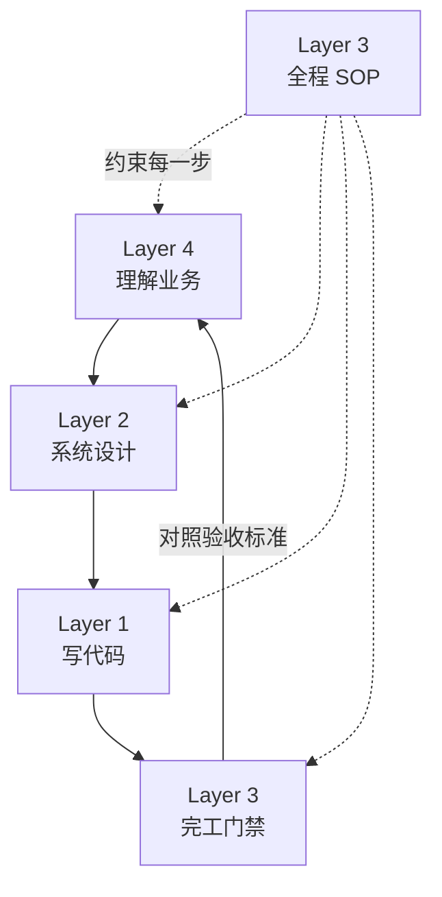
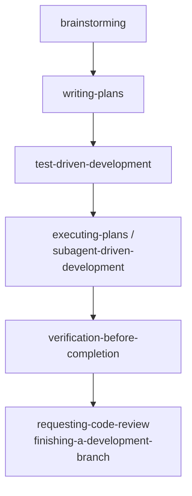
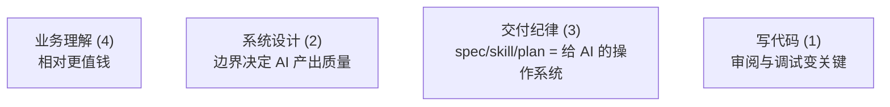

AI 编程快成默认姿势之后，「开发者该学什么」反而更乱：有人把敏捷塞进架构、把测试塞进语言、把 Superpowers 当成写代码技巧。本文只谈 **开发** 这件事——不区分前后端，也不把产品、运营整套扛肩上——用一套 **四层能力模型** 把边界划清楚，并说明 [Superpowers 系列](./superpowers-series-plan.html) 落在哪一层、AI 时代各层权重怎么变。

姊妹篇：[Claude Code 怎么处理不同问题](./claude-code-problem-solving-methodology.html)（按题型分工）；[主流 AI 编程工具怎么选](./mainstream-ai-coding-tools-comparison.html)（工具 × 模型维度）；[企业 Skills 治理](./enterprise-skills-governance-methodology.html)（Layer 3 组织化）；[Claude Code `/loop`](./claude-code-loop-guide.html)（会话内定时任务）。

## 先对齐：四层各自回答什么问题

很多人会用「语言 → 架构 → 方法论 → 懂业务」来理解软件工作，大方向没错，但混在一起时成长路径不清晰。若角色定位就是 **开发**，可以收成四个问题：

| 层 | 核心问题 |
| --- | --- |
| 1. 如何写代码 | 这段逻辑对不对、能不能改、出了问题能不能查 |
| 2. 如何设计系统 | 模块怎么分、边界在哪、系统怎么演进 |
| 3. 交付纪律 | 用什么流程，稳定地把 1 和 2 做出来、验完再交 |
| 4. 理解业务 | 代码要服务什么规则、场景和验收标准 |

::: tip 编号 ≠ 先后顺序

**编号**按「离代码远近」排：1 最贴实现，4 最贴业务。**交付**按 4→2→1 走；**3 贯穿全程**，并在末尾以门禁把结果 **对照回 Layer 4 的验收标准**。

:::

四层不是四种互不相关的技能，而是一条 **有闭环、有贯穿关系** 的工作链：

日常交付的顺序通常是：**先对齐业务 → 再定结构 → 再写实现 → 验完对照验收标准**；**交付纪律贯穿全程**，规定什么时候该 brainstorm、什么时候该写 plan、什么时候算真正完成。

**Layer 2 与 Layer 3 的快速分界**：Layer 2 管 **仓库长什么样**（模块、边界、契约）；Layer 3 管 **改动怎么进出仓库**（plan、review、测试门禁、分支收尾）。

---

## 第一层：如何写代码

### 这一层在回答什么

「给定一个边界清楚的改动，我能不能正确实现、读懂、修改，并在出问题时定位根因？」

这里说的「写代码」，不是背诵语法或 API，而是 **工程化的实现能力**——函数怎么组织、类型怎么表达、错误怎么处理、IO 和并发怎么控、别人（或 AI）写的代码你怎么读 diff、怎么 debug。前后端、脚本、CLI、数据处理，都归这一层；**栈是工具，不是分层依据**。

### 交付物与合格线

一个合格的 Layer 1，至少应该能：

- **审阅代码**：读 diff、跟调用链、看测试在保护什么——AI 时代往往 **读 > 写**
- **读懂并修改**已有代码，包括 AI 生成的大段 diff
- **在局部动手**时不破坏周边行为
- **写测试**：不追求覆盖率崇拜，但关键路径要有保护
- **查 bug**：从报错、日志、复现步骤走到根因，而不是盲目改到「好像好了」

有人会把测试、调试单独提成第五层。对开发者来说不必：**会写测试、会调试，本来就是「会写代码」的一部分**。

> 实现 + 审阅 + 测试 + 调试 = 写代码

没有验证的实现，在 AI 时代尤其危险——生成结果「看起来对」的概率很高，「实际上对」的概率并没有同步提高。

### AI 时代 Layer 1 怎么变

变化的不是「还需不需要会写代码」，而是 **重心迁移**：

| 以前 | 现在 |
| --- | --- |
| 手写每一行、熟记 API | 描述意图，AI 出初稿，人审 diff |
| 语法和样板是瓶颈 | 判断对错、改关键路径是瓶颈 |
| 调试靠逐行经验 | 更要会质疑「 plausible wrong」的生成结果 |

Layer 1 的日常重心，从「产出代码行数」转向 **审阅与兜底**：能看懂 AI 改了什么、测了什么、漏了什么。底线问题变成：**如果 AI 不可用，我能不能修 production 上的 critical bug？** 能，这一层就还在；不能，就是在用 AI 假装会开发。

---

## 第二层：如何设计系统

### 这一层在回答什么

「这个功能应该住在哪、谁调用谁、数据怎么流、失败了怎么办、半年后还能不能改？」

Layer 2 处理的是 **结构与演进**，不是某个函数的实现细节。典型产出包括：

- 模块划分与目录结构
- 数据模型与 schema 版本策略
- 接口契约与依赖方向
- 兼容性、迁移、降级策略
- 架构决策记录（为什么这样拆，而不是那样拆）

### 和 Layer 1 的分界

一个实用的判断标准：

- 「这个函数怎么写」→ Layer 1
- 「这个函数应该在哪个模块、谁能 import 它」→ Layer 2

Layer 1 高手但 Layer 2 薄弱，常见症状是：每个文件能看，整个 repo 越改越乱；AI 越用越快，技术债也越快。

### 例子：Pipeline 式拆分

以一个异步任务处理服务的重构为例。原先把接收、处理、回调全塞进一个几百行的 `worker.ts`，解析器和状态机也是巨型文件。设计层要解决的问题不是「某行代码怎么写」，而是：

- 编排逻辑 → `pipeline/runPipeline.ts` + 各 `*Stage.ts`
- 状态存储 → `store/schema.ts` + `migrate.ts`
- 解析与格式化 → 按职责拆目录
- 入口 → 薄壳，只 `parseArgs` 后交给 runtime

阶段边界可以写成：

决策表里还会写：允许 schema 演进、需要迁移文档、不更换消息中间件、不改变重试策略——这些 **都是 Layer 2 的产出**，Layer 1 负责在每个 Stage 里把代码写对。

### AI 时代 Layer 2 为什么更重要

AI 很擅长「按模式填充实现」。**边界越清晰，AI 越能并行、安全地干活；边界越模糊，生成越快，系统越散。**

因此 Layer 2 不是被替代，而是 **前置且加厚**：

- spec / design doc 变成 AI 的输入，而不只是给人归档
- 模块边界、命名约定、目录结构，本质是给 AI 的「操作系统」
- 架构决策仍需人做：团队约束、历史债、演进路径，模型无从得知

---

## 第三层：交付纪律（Superpowers 所代表的东西）

文中仍称 **Layer 3**；比「方法论」更贴地的叫法是 **交付纪律** 或 **过程与门禁**——强调的不只是「知道 Agile」，而是 **改动怎么推进、怎么验完再交**。

### 这一层在回答什么

「我用什么 **可重复流程**，把业务理解变成设计，再把设计变成经过验证的代码？」

Layer 3 不是某种语言或框架，而是 **开发过程本身**——包括何时探索、何时写计划、何时测试先行、何时才算完成、如何 review、如何收尾。Git/CI、code review、`.cursor/rules` 里「改动怎么进出仓库」的约定，也归这一层；**仓库目录长什么样**则归 Layer 2。

[Superpowers](./superpowers-series-plan.html) 正是这一层的具象化：把老手 tacit knowledge 写成 skill、plan、checklist，让人和 AI 按同一套规则协作。系列 Part 1～6 已按工作流顺序讲完 14 个 skill，本文只标它在四层地图里的位置。

### Superpowers 在开发链中的位置

与「纯开发」强相关的一条典型 skill 链：

遇到问题时还有：`systematic-debugging`、`using-git-worktrees` 等（见 [Part 5：质量闭环](./superpowers-part-05-quality.html)）。

这些 skill **几乎不教你怎么写 for 循环**，而是教：

- 动手之前，有没有对齐过设计与约束（[Part 2](./superpowers-part-02-planning.html)）
- 大改动有没有可执行的 plan
- claim done 之前，有没有跑过证据（`verification-before-completion`）

### Layer 3 与 Layer 1、2 的关系

三层缺一则症状明显：

| 缺失 | 典型症状 |
| --- | --- |
| 缺 Layer 1 | plan 写得漂亮，代码写不出来或写不对 |
| 缺 Layer 2 | 代码能跑，文件越来越大，无人敢 refactor |
| 缺 Layer 3 | 能写能设计，但无 spec、无测试、无验证就 merge |

交付纪律 **不替代** 写代码和设计，而是 **约束** 它们以可持续的方式发生。例如 refactor 采用「Foundation → Pipeline → Modules+Shell」三阶段，不是技术必然，而是 Layer 3 选择的 **降低风险的交付节奏**——先立 store/schema/测试基建，再抽 pipeline，最后瘦身模块与 shell。

### 完工门禁：verification 的第二次出现

Layer 1 把测试当作实现能力；Layer 3 的 `verification-before-completion` 则是 **流程门禁**：

> 在声称「做完了」之前，必须有证据（测试输出、手动验证记录、CI 结果），而不是「我觉得应该没问题」。

AI 加速实现之后，这道门禁的价值上升：**生成速度 ≠ 交付质量**，交付纪律负责把两者重新绑在一起，并把结果 **对照回 Layer 4**。

### AI 时代 Layer 3 的新含义

当 Agent 能执行多步任务时，Layer 3 又多了一层含义：**AI 编排**——

- 任务如何拆成 agent 可执行的步骤
- 哪些上下文写进 repo（rules、skills、spec）
- 哪些步骤必须人工 review 后才能继续
- 如何避免「AI 自说自话做完」却无人验收

Superpowers 的 plan + skill 体系，可以理解为 **给人和 AI 共用的开发 SOP**。这不是 Layer 1 的语法问题，也不是 Layer 2 的模块图问题，而是 **过程工程**。

---

## 第四层：理解业务

### 这一层在回答什么

「我写的代码，在服务什么业务规则、用户场景和验收标准？什么不该做？」

开发者不需要成为产品经理，但需要 **开发所需的业务粒度**：

- 领域名词的含义（例如 order、settlement、refund 各指什么）
- 哪些规则 **必须写进代码**（幂等、调度约束、兼容策略）
- 需求模糊时，该问什么问题才能开工
- 文档里的「非目标」——往往和「要做什么」一样重要

### 和 Layer 2 的分界

- **业务**：退款必须原路退回、不能跨渠道混退 → Layer 4
- **设计**：用 EnrichStage 拉订单上下文，再进 ProcessStage → Layer 2

Layer 4 提供 **why 和 what**；Layer 2 把它翻译成 **structure**；Layer 1 填 **implementation**。

### 开发者需要的业务深度

不必追求「比业务方更懂行业」，但要能独立产出：

- 把一句话需求拆成 **验收条件** 和 **边界 case**
- 知道某个「不做」在代码里长什么样（空实现、feature flag、明确 non-goal）
- 区分「用户要的」和「技术上顺手做的」

### AI 时代 Layer 4 的价值

通用 CRUD、格式化、胶水代码，AI 都能生成一二。难替代的是：

- 你们公司 **此刻** 为什么做这件事
- 领域规则与合规边界
- 和历史系统、组织流程的耦合

**业务理解偏薄 + AI 很强 = 最快做出没人要或不敢用的功能。** Layer 4 是避免「高效做错事」的护栏。

---

## 四层如何协同：一次完整交付

用一个抽象但贴近真实的流程串起来：

| 步骤 | 层 | 产出 |
| --- | --- | --- |
| 1. 对齐问题空间 | Layer 4 | 场景、目标、non-goals、验收标准 |
| 2. 决定怎么推进 | Layer 3 | 大改动走 brainstorm + plan；小改动至少明确验证方式 |
| 3. 定结构 | Layer 2 | 模块图、数据流、兼容性策略、决策表 |
| 4. 写代码并自带验证 | Layer 1 | 按边界实现；单测 / 集成测；AI 写大部分，人审 critical path |
| 5. 完工门禁，回到业务 | Layer 3 → 4 | verification、review、分支收尾；**对照验收标准与 non-goals** |

这条链是 **闭环**：Layer 4 和 2 是 **决策**，Layer 1 是 **落地**，Layer 3 是 **全程 SOP + 末尾门禁**。

---

## 改动规模 × 四层深度

四层都在，但 **不必每次做到同样深度**——按改动规模缩放，比每层都拉满更贴近日常：

| 改动规模 | 四层上的最低要求 |
| --- | --- |
| 一行热修 | L1 审阅 diff + L3 最小验证（复现命令、回归点） |
| 单模块功能 | L4 轻对齐（验收 + non-goals）+ L2 局部边界 + L1 |
| 跨模块重构 | L4 验收写清 + L2 设计文档 + L3 分阶段 plan |
| 新系统 / 新域 | 四层全开；L3 门禁逐步加厚 |

「最低要求」不是偷懒借口，而是 **把精力花在当前规模真正缺的那一层**。

---

## AI 编程时代：四层权重怎么调

四层地图不变，**权重** 变：

三条日常对照规则：

**规则一：先 spec / 边界，再让 AI 写代码**  
Layer 4 和 2 的产出是 Layer 1 的输入；跳过前两层，等于用 AI 加速制造不确定。

**规则二：Review 清单固定化**  
鉴权、迁移、幂等、错误处理、日志、回滚——这些是 AI 高频遗漏项，属于 Layer 1+3 的固定检查项。

**规则三：用 AI 换闭环速度，不是换功能数量**  
同样时间，优先多跑一轮「实现 → 验证 → 修正」，而不是多开三个未验证模块。

---

## 与其他分法对照：为什么四层够用

更泛的六层（价值、产品、结构、实现、验证、运行）适合描述 **整站软件生命周期**。对「开发者」角色，很多层可以合并而不丢信息：

| 更泛的分层 | 在开发者四层中的位置 |
| --- | --- |
| 价值 / 产品 | 并入 Layer 4（开发所需的业务与验收） |
| 结构 | Layer 2 |
| 实现 | Layer 1 |
| 验证 | Layer 1 + Layer 3 门禁 |
| 运行 / 运维 | Layer 1（会部署、会看日志）+ Layer 3（发布与收尾流程） |
| 协作 | 融入 Layer 3（review、plan 协作） |

不必为了完整而完整。**四层 + 「验证写入 1 和 3」**，对开发角色已经够用的认知地图。

---

## 自检：四层上都「够用」吗

不用每层都成为专家，但 **同一件事应该能连说四句话**：

1. **业务**：这个功能在服务什么规则，不做什么？
2. **设计**：模块和数据怎么分，失败时怎么办？
3. **交付纪律**：我是按什么流程做的，凭什么说做完了？
4. **代码**：关键改动在哪，测试覆盖什么，出问题怎么查？

四句里有一句卡壳，就补那一层，而不是盲目学新框架或新语言。

| 层 | 最低合格线 |
| --- | --- |
| 写代码 | 无 AI 时能修 critical bug；能审 diff；关键路径有测试 |
| 设计系统 | 能画出模块边界；能解释为何这样拆 |
| 交付纪律 | 大改动有 plan；done 前有 verification |
| 理解业务 | 能写出验收标准和非目标 |

---

## 小结

- **四层地图**：写代码、设计系统、交付纪律、理解业务；编号按离代码远近，交付走 4→2→1 闭环，Layer 3 贯穿并负责末尾门禁。
- **两层分工**：Layer 2 定仓库结构，Layer 3 定改动怎么进出；Superpowers 是 Layer 3 的可执行版，详见 [系列总目录](./superpowers-series-plan.html)。
- **按规模缩放**：热修、单模块、跨模块重构、新域——四层都在，但深度不同。
- **AI 时代**：Layer 1 从产量转向审阅与兜底；Layer 2/3/4 相对更值钱。
- **开工前四问**：业务对齐了吗？结构定了吗？流程走到哪一步了？代码和证据准备好了吗？

地图不必复杂；**边界清楚、每层能交付、验完能回到业务**，比背更多概念更重要。
