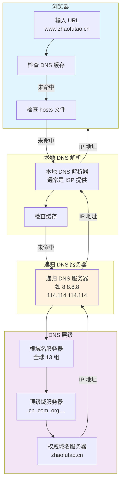
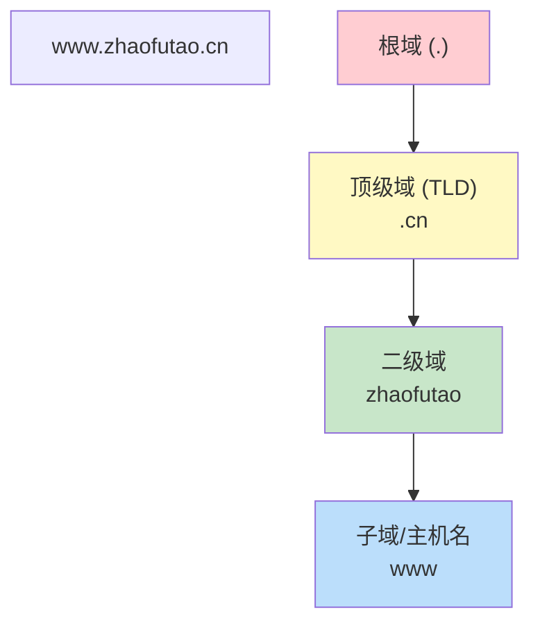
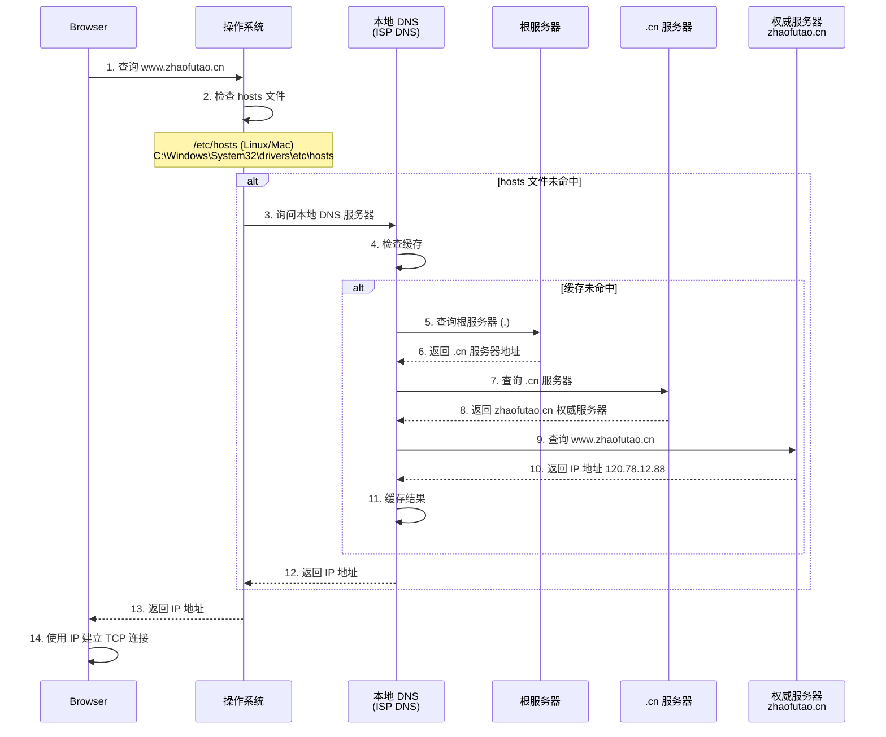
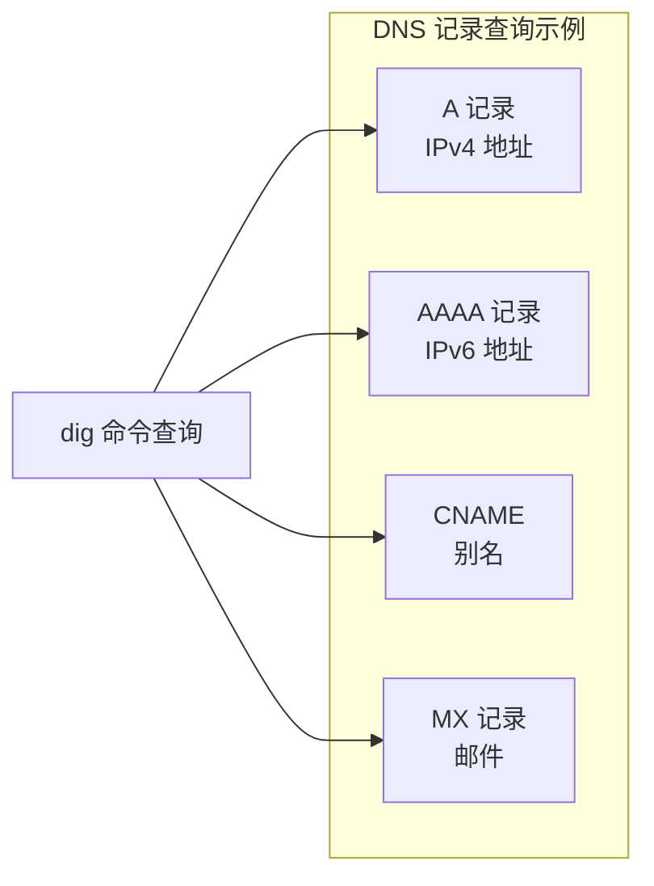
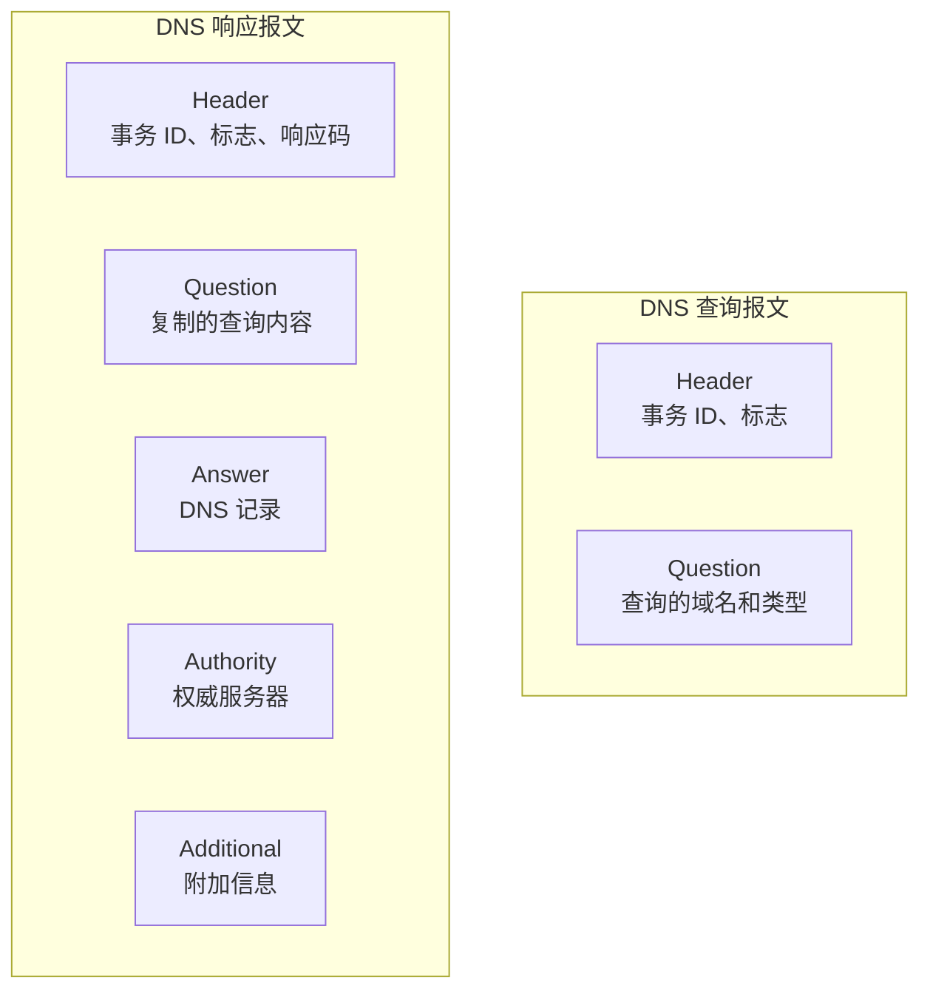
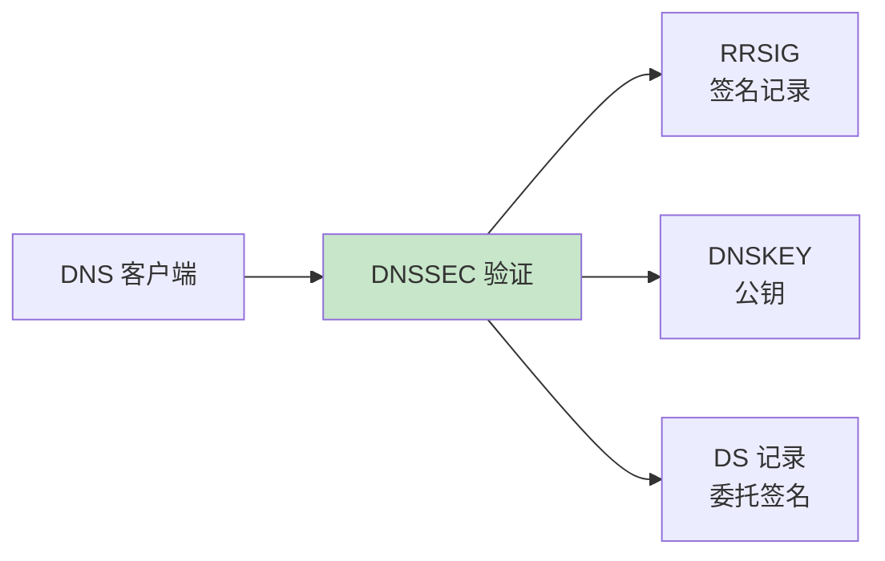
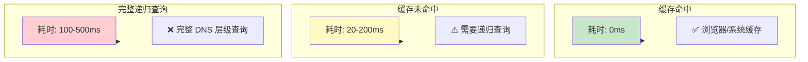
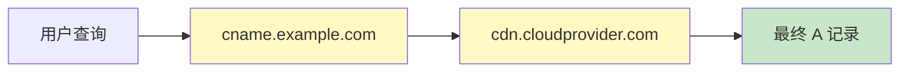
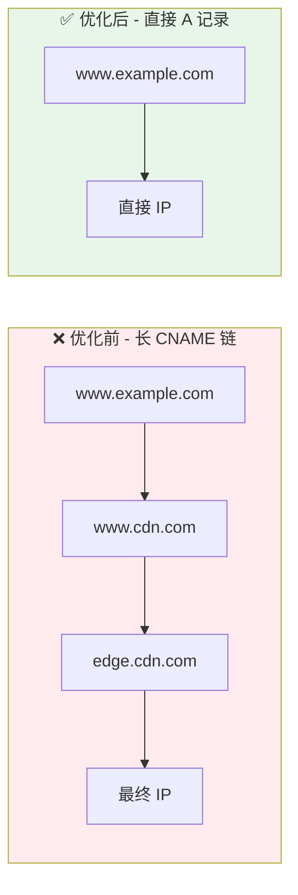
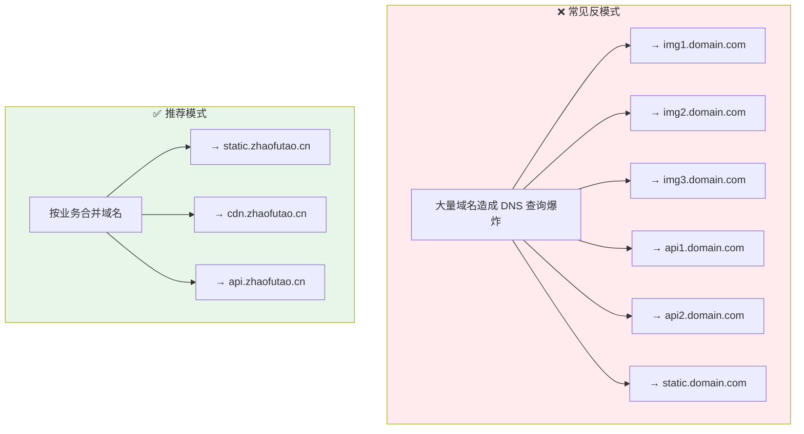

## 概述

DNS 把域名变成 IP。回车之后要过 **浏览器 / 系统 / 递归 / 权威** 好几跳，中间还可能被运营商或中间人「帮忙解析」。下面按时间顺序拆；**线上解析不对** 时，就顺着这一节从 hosts 往上摸。

> 根服务器常写「全球 13 组」——指的是 **13 个根标识**（字母 a–m），物理节点远不止 13 台，别和任播集群数杠上。



## DNS 系统架构

### 域名层级结构



域名采用层级结构，从右到左级别递减：

| 层级 | 示例 | 说明 |
|------|------|------|
| 根域 | `.` | 隐藏的根节点，全球 13 组根服务器 |
| 顶级域 (TLD) | `.cn` `.com` `.org` | 由 ICANN 管理 |
| 二级域 (SLD) | `zhaofutao` | 注册人可申请的名称 |
| 子域 | `www` `blog` `api` | 可自由分配的子域名 |

### DNS 服务器类型

| 类型 | 作用 | 示例 |
|------|------|------|
| 根服务器 | 指向 TLD 服务器 | 全球 13 组 (a-m.root-servers.net) |
| TLD 服务器 | 管理顶级域下的二级域 | .cn 服务器、.com 服务器 |
| 权威服务器 | 保存最终 DNS 记录 | ns1.zhaofutao.cn |
| 递归服务器 | 替客户端查询 | 8.8.8.8、114.114.114.114 |

## 浏览器域名解析流程

### 完整解析过程

以 `www.zhaofutao.cn` 为例，常见顺序如下（具体实现因浏览器/系统略有出入）：



### 步骤说明（和抓包对照用）

#### 第一步：浏览器 DNS 缓存

浏览器自己也会缓存一阵：

```javascript
// 现代浏览器通常缓存的 DNS 记录
// Chrome: chrome://net-internals/#dns 查看缓存
// Firefox: about:networking#dns 查看缓存
```

浏览器缓存的 TTL（生存时间）由 DNS 记录的 `max-age` 决定，一般在 60-600 秒之间。

#### 第二步：检查 hosts 文件

缓存没中，轮到 **操作系统** 看 hosts：

```bash
# Linux/Mac 上的 hosts 文件位置
/etc/hosts

# Windows 上的 hosts 文件位置
C:\Windows\System32\drivers\etc\hosts
```

hosts 文件示例：

```ini
# 格式: IP地址 主机名 [别名...]
127.0.0.1       localhost
192.168.1.100   myapp.local
120.78.12.88    www.zhaofutao.cn
```

hosts **优先于** 对递归的查询，本地联调、劫持演示都靠它。

#### 第三步：系统 DNS 缓存

操作系统也有 DNS 缓存机制：

- **Windows**: 使用 DNS Client 服务缓存
- **Linux**: 通常通过 nscd (Name Service Cache Daemon) 实现
- **macOS**: 使用 mDNSResponder

```bash
# Windows 查看 DNS 缓存
ipconfig /displaydns

# Windows 清除 DNS 缓存
ipconfig /flushdns

# Linux 清除 nscd 缓存
sudo systemctl restart nscd

# macOS 清除 DNS 缓存
sudo dscacheutil -flushcache
sudo killall -HUP mDNSResponder
```

#### 第四步：本地 DNS 解析器

再 miss，包就发到 **递归解析器**——家用路由器背后往往是运营商给的 DNS，也有人手改成 8.8.8.8 / 1.1.1.1 之类。

常见的公共 DNS 服务器：

| 提供商 | IPv4 地址 | IPv6 地址 |
|--------|-----------|-----------|
| Google | 8.8.8.8, 8.8.4.4 | 2001:4860:4860::8888 |
| Cloudflare | 1.1.1.1, 1.0.0.1 | 2606:4700:4700::1111 |
| 阿里云 | 223.5.5.5, 223.6.6.6 | 2400:3200::1 |
| 腾讯 DNSPod | 119.29.29.29 | 2402:4e00:: |

#### 第五步：递归查询

递归这边若仍无缓存，就代你 **从根问到权威**（对你来说是黑盒，对抓包是一串 UDP/TCP 53）：

1. **查询根服务器**: 询问 `www.zhaofutao.cn` 的 IP
2. **根服务器返回**: `cn` 顶级域服务器地址
3. **查询 TLD 服务器**: 询问 `zhaofutao.cn` 的权威服务器
4. **TLD 服务器返回**: `zhaofutao.cn` 的权威服务器地址
5. **查询权威服务器**: 获取 `www.zhaofutao.cn` 的 A/AAAA 记录
6. **返回最终结果**

#### 第六步：建立连接

IP 到手后才会去 **TCP 握手**；HTTPS 还要再叠 TLS。DNS 慢，首包就晚。

## DNS 记录类型

平时说「查 DNS」多半指 **A/AAAA**，实际还有一堆别的 RR：

| 记录类型 | 作用 | 示例 |
|----------|------|------|
| A | IPv4 地址映射 | `www.zhaofutao.cn -> 120.78.12.88` |
| AAAA | IPv6 地址映射 | `www -> 2400:xxxx:xxxx::1` |
| CNAME | 域名别名 | `blog.zhaofutao.cn -> zhaofutao.cn` |
| MX | 邮件交换服务器 | `@zhaofutao.cn -> mail.zhaofutao.cn` |
| NS | 域名服务器 | `zhaofutao.cn -> ns1.zhaofutao.cn` |
| TXT | 文本记录（常用于验证） | SPF、DKIM、DMARC 配置 |
| SOA | 权威记录起始 | 域名的主要信息 |



使用 `dig` 命令查询 DNS 记录：

```bash
# 查询 A 记录
dig www.zhaofutao.cn

# 查询 AAAA 记录
dig www.zhaofutao.cn AAAA

# 查询 MX 记录
dig zhaofutao.cn MX

# 指定 DNS 服务器查询
dig @8.8.8.8 www.zhaofutao.cn
```

## DNS 缓存与 TTL

### 缓存层级

```mermaid
flowchart TB
    BrowserDNS["浏览器 DNS 缓存<br/>TTL: 60-600s"]
    OS DNS["操作系统 DNS 缓存<br/>TTL: 分钟级"]
    LocalDNS["本地 DNS 递归服务器<br/>TTL: 域名的 TTL 值"]
    AuthDNS["权威 DNS 服务器<br/>原始 TTL 值"]

    BrowserDNS --> OS DNS
    OS DNS --> LocalDNS
    LocalDNS --> AuthDNS

    style BrowserDNS fill:#e3f2fd
    style AuthDNS fill:#ffebee
```

### TTL 的影响

- **设置过短**: 频繁向上游服务器查询，增加 DNS 权威服务器负载
- **设置过长**: 域名变更生效慢，缓存污染风险

常见的 TTL 设置策略：

```ini
; DNS 记录的 TTL 设置
; 通常 A 记录设置为 300-3600 秒 (5分钟-1小时)
www IN A 120.78.12.88
    TTL 300    ; 缓存 5 分钟

; MX 记录和 NS 记录通常设置较长
@ IN MX 10 mail.zhaofutao.cn
    TTL 3600   ; 缓存 1 小时
```

## DNS 协议细节

### DNS 报文结构



DNS 使用 UDP 端口 53 进行查询（大于 512 字节时使用 TCP）。

### DNS 安全扩展 (DNSSEC)

DNSSEC 通过数字签名确保 DNS 响应真实性：



## 影响 DNS 解析性能的因素

冷解析常见 **几十到几百 ms**，热缓存就接近 **0**。下面按「哪里最拖」排个序。

### 1. 缓存命中率

**命中** 就本地返回；**未命中** 才往上递归。这是延迟差数量级的大头。



| 缓存层级 | 命中率 | 典型延迟 |
|----------|--------|----------|
| 浏览器缓存 | 高 | < 1ms |
| 系统缓存 | 中高 | 1-5ms |
| 本地 DNS 服务器 | 中 | 5-50ms |
| 递归查询 | 低 | 50-500ms |

### 2. 网络延迟

递归离你越远，RTT 越难看：

| 用户位置 | DNS 服务器 | 典型延迟 |
|----------|------------|----------|
| 北京 | 北京 DNS | 5-15ms |
| 北京 | 广州 DNS | 30-50ms |
| 中国 | 美国 DNS | 150-300ms |
| 跨国弱网 | 远程 DNS | 300ms+ |

**IPv6**：有时走运营商内网更近，有时更绕；别默认「开了就更快」。

### 3. DNS 服务器性能

同一域名，换递归可能差一截——用 `dig +stats` 自己量：

```bash
# 使用 dig 测试各 DNS 服务器响应时间
dig @8.8.8.8 www.google.com +stats
dig @1.1.1.1 www.google.com +stats
dig @114.114.114.114 www.google.com +stats

# 典型输出
# Query time: 15 ms     # Google DNS
# Query time: 23 ms     # Cloudflare
# Query time: 45 ms     # 阿里DNS (视用户位置)
```

公共 DNS 服务对比：

| DNS 服务 | Avg Response | 稳定性 | DoH/DoT 支持 |
|----------|--------------|--------|--------------|
| Cloudflare 1.1.1.1 | ~10ms | 高 | ✅ |
| Google 8.8.8.8 | ~15ms | 高 | ✅ |
| Quad9 9.9.9.9 | ~20ms | 高 | ✅ |
| ISP DNS | 20-100ms | 中 | 视运营商 |

### 4. 域名链式解析 (CNAME Chain)

CNAME 记录会触发额外的 DNS 查询：



每个 CNAME 跳转都需要额外的 DNS 查询，通常增加 **20-50ms** 延迟。

### 5. DNSSEC 验证开销

启用 DNSSEC 会增加验证时间：

- 验证过程需要额外的 RRSIG 查询
- 链式验证可能需要 2-3 倍查询时间
- 通常增加 **10-30ms** 延迟

### 6. 解析器选择策略

部分网络使用不当的 DNS 递归解析策略：

| 问题 | 影响 | 解决方案 |
|------|------|----------|
| DNS 负载均衡轮询 | 首次解析慢 | 选择高性能 DNS |
| EDNS Client Subnet 缺失 | CDN 调度不准确 | 使用支持 ECS 的 DNS |
| 解析超时重试 | 解析时间翻倍 | 优化 DNS 服务器选择 |

## DNS 解析性能优化

能动的通常就这几类（别指望换 DNS 解决所有首屏问题）：

### 1. 合理设置 DNS  TTL

根据业务特点选择合适的 TTL：

```ini
# 静态资源域名 - 使用较长 TTL
static.zhaofutao.cn.  IN  A  120.78.12.88
                        TTL  3600    ; 1小时

# 核心业务域名 - 使用中等 TTL
www.zhaofutao.cn.     IN  A  120.78.12.88
                        TTL  600     ; 10分钟

# 频繁变更的域名 - 使用较短 TTL
api.zhaofutao.cn.     IN  A  120.78.12.88
                        TTL  60      ; 1分钟
```

**TTL 设置原则**：
- 高流量静态资源：3600-86400 秒
- 主域名：300-600 秒
- 频繁变更的域名：60-300 秒
- 活动/促销域名：60 秒

### 2. 选择高性能 DNS 服务

**使用公共 DNS 代替 ISP DNS**：

```ini
# /etc/resolv.conf (Linux/Mac)
nameserver 1.1.1.1        # Cloudflare
nameserver 8.8.8.8        # Google
nameserver 223.5.5.5      # 阿里云（国内访问快）
```

**启用 DoH/DoT 加密 DNS**：

```javascript
// Chrome 启用 DoH
// 设置 → 安全 → 使用安全 DNS → 选择 Cloudflare/Google

// Firefox 启用 DoH
// 设置 → 隐私与安全 → DNS over HTTPS → 启用
```

### 3. 减少 CNAME 链

避免过长的 CNAME 链：



CDN 接入优化：
- 让 CDN 厂商提供**权威 DNS 直解**服务
- 配置 **ALIAS 记录**自动解析为 A 记录
- 使用 **Anycast** 技术让 DNS 解析就最近返回

### 4. 浏览器端优化

```html
<!DOCTYPE html>
<html>
<head>
    <!-- DNS 预解析 - 提前解析外部资源域名 -->
    <link rel="dns-prefetch" href="//cdn.example.com">
    <link rel="dns-prefetch" href="//fonts.googleapis.com">
    <link rel="dns-prefetch" href="//analytics.example.com">

    <!-- 预连接 - 提前建立 TCP/TLS 连接 -->
    <link rel="preconnect" href="https://cdn.example.com">
    <link rel="preconnect" href="https://fonts.googleapis.com">

    <!-- 对关键域名使用 preconnect -->
    <link rel="preconnect" href="https://api.zhaofutao.cn">
</head>
</html>
```

**使用场景**：

| 指令 | 作用 | 适用场景 |
|------|------|----------|
| `dns-prefetch` | 预解析 DNS | 确定会使用的第三方域名 |
| `preconnect` | DNS + TCP + TLS | 重要的第三方 API/CDN |
| `preload` | 预加载资源 | 关键 CSS/JS/字体 |

### 5. 域名规划优化

合理规划域名数量和结构：



**域名合并原则**：
- 静态资源：1-2 个域名（减少连接数）
- API 服务：1 个域名（使用路径区分）
- 第三方服务：使用 dns-prefetch 预解析

### 6. 监控与调优

改版或切 CDN 后，随手 **dig/drill** 几下，比只看合成监控图管用：

```bash
# 使用 drill 测试解析时间
drill www.zhaofutao.cn @1.1.1.1
drill www.zhaofutao.cn @8.8.8.8

# 使用 time 命令测量
time dig www.zhaofutao.cn

# Web 页面 DNS 耗时测量 (Chrome DevTools)
# Network 面板 → Waterfall → DNS lookup
```

Chrome DevTools 中查看 DNS 时间：

```javascript
// 使用 Performance API 获取 DNS 时间
performance.getEntriesByType('resource').forEach(entry => {
    if (entry.initiatorType === 'link' || entry.initiatorType === 'script') {
        console.log(`${entry.name}: DNS = ${entry.domainLookupEnd - entry.domainLookupStart}ms`);
    }
});
```

## 浏览器解析优化

### 预解析 (Preconnect)

```html
<!-- 预连接，提前建立 TCP/TLS 连接 -->
<link rel="preconnect" href="https://fonts.googleapis.com">
```

### 预解析 DNS (Preload)

```html
<!-- 预解析特定域名 -->
<link rel="dns-prefetch" href="https://cdn.example.com">
```

### HTTP/2 和 HTTP/3 的改进

- **HTTP/2**：同 host **多请求复用一条连接**，同一页面里重复查同一域名的次数会少。  
- **HTTP/3 / QUIC**：握手路径短一截，但 **DNS 该查还是查**。

## 常见 DNS 问题排查

### 排查命令

```bash
# 1. 使用 nslookup 基础查询
nslookup www.zhaofutao.cn

# 2. 使用 dig 详细查询
dig +trace www.zhaofutao.cn

# 3. 使用 host 命令
host www.zhaofutao.cn

# 4. Windows 查看 DNS 缓存
ipconfig /displaydns

# 5. 跟踪 DNS 解析过程
dig +trace +nodnssec www.zhaofutao.cn
```

### 常见问题

| 问题 | 原因 | 解决方案 |
|------|------|----------|
| DNS 污染 | DNS 被恶意拦截返回假 IP | 使用可信 DNS 如 8.8.8.8 |
| DNS 缓存中毒 | 缓存了错误的 DNS 记录 | 清除本地缓存 |
| 域名解析失败 | NS 记录配置错误 | 检查域名注册商设置 |
| CDN 调度不准确 | DNS 解析到较远的节点 | 等待 DNS 扩散或联系 CDN 厂商 |

## 总结

把 DNS 想成 **带缓存的分布式数据库**：问错人、缓存没刷、CNAME 链太长，都会在 **首屏和排障** 里现形。日常记住三条就够：**hosts 能盖全局**、**TTL 决定切机房有多疼**、**递归不可信时先换再抓包**。DNSSEC / DoH 是另一层话题，和「解析慢不慢」不总绑在一起。

---

*参考资料: [RFC 1035](https://tools.ietf.org/html/rfc1035), [RFC 8484](https://tools.ietf.org/html/rfc8484), [MDN DNS Documentation](https://developer.mozilla.org/en-US/docs/Glossary/DNS)*
