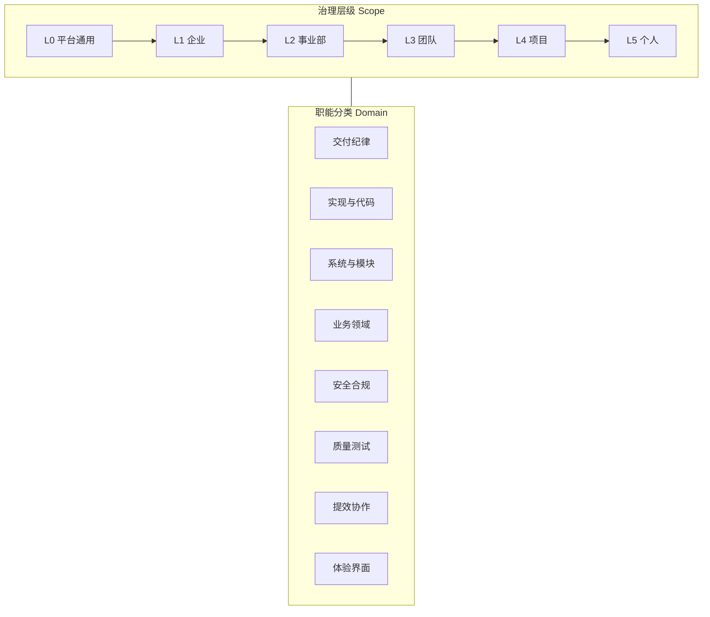

Agent 编程从个人尝鲜变成团队默认姿势之后，**Skills 会从个人备忘录变成组织资产**。个人可以靠直觉堆几十个 skill；企业不行——没有分层、分类和生命周期，几个月后会变成：没人知道该 invoke 哪个、同名 skill 互相打架、过期规范还在误导 AI、安全红线藏在某个同事的 `~/.cursor` 里。

本文给出一套可落地的 **Skills 治理方法论**：用 **治理层级（Scope）** 和 **职能分类（Domain）** 两个正交维度组织资产，再补上类型、生命周期、冲突规则、目录约定与成熟度模型。不绑定某一家 IDE，但以 Cursor / Claude Code / Codex 等「Markdown Skill + 规则文件」生态为默认语境。

姊妹篇：[开发者的四层能力](./developer-four-layers-model.html)（人的能力地图）；[Superpowers ⑥ 写你自己的 Skill](./superpowers-part-06-finish-and-write-skills.html)（单 Skill 怎么写、怎么验）；[Claude Code 进阶：MCP、Skills 与自用习惯](./claude-code-advanced-usage-guide.html)（安装与目录）。

## 先对齐：Skills 在企业里到底是什么

**Skill** 是把老手 tacit knowledge 写成 Agent 可检索、可执行的 **SOP / 参考指南**——不是一次性聊天记录，也不是万能 prompt。

| 概念 | 管什么 | 典型载体 | 与 Skill 的关系 |
| --- | --- | --- | --- |
| **Rules** | 始终生效的硬约束 | `.cursor/rules/*.mdc`、`AGENTS.md` | 约束边界；Skill 教 **怎么做** |
| **项目说明** | 本仓库固定上下文 | `CLAUDE.md` | 常开背景；细流程进 Skill |
| **Skill** | 按场景触发的流程、模式、领域知识 | `SKILL.md` + references | **按需加载**，靠 `description` 被发现 |
| **MCP / 工具** | 可执行外部能力 | MCP server、CLI | Skill 描述 **何时调用** |
| **Plan / Spec** | 单次任务方案 | `docs/specs/`、issue | 任务级；可沉淀为 Skill |

企业治理要回答：**谁写、放哪一层、归哪一类、怎么更新、冲突听谁的、怎么证明有效**。

---

## 方法论总览：两个正交维度



- **Scope**：对谁生效、谁维护——从平台通用到个人定制。
- **Domain**：解决哪类问题——安全、提效、写代码、业务域等；**同一 Skill 可打多个标签**。

两个维度独立：**「企业级支付安全 Skill」= Scope L1 + Domain 安全 + Domain 业务（支付）**。

### 四条治理原则

1. **默认可发现**：正式 Skill 必须有清晰的 `name`、`description`（第三人称 + 触发词），并进入目录（Registry）。
2. **显式优先级**：层级越高、越贴近合规的 Skill，冲突时 **覆盖** 低层（除非标注 `extends`）。
3. **可验证**：关键 Skill（安全、发布、资金类）上线前用 **压力场景** 做 RED-GREEN 验证（对 Skill 做 TDD）。
4. **可退役**：Skill 和代码一样要 **deprecate → archive**，避免僵尸规范。

---

## 维度一：治理层级（Scope）

### 六级模型

| 层级 | 代号 | 范围 | 典型路径 / 分发 | 所有者 | 变更节奏 |
| --- | --- | --- | --- | --- | --- |
| **L0 平台通用** | `platform` | 全工具链 | Cursor 内置、`skills.sh`、Superpowers | 平台 / 社区 | 随工具升级 |
| **L1 企业** | `enterprise` | 全公司 | 企业 Skills 仓库、MDM 下发 | 效能 + 架构 + 安全 | 季度 + 紧急补丁 |
| **L2 事业部** | `division` | 业务线、职能部门 | `org-skills/payment/` | 事业部 TL + 领域专家 | 月度 |
| **L3 团队** | `team` | Feature Team | 团队 mono-repo、`team-skills` | Tech Lead | 双周～月度 |
| **L4 项目** | `project` | 单个仓库 | `.cursor/skills/`、`.claude/skills/` | 仓库 Maintainer | 随迭代 |
| **L5 个人** | `personal` | 个人全项目 | `~/.cursor/skills/`、`~/.agents/skills/` | 个人 | 随时 |

::: tip Cursor 内置 skill

`~/.cursor/skills-cursor/` 为 **Cursor 自带只读** skill（如 loop、create-skill），**不要**与 L5 个人目录混用。

:::

### 各层该放什么

**L0** — 与具体公司无关：TDD、systematic-debugging、官方 `create-skill`。企业建 **白名单 / 推荐清单**，不随意 fork 改内容。

**L1** — 全公司必须遵守：**安全红线**、**合规**（PCI、隐私）、**发布纪律**、**通用 Review 标准**、**事件响应**。禁止把「某团队去年的一次性方案」升 L1。

**L2** — 领域语言、模块边界、跨团队契约、事业部工具链。例：支付收单 wizard、事业部 UI 规范。

**L3** — 分支策略、review 节奏、子 Agent 用法、与 Jira/Linear 衔接。从 L1/L2 **继承**，用 `extends` 注明。

**L4** — 本仓库目录结构、模块 skill、本项目的 verify 清单。**只有这个 repo 才成立** 的知识放这里。

**L5** — 个人实验；**默认不进企业目录**。反复被同事抄 → 走晋升流程到 L3/L4。

### 冲突优先级

默认覆盖链（从高到低）：

```text
L1 企业 > L2 事业部 > L3 团队 > L4 项目 > L5 个人 > L0 平台通用
```

例外须显式声明：

- `extends: enterprise-security-baseline` — 继承追加，不推翻红线。
- `overrides: team-review-checklist` — 仅 L4 获 TL 批准，且不得违反 L1。

::: warning L0 特殊规则

平台内置 skill 不能被企业「删除」，只能 **不安装 / 禁用自动 invoke**，并用 L1 skill 补充约束。

:::

### 晋升与降级

| 方向 | 触发条件 | 流程 |
| --- | --- | --- |
| **晋升** ↑ | 3+ 团队、6+ 月复用；或合规强制 | 申请 → Domain Owner 评审 → 写入上层 → 下层标 `deprecated` |
| **降级** ↓ | 仅单团队使用 | 迁回 L3/L4 |
| **退役** | 流程废弃、工具下线 | `status: deprecated` + 替代 skill + 90 天删除 |

---

## 维度二：职能分类（Domain）

分类是 **标签**，不是文件夹硬切——建议 **主分类 + 最多 2 个副分类**。

### 十二类推荐体系

| 代号 | 分类 | 回答的问题 | 典型 Skill |
| --- | --- | --- | --- |
| **D01** | `delivery` 交付纪律 | 改动怎么推进、何时算做完 | brainstorming、verification-before-completion |
| **D02** | `implementation` 实现与代码 | 怎么写、怎么改、怎么审 | Go security、frontend-code-review |
| **D03** | `architecture` 系统与模块 | 边界、契约、演进 | new-module-wizard、OpenAPI spec |
| **D04** | `domain` 业务领域 | 领域规则、名词、验收 | 支付清算、风控策略 |
| **D05** | `security` 安全与合规 | 红线、威胁建模 | 密钥处理、PCI 范围 |
| **D06** | `quality` 质量与测试 | TDD、回归、压测 | test-driven-development |
| **D07** | `productivity` 提效与协作 | 工具链、文档 | lark-doc、commit 规范 |
| **D08** | `design` 体验与界面 | UI、交互、文案 | frontend-design、copy-review |
| **D09** | `platform` 基础设施 | CI/CD、云、可观测 | 链路追踪 runbook |
| **D10** | `integration` 集成与接口 | MCP、OpenAPI、第三方 | webhook 对接 |
| **D11** | `operations` 运维与响应 | 发布、回滚、on-call | 事故 runbook |
| **D12** | `content` 内容与文档 | 博文、规格 | writing-plans、editorial-pass |

### 与「开发者四层能力」交叉索引

[四层能力模型](./developer-four-layers-model.html) 是 **人的地图**；Domain 是 **Skill 资产标签**——可交叉，不互相替代。

| 开发者四层 | 主要 Domain |
| --- | --- |
| Layer 1 写代码 | D02、D06 |
| Layer 2 设计系统 | D03、D10 |
| Layer 3 交付纪律 | D01、D06、D11 |
| Layer 4 理解业务 | D04、D05 |

例：`payment-refund` skill 可同时标 D04 + D05 + D03。

### 新 Skill 归类决策树

```text
是否「必须/禁止」且审计相关？ ──是──→ 主类 D05，Scope 至少 L1 会签
是否单次项目/模块独有？ ──是──→ 主类 D03 或 D02，Scope L4
是否教「做完前要跑什么证据」？ ──是──→ 主类 D01
是否领域名词/业务规则？ ──是──→ 主类 D04，Scope L2 起
否则：实现 → D02；工具 → D07；UI → D08
```

---

## Skill 类型（第三轴：刚性程度）

| 类型 | 特征 | 刚性 | 示例 |
| --- | --- | --- | --- |
| **gate** 门禁 | 不做完 X 不能 claim done | 高 | verification-before-completion |
| **workflow** 工作流 | 分步骤、检查清单 | 中高 | brainstorming → writing-plans |
| **technique** 技法 | 具体做法、可变通 | 中 | systematic-debugging |
| **pattern** 模式 | 思维方式、权衡 | 低 | 模块拆分模式 |
| **reference** 参考 | API、字段汇总 | 低 | 内部平台 URL 表 |

::: tip 治理建议

`gate` 与 `security` 类必须 L1/L2 维护；`reference` 可 L4 维护但需注明 `owner` 和 `last-verified`。

:::

---

## 企业目录与 registry

### monorepo 布局（L1～L3）

```text
org-agent-skills/
├── registry.yaml              # 全量目录
├── enterprise/                # L1
│   ├── security-baseline/
│   └── release-discipline/
├── divisions/payment/         # L2
├── teams/checkout-squad/      # L3
├── templates/SKILL.template.md
└── scripts/validate-skills.sh
```

### 项目内（L4）

```text
your-service/
├── .cursor/skills/service-module-layout/SKILL.md
├── AGENTS.md                  # 列出本仓库必用 skill
└── docs/agent/skills-index.md
```

### registry.yaml 最小字段

```yaml
skills:
  - name: enterprise-security-baseline
    scope: enterprise
    domains: [security, delivery]
    type: gate
    owner: security-platform@corp
    status: active          # draft | active | deprecated
    superseded_by: null
    last_reviewed: 2026-06-01
```

命名：`kebab-case`；禁止 `helper`、`utils` 等泛名入库。

---

## 生命周期


| 阶段 | 准入 |
| --- | --- |
| **draft** | 明确触发场景；有作者 |
| **active** | RED-GREEN 通过；`description` 含触发词；L1/L2 需会签 |
| **deprecated** | 有 `superseded_by` |
| **archive** | 无 active 引用 |

维护节奏：L1 每季度；L2 每月；L3 双周抽查；L4 随大版本；L5 个人自负。

---

## 角色 RACI（简表）

| 活动 | 工程师 | Tech Lead | Domain Owner | 安全 | 效能平台 |
| --- | --- | --- | --- | --- | --- |
| 起草 L4/L5 | **R** | A | C | I | I |
| 晋升 L2/L1 | C | **R** | **A** | C | C |
| registry 维护 | I | C | C | C | **R/A** |
| gate 类压力测试 | C | C | **A** | **R** | C |

---

## 发现、安装与调用纪律

1. **Registry** 按 `domain`、`scope` 过滤。
2. **`AGENTS.md`** 列出本仓库必用 skill。
3. **`description`**：第三人称 + 「Use when…」+ 触发词——企业级最高 ROI 治理点。
4. 与 [using-superpowers](./superpowers-part-01-using-superpowers.html) 对齐：有 1% 可能适用 → 先 invoke；**gate** 类不可跳过。

---

## 对 Skill 做 TDD（gate / security 必做）

1. **RED**：压力场景（时间紧、用户催）→ 无 skill 时 Agent 违规记录。
2. **GREEN**：最小 SKILL.md 堵住 rationalizations。
3. **REFACTOR**：补 loophole 再跑。

场景库可放 `scripts/pressure-test/scenarios/`，与 CI 夜间集成。

---

## 反模式

| 反模式 | 对策 |
| --- | --- |
| 巨型 skill 上下文爆炸 | 按 Domain 拆分；reference 外置 |
| 只有 L5 没有 L1 | 安全/发布升格 L1 |
| 改两字 Superpowers 就 L1 | L0 只引用；企业写 `extends` |
| skill 与 rules 重复 | rules 写禁止；skill 写流程 |
| 无 deprecated | registry 强制 `status` |

---

## 成熟度模型

| 等级 | 特征 |
| --- | --- |
| **M0 野生** | 个人散落，无目录 |
| **M1 项目化** | 重点 repo 有 L4 skills |
| **M2 团队化** | L3 清单 + 命名规范 |
| **M3 企业化** | L1 registry + 季度评审 |
| **M4 可验证** | gate 类压力测试 |
| **M5 可度量** | invoke 日志、缺陷归因 |

多数公司 **M2→M3** 性价比最高。

---

## 90 天落地路线图

**1–30 天**：盘点 L0 + 员工高频 skill；发布 L1 最小集（安全、发布验证、review、事故、依赖漏洞）；建 `registry.yaml`。

**31–60 天**：各事业部收 L2 清单去重；定命名与 `extends` 语法；选 2 个 gate skill 做压力测试样板。

**61–90 天**：跑通一例晋升（L4→L3）；季度评审日历；新人 onboarding 一页纸（L0/L1 + 本团队 L3 + 本仓库 L4）。

---

## 小结

1. **Scope × Domain** 两个正交维度，再加 **type** 表刚性——够组织全公司 skill 资产。
2. **L1 合规只升不降**；L4 放仓库独有知识；L5 默认不进企业目录。
3. **registry + 生命周期 + RACI** 比多写几个 `SKILL.md` 更重要。
4. **gate/security 做 TDD 式验证**，避免乐观文档。
5. 从 **M2 团队清单** 到 **M3 企业 registry**，是最先该买的单。

Skills 治理的本质，是把 AI 编程从「每人一套 prompt 巫术」收成 **可继承、可审计、可演进** 的组织能力——和当年把 CI、Code Review、ADR 制度化的路一样，只是载体从 Wiki 变成了 Agent 读得懂的 SKILL.md。
