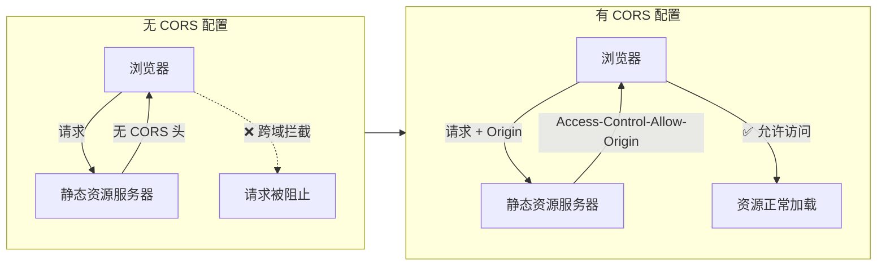
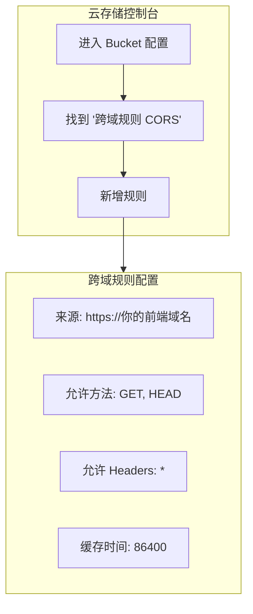
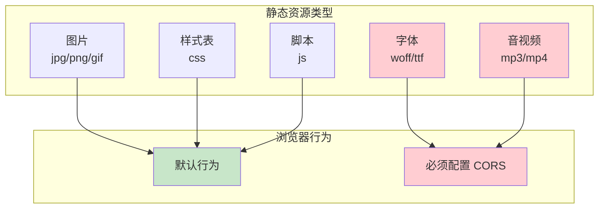
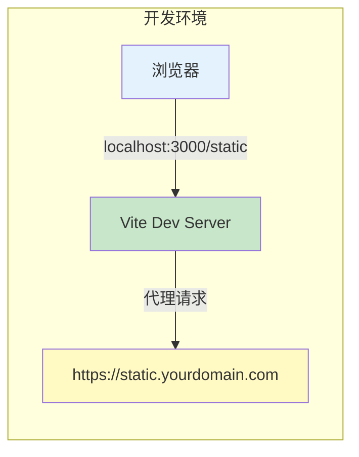
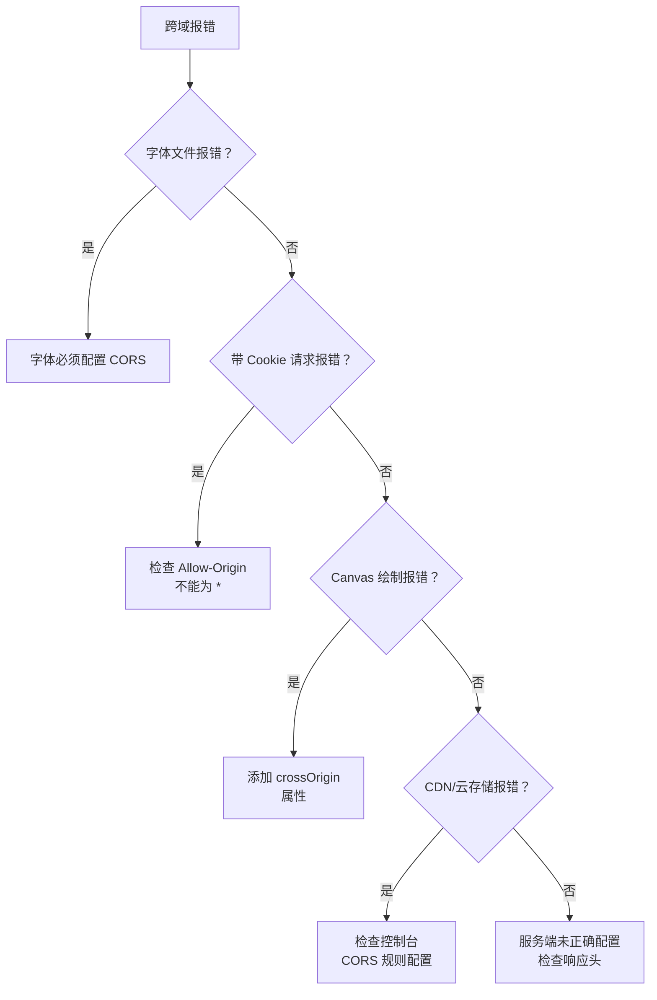
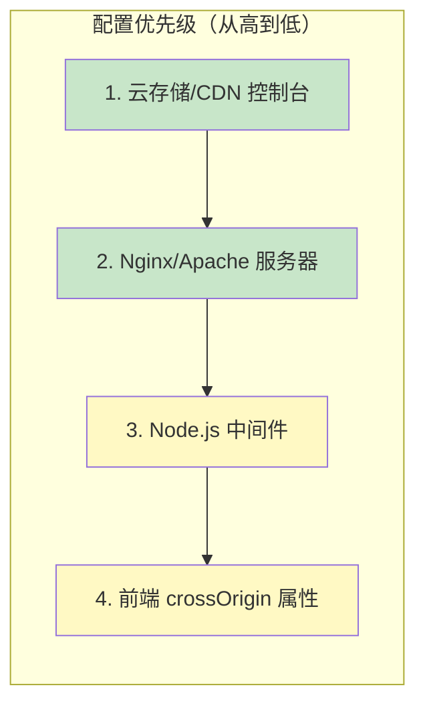

## 概述

前端跨域访问静态资源（图片、字体、CSS、JS、音视频等）是 Web 开发中的常见需求。**核心原则是：在静态资源所在的服务端配置 CORS 跨域响应头，前端仅需在极少数特殊场景（如 Canvas 绘图）添加属性**。



## 一、核心跨域响应头

服务端只需返回 3 个关键 HTTP 头，静态资源主要使用 `GET/HEAD` 请求：

| 响应头 | 说明 | 示例值 |
|--------|------|--------|
| `Access-Control-Allow-Origin` | 允许的跨域域名 | `https://你的前端域名.com` 或 `*` |
| `Access-Control-Allow-Methods` | 允许的请求方法 | `GET, HEAD` |
| `Access-Control-Max-Age` | 预检请求缓存时间（秒） | `86400` |

::: warning 生产环境注意
生产环境**禁止使用 `*`**，务必写明具体的前端域名，以防止资源被恶意站点滥用。
:::

## 二、主流服务器配置

### 1. Nginx（最常用）

编辑 Nginx 配置文件，针对静态资源目录或后缀配置跨域：

```nginx
server {
    listen 80;
    server_name static.yourdomain.com;

    root /var/www/static;
    index index.html;

    # ========== 跨域配置核心 ==========
    # 匹配所有静态资源
    location ~* \.(jpg|jpeg|png|gif|ico|css|js|woff|woff2|ttf|mp3|mp4)$ {
        # 测试环境：允许所有源
        add_header Access-Control-Allow-Origin *;

        # 生产环境：仅允许指定前端域名（更安全）
        # add_header Access-Control-Allow-Origin "https://www.your-frontend.com";

        add_header Access-Control-Allow-Methods "GET, HEAD";
        add_header Access-Control-Max-Age 86400;

        # 静态资源缓存（可选）
        expires 7d;
    }
}
```

配置后重启 Nginx：

```bash
nginx -s reload
```

### 2. Apache

修改 `.htaccess` 或 `httpd.conf`：

```apache
<FilesMatch "\.(jpg|png|gif|css|js|woff|woff2|ttf)$">
    Header set Access-Control-Allow-Origin "*"
    Header set Access-Control-Allow-Methods "GET, HEAD"
</FilesMatch>
```

### 3. Node.js (Express)

如果用 Node 托管静态资源，使用 `cors` 中间件：

```javascript
const express = require('express');
const cors = require('cors');
const app = express();

// 允许所有源跨域（测试环境）
app.use(cors());

// 生产环境：仅允许指定源
// app.use(cors({ origin: "https://www.your-frontend.com" }));

// 托管静态资源
app.use(express.static('static'));

app.listen(80, () => console.log('服务启动'));
```

### 4. 云存储 / CDN

企业级静态资源通常存储在云服务，直接在控制台配置跨域规则：



常见云服务配置位置：

| 云服务商 | 控制台路径 |
|----------|------------|
| 阿里云 OSS | Bucket → 权限管理 → 跨域设置 |
| 腾讯云 COS | Bucket → 基础配置 → 跨域访问 |
| 七牛云 | 对象存储 → 域名管理 → 跨域配置 |

## 三、静态资源类型与跨域需求



| 资源类型 | 是否需要配置 CORS | 说明 |
|----------|-------------------|------|
| 普通图片 | ❌ 不需要 | 浏览器默认允许跨域加载 |
| CSS/JS | ❌ 不需要 | 浏览器默认允许跨域加载 |
| **字体文件** | ✅ 必须配置 | 浏览器强制跨域限制 |
| **音视频** | ✅ 必须配置 | 浏览器强制跨域限制 |
| Canvas 绘图用图片 | ✅ 必须配置 | 涉及污染 Canvas |

## 四、前端特殊场景处理

### 1. Canvas 绘制跨域图片

跨域图片直接画入 Canvas 会导致 Canvas 被「污染」，无法导出。**前端必须添加 `crossOrigin` 属性**：

```html
<!-- 普通图片引用：无需配置 -->


<!-- Canvas 绘图用图片：必须加 crossOrigin="anonymous" -->

```

```javascript
// JavaScript 中设置
const img = new Image();
img.crossOrigin = 'anonymous';  // 必须设置
img.src = 'https://cdn.example.com/image.jpg';
img.onload = () => {
    const canvas = document.getElementById('myCanvas');
    const ctx = canvas.getContext('2d');
    ctx.drawImage(img, 0, 0);  // 不会污染 Canvas
};
```

### 2. 带 Cookie 的跨域请求

如果静态资源需要携带登录凭证，需要服务端和前端配合：

**服务端配置：**
```nginx
add_header Access-Control-Allow-Origin "https://www.your-frontend.com";
add_header Access-Control-Allow-Credentials "true";
```

**前端配置：**
```html

```

::: warning 重要限制
当 `Access-Control-Allow-Credentials` 为 `true` 时，`Access-Control-Allow-Origin` **不能使用 `*`**，必须指定具体域名。
:::

## 五、本地开发环境配置

开发时无需配置服务端，使用前端工具的代理功能即可：

### Vite 配置

```javascript
// vite.config.js
export default {
  server: {
    proxy: {
      '/static': {
        target: 'https://static.yourdomain.com',
        changeOrigin: true
      }
    }
  }
}
```

### Webpack 配置

```javascript
// webpack.config.js
module.exports = {
  devServer: {
    proxy: {
      '/static': {
        target: 'https://static.yourdomain.com',
        changeOrigin: true
      }
    }
  }
}
```



## 六、常见问题排查

### 问题诊断流程



### 常见错误与解决方案

| 错误信息 | 原因 | 解决方案 |
|----------|------|----------|
| `字体文件跨域报错` | 字体是浏览器强制跨域限制 | 必须配置 CORS |
| `The 'Access-Control-Allow-Origin' header contains multiple values` | Nginx 重复配置了 `add_header` | 删除多余配置 |
| `Canvas has been tainted` | 跨域图片未设置 `crossOrigin` | 添加 `crossOrigin="anonymous"` |
| `Credentials flag is true, but Access-Control-Allow-Origin is '*'` | 带凭证时使用通配符 | 改为具体域名 |
| 预检请求 (OPTIONS) 失败 | 服务端未处理 OPTIONS 请求 | 添加对应路由和响应头 |

### 快速诊断方法

使用 curl 检查响应头：

```bash
# 检查静态资源是否返回正确的 CORS 头
curl -I -X GET \
  -H "Origin: https://www.your-frontend.com" \
  https://static.yourdomain.com/image.jpg

# 预期输出应包含：
# Access-Control-Allow-Origin: https://www.your-frontend.com
# Access-Control-Allow-Methods: GET, HEAD
```

## 总结

### 核心要点

1. **静态资源跨域 = 服务端配置 CORS 头**，前端几乎不用改代码
2. 生产环境**禁止用 `*`**，写具体前端域名更安全
3. **字体、Canvas 图片是必配跨域**的资源，普通图片/CSS/JS 浏览器默认不拦截
4. 云存储/CDN 直接控制台配置，比改服务器更简单
5. Canvas 绘图只需前端加 `crossOrigin="anonymous"` 一行属性

### 配置优先级



优先使用云存储/CDN 的控制台配置，简单高效；只有在自建服务器时才需要配置 Nginx/Apache。

---

*参考资料: [MDN CORS](https://developer.mozilla.org/zh-CN/docs/Web/HTTP/CORS), [Fetch Standard](https://fetch.spec.whatwg.org/#http-cors-protocol), [W3C CORS Spec](https://www.w3.org/TR/cors/)*