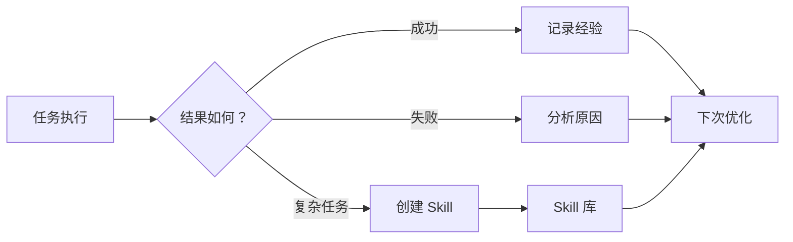
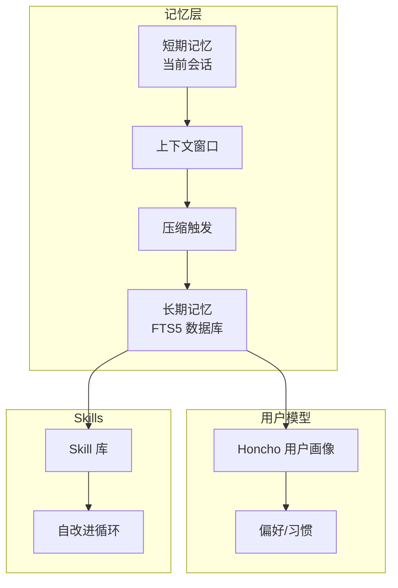
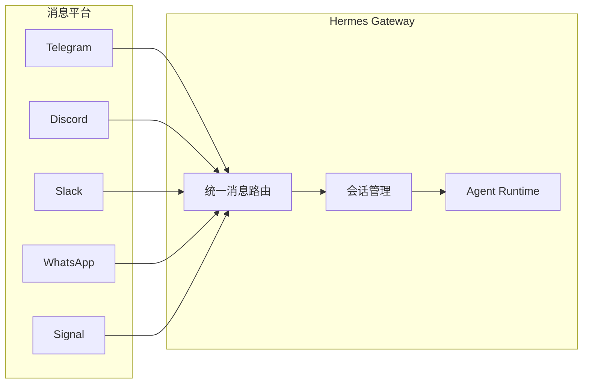

之前搞混过 **Hermes JS 引擎** 和 **Nous Research 的 Hermes Agent**，这篇只写后者。

Hermes Agent 是开源 personal Agent 里讨论度很高的一档（GitHub star 数会变，以仓库为准）。和其他 Agent 比，它比较突出的一点是：**会把任务沉淀成 Skill，并在复用时迭代**——不是只会单次问答。

和 [OpenClaw](./openclaw-personal-ai-assistant.html)（多 IM 接入、本地网关）是不同路线：Hermes 偏 **可成长的工作流 + Skill**；OpenClaw 偏 **聊天平台统一入口**。终端编程助手可看 [Claude Code 进阶](./claude-code-advanced-usage-guide.html)。

## Hermes Agent 是什么

Hermes Agent 是 **Nous Research** 开发的开源 AI Agent，定位是「**会成长的 AI 助手**」。

区别于普通的 Q&A 助手，它有几个独特能力：

- **自动创建 Skills**：复杂任务完成后，Agent 会把操作流程打包成可复用的 Skill
- **Skill 自我改进**：每次使用 Skill，Agent 会根据反馈优化它
- **持久化记忆**：不只是记住对话，还会在适当时机「提醒自己」保存重要信息
- **跨会话搜索**：FTS5 全文搜索 + LLM 摘要，跨越历史会话找信息
- **用户画像**：通过 Honcho 构建用户模型，越用越懂你

一句话总结：**普通的 Agent 是工具，Hermes 是会学习的助手**。

## 核心原理

### 内置学习闭环

这是 Hermes 区别于其他 Agent 的核心。传统 Agent 做一次扔一次，Hermes 有完整的反馈 loop：



具体机制：

1. **周期性自我提醒**：Agent 会定期「 nudge 」自己——「这件事要不要存一下？」
2. **Skill 自改进**：每次执行 Skill 后，Agent 评估效果，不好的地方改写
3. **对话即训练数据**：所有交互都被结构化保存，用于微调模型

### 记忆系统架构



| 组件 | 作用 |
|------|------|
| **FTS5 全文搜索** | 跨会话搜索历史对话 |
| **LLM Summarization** | 长对话压缩保留关键信息 |
| **Honcho** | 构建用户画像，理解用户偏好 |
| **Skill 自改进** | 使用反馈 → 改进 Skill 本身 |

### Skills 系统

Skills 是 Hermes 的程序化记忆单元：

```markdown
# Skill 结构示例
skill_name.md
├── description: "帮我做 Code Review"
├── triggers: ["/codereview", "@hermes review"]
├── steps: [        # Agent 自动从经验中提取
    "1. 读取代码",
    "2. 分析逻辑",
    "3. 提出建议"
]
├── self_improve: true  # 启用自改进
```

创建来源：
- Agent 主动从复杂任务中提取
- 用户手动创建
- 从 OpenClaw 迁移

### 消息网关架构

支持同时接入多个消息平台：



## 核心特性

### 多平台接入

| 平台 | 状态 |
|------|------|
| Telegram | ✅ |
| Discord | ✅ |
| Slack | ✅ |
| WhatsApp | ✅ |
| Signal | ✅ |
| Email | ✅ |
| Home Assistant | ✅ |

### 多模型支持

不绑定任何一家：

```bash
hermes model                        # 交互式选择
hermes model openrouter:anthropic/claude-sonnet-4-6
hermes model nous:intern
hermes model openai:gpt-5
hermes model z.ai:glm-4
```

支持的 provider：
- **Nous Portal**（Nous 自家）
- **OpenRouter**（200+ 模型）
- **OpenAI** / **Anthropic** / **Google** / **Meta**
- **GLM** / **Kimi** / **MiniMax**（国内模型）
- **自定义 endpoint**

### 多后端运行

| 后端 | 适用场景 |
|------|----------|
| Local | 本地开发测试 |
| Docker | 容器化部署 |
| SSH | 远程服务器 |
| Daytona | 云端开发环境 |
| Singularity | HPC/GPU 集群 |
| Modal | Serverless，按需唤醒 |

Modal 和 Daytona 支持 **serverless 持久化**：Agent 空闲时休眠，几乎不收费，收到消息自动唤醒。

### 40+ 内置工具

文件操作、代码执行、Web 搜索、API 调用等，开箱即用。更多通过 MCP 扩展。

### Cron 定时任务

用自然语言描述即可创建定时任务：

```
每天早上 9 点给我发一份昨日工作汇总
每周五下班前跑一次代码检查
每月 1 号备份数据库
```

## 应用场景

### 1. 个人 AI 助手

最基础的用法——装在服务器上，通过 Telegram 随时调用：

```bash
hermes gateway setup    # 配置 Telegram Bot
hermes gateway start    # 启动网关
# 从此 Telegram 里 @ 你的 Bot 就能用
```

### 2. 团队知识库

通过 Slack/Discord 接入，团队成员共享一个 Agent：

- 统一入口查文档
- 自动化流程（入职流程、每周报告）
- Skills 积累团队经验

### 3. 研究助手

Hermes 支持轨迹收集和 RL 环境对接：

- 批量生成训练轨迹
- Atropos RL 环境微调模型
- 轨迹压缩用于训练下一代替代

### 4. OpenClaw 迁移

如果已经在用 OpenClaw，一行命令迁移：

```bash
hermes claw migrate --dry-run  # 预览迁移内容
hermes claw migrate             # 执行迁移
```

迁移内容：SOUL.md、Memories、Skills、API Keys、消息平台配置等。

## 优缺点分析

### 优点

| 优点 | 说明 |
|------|------|
| **内置学习闭环** | 唯一有 Skill 自改进能力的开源 Agent |
| **记忆持久化** | 跨会话、跨时间保留上下文 |
| **多平台统一** | 一个 Agent，接所有聊天软件 |
| **模型中立** | 不绑定，自选 provider |
| **部署灵活** | 本地/VPS/Docker/Serverless |
| **OpenClaw 兼容** | 平滑迁移，数据不丢失 |
| **社区活跃** | 49k stars，持续迭代 |
| **Skills 市场** | agentskills.io 共享生态 |

### 缺点

| 缺点 | 说明 |
|------|------|
| **配置有一定门槛** | 比直接用 API 复杂 |
| **Skills 可能退化** | 自改进如果方向偏了需要人工介入 |
| **Serverless 冷启动** | Modal/Daytona 有延迟 |
| **国内使用** | Telegram 等平台访问受限 |
| **记忆隐私** | 数据本地存储但模型调用仍走第三方 |

## Hermes vs OpenClaw

| 特性 | Hermes Agent | OpenClaw |
|------|-------------|----------|
| **定位** | 自改进 Agent | 多平台 AI 助手 |
| **学习闭环** | ✅ 内置 | ❌ 无 |
| **Skills 系统** | ✅ 自改进 | ✅ 基础版 |
| **记忆系统** | FTS5 + Honcho | 基础记忆 |
| **多模型** | OpenRouter 等 | OpenRouter + 多家 |
| **Serverless** | ✅ Modal/Daytona | ❌ |
| **OpenClaw 迁移** | ✅ 原生支持 | N/A |
| **研究工具** | ✅ 轨迹收集/RL | ❌ |

## 安装使用

```bash
# 一键安装
curl -fsSL https://raw.githubusercontent.com/NousResearch/hermes-agent/main/scripts/install.sh | bash
source ~/.bashrc

# 启动对话
hermes

# 配置消息平台
hermes setup

# 切换模型
hermes model

# 启动网关
hermes gateway start
```

## 小结

- **Skill 自改进 + 持久记忆** 是 Hermes 和「只跑命令的 CLI Agent」的主要差别。
- 要 **多平台 @ 助手**，看 [OpenClaw](./openclaw-personal-ai-assistant.html)；要 **IDE/终端结对写代码**，看 Claude Code 系列（[进阶](./claude-code-advanced-usage-guide.html)、[方法论](./claude-code-problem-solving-methodology.html)）。
- 安装与模型列表以官方文档为准；`hermes claw migrate` 适合从 OpenClaw 迁配置。

---

*官网：https://hermes-agent.nousresearch.com* · *GitHub：https://github.com/NousResearch/hermes-agent*
