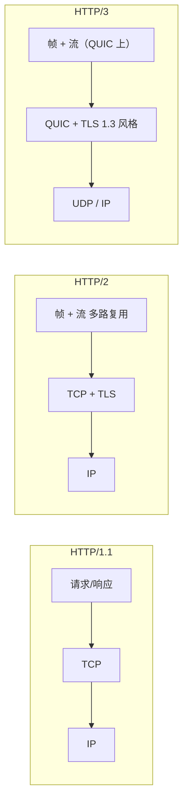

## 概述

**HTTP** 管的是「请求长什么样、响应长什么样」；真正怎么在链路上跑，还要看 **传输层** 怎么选。三者可以粗记为：

- **HTTP/1.1**：语义经典，多数在 **TCP** 上跑；并发主要靠 **多连接** 或管线化（后者几乎没人认真用）。
- **HTTP/2**：还是 **TCP + TLS**，但在一条连接里把多个请求 **多路复用** 成帧流，顺带做了头部压缩等优化。
- **HTTP/3**：语义上仍是 HTTP，但底层换成 **QUIC（基于 UDP）**，把「可靠传输 + 加密 + 连接管理」重新打包，解决 HTTP/2 在 **丢包时整条连接被拖慢** 的经典痛点。

下面按 **技术差异 → 升级带来什么 → 什么时候该指望谁** 来写；和 [HTTPS / TLS 那篇](./https-ssl-tls-deep-dive.html) 搭配看，更容易把「应用层 / 传输层 / 安全」对上号。

## HTTP/1.1：简单、兼容广，瓶颈也明显

### 模型

- **一问一答** 为主：一个连接上，响应顺序和请求顺序强相关（管线化能部分重叠，但实现与中间件支持差，线上基本当不存在）。
- **文本形态** 的头（后来也有优化手段，但核心习惯仍是「可读、可手工抓包」）。

### 典型限制

- **队头阻塞（应用层）**：前一个响应慢，后面的请求在同连接上容易 **被挡住**；所以浏览器会对同一站点 **开多条 TCP 连接**（域名分片、雪碧图、合并请求，很多都是为了绕开这个）。
- **头部冗余**：Cookie、User-Agent 等在每个请求里重复送，体积不小。
- **TCP 成本**：TLS 握手 + TCP 握手叠加，**首包、首屏** 对 RTT 敏感。

**适合**：老系统、极简内网、只面向 **只支持 HTTP/1.1** 的客户端或中间件；或调试时希望抓包一眼能读懂。

## HTTP/2：一条连接扛多请求

### 核心机制（相对 1.1）

- **二进制分帧**：把 HTTP 消息切成 **帧（frame）**，在逻辑上属于不同的 **流（stream）**。
- **多路复用**：多条请求/响应 **并行** 在同一条 TCP 连接上交错传输，不再靠「疯狂开连接」硬撑页面并发。
- **HPACK**：对头部做 **压缩**，减少重复字段开销。
- **服务器推送（Server Push）**：服务端主动推资源；**实际产品里用得不多**，很多站点直接关掉，以免推错或浪费带宽。

### 仍绕不开的一点

- **TCP 层面的队头阻塞** 还在：TCP 是 **字节流**，丢一个包，后续数据在接收端都要等重传；在 **无线、跨国、弱网** 下，HTTP/2 的多路复用有时会出现「一条流丢包， **整连接上其它流也一起等**」的现象。

**适合**：公网站点、现代浏览器与 CDN 的默认路径之一；静态资源多、同域并发高的页面收益明显。

## HTTP/3：把传输换成 QUIC

### QUIC 带来什么

- **用户态 + 内核 UDP**：连接建立、丢包恢复、拥塞控制等更多在 **用户态** 演进，不必等操作系统 TCP 栈慢慢升级。
- **加密是默认路径**：早期 QUIC 就与 TLS 1.3 思路对齐，**握手轮次** 通常比「传统 TCP + 多次 TLS」更省 RTT（具体取决于是否 0-RTT、是否首次访问等）。
- **连接迁移**：用 **连接 ID** 标识连接，IP/端口变了（例如手机 Wi‑Fi 切 4G）仍有机会 **延续会话**（实现与隐私策略因厂商而异，但方向如此）。
- **流级隔离**：QUIC 里多条流，**单流丢包主要影响该流**，其它流可继续推进，缓解 HTTP/2 在 TCP 上的「一损俱损」。

### 代价与注意点

- **UDP 在部分网络被限速或干扰**：企业防火墙、老旧运营商设备可能对 UDP **不友好**，需要 **优雅降级** 到 HTTP/2 或 HTTP/1.1（浏览器与常见 CDN 一般会做协商与回退）。
- **运维与观测**：习惯用 **四层** 做负载均衡或审计的团队，要适应 **QUIC 加密程度高**、部分信息不再像明文 HTTP/1.1 那样好扫一眼。

**适合**：移动端、高 RTT、丢包偶发的链路；全球化访问、视频、大站首页与 API **希望首连更快、弱网更稳** 的场景。

## 三者的快速对照

| 维度 | HTTP/1.1 | HTTP/2 | HTTP/3 |
|------|----------|--------|--------|
| 传输 | 主要是 TCP | TCP + TLS | QUIC（通常基于 UDP） |
| 并发模型 | 多连接为主；单连接易队头阻塞 | 单连接多流多路复用 | 单连接多流；流之间丢包隔离更好 |
| 头部 | 文本、冗余大 | HPACK 压缩 | QPACK（适配 QUIC 的头部压缩） |
| 握手与 RTT | TLS + TCP 叠加 | 同左，但连接数少 | 常更少 RTT 建立「可传数据的安全通道」 |
| 中间设备 | 兼容性最好 | 需支持 ALPN 等；部分老代理会降级 | UDP/QUIC 支持度仍在演进 |
| 典型痛点 | 连接数、头部体积、队头阻塞 | TCP 丢包拖慢所有流 | UDP 策略、生态与排障工具链 |

## 升级带来的优势（总结成可对外说的几条）

1. **页面与 API 的并行度**：HTTP/2 / 3 让 **同域多资源** 不必再靠「拼域名、开很多连接」这种土法。
2. **带宽利用率**：头部压缩 + 更合理的复用，**小包、多请求** 场景更省。
3. **弱网与移动网络**：HTTP/3 针对 **丢包与切换网络** 更友好，**首屏与长连接体验** 往往有体感提升（具体以实测为准）。
4. **安全默认**：现代栈上 **HTTPS + ALPN 协商** 已是常态；HTTP/3 进一步把 **加密与连接管理** 绑在一起设计。

## 适用场景与选型建议

- **只做内网、客户端极老、或中间件只认 HTTP/1.1**：维持 **HTTP/1.1** 并不丢人，把 **Keep-Alive、合理的缓存与压缩** 做好。
- **面向公网的网站与 API，且生态支持完整**：**优先开 HTTP/2**，成本低、收益确定；静态资源、SSR 页面、JSON API 都受益。
- **用户分布在移动网络、跨境链路，或监控里 TCP 重传偏高**：在 CDN / 网关 / 源站上 **启用 HTTP/3**，并保留 HTTP/2 作为回退；用 **RUM（真实用户监控）** 看 P75/P95，而不是只看实验室测速。
- **调试与学习**：HTTP/1.1 抓包最直观；HTTP/2 可看 Chrome DevTools 的 Protocol；HTTP/3 建议结合 **浏览器网络面板 + 服务端访问日志** 里的协议字段一起看。

## 实践上别忘了的几件事

- **ALPN**：TLS 握手阶段协商用 **h2** 还是 **h3**，源站与 CDN 配置要一致，证书与 SNI 也要正确。
- **0-RTT**：QUIC 的 0-RTT 能省延迟，但对 **重放** 敏感的非幂等接口要谨慎，按业务风险评估。
- **别为了协议版本牺牲基础项**：**CDN、HTTP 缓存、图片与脚本体积、TLS 会话复用**，往往比「只升到 HTTP/3」更先碰到天花板。

---

**一句话**：HTTP/1.1 简单可靠；HTTP/2 用 **多路复用** 解决了应用层并发；HTTP/3 用 **QUIC** 把 **丢包与握手** 的问题往前推了一步。线上最佳实践通常是 **HTTP/3 + HTTP/2 + HTTP/1.1 自动协商与回退**，再用数据决定要不要为 QUIC 单独投更多排障精力。
