## 概述

HTTPS = HTTP 外面套 **TLS**。这篇按 **「先握手拿对称密钥 → 再用证书把服务端钉死」** 的顺序写；版本表里 **1.2 仍大量存在**，新站能 **1.3 优先** 就优先。排障时对照 OpenSSL / 浏览器报错反查即可，别背序列图。

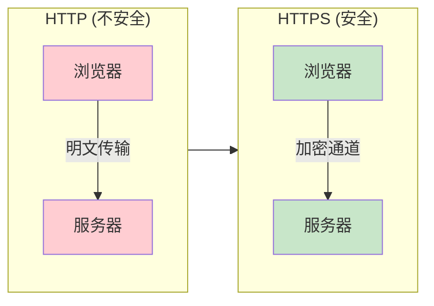

## 为什么需要 HTTPS

明文 HTTP 上，**同一段 Wi‑Fi 里的人**、**路径上任意一跳**，都能看见你在传啥；TLS 至少把 **机密性 + 完整性 +（对端的）身份** 三件事兜住。

### HTTP 的安全问题

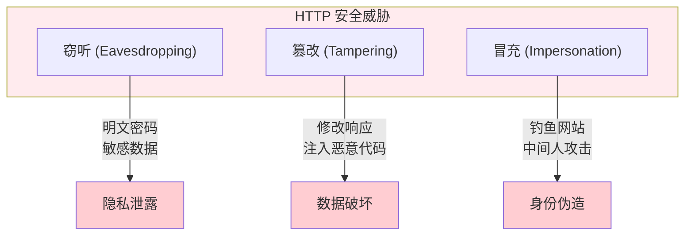

| 问题 | 描述 | 风险 |
|------|------|------|
| 窃听 | HTTP 明文传输，数据可被网络嗅探 | 密码、隐私泄露 |
| 篡改 | 数据在传输途中被修改 | 恶意注入、钓鱼攻击 |
| 冒充 | 伪造服务器欺骗用户 | 身份盗窃、金融欺诈 |

## TLS/SSL 协议原理

名字里还带 SSL 是历史包袱；今天配置里写的全是 **TLS**。老版本该关就关，别为了兼容 IE 留着 1.0。

### TLS 协议版本

| 版本 | 发布年份 | 状态 | 说明 |
|------|----------|------|------|
| SSL 2.0 | 1995 | 已废弃 | 存在严重安全漏洞 |
| SSL 3.0 | 1996 | 已废弃 | POODLE 攻击 |
| TLS 1.0 | 1999 | 已废弃 | BEAST 攻击 |
| TLS 1.1 | 2006 | 已废弃 | 2020 年被废弃 |
| TLS 1.2 | 2008 | 仍广泛使用 | 当前主流版本 |
| TLS 1.3 | 2018 | 推荐使用 | 更安全、更快速 |

### TLS 1.2 握手过程

1.2 里常见 **ECDHE 换临时密钥 + 证书里公钥做认证**（具体套件看 `Cipher Suite`）。下面是一版典型流程，和你抓到的包可能差在扩展字段上：

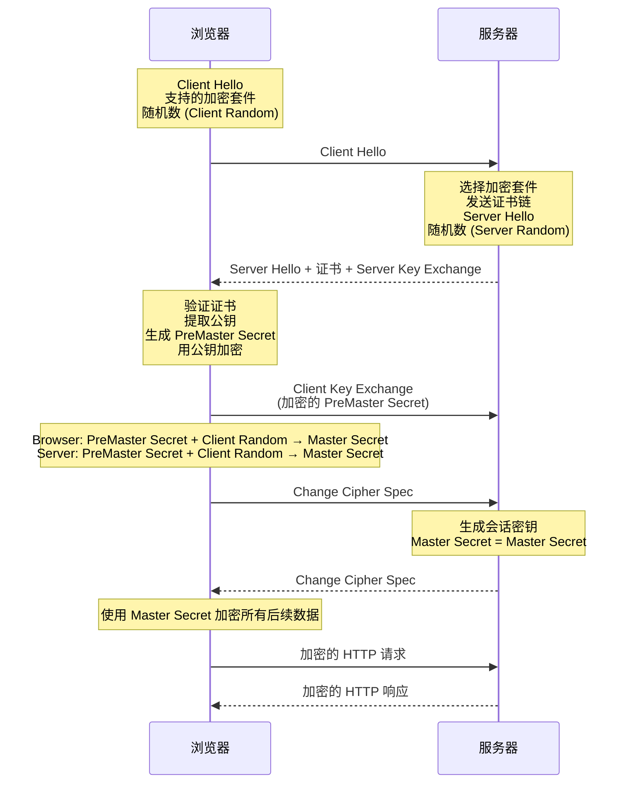

### TLS 1.3 握手优化

1.3 把大部分参数 **收紧成少数套件**，握手常见 **1-RTT**（首次）；**0-RTT** 能省往返但有 **重放** 争议，业务要自己评估。

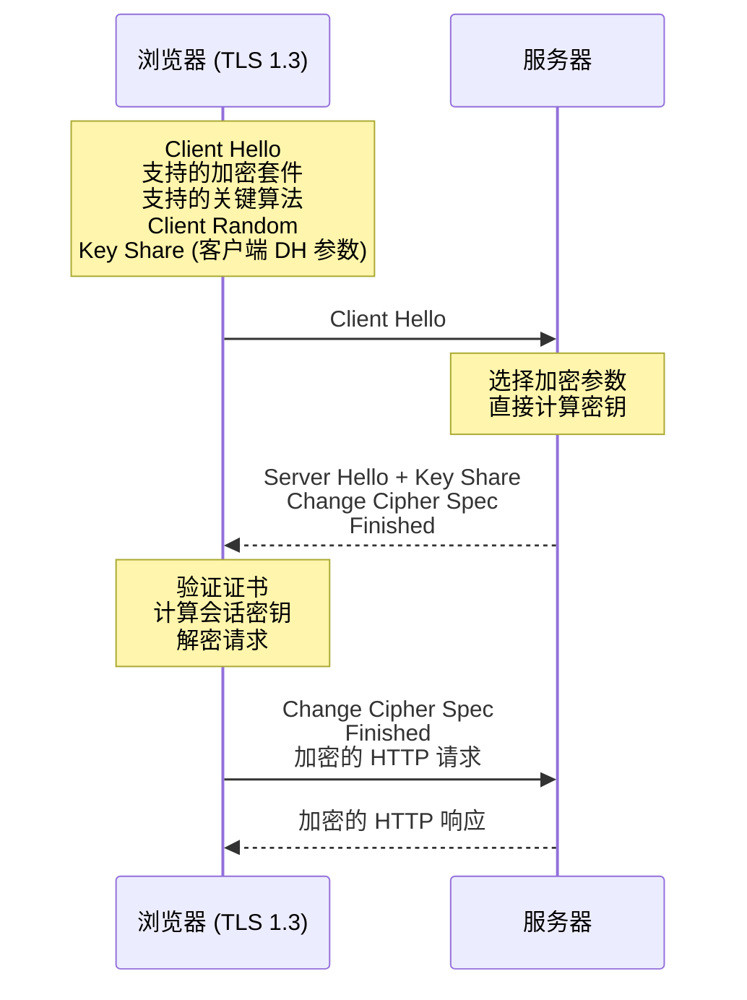

TLS 1.3 的改进：

| 改进点 | TLS 1.2 | TLS 1.3 |
|--------|----------|----------|
| 握手轮次 | 2-RTT | 1-RTT |
| 密钥交换 | RSA 或 DH | 仅 DH (前向安全) |
| 加密套件 | 大量 | 5 个推荐套件 |
| 0-RTT | 不支持 | 支持 (有重放风险) |

## 加密算法详解

握手阶段用 **非对称 / DH** 把对称密钥谈拢；真正扛流量的是 **AES-GCM、ChaCha20-Poly1305** 这类对称算法。别在业务层自己发明「混合加密」，用库和服务器默认套件。

### 对称加密 vs 非对称加密

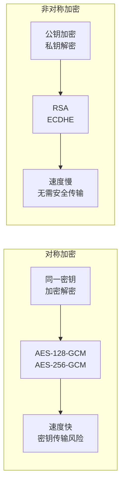

| 类型 | 算法 | 用途 | 特点 |
|------|------|------|------|
| 对称加密 | AES-128-GCM, AES-256-GCM, ChaCha20 | 数据传输加密 | 速度快，效率高 |
| 非对称加密 | RSA, ECDHE | 密钥交换 | 安全性高，速度慢 |
| 哈希算法 | SHA-256, SHA-384 | 签名验证 | 单向不可逆 |

### 加密套件

加密套件（Cipher Suite）命名格式：`TLS_密钥交换_签名算法_对称加密_哈希算法`

```bash
# TLS 1.2 加密套件示例
TLS_ECDHE_RSA_WITH_AES_128_GCM_SHA256
     │      │      │        │        │
     │      │      │        │        └── 哈希算法: SHA-256
     │      │      │        └── 对称加密: AES-128-GCM
     │      │      └── 签名算法: RSA
     │      └── 密钥交换: ECDHE (Elliptic Curve Diffie-Hellman Ephemeral)
     └── 协议: TLS
```

TLS 1.3 仅保留 5 个推荐加密套件：

| 加密套件 | 密钥交换 | 对称加密 | 哈希 |
|----------|----------|----------|------|
| TLS_AES_128_GCM_SHA256 | ECDHE | AES-128-GCM | SHA-256 |
| TLS_AES_256_GCM_SHA384 | ECDHE | AES-256-GCM | SHA-384 |
| TLS_CHACHA20_POLY1305_SHA256 | ECDHE | ChaCha20-Poly1305 | SHA-256 |
| TLS_AES_128_CCM_SHA256 | ECDHE | AES-128-CCM | SHA-256 |
| TLS_AES_128_CCM_8_SHA256 | ECDHE | AES-128-CCM-8 | SHA-256 |

## 数字证书机制

证书解决的是：**你连上的这台机子，是不是域名对应的那台**。链上缺中间证、SAN 没写全、时钟歪了，都是线上实打实会炸的。

### PKI (公钥基础设施)

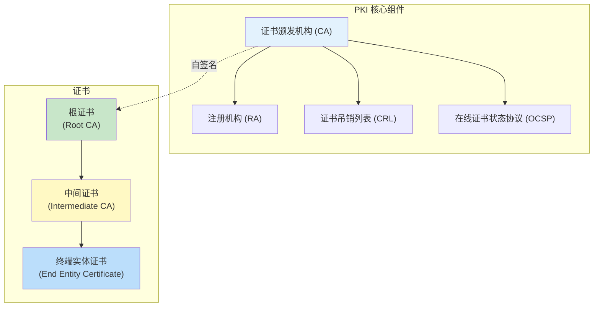

### 证书类型

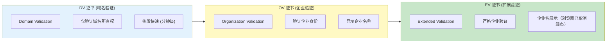

| 类型 | 验证级别 | 显示信息 | 适用场景 |
|------|----------|----------|----------|
| DV | 域名所有权 | 锁标志 + HTTPS | 个人网站、博客 |
| OV | 域名 + 企业身份 | 锁标志 + 企业名 | 企业官网 |
| EV | 严格企业验证 | 证书含企业名（**已无绿色地址栏**，Chrome 等 2019 起取消） | 金融、电商 |

### 证书格式

```bash
# 常见的证书格式
# PEM (Privacy Enhanced Mail) - Base64 编码
-----BEGIN CERTIFICATE-----
MIIFxxxxx...
-----END CERTIFICATE-----

# DER (Distinguished Encoding Rules) - 二进制编码
# 通常用于 Java KeyStore

# 转换命令
openssl x509 -in cert.pem -inform PEM -out cert.der -outform DER

# PKCS#12 / PFX - 包含私钥的证书包
openssl pkcs12 -export -in cert.pem -inkey key.pem -out bundle.p12

# PEM 证书链
-----BEGIN CERTIFICATE-----      # 终端实体证书
-----END CERTIFICATE-----
-----BEGIN CERTIFICATE-----      # 中间证书
-----END CERTIFICATE-----
-----BEGIN CERTIFICATE-----      # 根证书 (通常系统内置)
-----END CERTIFICATE-----
```

### 证书内容 (X.509)

```bash
# 查看证书详细信息
openssl x509 -in certificate.pem -text -noout

# 证书主要字段
Certificate:
    Data:
        Version: v3
        Serial Number: 04:xx:xx:xx:xx:xx:xx:xx
        Signature Algorithm: sha256WithRSAEncryption
        Issuer: C=US, O=Let's Encrypt, CN=R3
        Valid From: 2026-01-01 to 2026-04-01
        Subject: CN=www.example.com
        Subject Alternative Names: DNS:example.com, DNS:www.example.com
        Subject Public Key Info:
            Public Key Algorithm: RSA
            RSA Public Key: 2048 bits
        X509v3 Extensions:
            X509v3 Key Usage: Digital Signature, Key Encipherment
            X509v3 Basic Constraints: CA:FALSE
            X509v3 Subject Key Identifier: xx:xx:xx...
            X509v3 Authority Key Identifier: xx:xx:xx...
```

## TLS 握手详解

和上一节 **1.2 序列图** 对照看：这里把 **证书验证** 单独拆成流程图，方便对着 `openssl s_client` 输出一步步对。

### 完整的 TLS 1.2 握手流程

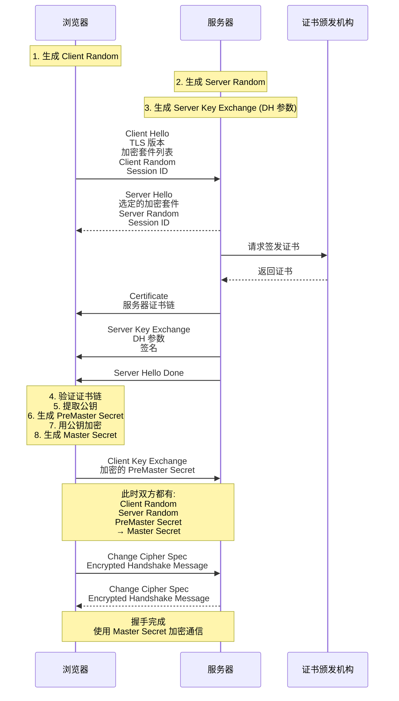

### 证书验证过程

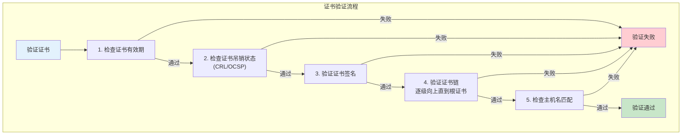

## 中间人攻击 (MITM)

能控制你路径上流量的人（恶意热点、公司网关、某些运营商插页），理论上都能玩这一出；**用户点「继续访问」** 是最常见的突破口。

### 攻击原理

```mermaid
sequenceDiagram
    participant U as 用户
    participant A as 攻击者
    participant S as 服务器

    Note over U,A,S: 正常 HTTPS 通信
    U->>S: Client Hello
    S-->>U: Server Hello + 证书

    Note over U,A,S: 中间人攻击
    U->>A: Client Hello
    A->>S: Client Hello (转发)
    S-->>A: Server Hello + 证书
    A-->>U: 伪造的证书 (攻击者自签名)

    Note over U: 浏览器警告：<br/>证书无效！
```

### 防御措施

| 防御手段 | 说明 |
|----------|------|
| 证书链验证 | 验证证书是否由可信 CA 签发 |
| 证书吊销检查 | 通过 CRL/OCSP 检查证书是否被吊销 |
| HPKP（**已废弃/移除**） | 历史方案；勿新接，现多用 Certificate Transparency + 短证书周期 |
| HSTS | 强制 HTTPS 访问，防止降级攻击 |
| CT (Certificate Transparency) | 公开日志，检测异常签发 |

## HTTPS 性能优化

首连贵主要在 **TLS 往返**；能 **会话复用、OCSP Stapling、HTTP/2/3** 就省一截。下面数字是量级，别当 SLA。

### TLS 握手延迟

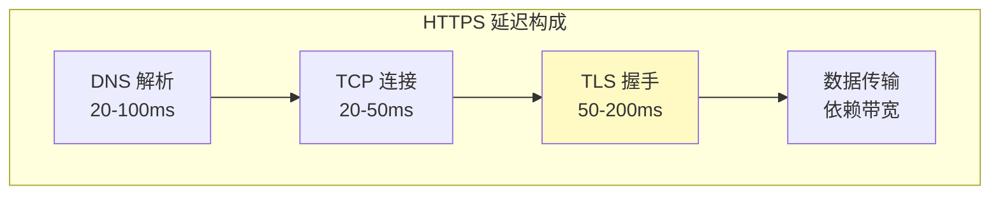

### 优化策略

#### 1. TLS 会话恢复

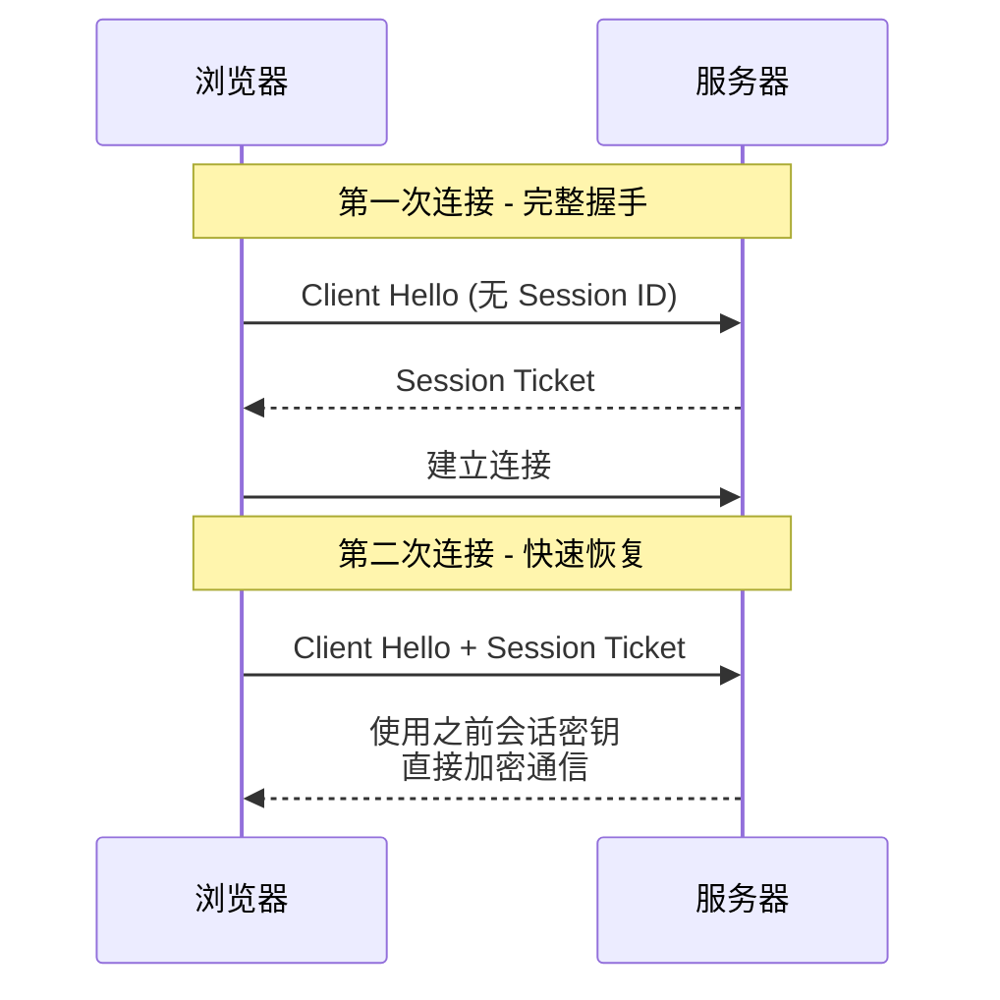

```bash
# Nginx 配置会话恢复
ssl_session_cache shared:SSL:10m;
ssl_session_timeout 1d;
ssl_session_tickets on;
```

#### 2. OCSP Stapling

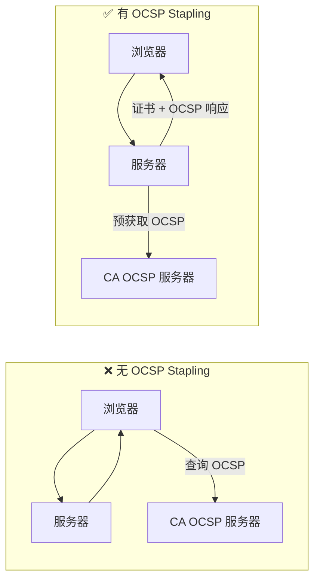

```nginx
# Nginx 启用 OCSP Stapling
ssl_stapling on;
ssl_stapling_verify on;
resolver 8.8.8.8 1.1.1.1 valid=300s;
```

#### 3. HTTP/2 和 HTTP/3

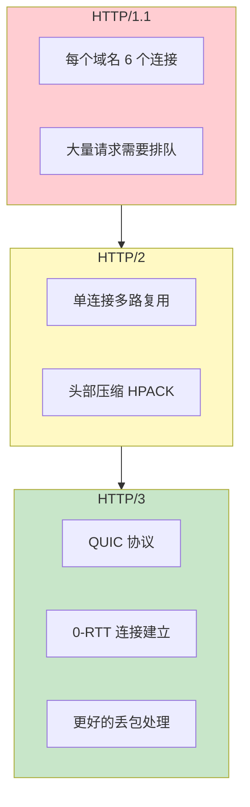

#### 4. 启用 HTTP/2 和 TLS 1.3

```nginx
# Nginx HTTP/2 和 TLS 配置
server {
    listen 443 ssl http2;

    # TLS 1.3 (需要 OpenSSL 1.1.1+)
    ssl_protocols TLSv1.2 TLSv1.3;

    # 推荐的加密套件
    ssl_ciphers 'TLS_AES_256_GCM_SHA384:TLS_CHACHA20_POLY1305_SHA256:ECDHE-RSA-AES256-GCM-SHA512';
    ssl_prefer_server_ciphers on;

    # 开启 OCSP Stapling
    ssl_stapling on;
    ssl_stapling_verify on;

    # 安全头
    add_header Strict-Transport-Security "max-age=63072000" always;
    add_header X-Frame-Options DENY;
    add_header X-Content-Type-Options nosniff;
}
```

### 现代 HTTPS 最佳配置

```nginx
# 完整的 HTTPS 最佳配置
server {
    listen 443 ssl http2;
    server_name www.example.com;

    ssl_certificate /path/to/full_chain.pem;
    ssl_certificate_key /path/to/private_key.pem;

    # TLS 版本
    ssl_protocols TLSv1.2 TLSv1.3;

    # 加密套件 (TLS 1.3 密码套件会被自动添加)
    ssl_ciphers 'ECDHE-ECDSA-AES128-GCM-SHA256:ECDHE-RSA-AES128-GCM-SHA256';
    ssl_prefer_server_ciphers off;

    # SSL 会话
    ssl_session_cache shared:SSL:10m;
    ssl_session_timeout 1d;
    ssl_session_tickets off;  # TLS 1.3 不需要

    # OCSP Stapling
    ssl_stapling on;
    ssl_stapling_verify on;
    resolver 1.1.1.1 8.8.8.8 valid=300s;
    resolver_timeout 5s;

    # 安全头
    add_header Strict-Transport-Security "max-age=31536000; includeSubDomains" always;
    add_header X-Frame-Options "SAMEORIGIN" always;
    add_header X-Content-Type-Options "nosniff" always;
    add_header Referrer-Policy "strict-origin-when-cross-origin" always;
    add_header Permissions-Policy "accelerometer=(),camera=(),geolocation=()";
}
```

## HTTPS 部署检测

上线后：**链是否完整、中间证书有没有漏、HSTS 有没有写炸**，比纠结 cipher 名字更有性价比。

### 检测工具

```bash
# 使用 OpenSSL 测试 TLS 连接
openssl s_client -connect www.example.com:443 -tls1_3
openssl s_client -connect www.example.com:443 -showcerts

# 在线检测
# https://www.ssllabs.com/ssltest/    （报告很细，适合一次性体检）
# https://cryptcheck.fr/               (简洁报告)
# https://www.wosign.com/              (国内)

# 命令行检测
echo | openssl s_client -connect www.google.com:443 -servername www.google.com 2>/dev/null | openssl x509 -noout -dates -issuer -subject
```

### 常见问题排查

| 问题 | 原因 | 解决方案 |
|------|------|----------|
| 证书链不完整 | 缺少中间证书 | 拼接完整证书链 |
| 证书过期 | 证书超过有效期 | 续期证书 |
| 主机名不匹配 | 证书 CN 与域名不符 | 重新签发证书 |
| 混合内容 | HTTPS 页面加载 HTTP 资源 | 全部改为 HTTPS |
| HSTS 失效 | 配置错误或过期 | 重新正确配置 |

## 常见 HTTPS 相关错误

Chrome / Firefox 报错串里 **ERR_*** 多半能直接映射到：链、日期、域名、套件。

### 浏览器错误提示

| 错误 | 含义 | 处理方法 |
|------|------|----------|
| `NET::ERR_CERT_AUTHORITY_INVALID` | 证书不被信任 | 检查证书链 |
| `NET::ERR_CERT_DATE_INVALID` | 证书过期 | 更新证书 |
| `NET::ERR_CERT_COMMON_NAME_INVALID` | 域名不匹配 | 检查证书 SAN |
| `ERR_SSL_VERSION_OR_CIPHER_MISMATCH` | 加密套件不兼容 | 更新配置 |
| `SEC_ERROR_UNKNOWN_ISSUER` | 未知颁发者 | 检查中间证书 |

## 总结

- **TLS** 管握手和信道；**证书**管「是不是这个站」；混内容、链缺一环、系统时间错，照样红屏。  
- 配置：**能 1.3 就 1.3**，1.2 留着兼容时 **套件别手抄十年前的**；**HSTS** 开之前想清楚能不能全程 HTTPS。  
- 运维：**全链证书**、`openssl s_client -showcerts`、**证书到期监控** 比追求满分 cipher 分更实在。

---

*参考资料: [RFC 5246](https://tools.ietf.org/html/rfc5246), [RFC 8446](https://tools.ietf.org/html/rfc8446), [MDN HTTPS](https://developer.mozilla.org/en-US/docs/Glossary/HTTPS), [SSL Labs SSL/TLS Best Practices](https://github.com/ssllabs/research/wiki/SSL-and-TLS-Deployment-Best-Practices)*
