## 什么是银行卡组织？

银行卡组织（Card Scheme/Card Network）是连接发卡银行、收单机构和商户的支付网络。它们制定了卡片交易的规则和标准，确保资金能够在全球范围内安全、高效地流转。

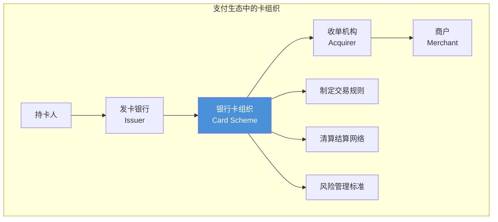

## 七大国际卡组织概览

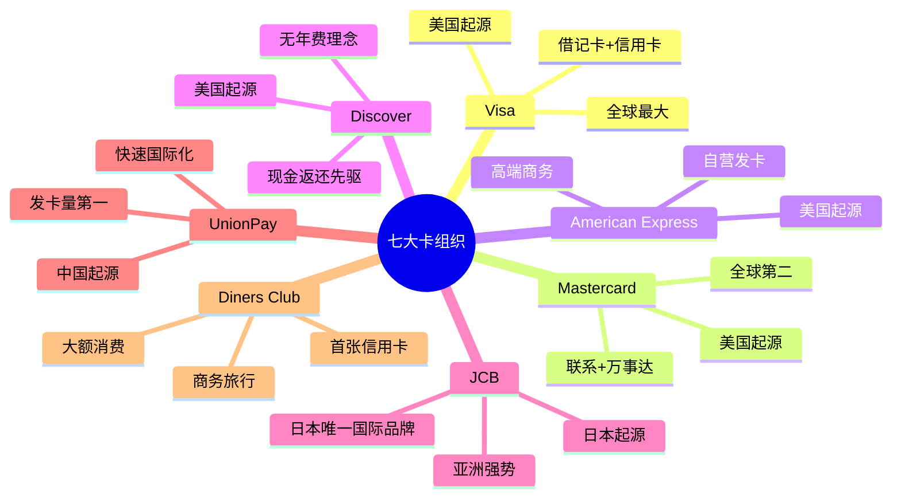

## 各卡组织详细介绍

### 1. Visa

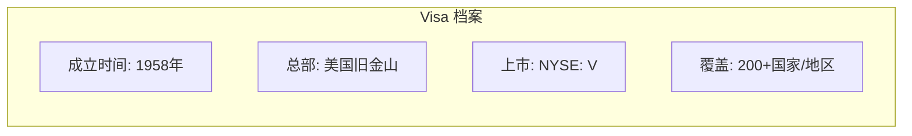

**发展历程**

| 年份 | 里程碑 |
|------|--------|
| 1958 | 美国银行推出 BankAmericard |
| 1970 | 成立 National BankAmericard Inc. |
| 1976 | 更名为 Visa |
| 2008 | 纽约证券交易所上市 |
| 2024 | 全球交易量超 $15 万亿 |

**核心特点**

- **全球覆盖率最高**：在 200 多个国家和地区被接受
- **双品牌策略**：Visa（信用卡）+ Visa Electron（借记卡）
- **技术领先**：VisaNet 每秒处理 65,000+ 笔交易
- **创新投入**：Visa Checkout、Visa Token Service

**卡号识别**

```
Visa 卡号范围：
┌─────────────────────────────────┐
│ 以 4 开头                        │
│ 长度：13、16 或 19 位            │
│ 示例：4111 1111 1111 1111       │
└─────────────────────────────────┘
```

### 2. Mastercard

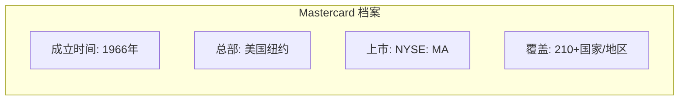

**发展历程**

| 年份 | 里程碑 |
|------|--------|
| 1966 | 多家银行联合成立 ICA |
| 1969 | 更名为 Master Charge |
| 1979 | 更名为 Mastercard |
| 2006 | 纽约证券交易所上市 |
| 2024 | 品牌价值全球前 20 |

**核心特点**

- **双品牌策略**：Mastercard（信用卡）+ Maestro（借记卡）
- **无价城市**：全球营销活动，覆盖 100+ 城市
- **数字支付**：Masterpass、Identity Check
- **金融包容性**：致力于 2025 年让 10 亿人获得金融服务

**卡号识别**

```
Mastercard 卡号范围：
┌─────────────────────────────────┐
│ 以 51-55 或 2221-2720 开头      │
│ 长度：16 位                     │
│ 示例：5500 0000 0000 0004      │
└─────────────────────────────────┘
```

### 3. American Express (Amex)

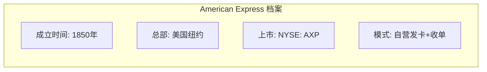

**发展历程**

| 年份 | 里程碑 |
|------|--------|
| 1850 | 成立快递公司 |
| 1891 | 发明旅行支票 |
| 1958 | 发行第一张信用卡 |
| 1999 | 推出蓝卡 Blue Card |
| 2024 | 全球高端卡市场领先 |

**核心特点**

- **闭环模式**：既是发卡行也是收单行
- **高端定位**：年费高，权益丰富
- **商务旅行**：企业差管服务领先
- **高消费人群**：平均交易金额最高

**卡号识别**

```
American Express 卡号范围：
┌─────────────────────────────────┐
│ 以 34 或 37 开头                │
│ 长度：15 位                     │
│ 格式：XXXX XXXXXX XXXXX         │
│ 示例：3782 822463 10005        │
└─────────────────────────────────┘
```

### 4. Discover

```mermaid
flowchart LR
    subgraph "Discover 档案"
        A[成立时间: 1985年]
        B[总部: 美国伊利诺伊]
        C[上市: NYSE: DFS]
        D[特色: 无年费+返现"]
    end
```

**发展历程**

| 年份 | 里程碑 |
|------|--------|
| 1985 | Sears 推出 Discover Card |
| 2004 | 发现金卡国际收购 Pulse 网络 |
| 2007 | 从摩根士丹利分拆独立上市 |
| 2008 | 收购 Diners Club 国际 |
| 2024 | 美国返现卡市场领先 |

**核心特点**

- **无年费理念**：首创免年费信用卡
- **现金返还**：返现奖励计划先驱
- **美国本土**：主要市场在美国
- **收购 Diners**：拓展国际网络

**卡号识别**

```
Discover 卡号范围：
┌─────────────────────────────────┐
│ 以 6011、644-649、65 开头       │
│ 长度：16 或 19 位               │
│ 示例：6011 1111 1111 1117      │
└─────────────────────────────────┘
```

### 5. JCB (Japan Credit Bureau)

```mermaid
flowchart LR
    subgraph "JCB 档案"
        A[成立时间: 1961年]
        B[总部: 日本东京]
        C[性质: 非上市公司]
        D[覆盖: 190+国家/地区"]
    end
```

**发展历程**

| 年份 | 里程碑 |
|------|--------|
| 1961 | 日本信用 bureau 成立 |
| 1981 | 开始国际化扩张 |
| 1987 | 在美国发行卡片 |
| 2012 | 与 Discover 签署战略合作 |
| 2024 | 亚洲市场强势品牌 |

**核心特点**

- **日本唯一**：日本唯一的国际卡品牌
- **亚洲强势**：在东亚、东南亚接受度高
- **高端服务**：JCB Plaza 旅行服务
- **战略合作**：与 Discover 互惠合作

**卡号识别**

```
JCB 卡号范围：
┌─────────────────────────────────┐
│ 以 3528-3589 开头               │
│ 长度：16 位                     │
│ 示例：3530 1113 3330 0000      │
└─────────────────────────────────┘
```

### 6. UnionPay (中国银联)

```mermaid
flowchart LR
    subgraph "UnionPay 档案"
        A[成立时间: 2002年]
        B[总部: 中国上海]
        C[性质: 国有控股]
        D[发卡量: 全球第一"]
    end
```

**发展历程**

| 年份 | 里程碑 |
|------|--------|
| 2002 | 在上海成立 |
| 2004 | 开始国际化 |
| 2010 | 超越 Visa 成为发卡量第一 |
| 2015 | 成为全球最大银行卡组织 |
| 2024 | 覆盖 180+ 国家和地区 |

**核心特点**

- **发卡量第一**：全球发卡量最大
- **中国市场**：国内近乎垄断地位
- **快速国际化**：境外接受度持续提升
- **移动支付**：云闪付、二维码支付

**卡号识别**

```
UnionPay 卡号范围：
┌─────────────────────────────────┐
│ 以 62 开头                      │
│ 长度：16 或 19 位               │
│ 示例：6225 8801 2345 6789      │
└─────────────────────────────────┘
```

### 7. Diners Club

```mermaid
flowchart LR
    subgraph "Diners Club 档案"
        A[成立时间: 1950年]
        B[总部: 美国]
        C[归属: Discover]
        D[特色: 世界首张信用卡"]
    end
```

**发展历程**

| 年份 | 里程碑 |
|------|--------|
| 1950 | 大来俱乐部成立，首张信用卡 |
| 1981 | 被 Citicorp 收购 |
| 2004 | 大部分业务被 Discover 收购 |
| 2024 | 专注商务旅行市场 |

**核心特点**

- **历史最悠久**：世界第一张多用途信用卡
- **商务定位**：专注商务人士和旅行
- **高端服务**：机场贵宾厅服务
- **大额消费**：无预设消费限额

**卡号识别**

```
Diners Club 卡号范围：
┌─────────────────────────────────┐
│ 以 36、38、39 开头              │
│ 长度：14-19 位                  │
│ 示例：3056 9309 0259 04        │
└─────────────────────────────────┘
```

## 卡组织对比分析

### 市场份额对比

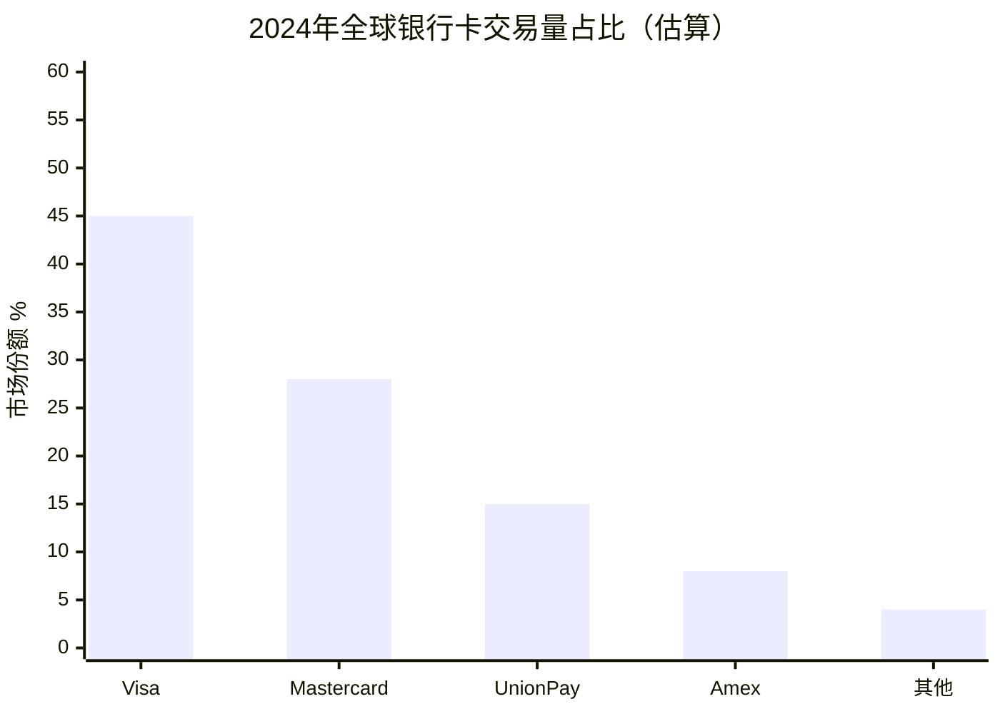

### 商业模式对比

| 特性 | Visa/Mastercard | American Express | Discover | UnionPay |
|------|-----------------|------------------|----------|----------|
| 模式 | 开放式 | 闭环式 | 闭环式 | 开放式 |
| 发卡 | 银行发卡 | 自营发卡 | 自营+合作 | 银行发卡 |
| 收单 | 独立收单 | 自营收单 | 自营收单 | 银行收单 |
| 费率 | 1.5-2.5% | 2.5-3.5% | 1.5-2.5% | 0.5-1.5% |

### 地域优势

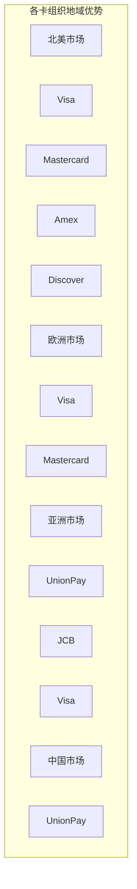

## 卡号识别规则汇总

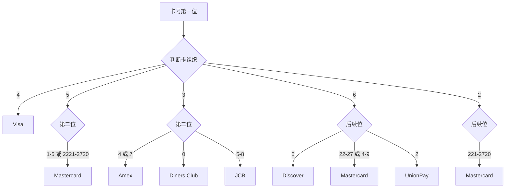

### BIN/IIN 范围速查表

| 卡组织 | BIN 范围 | 卡号长度 |
|--------|----------|----------|
| Visa | 4 | 13, 16, 19 |
| Mastercard | 51-55, 2221-2720 | 16 |
| Amex | 34, 37 | 15 |
| Discover | 6011, 644-649, 65, 622126-622925 | 16, 19 |
| JCB | 3528-3589 | 16 |
| UnionPay | 62 | 16, 19 |
| Diners Club | 36, 38, 39, 3095 | 14-19 |

## 技术标准与安全

### EMV 芯片标准

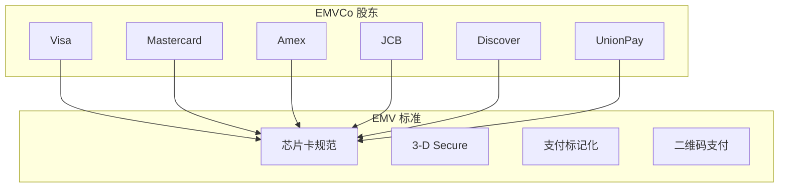

### 3-D Secure 认证

| 版本 | 特点 | 卡组织支持 |
|------|------|------------|
| 3DS 1.0 | 静态密码，体验差 | 全部支持 |
| 3DS 2.0 | 风险评估，无感认证 | 全部支持 |
| 3DS 2.2 | 强客户认证 SCA | 全部支持 |

### PCI DSS 合规

所有卡组织都要求处理卡片数据的商户和服务商遵守 PCI DSS 标准。详见 [PCI DSS 入门指南](/posts/pci-dss-overview.html)。

## 选择建议

### 对消费者

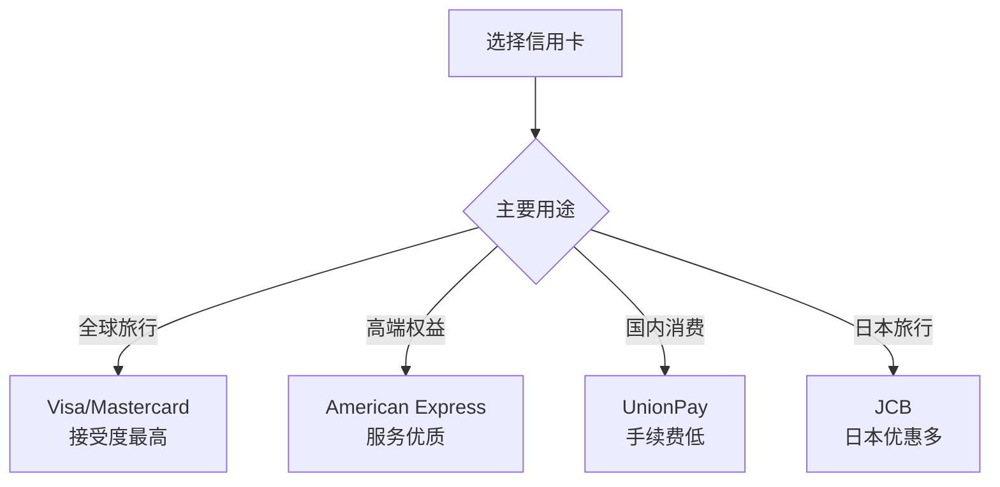

### 对商户

| 考虑因素 | 建议 |
|----------|------|
| 客户群体 | 根据客户来源地选择支持的主要卡组织 |
| 交易成本 | UnionPay 费率较低，Visa/MC 居中，Amex 较高 |
| 欺诈风险 | 全部支持，使用 3-D Secure 降低风险 |
| 技术对接 | 通过聚合支付网关一次对接多卡组织 |

## 未来趋势

### 数字化转型

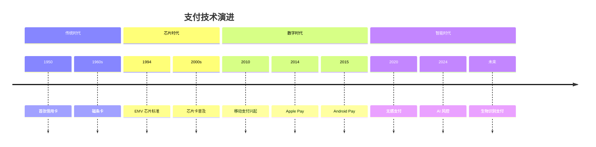

### 新兴技术

| 技术 | 应用 | 主要推动者 |
|------|------|------------|
| Tokenization | 支付标记化 | EMVCo 全体 |
| NFC | 非接触支付 | Visa, MC |
| QR Code | 二维码支付 | UnionPay, MC |
| Cryptocurrency | 稳定币结算 | Visa, MC |
| AI/ML | 智能风控 | 全部 |

## 推荐阅读

### 官方资源

| 组织 | 链接 |
|------|------|
| Visa | [visa.com](https://usa.visa.com/) |
| Mastercard | [mastercard.com](https://www.mastercard.com/) |
| American Express | [americanexpress.com](https://www.americanexpress.com/) |
| Discover | [discover.com](https://www.discover.com/) |
| JCB | [global.jcb](https://www.global.jcb/en/) |
| UnionPay | [unionpay.com](https://www.unionpay.com/) |
| EMVCo | [emvco.com](https://www.emvco.com/) |

### 深度阅读

| 主题 | 资源 |
|------|------|
| 支付行业报告 | Nilson Report, McKinsey Payments |
| 技术标准 | EMVCo 规范文档, ISO 8583 |
| 合规要求 | [PCI DSS 入门指南](/posts/pci-dss-overview.html) |
| 技术实现 | [PCI DSS 技术实现](/posts/pci-dss-implementation.html) |

## 总结

国际七大卡组织各有特色：

| 卡组织 | 核心优势 | 最佳场景 |
|--------|----------|----------|
| Visa | 全球接受度最高 | 国际旅行、跨境电商 |
| Mastercard | 覆盖广、创新强 | 全球支付、数字商务 |
| Amex | 高端服务、优质权益 | 商务出行、高端消费 |
| Discover | 无年费、高返现 | 美国日常消费 |
| JCB | 日本市场强势 | 日本旅行、东亚消费 |
| UnionPay | 中国市场主导 | 国内消费、华人社区 |
| Diners Club | 商务旅行服务 | 企业差旅、大额消费 |

> 选择合适的卡组织，需要根据你的业务场景、客户群体和成本预算综合考虑。

---

**相关文章**：
- [PCI DSS 支付卡行业数据安全标准入门指南](/posts/pci-dss-overview.html)
- [PCI DSS 技术实现指南](/posts/pci-dss-implementation.html)