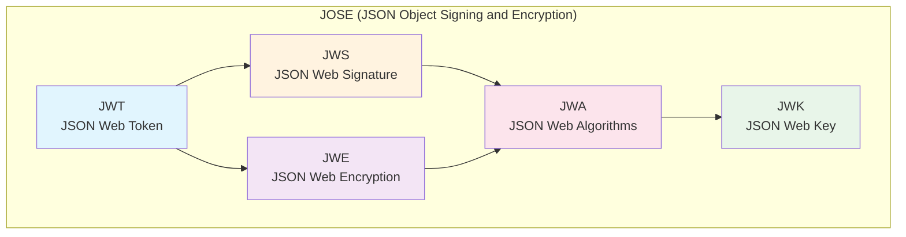
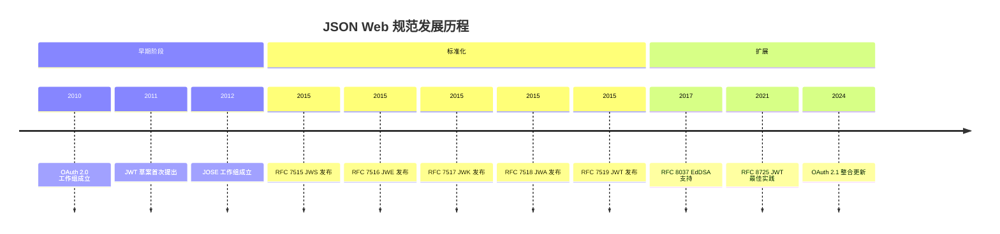
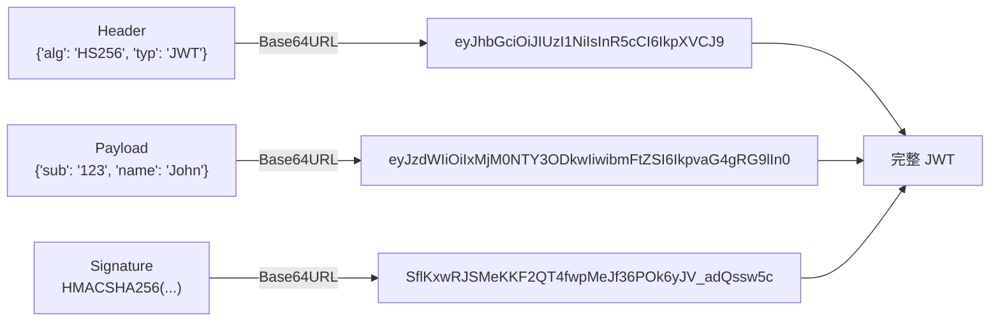
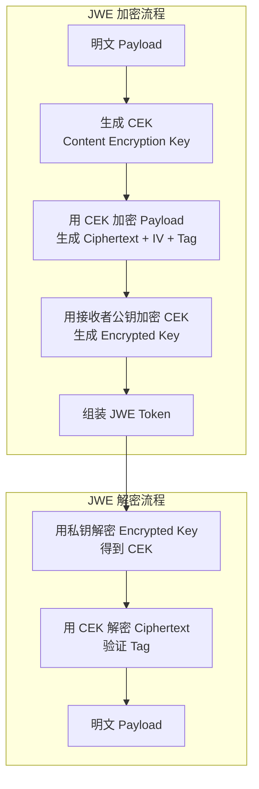
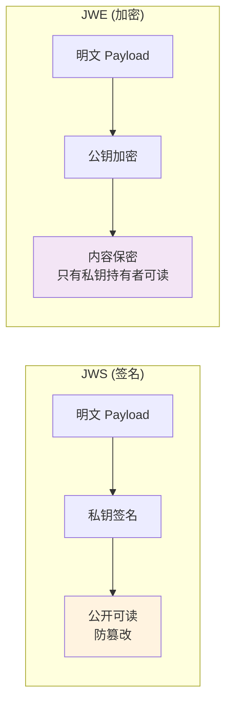
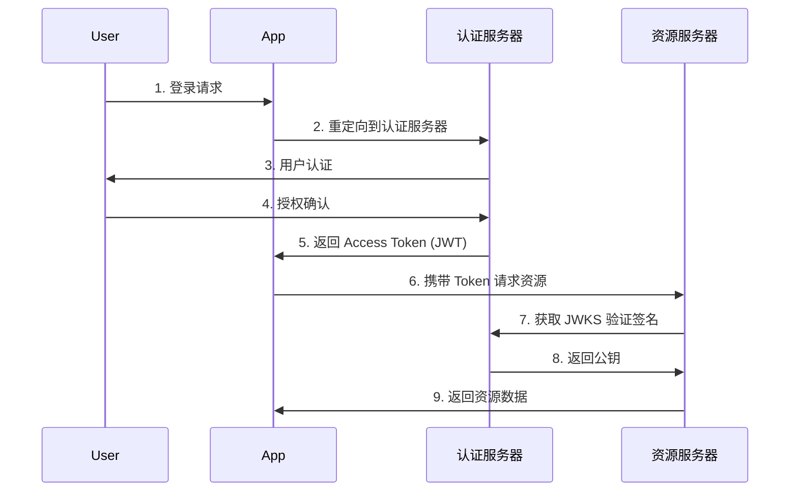
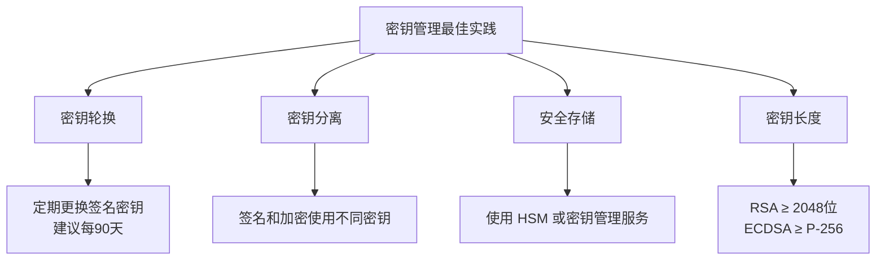
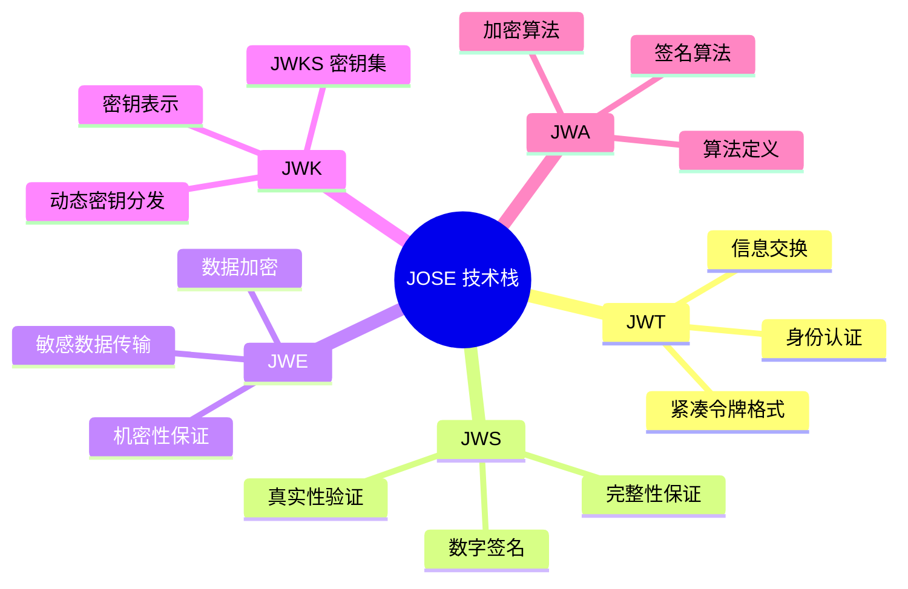

## 概述

在现代 Web 应用和 API 安全领域，JSON Web 技术栈（统称 JOSE - JSON Object Signing and Encryption）扮演着至关重要的角色。本文将深入解析 JWT、JWS、JWE 及其相关规范。



## 历史发展



### RFC 规范一览

| 规范 | RFC 编号 | 说明 |
|------|----------|------|
| JWS | RFC 7515 | JSON Web Signature，数字签名 |
| JWE | RFC 7516 | JSON Web Encryption，数据加密 |
| JWK | RFC 7517 | JSON Web Key，密钥表示 |
| JWA | RFC 7518 | JSON Web Algorithms，算法定义 |
| JWT | RFC 7519 | JSON Web Token，令牌格式 |
| JWT BP | RFC 8725 | JWT 最佳实践 |

## 核心概念详解

### 1. JWT (JSON Web Token)

JWT 是一种紧凑的、URL 安全的方式，用于在各方之间传输声明（claims）。

#### JWT 结构

一个 JWT 由三部分组成，用点号（`.`）分隔：

```
Header.Payload.Signature
```



#### JWT 类型

| 类型 | 说明 | 使用场景 |
|------|------|----------|
| JWS（默认） | 签名令牌 | 认证、授权、信息交换 |
| JWE | 加密令牌 | 敏感数据传输、保密通信 |

#### 标准 Claims（声明）

```json
{
  "iss": "https://example.com",  // 签发者 (Issuer)
  "sub": "user-123",             // 主题 (Subject)
  "aud": "https://api.example.com", // 受众 (Audience)
  "exp": 1735689600,             // 过期时间 (Expiration)
  "nbf": 1735603200,             // 生效时间 (Not Before)
  "iat": 1735603200,             // 签发时间 (Issued At)
  "jti": "unique-token-id"       // JWT ID（用于防重放）
}
```

#### JWT 示例代码

```javascript
// Node.js 示例
const jwt = require('jsonwebtoken');

// 签发 JWT
const token = jwt.sign(
  { userId: 123, username: 'john' },  // Payload
  'your-secret-key',                   // 密钥
  { expiresIn: '1h', issuer: 'my-app' } // 选项
);

// 验证 JWT
try {
  const decoded = jwt.verify(token, 'your-secret-key');
  console.log(decoded); // { userId: 123, username: 'john', iat: ..., exp: ... }
} catch (err) {
  console.log('Invalid token');
}
```

### 2. JWS (JSON Web Signature)

JWS 用于对任意数据添加数字签名，确保数据的**完整性**和**真实性**。

#### JWS 结构

```
BASE64URL(UTF8(JWS Protected Header)) ||
'.' ||
BASE64URL(JWS Payload) ||
'.' ||
BASE64URL(JWS Signature)
```

#### JWS Header 示例

```json
{
  "alg": "RS256",     // 算法
  "typ": "JWT",       // 类型
  "kid": "key-2024",  // 密钥 ID
  "jku": "https://example.com/.well-known/jwks.json" // JWK Set URL
}
```

#### JWS 序列化格式

| 格式 | 说明 | 使用场景 |
|------|------|----------|
| Compact | 紧凑格式，单行 | HTTP Header、URL 参数 |
| JSON | JSON 格式，支持多方签名 | 需要附加未保护 Header |

**Compact 格式示例：**
```
eyJhbGciOiJSUzI1NiIsImtpZCI6IjEyMzQifQ.eyJzdWIiOiJhYmMifQ.RqP5...
```

**JSON 格式示例：**
```json
{
  "protected": "eyJhbGciOiJSUzI1NiJ9",
  "payload": "eyJzdWIiOiJhYmMifQ",
  "signature": "RqP5..."
}
```

### 3. JWE (JSON Web Encryption)

JWE 用于加密任意数据，确保数据的**机密性**。

#### JWE 结构

JWE 比 JWS 复杂，由 **5 部分**组成：

```
BASE64URL(JWE Protected Header) ||
'.' ||
BASE64URL(JWE Encrypted Key) ||
'.' ||
BASE64URL(JWE Initialization Vector) ||
'.' ||
BASE64URL(JWE Ciphertext) ||
'.' ||
BASE64URL(JWE Authentication Tag)
```



#### JWE Header 示例

```json
{
  "alg": "RSA-OAEP",  // 密钥加密算法
  "enc": "A256GCM",   // 内容加密算法
  "kid": "enc-key-1", // 密钥 ID
  "typ": "JWT"
}
```

#### JWE 示例代码

```javascript
const jose = require('jose');

async function encryptJWT() {
  const publicKey = await jose.importJWK({
    kty: 'RSA',
    e: 'AQAB',
    n: '...',
    alg: 'RSA-OAEP-256'
  });

  const jwe = await new jose.CompactEncrypt(
    new TextEncoder().encode(JSON.stringify({ secret: 'data' }))
  )
    .setProtectedHeader({ alg: 'RSA-OAEP-256', enc: 'A256GCM' })
    .encrypt(publicKey);

  console.log(jwe);
}

async function decryptJWT(jwe, privateKey) {
  const { plaintext } = await jose.compactDecrypt(jwe, privateKey);
  console.log(new TextDecoder().decode(plaintext));
}
```

### 4. JWK (JSON Web Key)

JWK 是一种用 JSON 格式表示加密密钥的标准。

#### JWK 结构

```json
{
  "kty": "RSA",        // 密钥类型
  "use": "sig",        // 用途: sig(签名) 或 enc(加密)
  "kid": "2024-01",    // 密钥 ID
  "alg": "RS256",      // 算法
  "n": "0vx7agoebGcQ...",   // RSA 模数
  "e": "AQAB",         // RSA 指数
  "x5c": ["..."],      // X.509 证书链
  "x5t": "..."         // X.509 证书指纹
}
```

#### JWK Set (JWKS)

多个 JWK 的集合，常用于 OAuth/OIDC 服务器：

```json
{
  "keys": [
    {
      "kty": "RSA",
      "kid": "sig-2024",
      "use": "sig",
      "n": "...",
      "e": "AQAB"
    },
    {
      "kty": "RSA",
      "kid": "enc-2024",
      "use": "enc",
      "n": "...",
      "e": "AQAB"
    }
  ]
}
```

#### 不同密钥类型的 JWK

**RSA 密钥：**
```json
{ "kty": "RSA", "n": "...", "e": "AQAB" }
```

**EC 密钥：**
```json
{ "kty": "EC", "crv": "P-256", "x": "...", "y": "..." }
```

**对称密钥：**
```json
{ "kty": "oct", "k": "GawgguFyGrWKav7AX4VKUg" }
```

**OKP (EdDSA) 密钥：**
```json
{ "kty": "OKP", "crv": "Ed25519", "x": "..." }
```

### 5. JWA (JSON Web Algorithms)

JWA 定义了 JWS、JWE 和 JWK 使用的算法。

## 算法详解

### 签名算法 (JWS)

| 算法 | 类型 | 密钥长度 | 安全性 | 推荐度 |
|------|------|----------|--------|--------|
| HS256 | HMAC | 256+ bits | 中 | ⭐⭐ |
| HS384 | HMAC | 384+ bits | 中 | ⭐⭐ |
| HS512 | HMAC | 512+ bits | 中 | ⭐⭐ |
| RS256 | RSA | 2048+ bits | 高 | ⭐⭐⭐ |
| RS384 | RSA | 2048+ bits | 高 | ⭐⭐⭐ |
| RS512 | RSA | 2048+ bits | 高 | ⭐⭐⭐ |
| ES256 | ECDSA | P-256 | 高 | ⭐⭐⭐⭐ |
| ES384 | ECDSA | P-384 | 高 | ⭐⭐⭐⭐ |
| ES512 | ECDSA | P-521 | 高 | ⭐⭐⭐⭐ |
| PS256 | RSA-PSS | 2048+ bits | 高 | ⭐⭐⭐⭐ |
| EdDSA | EdDSA | Ed25519 | 高 | ⭐⭐⭐⭐⭐ |

### 密钥加密算法 (JWE - alg)

| 算法 | 说明 | 推荐度 |
|------|------|--------|
| RSA1_5 | RSA PKCS#1 v1.5 | ❌ 不推荐（存在漏洞） |
| RSA-OAEP | RSA OAEP with SHA-1 | ⭐⭐⭐ |
| RSA-OAEP-256 | RSA OAEP with SHA-256 | ⭐⭐⭐⭐ |
| A128KW | AES-128 Key Wrap | ⭐⭐⭐ |
| A256KW | AES-256 Key Wrap | ⭐⭐⭐⭐ |
| ECDH-ES | ECDH with Key Agreement | ⭐⭐⭐⭐ |
| ECDH-ES+A128KW | ECDH + AES-128 KW | ⭐⭐⭐⭐ |
| ECDH-ES+A256KW | ECDH + AES-256 KW | ⭐⭐⭐⭐⭐ |

### 内容加密算法 (JWE - enc)

| 算法 | 说明 | 推荐度 |
|------|------|--------|
| A128CBC-HS256 | AES-128-CBC + HMAC-SHA256 | ⭐⭐⭐ |
| A192CBC-HS384 | AES-192-CBC + HMAC-SHA384 | ⭐⭐⭐ |
| A256CBC-HS512 | AES-256-CBC + HMAC-SHA512 | ⭐⭐⭐⭐ |
| A128GCM | AES-128-GCM | ⭐⭐⭐⭐ |
| A192GCM | AES-192-GCM | ⭐⭐⭐⭐ |
| A256GCM | AES-256-GCM | ⭐⭐⭐⭐⭐ |

## JWS vs JWE 对比



| 特性 | JWS | JWE |
|------|-----|-----|
| 主要目的 | 完整性 + 真实性 | 机密性 |
| 数据可见性 | 任何人可读 | 只有持有私钥者可读 |
| 密钥使用 | 私钥签名，公钥验证 | 公钥加密，私钥解密 |
| 计算开销 | 较小 | 较大（两次加密） |
| 典型场景 | 身份认证、API 授权 | 敏感数据传输 |

## 实际应用场景

### 1. OAuth 2.0 / OIDC 认证



### 2. 微服务间认证

```javascript
// 服务 A 生成 Token
const serviceToken = jwt.sign(
  { service: 'service-a', permissions: ['read:users'] },
  process.env.JWT_SECRET,
  { expiresIn: '5m' }
);

// 服务 B 验证 Token
const decoded = jwt.verify(token, process.env.JWT_SECRET);
if (decoded.service !== 'service-a') {
  throw new Error('Unauthorized service');
}
```

### 3. 无状态 Session

```javascript
// 传统 Session：服务器存储
app.post('/login', (req, res) => {
  const sessionId = generateId();
  sessions[sessionId] = { userId: user.id }; // 存储在服务器
  res.cookie('sessionId', sessionId);
});

// JWT Session：无状态
app.post('/login', (req, res) => {
  const token = jwt.sign(
    { userId: user.id },
    SECRET,
    { expiresIn: '7d' }
  );
  res.json({ token }); // 客户端存储
});
```

### 4. 敏感数据传输（JWE）

```javascript
// 传输信用卡信息
const cardData = {
  number: '4111111111111111',
  cvv: '123',
  expiry: '12/25'
};

const jwe = await new jose.CompactEncrypt(
  new TextEncoder().encode(JSON.stringify(cardData))
)
  .setProtectedHeader({ alg: 'RSA-OAEP-256', enc: 'A256GCM' })
  .encrypt(publicKey);
```

## 安全最佳实践

### 1. 算法选择

```javascript
// ❌ 不要使用弱算法
const weakToken = jwt.sign(payload, secret, { algorithm: 'none' });

// ✅ 使用强算法
const strongToken = jwt.sign(payload, privateKey, { algorithm: 'ES256' });
```

### 2. 密钥管理



### 3. Claims 验证

```javascript
function validateToken(token, expectedAudience) {
  const decoded = jwt.verify(token, publicKey, {
    algorithms: ['ES256', 'RS256'], // 限制算法
    issuer: 'https://auth.example.com',
    audience: expectedAudience
  });

  // 检查必要字段
  if (!decoded.sub || !decoded.exp) {
    throw new Error('Missing required claims');
  }

  // 检查过期时间（额外保护）
  if (decoded.exp < Date.now() / 1000) {
    throw new Error('Token expired');
  }

  return decoded;
}
```

### 4. 防止常见攻击

| 攻击类型 | 防护措施 |
|----------|----------|
| 算法混淆 | 验证时显式指定算法 |
| None 算法 | 禁止 `alg: none` |
| 弱密钥 | 使用足够长度的密钥 |
| 重放攻击 | 使用 `jti` + 缓存黑名单 |
| 信息泄露 | 敏感数据使用 JWE |

### 5. Token 存储

```javascript
// ❌ 不安全：存储在 localStorage
localStorage.setItem('token', token);

// ✅ 较安全：HttpOnly Cookie
res.cookie('token', token, {
  httpOnly: true,  // 防止 XSS
  secure: true,    // 仅 HTTPS
  sameSite: 'strict' // 防止 CSRF
});
```

## 多语言实现示例

### Java (Spring Security)

```java
// 依赖: io.jsonwebtoken:jjwt-api
import io.jsonwebtoken.*;

public class JwtService {
    private final Key secretKey = Keys.secretKeyFor(SignatureAlgorithm.ES256);

    public String generateToken(String username) {
        return Jwts.builder()
            .setSubject(username)
            .setIssuedAt(new Date())
            .setExpiration(new Date(System.currentTimeMillis() + 3600000))
            .signWith(secretKey)
            .compact();
    }

    public Claims parseToken(String token) {
        return Jwts.parserBuilder()
            .setSigningKey(secretKey)
            .build()
            .parseClaimsJws(token)
            .getBody();
    }
}
```

### Python (PyJWT)

```python
import jwt
from datetime import datetime, timedelta

# 生成 Token
def create_token(user_id):
    payload = {
        'sub': user_id,
        'iat': datetime.utcnow(),
        'exp': datetime.utcnow() + timedelta(hours=1)
    }
    return jwt.encode(payload, SECRET_KEY, algorithm='ES256')

# 验证 Token
def verify_token(token):
    try:
        payload = jwt.decode(token, PUBLIC_KEY, algorithms=['ES256'])
        return payload
    except jwt.ExpiredSignatureError:
        raise Exception('Token expired')
    except jwt.InvalidTokenError:
        raise Exception('Invalid token')
```

### Go (golang-jwt)

```go
import "github.com/golang-jwt/jwt/v5"

func GenerateToken(userID string) (string, error) {
    claims := jwt.MapClaims{
        "sub": userID,
        "exp": time.Now().Add(time.Hour).Unix(),
        "iat": time.Now().Unix(),
    }

    token := jwt.NewWithClaims(jwt.SigningMethodES256, claims)
    return token.SignedString(privateKey)
}

func ParseToken(tokenString string) (jwt.MapClaims, error) {
    token, err := jwt.Parse(tokenString, func(token *jwt.Token) (interface{}, error) {
        if _, ok := token.Method.(*jwt.SigningMethodECDSA); !ok {
            return nil, fmt.Errorf("unexpected signing method")
        }
        return publicKey, nil
    })

    if claims, ok := token.Claims.(jwt.MapClaims); ok && token.Valid {
        return claims, nil
    }
    return nil, err
}
```

## 调试工具

### 在线工具

1. **[jwt.io](https://jwt.io)** - JWT 解码和调试
2. **[jwt.ms](https://jwt.ms)** - Microsoft JWT 解码器

### 命令行工具

```bash
# 解码 JWT Header
echo "eyJhbGciOiJIUzI1NiIsInR5cCI6IkpXVCJ9" | base64 -d

# 解码 JWT Payload
echo "eyJzdWIiOiIxMjM0NTY3ODkwIiwibmFtZSI6IkpvaG4gRG9lIiwiaWF0IjoxNTE2MjM5MDIyfQ" | base64 -d

# 使用 jq 格式化
echo "eyJzdWIiOiIxMjM0NTY3ODkwIn0" | base64 -d | jq .
```

## 总结



**选择建议：**

- **只需要验证身份**：使用 JWS（最常见的 JWT 用法）
- **需要保护敏感数据**：使用 JWE
- **两者都需要**：先签名后加密（Nested JWT）

**算法推荐：**
- 新项目优先选择 **ES256** 或 **EdDSA**
- 遗留系统可使用 **RS256**
- 避免使用 **HS256**（除非密钥管理得当）
- 加密选择 **A256GCM** + **ECDH-ES+A256KW**
