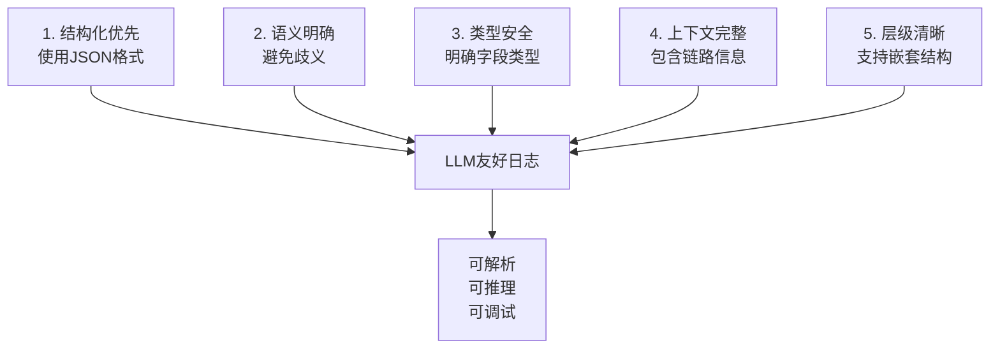
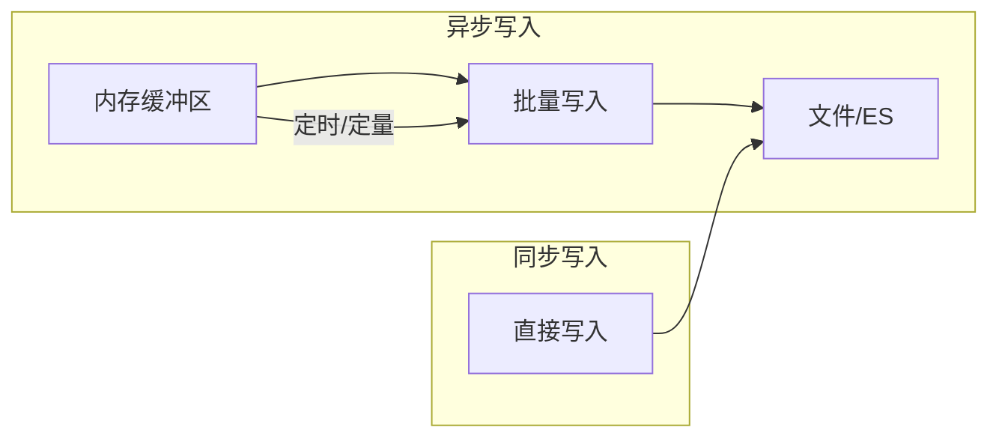

## 概述

让 LLM 读日志、做初筛，前提是日志别写得只有人眼能懂：字段挤一行、级别和 message 糊在一起，模型很容易抓错。这篇写 **我习惯怎么切 JSON 字段**，后面跟 Go、Java 两套可直接改的示例——目标就一个：**人眼和脚本都能稳定解析**。

## 传统日志格式的问题

### 常见的不友好格式

```log
# 无结构化日志（最难解析）
2026-03-23 10:15:32 ERROR [PaymentService] Transaction failed: insufficient balance, order_id=ORD20260323001, user=13800138000

# 半结构化日志（歧义多）
2026-03-23 10:15:32 ERROR PaymentService - Transaction failed: insufficient balance (order_id=ORD20260323001, user=13800138000)

# 混合多种格式
10:15:32 ERROR: failed to process request id=123 status=timeout
[10:15:33] WARN: connection pool 80% full
```

这些格式存在以下问题：

| 问题 | 描述 | LLM理解难度 |
|-----|------|------------|
| 歧义性 | 字段边界不明确，如 `order_id=123, user=456` 容易被误解析 | 高 |
| 不一致性 | 不同服务使用不同格式 | 高 |
| 嵌套结构缺失 | 复杂对象无法表达 | 高 |
| 上下文丢失 | 单条日志无法反映调用链 | 中 |
| 类型模糊 | 数字和字符串混淆 | 中 |

## LLM友好日志设计原则

### 核心原则



### 日志级别规范

```json
{
  "level": "ERROR",
  "level_value": 4,
  "level_desc": "服务降级运行，部分功能不可用"
}
```

| Level | Value | 何时使用 | LLM理解 |
|-------|-------|---------|--------|
| DEBUG | 1 | 详细调试信息 | 排查问题时使用 |
| INFO | 2 | 正常业务流程 | 理解系统运行态 |
| WARN | 3 | 异常但可恢复 | 需要关注 |
| ERROR | 4 | 错误需处理 | 必须处理 |
| FATAL | 5 | 系统不可用 | 紧急响应 |

## 推荐的LLM友好日志格式

### 完整JSON结构

```json
{
  "timestamp": "2026-03-23T10:15:32.456Z",
  "timestamp_unix": 1742720132,
  "level": "ERROR",
  "level_value": 4,
  "service": "payment-service",
  "service_version": "2.1.0",
  "environment": "production",
  "trace_id": "a1b2c3d4e5f6",
  "span_id": "7g8h9i0j",
  "parent_span_id": "1a2b3c4d",
  "logger": "PaymentService",
  "message": "Transaction failed due to insufficient balance",
  "message_template": "Transaction failed due to {reason}",
  "error": {
    "type": "InsufficientBalanceError",
    "code": "PAY_001",
    "message": "Account balance insufficient",
    "stack_trace": "..."
  },
  "context": {
    "order_id": "ORD20260323001",
    "user_id": "U13800138000",
    "amount": 199.00,
    "currency": "CNY",
    "payment_method": "WECHAT_PAY"
  },
  "metadata": {
    "region": "cn-east-1",
    "host": "payment-srv-05",
    "pid": 12345,
    "request_id": "req-xyz-789"
  },
  "duration_ms": 245,
  "status_code": 500
}
```

### 字段说明

| 字段 | 必需 | 类型 | 描述 |
|-----|------|-----|------|
| `timestamp` | 是 | ISO8601 | 日志时间 |
| `timestamp_unix` | 是 | int64 | Unix时间戳（毫秒） |
| `level` | 是 | string | 日志级别 |
| `level_value` | 是 | int | 级别数值（便于比较） |
| `service` | 是 | string | 服务名称 |
| `message` | 是 | string | 人类可读消息 |
| `message_template` | 推荐 | string | 消息模板（用于聚类） |
| `trace_id` | 推荐 | string | 链路追踪ID |
| `context` | 是 | object | 业务上下文 |
| `error` | 条件 | object | 错误详情（ERROR级别必需） |

## Go语言实现

### 日志库：zerolog + 自定义封装

首先安装依赖：

```bash
go get github.com/rs/zerolog
go get github.com/google/uuid
```

### 核心日志结构定义

```go
// log/llm_logger.go
package log

import (
	"context"
	"encoding/json"
	"fmt"
	"os"
	"time"

	"github.com/google/uuid"
	"github.com/rs/zerolog"
)

// LLMFriendlyLog LLM友好的日志结构
type LLMFriendlyLog struct {
	Timestamp      string                 `json:"timestamp"`
	TimestampUnix  int64                  `json:"timestamp_unix"`
	Level          string                 `json:"level"`
	LevelValue     int                    `json:"level_value"`
	Service        string                 `json:"service"`
	ServiceVersion string                 `json:"service_version"`
	Environment    string                 `json:"environment"`
	TraceID        string                 `json:"trace_id,omitempty"`
	SpanID         string                 `json:"span_id,omitempty"`
	ParentSpanID   string                 `json:"parent_span_id,omitempty"`
	Logger         string                 `json:"logger"`
	Message        string                 `json:"message"`
	MessageTemplate string                `json:"message_template,omitempty"`
	Error          *ErrorInfo             `json:"error,omitempty"`
	Context        map[string]interface{} `json:"context"`
	Metadata       map[string]interface{} `json:"metadata"`
	DurationMs     *int64                 `json:"duration_ms,omitempty"`
	StatusCode     *int                   `json:"status_code,omitempty"`
}

// ErrorInfo 错误详情结构
type ErrorInfo struct {
	Type       string `json:"type"`
	Code       string `json:"code"`
	Message    string `json:"message"`
	StackTrace string `json:"stack_trace,omitempty"`
}

// LogLevel 日志级别
type LogLevel int

const (
	DEBUG LogLevel = 1
	INFO  LogLevel = 2
	WARN  LogLevel = 3
	ERROR LogLevel = 4
	FATAL LogLevel = 5
)

var levelNames = map[LogLevel]string{
	DEBUG: "DEBUG",
	INFO:  "INFO",
	WARN:  "WARN",
	ERROR: "ERROR",
	FATAL: "FATAL",
}

var levelValues = map[LogLevel]int{
	DEBUG: 1,
	INFO:  2,
	WARN:  3,
	ERROR: 4,
	FATAL: 5,
}

// contextKey 日志上下文key
type contextKey string

const traceIDKey contextKey = "trace_id"
const spanIDKey contextKey = "span_id"
const parentSpanIDKey contextKey = "parent_span_id"

// LLMLogger LLM友好日志器
type LLMLogger struct {
	service        string
	serviceVersion string
	environment    string
	logger         zerolog.Logger
}

// NewLLMLogger 创建LLM日志器
func NewLLMLogger(service, version, env string) *LLMLogger {
	zerolog.TimeFieldFormat = time.RFC3339Nano

	logger := zerolog.New(os.Stdout).
		With().
		Timestamp().
		Caller().
		Logger()

	return &LLMLogger{
		service:        service,
		serviceVersion: version,
		environment:    env,
		logger:         logger,
	}
}

// WithTrace 添加链路追踪上下文
func (l *LLMLogger) WithTrace(ctx context.Context, traceID, spanID, parentSpanID string) context.Context {
	if traceID == "" {
		traceID = uuid.New().String()[:16]
	}
	if spanID == "" {
		spanID = uuid.New().String()[:8]
	}
	ctx = context.WithValue(ctx, traceIDKey, traceID)
	ctx = context.WithValue(ctx, spanIDKey, spanID)
	ctx = context.WithValue(ctx, parentSpanIDKey, parentSpanID)
	return ctx
}

// log 构建并输出LLM友好日志
func (l *LLMLogger) log(ctx context.Context, level LogLevel, msg string, template string, err error, context map[string]interface{}, durationMs *int64, statusCode *int) {
	traceID, _ := ctx.Value(traceIDKey).(string)
	spanID, _ := ctx.Value(spanIDKey).(string)
	parentSpanID, _ := ctx.Value(parentSpanIDKey).(string)

	now := time.Now()

	logEntry := LLMFriendlyLog{
		Timestamp:       now.Format(time.RFC3339Nano),
		TimestampUnix:   now.UnixMilli(),
		Level:           levelNames[level],
		LevelValue:      levelValues[level],
		Service:         l.service,
		ServiceVersion:  l.serviceVersion,
		Environment:     l.environment,
		TraceID:         traceID,
		SpanID:          spanID,
		ParentSpanID:    parentSpanID,
		Logger:          "application",
		Message:         msg,
		MessageTemplate: template,
		Context:         context,
		Metadata: map[string]interface{}{
			"host": getHostname(),
			"pid":  os.Getpid(),
		},
		DurationMs: durationMs,
		StatusCode: statusCode,
	}

	// 处理错误信息
	if err != nil {
		logEntry.Error = &ErrorInfo{
			Type:       fmt.Sprintf("%T", err),
			Code:       getErrorCode(err),
			Message:    err.Error(),
			StackTrace: fmt.Sprintf("%+v", err),
		}
	}

	// 序列化为JSON
	jsonBytes, _ := json.Marshal(logEntry)

	// 根据级别输出
	switch level {
	case DEBUG:
		l.logger.Debug().RawJSON("llm_log", jsonBytes).Msg(msg)
	case INFO:
		l.logger.Info().RawJSON("llm_log", jsonBytes).Msg(msg)
	case WARN:
		l.logger.Warn().RawJSON("llm_log", jsonBytes).Msg(msg)
	case ERROR:
		l.logger.Error().RawJSON("llm_log", jsonBytes).Msg(msg)
	case FATAL:
		l.logger.Fatal().RawJSON("llm_log", jsonBytes).Msg(msg)
	}
}

// Debug 输出DEBUG级别日志
func (l *LLMLogger) Debug(ctx context.Context, msg string, context map[string]interface{}) {
	l.log(ctx, DEBUG, msg, "", nil, context, nil, nil)
}

// Info 输出INFO级别日志
func (l *LLMLogger) Info(ctx context.Context, msg string, context map[string]interface{}) {
	l.log(ctx, INFO, msg, "", nil, context, nil, nil)
}

// Warn 输出WARN级别日志
func (l *LLMLogger) Warn(ctx context.Context, msg string, err error, context map[string]interface{}) {
	l.log(ctx, WARN, msg, "", err, context, nil, nil)
}

// Error 输出ERROR级别日志
func (l *LLMLogger) Error(ctx context.Context, msg string, err error, context map[string]interface{}) {
	l.log(ctx, ERROR, msg, "", err, context, nil, nil)
}

// Fatal 输出FATAL级别日志
func (l *LLMLogger) Fatal(ctx context.Context, msg string, err error, context map[string]interface{}) {
	l.log(ctx, FATAL, msg, "", err, context, nil, nil)
}

// WithDuration 记录操作耗时
func (l *LLMLogger) WithDuration(ctx context.Context, msg string, template string, durationMs int64, statusCode int, err error, context map[string]interface{}) {
	l.log(ctx, INFO, msg, template, err, context, &durationMs, &statusCode)
}

// 辅助函数
func getHostname() string {
	hostname, _ := os.Hostname()
	return hostname
}

func getErrorCode(err error) string {
	if err == nil {
		return ""
	}
	// 尝试从error接口获取错误码
	type codeError interface {
		Code() string
	}
	if ce, ok := err.(codeError); ok {
		return ce.Code()
	}
	return "UNKNOWN"
}
```

### 使用示例

```go
// main.go
package main

import (
	"context"
	"errors"
	"fmt"
	"time"

	"your-app/log"
)

// 自定义错误类型
type InsufficientBalanceError struct {
	AccountID string
	Balance   float64
	Amount    float64
}

func (e *InsufficientBalanceError) Error() string {
	return fmt.Sprintf("insufficient balance: account=%s, balance=%.2f, required=%.2f",
		e.AccountID, e.Balance, e.Amount)
}

func (e *InsufficientBalanceError) Code() string {
	return "PAY_001"
}

func main() {
	// 初始化日志器
	logger := log.NewLLMLogger("payment-service", "2.1.0", "production")
	ctx := logger.WithTrace(context.Background(), "", "", "")

	// 示例1：普通信息日志
	logger.Info(ctx, "Payment request received", map[string]interface{}{
		"order_id":      "ORD20260323001",
		"user_id":       "U13800138000",
		"amount":        199.00,
		"currency":      "CNY",
		"payment_method": "WECHAT_PAY",
	})

	// 示例2：带耗时的业务日志
	start := time.Now()
	// 模拟业务处理
	time.Sleep(100 * time.Millisecond)
	durationMs := time.Since(start).Milliseconds()

	logger.WithDuration(ctx,
		"Payment processed successfully",
		"Payment processed for order {order_id}",
		durationMs,
		200,
		nil,
		map[string]interface{}{
			"order_id": "ORD20260323001",
			"txn_id":   "TXN20260323001",
		},
	)

	// 示例3：错误日志
	err := &InsufficientBalanceError{
		AccountID: "ACC001",
		Balance:   50.00,
		Amount:    199.00,
	}
	logger.Error(ctx, "Transaction failed", err, map[string]interface{}{
		"order_id": "ORD20260323001",
		"user_id":  "U13800138000",
	})
}
```

### 输出示例

```json
{"level":"info","timestamp":"2026-03-23T10:15:32.123456789Z","llm_log":{"timestamp":"2026-03-23T10:15:32.123456789Z","timestamp_unix":1742720132123,"level":"INFO","level_value":2,"service":"payment-service","service_version":"2.1.0","environment":"production","trace_id":"a1b2c3d4e5f6","span_id":"7g8h9i0j","parent_span_id":"","logger":"application","message":"Payment processed successfully","message_template":"Payment processed for order {order_id}","context":{"order_id":"ORD20260323001","txn_id":"TXN20260323001"},"metadata":{"host":"payment-srv-05","pid":12345},"duration_ms":100,"status_code":200}}
{"level":"error","timestamp":"2026-03-23T10:15:32.234Z","llm_log":{"timestamp":"2026-03-23T10:15:32.234567890Z","timestamp_unix":1742720132234,"level":"ERROR","level_value":4,"service":"payment-service","service_version":"2.1.0","environment":"production","trace_id":"a1b2c3d4e5f6","span_id":"7g8h9i0j","parent_span_id":"","logger":"application","message":"Transaction failed","error":{"type":"*main.InsufficientBalanceError","code":"PAY_001","message":"insufficient balance: account=ACC001, balance=50.00, required=199.00","stack_trace":"..."},"context":{"order_id":"ORD20260323001","user_id":"U13800138000"},"metadata":{"host":"payment-srv-05","pid":12345}}}
```

## Java语言实现

### 日志库：Logback + JSON Encoder + 自定义MDC

添加Maven依赖：

```xml
<dependency>
    <groupId>ch.qos.logback</groupId>
    <artifactId>logback-classic</artifactId>
    <version>1.4.14</version>
</dependency>
<dependency>
    <groupId>net.logstash.logback</groupId>
    <artifactId>logstash-logback-encoder</artifactId>
    <version>7.4</version>
</dependency>
<dependency>
    <groupId>org.slf4j</groupId>
    <artifactId>slf4j-api</artifactId>
    <version>2.0.11</version>
</dependency>
```

### 核心日志结构

```java
// com/example/log/LLMFriendlyLog.java
package com.example.log;

import com.fasterxml.jackson.annotation.JsonInclude;
import com.fasterxml.jackson.annotation.JsonProperty;

import java.time.Instant;
import java.util.HashMap;
import java.util.Map;
import java.util.UUID;

/**
 * LLM友好的日志结构
 */
@JsonInclude(JsonInclude.Include.NON_NULL)
public class LLMFriendlyLog {

    @JsonProperty("timestamp")
    private String timestamp;

    @JsonProperty("timestamp_unix")
    private long timestampUnix;

    @JsonProperty("level")
    private String level;

    @JsonProperty("level_value")
    private int levelValue;

    @JsonProperty("service")
    private String service;

    @JsonProperty("service_version")
    private String serviceVersion;

    @JsonProperty("environment")
    private String environment;

    @JsonProperty("trace_id")
    private String traceId;

    @JsonProperty("span_id")
    private String spanId;

    @JsonProperty("parent_span_id")
    private String parentSpanId;

    @JsonProperty("logger")
    private String logger;

    @JsonProperty("message")
    private String message;

    @JsonProperty("message_template")
    private String messageTemplate;

    @JsonProperty("error")
    private ErrorInfo error;

    @JsonProperty("context")
    private Map<String, Object> context;

    @JsonProperty("metadata")
    private Map<String, Object> metadata;

    @JsonProperty("duration_ms")
    private Long durationMs;

    @JsonProperty("status_code")
    private Integer statusCode;

    // 静态工厂方法
    public static Builder builder() {
        return new Builder();
    }

    // Getters and Setters
    public String getTimestamp() { return timestamp; }
    public void setTimestamp(String timestamp) { this.timestamp = timestamp; }

    public long getTimestampUnix() { return timestampUnix; }
    public void setTimestampUnix(long timestampUnix) { this.timestampUnix = timestampUnix; }

    public String getLevel() { return level; }
    public void setLevel(String level) { this.level = level; }

    public int getLevelValue() { return levelValue; }
    public void setLevelValue(int levelValue) { this.levelValue = levelValue; }

    public String getService() { return service; }
    public void setService(String service) { this.service = service; }

    public String getServiceVersion() { return serviceVersion; }
    public void setServiceVersion(String serviceVersion) { this.serviceVersion = serviceVersion; }

    public String getEnvironment() { return environment; }
    public void setEnvironment(String environment) { this.environment = environment; }

    public String getTraceId() { return traceId; }
    public void setTraceId(String traceId) { this.traceId = traceId; }

    public String getSpanId() { return spanId; }
    public void setSpanId(String spanId) { this.spanId = spanId; }

    public String getParentSpanId() { return parentSpanId; }
    public void setParentSpanId(String parentSpanId) { this.parentSpanId = parentSpanId; }

    public String getLogger() { return logger; }
    public void setLogger(String logger) { this.logger = logger; }

    public String getMessage() { return message; }
    public void setMessage(String message) { this.message = message; }

    public String getMessageTemplate() { return messageTemplate; }
    public void setMessageTemplate(String messageTemplate) { this.messageTemplate = messageTemplate; }

    public ErrorInfo getError() { return error; }
    public void setError(ErrorInfo error) { this.error = error; }

    public Map<String, Object> getContext() { return context; }
    public void setContext(Map<String, Object> context) { this.context = context; }

    public Map<String, Object> getMetadata() { return metadata; }
    public void setMetadata(Map<String, Object> metadata) { this.metadata = metadata; }

    public Long getDurationMs() { return durationMs; }
    public void setDurationMs(Long durationMs) { this.durationMs = durationMs; }

    public Integer getStatusCode() { return statusCode; }
    public void setStatusCode(Integer statusCode) { this.statusCode = statusCode; }

    /**
     * 错误详情
     */
    public static class ErrorInfo {
        @JsonProperty("type")
        private String type;

        @JsonProperty("code")
        private String code;

        @JsonProperty("message")
        private String message;

        @JsonProperty("stack_trace")
        private String stackTrace;

        public ErrorInfo() {}

        public ErrorInfo(String type, String code, String message, String stackTrace) {
            this.type = type;
            this.code = code;
            this.message = message;
            this.stackTrace = stackTrace;
        }

        public String getType() { return type; }
        public void setType(String type) { this.type = type; }

        public String getCode() { return code; }
        public void setCode(String code) { this.code = code; }

        public String getMessage() { return message; }
        public void setMessage(String message) { this.message = message; }

        public String getStackTrace() { return stackTrace; }
        public void setStackTrace(String stackTrace) { this.stackTrace = stackTrace; }
    }

    /**
     * 构建器
     */
    public static class Builder {
        private final LLMFriendlyLog log = new LLMFriendlyLog();
        private final Map<String, Object> context = new HashMap<>();
        private final Map<String, Object> metadata = new HashMap<>();

        public Builder timestamp(Instant instant) {
            log.setTimestamp(instant.toString());
            log.setTimestampUnix(instant.toEpochMilli());
            return this;
        }

        public Builder level(String level, int levelValue) {
            log.setLevel(level);
            log.setLevelValue(levelValue);
            return this;
        }

        public Builder service(String service, String version, String env) {
            log.setService(service);
            log.setServiceVersion(version);
            log.setEnvironment(env);
            return this;
        }

        public Builder trace(String traceId, String spanId, String parentSpanId) {
            log.setTraceId(traceId);
            log.setSpanId(spanId);
            log.setParentSpanId(parentSpanId);
            return this;
        }

        public Builder logger(String logger) {
            log.setLogger(logger);
            return this;
        }

        public Builder message(String message, String template) {
            log.setMessage(message);
            log.setMessageTemplate(template);
            return this;
        }

        public Builder error(Throwable throwable) {
            if (throwable != null) {
                ErrorInfo errorInfo = new ErrorInfo();
                errorInfo.setType(throwable.getClass().getName());
                errorInfo.setCode(getErrorCode(throwable));
                errorInfo.setMessage(throwable.getMessage());
                errorInfo.setStackTrace(getStackTrace(throwable));
                log.setError(errorInfo);
            }
            return this;
        }

        public Builder context(String key, Object value) {
            this.context.put(key, value);
            return this;
        }

        public Builder context(Map<String, Object> context) {
            if (context != null) {
                this.context.putAll(context);
            }
            return this;
        }

        public Builder metadata(String key, Object value) {
            this.metadata.put(key, value);
            return this;
        }

        public Builder duration(long durationMs) {
            log.setDurationMs(durationMs);
            return this;
        }

        public Builder statusCode(int statusCode) {
            log.setStatusCode(statusCode);
            return this;
        }

        public LLMFriendlyLog build() {
            log.setContext(new HashMap<>(context));
            log.setMetadata(new HashMap<>(metadata));
            return log;
        }

        private String getErrorCode(Throwable t) {
            if (t instanceof HasErrorCode) {
                return ((HasErrorCode) t).getErrorCode();
            }
            return "UNKNOWN";
        }

        private String getStackTrace(Throwable t) {
            StringBuilder sb = new StringBuilder();
            for (StackTraceElement element : t.getStackTrace()) {
                sb.append(element.toString()).append("\n");
                if (sb.length() > 2000) break; // 限制长度
            }
            return sb.toString();
        }
    }
}

/**
 * 可提供错误码的接口
 */
interface HasErrorCode {
    String getErrorCode();
}
```

### LLM日志器实现

```java
// com/example/log/LLMLogger.java
package com.example.log;

import com.fasterxml.jackson.databind.ObjectMapper;
import com.fasterxml.jackson.datatype.jsr310.JavaTimeModule;
import org.slf4j.Logger;
import org.slf4j.LoggerFactory;
import org.slf4j.MDC;

import java.net.InetAddress;
import java.time.Instant;
import java.util.Map;
import java.util.UUID;

/**
 * LLM友好日志记录器
 */
public class LLMLogger {

    private static final ObjectMapper objectMapper = new ObjectMapper()
            .registerModule(new JavaTimeModule());

    public enum Level {
        DEBUG(1, "DEBUG"),
        INFO(2, "INFO"),
        WARN(3, "WARN"),
        ERROR(4, "ERROR"),
        FATAL(5, "FATAL");

        private final int value;
        private final String name;

        Level(int value, String name) {
            this.value = value;
            this.name = name;
        }

        public int getValue() { return value; }
        public String getName() { return name; }
    }

    // MDC Keys
    private static final String TRACE_ID_KEY = "trace_id";
    private static final String SPAN_ID_KEY = "span_id";
    private static final String PARENT_SPAN_ID_KEY = "parent_span_id";

    private final String service;
    private final String serviceVersion;
    private final String environment;
    private final Logger baseLogger;

    public LLMLogger(String service, String serviceVersion, String environment) {
        this.service = service;
        this.serviceVersion = serviceVersion;
        this.environment = environment;
        this.baseLogger = LoggerFactory.getLogger(service);
    }

    /**
     * 初始化链路追踪上下文
     */
    public void initTrace() {
        String traceId = UUID.randomUUID().toString().substring(0, 16);
        String spanId = UUID.randomUUID().toString().substring(0, 8);
        MDC.put(TRACE_ID_KEY, traceId);
        MDC.put(SPAN_ID_KEY, spanId);
    }

    /**
     * 清除链路追踪上下文
     */
    public void clearTrace() {
        MDC.remove(TRACE_ID_KEY);
        MDC.remove(SPAN_ID_KEY);
        MDC.remove(PARENT_SPAN_ID_KEY);
    }

    private LLMFriendlyLog.Builder createBaseBuilder(String message, String template) {
        Instant now = Instant.now();
        String traceId = MDC.get(TRACE_ID_KEY);
        String spanId = MDC.get(SPAN_ID_KEY);
        String parentSpanId = MDC.get(PARENT_SPAN_ID_KEY);

        return LLMFriendlyLog.builder()
                .timestamp(now)
                .service(service, serviceVersion, environment)
                .trace(traceId, spanId, parentSpanId)
                .logger(baseLogger.getName())
                .message(message, template)
                .metadata("host", getHostname())
                .metadata("pid", ProcessHandle.current().pid());
    }

    public void debug(String message, Map<String, Object> context) {
        log(Level.DEBUG, message, null, null, null, context, null, null);
    }

    public void info(String message, Map<String, Object> context) {
        log(Level.INFO, message, null, null, null, context, null, null);
    }

    public void warn(String message, Throwable error, Map<String, Object> context) {
        log(Level.WARN, message, null, error, null, context, null, null);
    }

    public void error(String message, Throwable error, Map<String, Object> context) {
        log(Level.ERROR, message, null, error, null, context, null, null);
    }

    public void fatal(String message, Throwable error, Map<String, Object> context) {
        log(Level.FATAL, message, null, error, null, context, null, null);
    }

    /**
     * 带耗时的业务日志
     */
    public void logDuration(String message, String template, long durationMs,
                           int statusCode, Throwable error, Map<String, Object> context) {
        log(Level.INFO, message, template, error, durationMs, context, statusCode);
    }

    private void log(Level level, String message, String template, Throwable error,
                    Long durationMs, Map<String, Object> context, Integer statusCode) {
        log(level, message, template, error, null, context, durationMs, statusCode);
    }

    private void log(Level level, String message, String template, Throwable error,
                    Object dummy, Map<String, Object> context, Long durationMs, Integer statusCode) {
        LLMFriendlyLog llmLog = createBaseBuilder(message, template)
                .level(level.getName(), level.getValue())
                .error(error)
                .context(context)
                .duration(durationMs)
                .statusCode(statusCode)
                .build();

        try {
            String json = objectMapper.writeValueAsString(llmLog);

            switch (level) {
                case DEBUG:
                    baseLogger.debug("{}", json);
                    break;
                case INFO:
                    baseLogger.info("{}", json);
                    break;
                case WARN:
                    baseLogger.warn("{}", json);
                    break;
                case ERROR:
                    baseLogger.error("{}", json);
                    break;
                case FATAL:
                    baseLogger.error("{}", json);
                    break;
            }
        } catch (Exception e) {
            baseLogger.error("Failed to serialize log: {}", e.getMessage());
        }
    }

    private String getHostname() {
        try {
            return InetAddress.getLocalHost().getHostName();
        } catch (Exception e) {
            return "unknown";
        }
    }
}
```

### 自定义错误类型

```java
// com/example/error/BusinessError.java
package com.example.error;

import com.example.log.HasErrorCode;

/**
 * 业务错误基类
 */
public class BusinessError extends RuntimeException implements HasErrorCode {

    private final String errorCode;

    public BusinessError(String errorCode, String message) {
        super(message);
        this.errorCode = errorCode;
    }

    public BusinessError(String errorCode, String message, Throwable cause) {
        super(message, cause);
        this.errorCode = errorCode;
    }

    @Override
    public String getErrorCode() {
        return errorCode;
    }
}

// InsufficientBalanceError.java
class InsufficientBalanceError extends BusinessError {

    private final String accountId;
    private final double balance;
    private final double required;

    public InsufficientBalanceError(String accountId, double balance, double required) {
        super("PAY_001", String.format("Insufficient balance: account=%s, balance=%.2f, required=%.2f",
                accountId, balance, required));
        this.accountId = accountId;
        this.balance = balance;
        this.required = required;
    }

    public String getAccountId() { return accountId; }
    public double getBalance() { return balance; }
    public double getRequired() { return required; }
}
```

### 使用示例

```java
// com/example/PaymentService.java
package com.example;

import com.example.error.InsufficientBalanceError;
import com.example.log.LLMLogger;

import java.util.HashMap;
import java.util.Map;
import java.util.logging.Level;

public class PaymentService {

    private static final LLMLogger logger = new LLMLogger(
            "payment-service",
            "2.1.0",
            "production"
    );

    public void processPayment(String orderId, String userId, double amount) {
        logger.initTrace();

        Map<String, Object> context = new HashMap<>();
        context.put("order_id", orderId);
        context.put("user_id", userId);
        context.put("amount", amount);
        context.put("currency", "CNY");

        try {
            logger.info("Payment request received", context);

            // 模拟业务处理
            long startTime = System.currentTimeMillis();
            // ... 业务逻辑
            long duration = System.currentTimeMillis() - startTime;

            Map<String, Object> successContext = new HashMap<>(context);
            successContext.put("txn_id", "TXN" + System.currentTimeMillis());

            logger.logDuration(
                    "Payment processed successfully",
                    "Payment processed for order {order_id}",
                    duration,
                    200,
                    null,
                    successContext
            );

        } catch (InsufficientBalanceError e) {
            Map<String, Object> errorContext = new HashMap<>(context);
            errorContext.put("account_id", e.getAccountId());
            errorContext.put("available_balance", e.getBalance());

            logger.error("Transaction failed", e, errorContext);
            throw e;
        } finally {
            logger.clearTrace();
        }
    }
}
```

### Logback配置

```xml
<!-- src/main/resources/logback.xml -->
<?xml version="1.0" encoding="UTF-8"?>
<configuration>
    <appender name="CONSOLE" class="ch.qos.logback.core.ConsoleAppender">
        <encoder class="net.logstash.logback.encoder.LogstashEncoder">
            <includeMdcKeyName>trace_id</includeMdcKeyName>
            <includeMdcKeyName>span_id</includeMdcKeyName>
            <includeMdcKeyName>parent_span_id</includeMdcKeyName>
            <customFields>{"service":"payment-service","version":"2.1.0"}</customFields>
        </encoder>
    </appender>

    <appender name="JSON_FILE" class="ch.qos.logback.core.rolling.RollingFileAppender">
        <file>logs/app.json</file>
        <rollingPolicy class="ch.qos.logback.core.rolling.TimeBasedRollingPolicy">
            <fileNamePattern>logs/app.%d{yyyy-MM-dd}.json.gz</fileNamePattern>
            <maxHistory>30</maxHistory>
        </rollingPolicy>
        <encoder class="net.logstash.logback.encoder.LogstashEncoder">
            <includeMdcKeyName>trace_id</includeMdcKeyName>
            <includeMdcKeyName>span_id</includeMdcKeyName>
        </encoder>
    </appender>

    <root level="INFO">
        <appender-ref ref="CONSOLE" />
        <appender-ref ref="JSON_FILE" />
    </root>

    <logger name="payment-service" level="DEBUG" />
</configuration>
```

## 最佳实践

### 1. 日志消息模板化

```json
{
  "message": "Failed to process payment for order ORD20260323001",
  "message_template": "Failed to process payment for order {order_id}"
}
```

**好处**：
- 便于LLM进行日志聚类分析
- 减少重复存储，节省空间
- 便于构建日志监控告警规则

### 2. 统一的错误码体系

```json
{
  "error": {
    "code": "PAY_001",
    "type": "InsufficientBalanceError",
    "message": "Account balance insufficient"
  }
}
```

推荐错误码格式：`{模块}_{序号}`

| 模块 | 前缀 | 示例 |
|-----|------|------|
| 支付 | PAY | PAY_001 |
| 用户 | USR | USR_001 |
| 订单 | ORD | ORD_001 |
| 系统 | SYS | SYS_001 |

### 3. 链路追踪整合

```json
{
  "trace_id": "a1b2c3d4e5f6",
  "span_id": "7g8h9i0j",
  "parent_span_id": "1a2b3c4d"
}
```

### 4. LLM查询语言示例

有了结构化日志后，可以设计LLM友好的查询接口：

```python
# 伪代码：LLM查询接口
def query_logs(query: str) -> list[dict]:
    """
    LLM可理解的自然语言查询示例：

    "查询最近1小时所有ERROR级别日志，按服务分组"
    "查找所有包含 insufficient balance 错误的订单"
    "统计每个用户的支付失败次数"
    """
    pass
```

### 5. 性能考虑



| 方案 | 优点 | 缺点 | 适用场景 |
|-----|------|------|---------|
| 同步写入 | 可靠性高 | 性能开销大 | 金融交易 |
| 异步批量 | 性能高 | 可能丢日志 | 高并发服务 |
| 内存缓冲 | 最低延迟 | 可能丢日志 | 开发调试 |

## 总结

LLM友好日志格式的核心要点：

1. **结构化**：使用JSON格式，字段明确
2. **类型安全**：明确字段类型和值
3. **上下文完整**：包含链路追踪信息
4. **错误规范**：统一的错误码和错误结构
5. **模板分离**：消息与模板分离，便于聚类

Go / Java 两段抄进项目改改就能用；真要接 AI 流水线，再在结构化字段上叠一层即可，不必一次到位。
