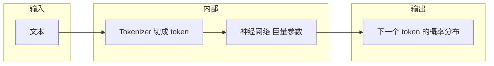

> 系列总目录与后续篇章规划见：[《LLM 底层原理 · 系列学习计划》](./llm-from-scratch-series-plan.html)。

Day 1 就干两件事：词对齐，把流水线画出来；公式和层细节从 Day 2 往后接。

## 本篇目标

读完尽量能做到下面几条（当自检清单用）：

1. 区分 **语言模型（LM）** 与 **大语言模型（LLM）** 在常见说法里的含义。
2. 说清楚参数、token、上下文窗口各指什么，以及它们如何影响「能记多长、模型有多大」。
3. 分清训练和推理在数据、目标、是否更新参数上的差别。
4. 能说清 **LLM** 在底层主要在算什么（下一 token 的分布、训练调参、推理自回归，能指到即可）。

## 知识结构（一张图）

就一条链（和下图一致）：文本 → token → 大网络 → 下一个 token 的概率。后面讲 Transformer 也是往这条链上挂模块。

- **LM**：给一段已出现的符号序列，建模「下一个符号（通常是 token）」的概率分布。
- **LLM**：把上述能力做到规模很大（参数多、训练数据多、上下文长），并在工程上可产品化（对话、工具调用等）。

## 核心术语

下面四块读 paper、看 Model Card 会反复撞见，先抠准指什么。

### Token 与词表（vocabulary）

模型不直接读汉字/英文单词，而是读 **token ID**（整数）。 **Tokenizer** 把字符串切成 token；词表是「ID ↔ 子词/片段」的有限集合。同一句话，不同分词器切出来的 token 个数可以不同，所以「多少字」≠「多少 token」。

### 上下文窗口（context length）

模型每一步能同时「看到」的 token 序列长度上限，常记为最大长度 \(L_{\max}\)（如 4k、8k、128k）。超过窗口的内容要么截断，要么用别的机制处理（后续篇章会涉及）。 **先记住：有上限，且通常越长越贵。**

### 参数（parameters）

神经网络里可学习的权重，规模常用 **B**（十亿）表示，如 7B、70B。粗略直觉：参数越多，能表达、能拟合的东西通常越多，但训推成本也更高（从 Day 2 起会接上「这些参数在哪些层里」）。

### 训练 vs 推理

| | <strong>训练（training）</strong> | <strong>推理（inference）</strong> |
|---|----------------------|------------------------|
| <strong>目的</strong> | 让参数拟合数据分布（学会预测） | 用已训练参数生成或续写 |
| <strong>数据</strong> | 大量文本等 | 通常是你的 prompt + 已生成部分 |
| <strong>是否更新参数</strong> | 是（反向传播更新） | 否（参数固定） |
| <strong>算力特点</strong> | 重、久、常要分布式 | 每次请求主要是前向；关心延迟与吞吐 |

俗话一句：训练是「调旋钮」，推理是「用调好后的旋钮算一遍」。

## 五句话讲清：LLM 在算什么？

当「电梯演讲」用：后面看到自注意力、层堆叠，都可以往这五句上套。

1. 输入是当前上下文里的一串 token（每个是一个整数 ID）。
2. 神经网络（由巨量参数定义）把这串 token 变成内部表示，并综合上下文信息。
3. 自回归设定下，模型给出下一 token 在词表上的概率分布。
4. 训练时，用真实出现的下一个 token 当「标准答案」，用损失（常见为交叉熵）更新参数，使正确 token 的概率变大。
5. 推理时，根据分布抽出下一个 token（采样或 argmax 都行），拼回上下文再算，循环到结束符或长度上限 —— 「逐字生成」就是这么滚出来的。

若只记一个公式骨架（细节在 Day 5 展开）：

\[
P(t_{n+1} \mid t_1,\ldots,t_n) \approx f_\theta(t_1,\ldots,t_n)
\]

其中 \(f_\theta\) 是参数为 \(\theta\) 的深度网络（本系列后面主要是 Transformer）。

## 自测题

**Q1.** 「70B 模型」里的 70B 指的是什么？和「上下文 8k」是同一类概念吗？

::: details 要点

70B 指参数量；8k 指上下文长度。一个管「模型有多大」，一个管「一次能看多长」。

:::

**Q2.** 为什么同一句话在不同 tokenizer 下 token 数可能不同？

::: details 要点

分词规则与词表不同，子词切分粒度不同。

:::

**Q3.** 推理阶段会不会用反向传播更新权重？

::: details 要点

标准产品路径里，推理阶段不改权重；更新权重属于训练或单独的微调流程。

:::

**Q4.** 训练和推理各主要「吃」什么数据？

::: details 要点

训练吃大规模语料调参；推理主要用你的 **prompt** 和已生成片段做前向计算。

:::

**Q5.** 「LM 预测下一个 token」和「聊天里一整句回答」之间差了什么？

::: details 要点

底层仍是逐 token 预测；聊天里那一整句，是多步自回归拼出来的，还可能叠系统提示、微调、解码策略（Day 14 再细讲）。

:::

## 延伸阅读（可选）

随便点开一篇公开模型的 Model Card 或技术报告，对照 Parameters、Context length、Tokenizer 三节扫一遍——比死记定义快。

## 下一篇

**Day 2** 从线性层、非线性、损失与梯度下降入手，把那堆参数 \(\theta\) 长什么样、损失怎么推着它们动，落到算式上：[Day 2｜从函数到神经网络](./llm-from-scratch-day-02-nn-basics.html)。需要总览时再看 [系列计划](./llm-from-scratch-series-plan.html)。
