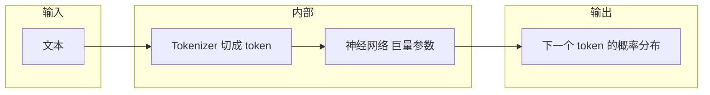

> 系列总目录与后续篇章规划见：[《LLM 底层原理 · 系列学习计划》](./llm-from-scratch-series-plan.html)。

本篇是「LLM 底层原理」系列的第一篇：先建立**术语对齐**和**整体地图**，再谈公式与架构。

## 本篇目标

读完你能做到：

1. 区分**语言模型（LM）**与**大语言模型（LLM）**在常见说法里的含义。
2. 说清楚**参数、token、上下文窗口**各指什么，以及它们如何影响「能记多长、模型有多大」。
3. 分清**训练**和**推理**在数据、目标、是否更新参数上的差别。
4. 用几句话向别人解释：**底层上 LLM 在做的核心计算是什么**。

## 知识结构（一张图）

- **LM**：给一段已出现的符号序列，建模「下一个符号（通常是 token）」的概率分布。
- **LLM**：把上述能力做到**规模很大**（参数多、训练数据多、上下文长），并在工程上可产品化（对话、工具调用等）。

## 核心术语

### Token 与词表（vocabulary）

模型**不直接读汉字/英文单词**，而是读 **token ID**（整数）。**Tokenizer** 把字符串切成 token；**词表**是「ID ↔ 子词/片段」的有限集合。同一句话，不同分词器切出来的 **token 个数**可以不同，所以「多少字」≠「多少 token」。

### 上下文窗口（context length）

模型每一步能同时「看到」的 token 序列长度上限，常记为最大长度 \(L_{\max}\)（如 4k、8k、128k）。超过窗口的内容要么截断，要么用别的机制处理（后续篇章会涉及）。**先记住：有上限，且通常越长越贵。**

### 参数（parameters）

神经网络里**可学习的权重**，规模常用 **B**（十亿）表示，如 7B、70B。粗略直觉：**参数多 → 表达能力与拟合能力更强**，但训练与部署成本更高（从 Day 2 起会接上「这些参数在哪些层里」）。

### 训练 vs 推理

| | **训练（training）** | **推理（inference）** |
|---|----------------------|------------------------|
| **目的** | 让参数拟合数据分布（学会预测） | 用已训练参数生成或续写 |
| **数据** | 大量文本等 | 通常是你的 prompt + 已生成部分 |
| **是否更新参数** | 是（反向传播更新） | 否（参数固定） |
| **算力特点** | 重、久、常要分布式 | 每次请求主要是前向；关心延迟与吞吐 |

**一句话**：训练是「调旋钮」，推理是「用调好后的旋钮算一遍」。

## 五句话讲清：LLM 在算什么？

1. **输入**是当前上下文里的一串 token（每个是一个整数 ID）。
2. **神经网络**（由巨量参数定义）把这串 token 变成内部表示，并综合上下文信息。
3. 在**自回归**设定下，模型输出的是 **「下一个 token」在整个词表上的概率分布**。
4. **训练**时，用真实出现的下一个 token 当「标准答案」，通过损失函数（常见为交叉熵）**调整参数**，使正确 token 的概率变大。
5. **推理**时，根据该分布**采样或选 argmax** 得到一个新 token，拼回上下文，再重复，直到结束符或长度上限 —— 这就是「逐字生成」的数学本质。

若只记一个公式骨架（细节在 Day 5 展开）：

\[
P(t_{n+1} \mid t_1,\ldots,t_n) \approx f_\theta(t_1,\ldots,t_n)
\]

其中 \(f_\theta\) 是参数为 \(\theta\) 的深度网络（本系列后面主要是 Transformer）。

## 自测题

**Q1.** 「70B 模型」里的 70B 指的是什么？和「上下文 8k」是同一类概念吗？

要点

70B 是<strong>参数量</strong>；8k 是<strong>上下文长度</strong>。一个管「模型有多大」，一个管「一次能看多长」。

**Q2.** 为什么同一句话在不同 tokenizer 下 token 数可能不同？

要点

分词规则与词表不同，子词切分粒度不同。

**Q3.** 推理阶段会不会用反向传播更新权重？

要点

标准产品推理<strong>不会</strong>；更新权重属于训练或单独的微调流程。

**Q4.** 训练和推理各主要「吃」什么数据？

要点

训练吃<strong>大规模语料</strong>以调参；推理主要吃<strong>用户 prompt + 已生成 token</strong>做前向计算。

**Q5.** 「LM 预测下一个 token」和「聊天里一整句回答」之间差了什么？

要点

底层仍是逐 token 预测；<strong>一整句</strong>是多步自回归拼接的结果，还可能叠加系统提示、微调、解码策略（Day 14 再细讲）。

## 延伸阅读（可选）

任意一篇公开模型的 **Model Card / 技术报告**：找 **Parameters、Context length、Tokenizer** 三节，对照本文术语，建立「报告里每一块在说什么」的对应关系。

## 下一篇

**Day 2** 从**线性层、非线性、损失与梯度下降**入手，让你知道那堆参数 \(\theta\) 具体长什么样、损失怎么推着它们动：[Day 2｜从函数到神经网络](./llm-from-scratch-day-02-nn-basics.html)。继续学习时也可打开 [系列计划](./llm-from-scratch-series-plan.html)。
