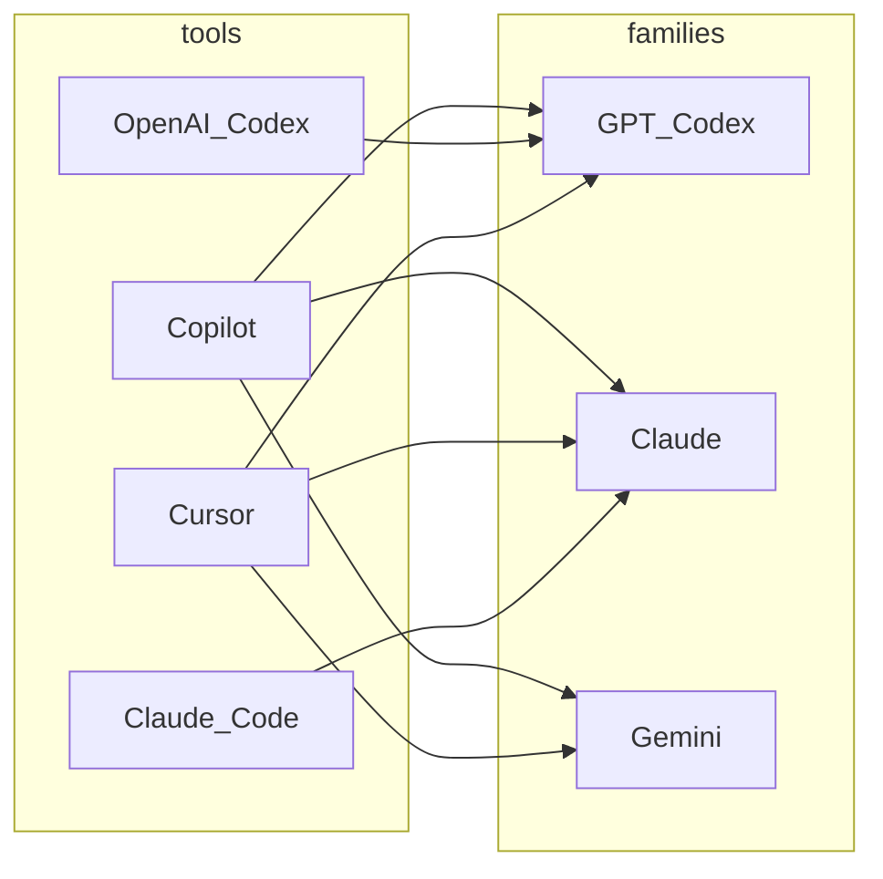

> **时效说明**：本文信息与链接整理于 **2026-04-16**。各厂商套餐名、模型档位、定价与文档路径变更频繁，**以官网与控制台为准**；若发现与当前产品不一致，请优先信任官方说明。

若更关心 **GPT / Claude / Gemini 各家族档位与国产替代**（而非 IDE、CLI 产品形态），见：[主流编程大模型怎么选](./mainstream-coding-llm-families.html)。**Codex Hooks 与 `codex review`** 见 [Codex Hook 与 Review](./codex-hook-review-guide.html)。**开发者四层能力** 见 [四层模型](./developer-four-layers-model.html)；**企业 Skills 治理** 见 [方法论](./enterprise-skills-governance-methodology.html)；Claude Code **会话内 `/loop`** 见 [loop 指南](./claude-code-loop-guide.html)。

写代码用的 AI，拆开来看就两件事：**在什么产品里干活**（工具），以及 **用哪些模型档位在算**（模型族）。此前一文把 **Codex** 只写成「模型名」、不写入工具侧——这与 **OpenAI 当前产品线**不符；下面按 [OpenAI Codex 官方开发者文档](https://developers.openai.com/codex/cli/) 等对正文做了校正。

---

## 先分清：CLI 和 Agent 不是同一层级

读下文里的 **Codex CLI**、**coding agent** 之前，先把两个词拆开——它们**不在一个维度**上：

| 概念 | 是什么 |
|------|--------|
| **CLI（Command Line Interface）** | **你在哪操作**：终端里敲命令、看文字输出。和网页、IDE 侧边栏一样，都是一种 **界面形态**（壳）。 |
| **Agent（编码场景里常指）** | **怎么干活**：能 **多步推进**、**调用工具**（读改文件、跑命令、检索再决策），而不是只回一段代码就结束。是一种 **行为方式 / 能力范式**（脑子怎么转）。 |

**关系**：**CLI** 回答「从哪进」；**Agent** 回答「会不会持续用工具把事做完」。二者可组合——**Codex CLI** = **用终端这个入口** 跑 **coding agent**；**IDE 里的 Agent 模式** = **用图形界面** 跑同类 agent。终端里也可以跑 **非 Agent** 的一次性脚本或传统命令，那就不是「Agent 体验」了。

**对比记忆**：**CLI / GUI** 是壳；**Agent / 单次补全或单次问答** 是交互深度。后文提到 **CLI** 时，默认指 **带 Agent 能力的产品形态**（如 OpenAI Codex CLI、Claude Code），除非另作说明。

---

## 「Codex」别混成一件事：产品 vs 模型名

今天至少应区分两层含义（名字相似，容易搅在一起）：

### 1）OpenAI **Codex 产品**（独立工具线）

这是 OpenAI 的 **编码 Agent 产品线**，典型包括：

| 形态 | 是什么 |
|------|--------|
| **Codex CLI** | 在终端本地跑的 **coding agent**（交互式 TUI），**Rust 实现、[开源](https://github.com/openai/codex)**；可对选定目录读、改、跑代码。 |
| **Codex IDE 扩展** | 在 **VS Code、Cursor 等 VS Code 兼容编辑器**里使用，与 **CLI 共用同一套 Agent**；支持聊天、改码、预览 diff、云端任务等（详见 [IDE 功能说明](https://developers.openai.com/codex/ide/features/)）。 |
| **Codex Cloud** | 把更大任务丢到云端跑、再在本地/IDE 里跟进与合入（扩展与 CLI 里均可衔接）。 |
| **与 ChatGPT 账号打通** | **ChatGPT Plus、Pro、Business、Edu、Enterprise** 等套餐包含 Codex 能力；计费与权益以 [OpenAI 定价说明](https://developers.openai.com/codex/pricing) 为准。 |

因此：**Codex 完全可以、也应该出现在「工具维度」里**——和「只在 Copilot 里选一个名叫 *Codex* 的模型」不是同一回事。

### 2）***GPT‑x‑Codex* 等模型档位**（名字里带 Codex）

在 **Codex 产品内部**可用 `/model` 等在 **GPT‑5.4、GPT‑5.3‑Codex** 等之间切换（见 [CLI 文档](https://developers.openai.com/codex/cli/)）。  
**GitHub Copilot** 的可选模型列表里也会出现 **带 Codex 字样的档位**——那是 **Copilot 侧集成**，与 **你是否安装 OpenAI Codex CLI/扩展** 无必然关系。

**一句话**：**左边选「用不用 OpenAI Codex 这一套 Agent」**；**右边选「用哪一族/哪一档模型」**——Copilot 里的 *Codex* 档位归 **模型族**；**OpenAI Codex CLI/扩展** 归 **工具**。

---

## 一、模型维度：常见模型族（枚举）

1. **OpenAI GPT / *Codex* 向档位**  
   通用 GPT 与 **编程 Agent 向**的命名档位（如 *GPT‑5.3‑Codex*）；既出现在 **OpenAI Codex 产品**里，也出现在 **GitHub Copilot**、**Cursor** 等的可选模型中。

2. **Anthropic Claude 系**  
   Sonnet / Opus / Haiku 等（命名会迭代）。

3. **Google Gemini 系**  
   在 **Copilot 部分客户端**、**Cursor** 等作为选项出现。

4. **其它闭源集成**  
   如 Copilot 中曾出现的 **xAI Grok**、轻量小模型等，以当期列表为准。

5. **BYOK**  
   在 **Cursor** 等宿主用 **自己的 API Key**；与 **ChatGPT 套餐内含的 Codex** 计费路径不同。

---

## 二、工具维度：常见宿主（你在哪写）

| 关注点 | 说明 |
|--------|------|
| **挂在哪** | 插件（Copilot）、**OpenAI Codex（CLI + IDE 扩展）**、独立编辑器（Cursor 自带 AI）、终端 CLI（Claude Code）。 |
| **交互形态** | 补全、Chat、Agent、MCP、云端委派、审批模式等。 |

### GitHub Copilot

**形态**：**VS Code / JetBrains / Vim 等插件**，绑 **GitHub** 与企业管理。  
**要点**：多模型可选（含 **OpenAI 侧带 Codex 字样的档位** 等），但 **不是** OpenAI Codex 产品本体。

### OpenAI Codex（CLI / IDE 扩展）

**形态**：**终端 `codex`** + **编辑器扩展**（与 CLI **同一 Agent**）；可 **云端任务**、**MCP**、子 Agent、网页搜索、审批模式等（以官方文档为准）。  
**适合**：已买 **ChatGPT 付费档**、希望 **OpenAI 官方 Agent 栈**贯穿终端与 IDE 的人。  
**要点**：与 **Copilot 是否订阅** 无绑定；与 **Cursor 自带 Composer** 可并存，是否同时用取决于团队规范。

### Cursor

**形态**：**独立编辑器** + 自带 Chat / Composer / Agent；**也可装 OpenAI Codex 扩展**（官方列在兼容编辑器中）。  
**适合**：要强 **多模型 / BYOK**、或 **编辑器原生 Agent + 可选 Codex 扩展** 的组合。  
**要点**：**「Cursor 订阅」与「ChatGPT 含 Codex」** 是两条账单线，别混。

### Claude Code

**形态**：**终端 CLI** + Agent，**MCP、Skills**。  
**适合**：**Anthropic / Claude** 为主、要终端长会话改仓库。  
**要点**：与 OpenAI Codex **厂商不同**；选型常是 **OpenAI 栈 vs Anthropic 栈** 之一。

**JetBrains AI / Junie**：不换 IDE 的常见选项，此处不展开。

---

## 三、工具 × 模型：二维关系

### 3.1 矩阵（概括）

**●** = 常见可选或产品主推；**—** = 通常不提供。  
**GPT / Codex 列**：泛指 OpenAI 侧 GPT 与 *Codex* 向档位（具体名称随时间变）。

| 工具 / 产品 | GPT / Codex 向 | Claude 系 | Gemini 系 | BYOK |
|-------------|:---:|:---:|:---:|:---:|
| **GitHub Copilot** | ● | ● | ● | 一般否 |
| **OpenAI Codex（CLI/扩展）** | ● | — | — | 一般否（随 ChatGPT 等套餐） |
| **Cursor（自带 AI）** | ● | ● | ● | 是 |
| **Claude Code** | — | ● | — | 非典型 |

### 3.2 关系图（工具 → 模型族）

> **怎么读**：**OpenAI_Codex** 是 **OpenAI 的 Agent 产品**，主要消耗 **GPT / Codex 向** 档位；**Copilot** 与 **Cursor** 也可分别接 **Claude / Gemini** 等第三方族。**Cursor** 若再装 Codex 扩展，相当于在 **同一编辑器**里叠两套能力，矩阵里仍用一行 **Cursor** 概括其自带 AI。

---

## 四、两条线怎么选（很短）

1. **先定厂商栈**：偏 **OpenAI + ChatGPT 账单** → 看 **OpenAI Codex（CLI/扩展）** 是否覆盖你；偏 **GitHub 一体** → **Copilot**；偏 **Anthropic** → **Claude Code**。  
2. **再定编辑器**：死守 VS Code 插件 → **Copilot** 或 **VS Code + Codex 扩展**；接受 **Cursor** → 比较 **自带 Agent** 与 **+Codex 扩展** 是否重复投资。  
3. **核对文档**：模型名与套餐变得快，以 **OpenAI / GitHub / Cursor / Anthropic** 当期说明为准。

---

## 五、官方文档

- [OpenAI Codex CLI](https://developers.openai.com/codex/cli/)  
- [OpenAI Codex IDE 扩展](https://developers.openai.com/codex/ide/features/)  
- [GitHub Copilot：Model comparison](https://docs.github.com/en/copilot/reference/ai-models/model-comparison)  
- [Cursor 文档](https://cursor.com/docs)  
- [Claude Code 文档](https://code.claude.com/docs)  

---

## 小结

**CLI** 是界面形态，**Agent** 是多步用工具干活的方式；**Codex CLI** 之类是「终端壳 + Agent」，不要和「一个叫 CLI 的模型」混谈。  
此前把 **Codex** 只写成 **Copilot/Cursor 里的模型档位**，忽略了 OpenAI 已把 **Codex** 做成 **CLI + IDE 扩展 + 云端** 的 **独立产品线**——这是本文要订正的核心。选型时：**工具行**是否包含 **OpenAI Codex**；**模型列**里的 *Codex* 字样，要分清是 **Copilot 里选的档位** 还是 **Codex 产品内切换的模型**。
