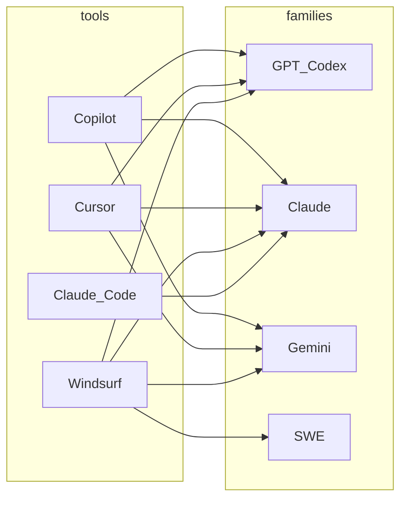

写代码用的 AI，拆开来看就两件事：**用什么工具**（插件 / 编辑器 / 终端），以及 **用哪类模型在算**。下面只谈几款高频产品；**具体模型名与是否可选以各产品当前控制台 / 文档为准**，下文的枚举与矩阵是**分桶 + 概括**，方便你做二维对照。

---

## 一、模型维度：常见模型族（枚举）

编程工具里出现的模型，可按「谁家的、干什么活」粗分为下面几类（同类里还会有 **Fast / Pro / Thinking** 等档位，名称随版本更替）：

1. **OpenAI GPT / Codex 系**  
   通用 GPT 与面向 **代码 / Agent** 的 Codex 向模型；常见于补全、多步改代码、部分产品默认档。

2. **Anthropic Claude 系**  
   **Sonnet / Opus / Haiku** 等档位（命名会迭代）；长上下文与多文件任务里常被列为可选或默认强模。

3. **Google Gemini 系**  
   在 **Copilot 部分客户端**、**Cursor / Windsurf** 等里作为可选模型；多模态 / 长文场景部分产品会推荐。

4. **厂商自研代码模型**  
   典型例子是 **Windsurf 的 SWE（如 SWE-1.x）**：与产品一块优化延迟和「工程流」；**不开放给其他工具**当通用 API。

5. **其他闭源商用模型（随工具集成变化）**  
   例如部分时期 Copilot 中的 **xAI Grok**、**轻量专用小模型**（用于低延迟补全）等；是否出现完全取决于 **GitHub / 工具方** 当期集成列表。

6. **BYOK 接入的任意兼容端点**  
   不算单一「族」，但算一种 **模型来源维度**：你在 **Cursor / Windsurf** 等里填 **自己的 API Key**，底层可能是 OpenAI 兼容网关、Anthropic、国产云厂商等——**账单与数据策略**跟工具订阅分离，需自己评估。

---

## 二、工具维度：四款产品在解决什么

| 关注点 | 说明 |
|--------|------|
| **挂在哪** | VS Code + 插件、独立编辑器（Cursor / Windsurf）、终端 CLI（Claude Code）。 |
| **交互形态** | 补全、Chat、多文件 Agent、MCP / 规则。 |
| **生态与治理** | 是否绑 GitHub、企业审计、能否接受第二套编辑器。 |

### GitHub Copilot

**形态**：**VS Code / JetBrains / Vim 等插件** + Chat / Agent，与 **GitHub** 账户与企业策略一体。  
**适合**：少换工具、重度 GitHub、要成熟治理与用量模型。  
**优劣**：生态稳、**多模型切换**成熟；高阶能力常与 **套餐 / 高级请求** 挂钩。

### Cursor

**形态**：**独立编辑器** + Composer / Agent，强调按项目改多文件。  
**适合**：要强 Agent、要 Rules、要 **多模型 + 自有 Key**。  
**优劣**：迭代快；**额度 / 积分** 要算账，大改需团队审查习惯。

### Windsurf（Cascade）

**形态**：独立编辑器 + **Cascade** + Tab；**SWE 自研** 与第三方模型并存。  
**适合**：与 Cursor 同类，但看重 **自研低延迟** 或 **BYOK**。  
**优劣**：模型下拉通常全；与 Cursor 需实测二选一。

### Claude Code

**形态**：**终端 CLI** + Agent，**MCP、Skills** 丰富。  
**适合**：命令行长会话、代理式改仓库、Anthropic 栈为主。  
**优劣**：心智清晰；模型侧 **以 Claude 为主**，非「IDE 里点按钮」路径。

**顺带**：**JetBrains AI / Junie** 属于「不换 IDE」路线，由 JetBrains 对接多家模型，此处不单独占行。

---

## 三、工具 × 模型：二维关系

### 3.1 矩阵（概括）

表中 **●** 表示该产品在**典型配置**下，用户常能**在界面里选到**或官方主推的集成（不含 BYOK 自定义后端）；**—** 表示一般**不作为该产品的一等公民**；**BYOK** 列表示是否普遍支持 **自带 API Key** 接模型。

| 工具 | GPT / Codex 系 | Claude 系 | Gemini 系 | 自研 SWE 等 | BYOK |
|------|:---:|:---:|:---:|:---:|:---:|
| **GitHub Copilot** | ● | ● | ● | — | 一般否 |
| **Cursor** | ● | ● | ● | — | 是 |
| **Windsurf** | ● | ● | ● | ● | 是 |
| **Claude Code** | — | ● | — | — | 非典型 |

**说明**：Claude Code 的「模型」随 **Anthropic 订阅与产品策略** 走，通常不把它理解成「多族模型超市」；Copilot 的 **Grok / 小模型** 等未单独拆列，归入「其他集成」类，以 [官方模型页](https://docs.github.com/en/copilot/reference/ai-models/model-comparison) 为准。

### 3.2 关系图（工具 → 常规模型族）

下图与上表一致：**箭头表示「该产品侧常见可选或主推」**；Mermaid 里用 ASCII 节点 id，避免渲染失败。

> **怎么读**：左侧是 **工具**，右侧是 **模型族**；一条边表示「该工具里通常能玩到这一类」。**BYOK** 时，Cursor / Windsurf 右侧实际连到的可能是表中未画的其它端点，图上不单独展开。

---

## 四、两条线一起怎么选（很短）

1. **先定工具**：不换编辑器 → **Copilot**（或 JetBrains 内置）；要强新编辑器 Agent → **Cursor / Windsurf** 二选一实测；要终端代理 → **Claude Code**。  
2. **再定模型**：在已选工具内用 **默认 / Auto** 起步；要 **Claude-only** 心智 → **Claude Code** 或 Cursor/Windsurf 里锁 Claude；要 **自研 SWE** 体验 → 优先看 **Windsurf**。  
3. **定期核对**：模型列表变化快，以 **各产品 Settings + 官方文档** 为准。

---

## 五、官方文档（核对模型用）

- [GitHub Copilot：Model comparison](https://docs.github.com/en/copilot/reference/ai-models/model-comparison)  
- [Cursor 文档](https://cursor.com/docs)  
- [Windsurf Models](https://docs.windsurf.com/windsurf/models)  
- [Claude Code 文档](https://code.claude.com/docs)  

---

## 小结

**模型维度**先按族枚举，再和 **工具维度**做一张 **矩阵 + 关系图**，选型时就是：我在哪写（工具）× 我想用哪类脑子（模型族）× 要不要 BYOK。若你只有一条硬约束（例如必须 Claude、或必须留在 VS Code），可以从矩阵里直接划掉不可行格，再剩 1～2 个组合实测即可。
