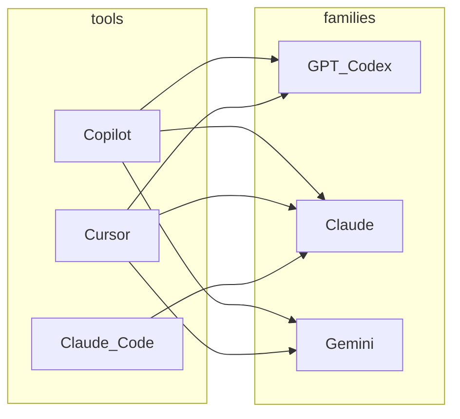

写代码用的 AI，拆开来看就两件事：**在什么产品里干活**（工具 / 宿主），以及 **背后用哪类模型**（GPT、Codex 向、Claude、Gemini……）。下文以国内开发者**最常碰到的三条路径**为主：**GitHub Copilot、Cursor、Claude Code**；**具体模型名以各产品当期文档为准**。

---

## 「工具」里为啥没有单独一行 Codex？

**Codex** 一般指 **OpenAI 的编程向模型 / 能力线**（名称随代际会变），它出现在：

- **GitHub Copilot** 里的可选模型（如各类 *Codex* / GPT 编程向档位）  
- **Cursor** 里选的 OpenAI / Codex 向模型  
- **ChatGPT / OpenAI 网页或客户端** 里的 coding、Agent 能力（若你主要在对话里写代码）

也就是说：**Codex 是「模型族」这一维上的标签**，不是和「装 VS Code 插件」同级的另一个安装包。本文在 **模型族**里用 **「GPT / Codex 系」** 这一列覆盖它；**工具**列写的是你**打开哪个产品界面**。

若你几乎只在 **ChatGPT** 里贴代码、跑生成，可以把 **「OpenAI ChatGPT（网页/客户端）」** 理解成第四种宿主——本文不单独展开矩阵，避免和 IDE 赛道混成一张表；你心里把它当作 **「对话型宿主 + 背后 OpenAI 模型」** 即可。

---

## 一、模型维度：常见模型族（枚举）

1. **OpenAI GPT / Codex 系**  
   通用 GPT 与 **编程 / Agent 向**的 Codex 品牌或同类档位；**Copilot、Cursor** 里最常见的一类选项。

2. **Anthropic Claude 系**  
   Sonnet / Opus / Haiku 等档位（命名会迭代）；长上下文、多文件任务里常被列为强选项。

3. **Google Gemini 系**  
   在 **Copilot 部分客户端**、**Cursor** 等作为可选模型出现。

4. **其它闭源集成（随工具变化）**  
   如部分时期 Copilot 里的 **xAI Grok**、**轻量小模型**（低延迟补全）等，以官方列表为准。

5. **少数产品绑定的自研代码模型**  
   某些**商业编辑器**会推自家模型（海外讨论里偶尔出现）；**认知度因地区差异很大**，对大多数人**不是必选项**，下文矩阵不单独占列，避免喧宾夺主。

6. **BYOK（自带 API Key）**  
   在 **Cursor** 等里接自己的 OpenAI / Anthropic 等账单；底层模型族仍落回上面几类。

---

## 二、工具维度：三款主流宿主（你在哪写）

| 关注点 | 说明 |
|--------|------|
| **挂在哪** | VS Code + 插件、独立编辑器（Cursor）、终端 CLI（Claude Code）。 |
| **交互形态** | 补全、Chat、多文件 Agent、MCP / 规则。 |
| **生态与治理** | 是否绑 GitHub、企业审计、能否接受第二套编辑器。 |

### GitHub Copilot

**形态**：**VS Code / JetBrains / Vim 等插件** + Chat / Agent，与 **GitHub** 一体。  
**适合**：少换工具、重度 GitHub、要成熟治理。  
**优劣**：稳、**多模型**（含 **GPT/Codex 向**、Claude、Gemini 等，以官方为准）；高阶常与 **套餐 / 高级请求** 挂钩。

### Cursor

**形态**：**独立编辑器** + Composer / Agent。  
**适合**：要强 Agent、Rules、**多模型 + BYOK**。  
**优劣**：迭代快；**额度 / 积分**要算账。

### Claude Code

**形态**：**终端 CLI** + Agent，**MCP、Skills** 多。  
**适合**：命令行、长会话改仓库、**以 Claude 为主**。  
**优劣**：心智清晰；**不是**传统 IDE 里点按钮的路径。

**JetBrains AI / Junie**：不换 IDE 的常见选项，由 JetBrains 对接多家模型，此处不展开。

### 可选了解：同赛道的其它编辑器（非必知）

海外技术社区里，常与 Cursor 并列被提到的还有 **Windsurf**（与 Codeium 同源）等**另一类商业编辑器**。若你**完全没听过、也无需求**，可以**直接忽略**——不构成「必须二选一」；**本文不做推荐排序**，只保留三条主路径，减少信息噪音。

---

## 三、工具 × 模型：二维关系

### 3.1 矩阵（三款主流宿主）

**●** = 界面里常见可选或主推；**—** = 一般不作为一等公民。  
**GPT / Codex 系** 列已包含你在 Copilot / Cursor 里看到的 **Codex 向**档位。

| 工具 | GPT / Codex 系 | Claude 系 | Gemini 系 | BYOK |
|------|:---:|:---:|:---:|:---:|
| **GitHub Copilot** | ● | ● | ● | 一般否 |
| **Cursor** | ● | ● | ● | 是 |
| **Claude Code** | — | ● | — | 非典型 |

### 3.2 关系图（工具 → 模型族）

> **怎么读**：**Codex** 落在右侧 **GPT_Codex** 这一桶里，由 **Copilot / Cursor** 接入，而不是左侧单独多一个「Codex 工具」节点。**BYOK** 时 Cursor 还可接其它端点，图上不展开。

---

## 四、两条线怎么选（很短）

1. **先定宿主**：留在 VS Code → **Copilot**；接受新编辑器 → **Cursor**；要终端 Agent → **Claude Code**。  
2. **再定模型**：在宿主内 **默认 / Auto** 起步；要强 **Codex 向** → 在 **Copilot 或 Cursor** 的模型列表里选（名称以当期为准）；要 **Claude-only** → **Claude Code** 或 Cursor 里锁 Claude。  
3. **定期核对**：列表变化快，以 **Settings + 官方文档** 为准。

---

## 五、官方文档

- [GitHub Copilot：Model comparison](https://docs.github.com/en/copilot/reference/ai-models/model-comparison)（可看到 **GPT‑Codex 向**等条目）  
- [Cursor 文档](https://cursor.com/docs)  
- [Claude Code 文档](https://code.claude.com/docs)  

---

## 小结

**Codex** 在 **模型维度**里，通过 **GPT / Codex 系** 这一列体现；**工具维度**写的是 **Copilot / Cursor / Claude Code** 三个常见宿主，避免把「模型品牌」和「打开哪个软件」混成一张表。若你对海外小众编辑器无感，**只盯这三款 + 必要时 ChatGPT** 就足够做决策。
