## 什么是移动支付？

移动支付（Mobile Payment）是指使用移动设备（智能手机、智能手表等）完成支付交易的方式。Apple Pay 和 Google Pay 是目前全球最主流的两大移动支付平台。

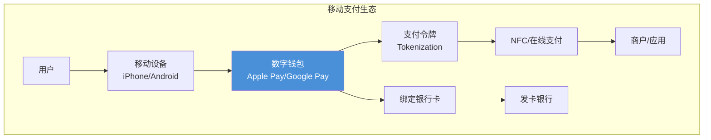

## 两大平台概览

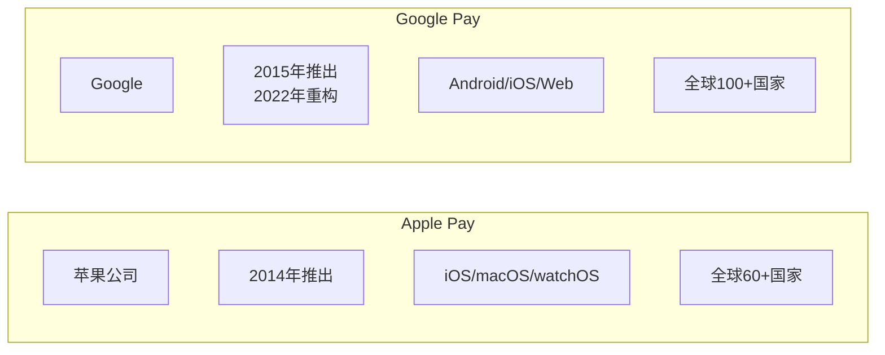

## Apple Pay

### 平台档案

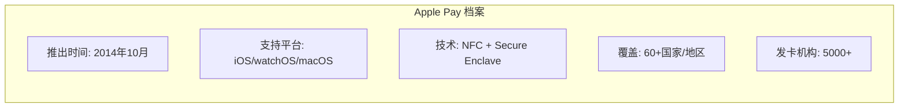

### 发展历程

| 年份 | 里程碑 |
|------|--------|
| 2014 | 在美国推出，支持 iPhone 6 |
| 2015 | 扩展到英国，支持 Apple Watch |
| 2016 | 进入中国、日本、澳大利亚 |
| 2017 | 支持 P2P 转账（Apple Pay Cash） |
| 2018 | 支持 Transit（公共交通） |
| 2020 | 推出 Apple Card |
| 2022 | 支持 Tap to Pay（无终端收款） |
| 2024 | 全球交易量持续增长 |

### 技术架构

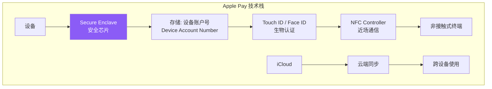

### 安全机制

```
Apple Pay 安全流程：
┌─────────────────────────────────────────────────────────────┐
│ 1. 添加卡片                                                 │
│    银行卡信息 → Apple → 发卡银行验证                         │
│                    ↓                                        │
│    生成设备唯一: Device Account Number (令牌)               │
│                    ↓                                        │
│    存储于 Secure Enclave（硬件级安全）                       │
├─────────────────────────────────────────────────────────────┤
│ 2. 支付时                                                   │
│    Face ID/Touch ID 认证 → 生成动态安全码                   │
│                    ↓                                        │
│    设备账户号 + 动态安全码 → 发送给终端                      │
│                    ↓                                        │
│    卡组织验证令牌 → 发卡银行授权                             │
├─────────────────────────────────────────────────────────────┤
│ ✗ 真实卡号永不存储在设备或苹果服务器上                       │
│ ✗ 真实卡号永不共享给商户                                    │
└─────────────────────────────────────────────────────────────┘
```

### 支持的支付场景

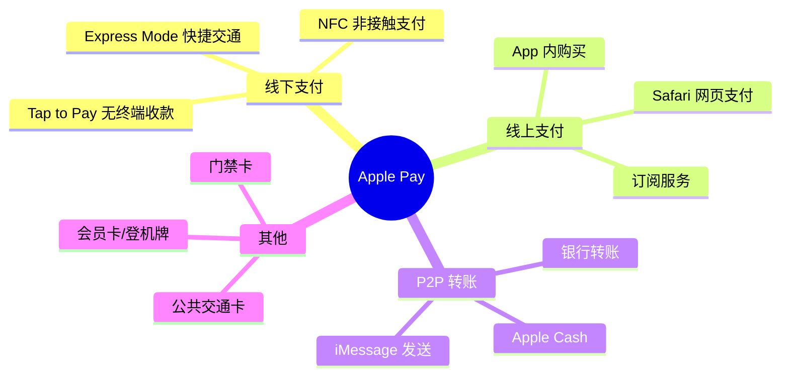

### 设备要求

| 功能 | iPhone | Apple Watch | iPad | Mac |
|------|--------|-------------|------|-----|
| 线下 NFC 支付 | iPhone 6+ | Series 1+ | ✗ | ✗ |
| App 内支付 | iPhone 6+ | ✓ | iPad Pro/Air 2+ | 2012+ |
| 网页支付 | ✓ | ✓ | ✓ | ✓ |
| Express Mode | iPhone XR+ | Series 3+ | ✗ | ✗ |

## Google Pay

### 平台档案

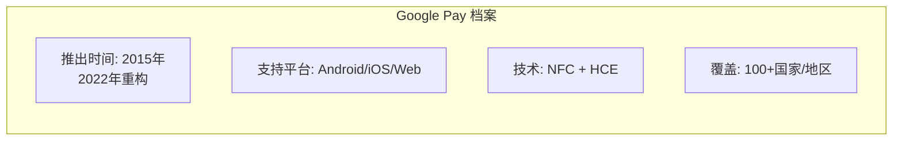

### 发展历程

| 年份 | 里程碑 |
|------|--------|
| 2011 | 推出 Google Wallet（数字钱包） |
| 2015 | 推出 Android Pay |
| 2018 | 合并为 Google Pay |
| 2020 | 在印度推出 Google Pay（Tez） |
| 2022 | 重构为 Google Wallet |
| 2023 | 支持 Click to Pay |
| 2024 | 全球扩展，支持更多银行卡 |

### Google Pay vs Google Wallet

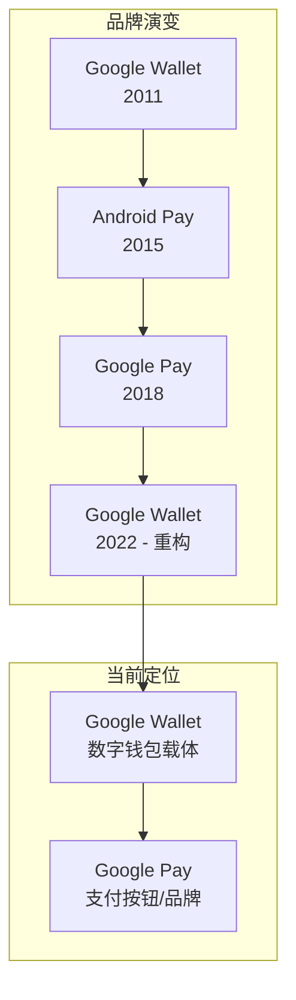

### 技术架构

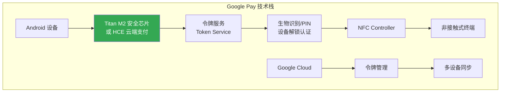

### 安全机制

```
Google Pay 安全流程：
┌─────────────────────────────────────────────────────────────┐
│ 1. 添加卡片                                                 │
│    银行卡信息 → Google → 卡组织令牌服务                      │
│                    ↓                                        │
│    生成: 虚拟卡号 (Token)                                    │
│                    ↓                                        │
│    存储于设备安全存储或云端（HCE）                           │
├─────────────────────────────────────────────────────────────┤
│ 2. 支付时                                                   │
│    设备解锁 → 生成一次性密钥 (Cryptogram)                    │
│                    ↓                                        │
│    虚拟卡号 + 密钥 → 发送给终端                              │
│                    ↓                                        │
│    卡组织验证 → 发卡银行授权                                 │
├─────────────────────────────────────────────────────────────┤
│ ✗ 真实卡号不存储在设备上                                     │
│ ✗ 真实卡号不共享给商户                                      │
│ ✓ 支持远程锁定/擦除设备                                     │
└─────────────────────────────────────────────────────────────┘
```

### 支持的支付场景

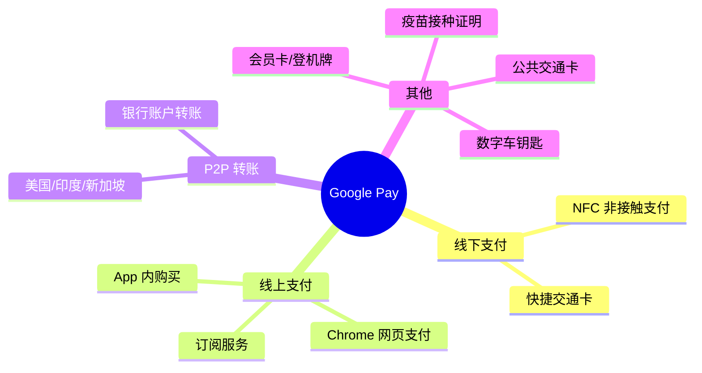

### 设备要求

| 功能 | Android | iOS | Web |
|------|---------|-----|-----|
| NFC 线下支付 | Android 5.0+ NFC | ✗ | ✗ |
| App 内支付 | Android 5.0+ | iOS 12+ | ✓ |
| 网页支付 | Chrome | Safari/Chrome | ✓ |
| 快捷交通 | 部分设备 | ✗ | ✗ |

## 技术对比

### 核心技术差异

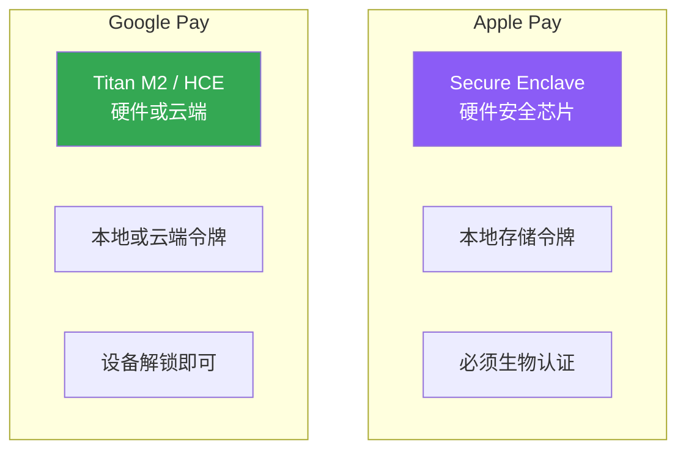

### 安全对比

| 特性 | Apple Pay | Google Pay |
|------|-----------|------------|
| 令牌化 | ✓ 设备唯一令牌 | ✓ 虚拟卡号 |
| 硬件安全 | Secure Enclave | Titan M2 / HCE |
| 认证方式 | Face ID/Touch ID/密码 | 指纹/面部/PIN/密码 |
| 令牌存储 | 仅本地 | 本地或云端 |
| 远程锁定 | 查找我的 iPhone | 查找我的设备 |
| 卡片数量限制 | 8-12张 | 无明确限制 |

### 用户体验对比

| 方面 | Apple Pay | Google Pay |
|------|-----------|------------|
| 添加卡片 | 相机扫描 + 手动 | 相机扫描 + 手动 |
| 默认卡 | 自动选择上次 | 可设置默认 |
| 支付触发 | 双击侧边键 | 解锁即可 |
| 交易历史 | 钱包 App 内 | Google Pay App |
| 通知 | 即时推送 | 即时推送 |

### 地区支持对比

```mermaid
xychart-beta
    title "两大平台地区支持数量（估算）"
    x-axis ["北美", "欧洲", "亚太", "中东", "拉美", "非洲"]
    y-axis "支持国家数" 0 --> 40
    bar [3, 32, 18, 8, 5, 3]
    bar [3, 38, 25, 12, 8, 5]
```

## 开发者集成

### Apple Pay 集成

```swift
// iOS Apple Pay 集成示例
import PassKit

class PaymentViewController: UIViewController, PKPaymentAuthorizationViewControllerDelegate {

    func setupApplePay() {
        // 检查设备是否支持 Apple Pay
        let networks: [PKPaymentNetwork] = [.visa, .masterCard, .amex]
        if PKPaymentAuthorizationViewController.canMakePayments(usingNetworks: networks) {
            // 可以使用 Apple Pay
        }
    }

    func startPayment() {
        let request = PKPaymentRequest()
        request.merchantIdentifier = "merchant.your.id"
        request.supportedNetworks = [.visa, .masterCard, .amex]
        request.merchantCapabilities = .capability3DS
        request.countryCode = "US"
        request.currencyCode = "USD"

        request.paymentSummaryItems = [
            PKPaymentSummaryItem(label: "商品", amount: NSDecimalNumber(value: 99.99))
        ]

        let controller = PKPaymentAuthorizationViewController(paymentRequest: request)
        controller?.delegate = self
        present(controller!, animated: true)
    }

    func paymentAuthorizationController(_ controller: PKPaymentAuthorizationViewController,
                                        didAuthorizePayment payment: PKPayment,
                                        completion: @escaping (PKPaymentAuthorizationStatus) -> Void) {
        // 处理支付令牌
        let token = payment.token
        // 发送到服务器进行解密和验证
        completion(.success)
    }
}
```

### Google Pay 集成

```kotlin
// Android Google Pay 集成示例
class PaymentActivity : AppCompatActivity() {

    private val paymentsClient: PaymentsClient by lazy {
        Wallet.getPaymentsClient(
            this,
            Wallet.WalletOptions.Builder()
                .setEnvironment(WalletConstants.ENVIRONMENT_TEST)
                .build()
        )
    }

    private fun isGooglePayAvailable(): Task<Boolean> {
        val request = IsReadyToPayRequest.newBuilder()
            .addAllowedPaymentMethod(WalletConstants.PAYMENT_METHOD_CARD)
            .addAllowedPaymentMethod(WalletConstants.PAYMENT_METHOD_TOKENIZED_CARD)
            .build()
        return paymentsClient.isReadyToPay(request)
    }

    private fun startPayment() {
        val request = PaymentDataRequest.newBuilder()
            .setTransactionInfo(
                TransactionInfo.newBuilder()
                    .setTotalPrice("99.99")
                    .setTotalPriceStatus(WalletConstants.TOTAL_PRICE_STATUS_FINAL)
                    .setCurrencyCode("USD")
                    .build()
            )
            .setMerchantInfo(
                MerchantInfo.newBuilder()
                    .setMerchantName("Your Store")
                    .build()
            )
            .setAllowedPaymentMethods(
                listOf(
                    PaymentMethodTokenizationParameters.newBuilder()
                        .setPaymentMethodTokenizationType(
                            WalletConstants.PAYMENT_METHOD_TOKENIZATION_TYPE_PAYMENT_GATEWAY
                        )
                        .addParameter("gateway", "stripe")
                        .addParameter("stripe:publishableKey", "pk_test_xxx")
                        .build()
                )
            )
            .build()

        AutoResolveHelper.resolveTask(
            paymentsClient.loadPaymentData(request),
            this,
            LOAD_PAYMENT_DATA_REQUEST_CODE
        )
    }
}
```

### Web 集成对比

```javascript
// Apple Pay on the Web
if (window.ApplePaySession && ApplePaySession.canMakePayments()) {
    const request = {
        countryCode: 'US',
        currencyCode: 'USD',
        supportedNetworks: ['visa', 'masterCard', 'amex'],
        merchantCapabilities: ['supports3DS'],
        total: { label: 'Your Store', amount: '99.99' }
    };

    const session = new ApplePaySession(3, request);
    session.onpaymentauthorized = (event) => {
        const payment = event.payment;
        // 处理支付
        session.completePayment(ApplePaySession.STATUS_SUCCESS);
    };
    session.begin();
}

// Google Pay on the Web
const googlePayClient = new google.payments.api.PaymentsClient({ environment: 'TEST' });

const paymentDataRequest = {
    apiVersion: 2,
    apiVersionMinor: 0,
    allowedPaymentMethods: [{
        type: 'CARD',
        parameters: {
            allowedAuthMethods: ['PAN_ONLY', 'CRYPTOGRAM_3DS'],
            allowedCardNetworks: ['VISA', 'MASTERCARD', 'AMEX']
        },
        tokenizationSpecification: {
            type: 'PAYMENT_GATEWAY',
            parameters: { gateway: 'stripe', 'stripe:publishableKey': 'pk_test_xxx' }
        }
    }],
    merchantInfo: { merchantName: 'Your Store' },
    transactionInfo: {
        totalPriceStatus: 'FINAL',
        totalPrice: '99.99',
        currencyCode: 'USD'
    }
};

googlePayClient.loadPaymentData(paymentDataRequest).then((paymentData) => {
    // 处理支付
});
```

## 商户接入指南

### 接入流程

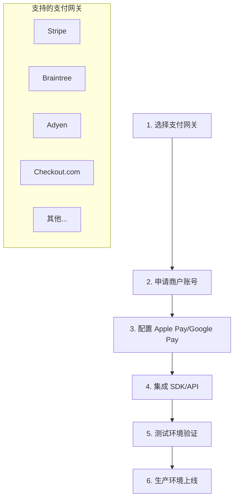

### 费用结构

| 费用项 | Apple Pay | Google Pay |
|--------|-----------|------------|
| 平台费用 | 免费 | 免费 |
| 交易手续费 | 发卡行/收单行收取 | 发卡行/收单行收取 |
| 商户接入 | 通过支付网关 | 通过支付网关 |
| 额外成本 | 无 | 无 |

> 注意：Apple Pay 和 Google Pay 本身不收取额外费用，商户仍需支付正常的银行卡交易手续费。

### 测试环境

| 平台 | 测试环境 | 测试卡号 |
|------|----------|----------|
| Apple Pay | Sandbox | Apple 提供的测试卡 |
| Google Pay | TEST environment | Google 提供的测试卡 |

## 中国市场现状

### Apple Pay 在中国

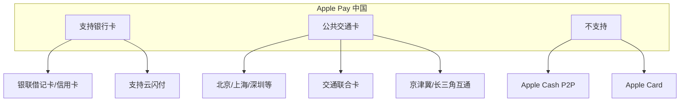

### Google Pay 在中国

```
Google Pay 中国现状：
┌─────────────────────────────────────────────┐
│ ✗ Google Play 服务不可用                    │
│ ✗ 无法添加中国大陆银行卡                    │
│ ✗ 无法进行线下 NFC 支付                     │
│ ✓ 仅可在出境时使用（已添加的境外卡）        │
└─────────────────────────────────────────────┘
```

### 中国替代方案

| 场景 | 中国方案 |
|------|----------|
| 移动支付 | 微信支付、支付宝、云闪付 |
| NFC 支付 | 云闪付闪付、各银行 App |
| 公交地铁 | 各城市交通卡 App、微信/支付宝乘车码 |
| 数字钱包 | 数字人民币 e-CNY |

## 安全最佳实践

### 对用户

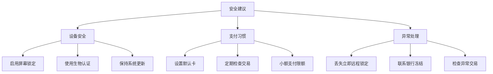

### 对商户

| 安全要求 | 说明 |
|----------|------|
| PCI DSS 合规 | 处理卡号需遵守 PCI DSS |
| 3-D Secure | 启用 3DS 2.0 强认证 |
| 令牌验证 | 正确验证支付令牌 |
| 日志审计 | 记录交易日志 |
| 欺诈监控 | 实时风控系统 |

## 未来趋势

### 技术演进

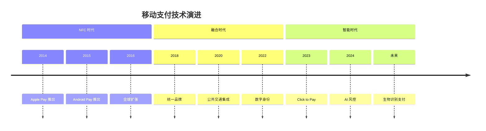

### 新兴功能

| 功能 | Apple Pay | Google Pay | 状态 |
|------|-----------|------------|------|
| 数字车钥匙 | ✓ | ✓ | 部分车型 |
| 数字身份证 | ✓（美国部分州） | ✓ | 推进中 |
| 疫苗证明 | ✓ | ✓ | 多国支持 |
| Click to Pay | ✓ | ✓ | 推进中 |
| Buy Now Pay Later | ✓（Apple Pay Later） | ✓（Affirm 集成） | 部分市场 |

## 推荐阅读

### 官方文档

| 资源 | 链接 |
|------|------|
| Apple Pay 开发者文档 | [developer.apple.com/apple-pay](https://developer.apple.com/apple-pay/) |
| Apple Pay 商户指南 | [developer.apple.com/apple-pay/implementation](https://developer.apple.com/apple-pay/implementation/) |
| Google Pay 商户中心 | [pay.google.com/business](https://pay.google.com/business) |
| Google Pay 开发者文档 | [developers.google.com/pay/api](https://developers.google.com/pay/api) |

### 技术规范

| 规范 | 说明 |
|------|------|
| EMVCo Tokenization | 支付令牌化规范 |
| 3-D Secure 2.0 | 强客户认证规范 |
| PCI DSS | 支付卡数据安全标准 |
| NFC Forum | NFC 技术规范 |

### 相关文章

- [国际七大银行卡组织全面解析](/posts/international-card-schemes.html)
- [PCI DSS 支付卡行业数据安全标准入门指南](/posts/pci-dss-overview.html)
- [PCI DSS 技术实现指南](/posts/pci-dss-implementation.html)

## 总结

### 选择建议

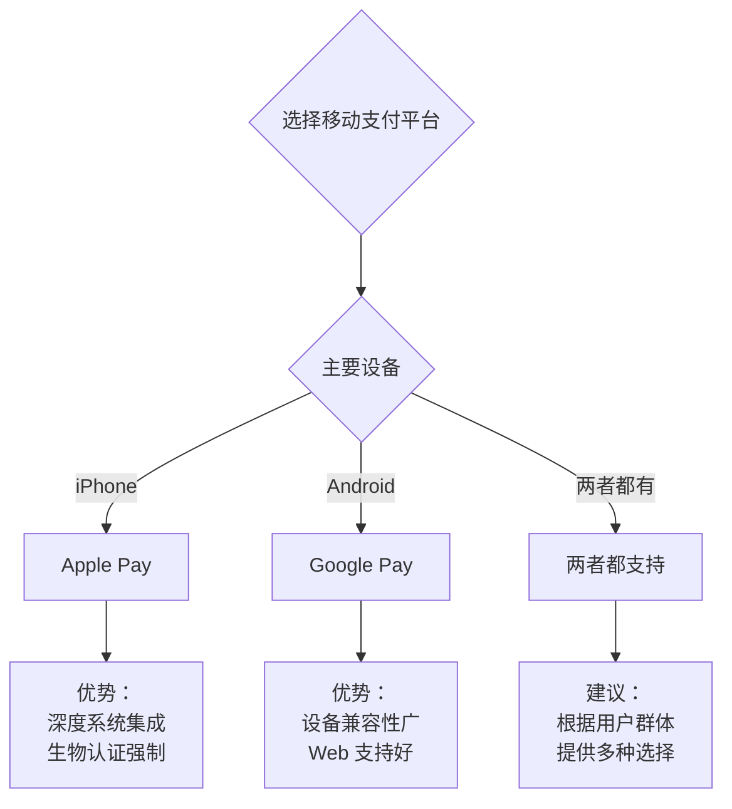

### 核心要点

| 方面 | 要点 |
|------|------|
| 安全性 | 两者都采用令牌化技术，真实卡号不暴露 |
| 便捷性 | NFC 支付比刷卡更快，无需携带实体卡 |
| 覆盖面 | 全球主要市场均支持，商户接受度高 |
| 开发成本 | 通过支付网关集成，成本可控 |
| 用户体验 | 原生体验优于第三方支付 |

> 移动支付已成为现代支付的标准配置，建议商户同时支持 Apple Pay 和 Google Pay，覆盖最广泛的用户群体。

---

**相关文章**：
- [国际七大银行卡组织全面解析](/posts/international-card-schemes.html)
- [PCI DSS 支付卡行业数据安全标准入门指南](/posts/pci-dss-overview.html)
- [PCI DSS 技术实现指南](/posts/pci-dss-implementation.html)