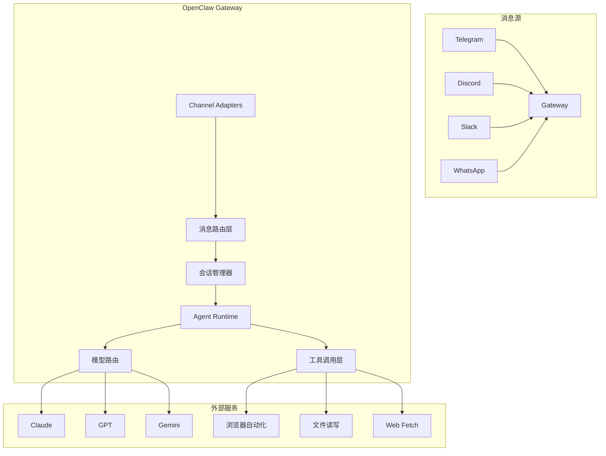

## 前言

日常用 AI 助手，一般是打开网页或者切到某个 App 问一句。但如果你的**工作流分散在 Slack、Telegram、Discord 多个平台**，来回切换本身就是损耗。

OpenClaw 做的事，就是把 AI 助手 **接到 Slack、Telegram、Discord 等平台**，在聊天里 @ 它就能干活——少在 App 之间来回切。

和 [Hermes Agent](./hermes-agent-self-improving-ai.html) 不同：OpenClaw 核心是 **本地 Gateway + 多 IM 通道**；Hermes 更强调 **Skill 沉淀与自改进**。写代码向的终端助手见 [Claude Code 进阶](./claude-code-advanced-usage-guide.html)。

## OpenClaw 是什么

OpenClaw 是一个**本地运行的个人 AI 助手**，核心理念：

- **本地优先**：跑在你自己的设备上，数据不经过第三方
- **多平台接入**：WhatsApp、Telegram、Slack、Discord、Google Chat、Signal、iMessage、Matrix、Microsoft Teams 等
- **多智能体**：可以配置多个独立 Agent，每个有自己的人格、工作区和模型
- **语音 + Canvas**：支持 macOS/iOS/Android 语音交互，以及可控制的 Canvas 界面

## 核心原理

### 整体架构



### Gateway：消息中枢

Gateway 是 OpenClaw 的核心，扮演**消息路由 + 会话管理 + 认证**三位一体的角色：

1. **Channel Adapters**：每个平台有独立的适配器，负责消息收发和平台特定格式转换
2. **消息路由层**：根据消息来源（群组/私聊/指令）分发到对应 Agent
3. **会话管理器**：维护对话上下文，支持按人/按对话/按时间多种隔离策略
4. **Agent Runtime**：执行 AI 任务，调用工具，Streaming 输出

### 会话隔离机制

```json5
// 会话管理配置
session: {
  scope: "per-sender",        // 按发送者隔离
  dmScope: "per-channel-peer", // 私聊按对话方隔离
  reset: {
    mode: "daily",            // 每天重置
    atHour: 4,
    idleMinutes: 60,          // 空闲 N 分钟重置
  },
  resetTriggers: ["/new", "/reset"], // 手动重置指令
}
```

会话 Key 的格式：`agent:<agentId>:<mainKey>`，私聊用主 Key，群组/房间默认隔离。

### 消息队列机制

当一个请求正在处理时，新消息会进入队列：

```json5
routing: {
  queue: {
    mode: "collect",        // 收集模式
    debounceMs: 1000,      // 防抖间隔
    cap: 20,               // 队列上限
    drop: "summarize",      // 超出时 summarizing
  },
}
```

### 工具调用

Agent Runtime 通过 MCP 风格的工具接口调用各种能力：

| 工具 | 用途 |
|------|------|
| `sessions_spawn` | 创建新会话/任务 |
| `read` / `write` | 文件读写 |
| `web_fetch` | 网页抓取 |
| 浏览器控制 | 浏览器自动化操作 |
| `firecrawl_search` / `firecrawl_scrape` | 搜索和爬取 |

### 模型路由

```json5
agents: {
  defaults: {
    model: {
      primary: "anthropic/claude-sonnet-4-6",
      fallbacks: [
        "anthropic/claude-opus-4-6",
        "openai/gpt-5.2",
      ],
    },
    imageModel: {
      primary: "openrouter/anthropic/claude-sonnet-4-6",
    },
  },
},
```

支持多模型 fallback，优先用 Sonnet，挂了切 Opus，再挂了切 GPT。

## 典型应用场景

### 1. 跨平台信息汇总

在 Slack 里 @openclaw，它帮你查邮件、日历，生成今日简报——不用再打开一堆 App。

### 2. 浏览器自动化

「帮我订下周一去上海的机票」——OpenClaw 可以调用浏览器工具完成任务，全程不需要你手动操作。

### 3. 跨设备协同

手机上发指令，Gateway 在服务器上执行，结果推送到你所在的任意平台。

### 4. 多 Agent 分工

可以配置多个独立 Agent：
- 一个处理技术问题（用 Opus）
- 一个处理日常事务（用 Sonnet）
- 各自有独立工作区和会话历史，互不干扰

### 5. 团队共享

部署在服务器上，团队成员通过飞书/Slack 等平台访问，复用同一个 AI 能力池。

## 优缺点分析

### 优点

| 优点 | 说明 |
|------|------|
| **本地化** | 数据不经过第三方平台，适合对隐私有要求的场景 |
| **多平台统一** | 一个 AI，多个入口，不用在 App 间切换 |
| **多 Agent 隔离** | 不同任务用不同 Agent，工作区独立 |
| **持久化工作区** | 有文件系统作为长期记忆，不像纯对话那样丢上下文 |
| **工具编排** | 浏览器、文件、Web Fetch 统一调度，适合复杂任务 |
| **模型路由** | 自动 fallback，保证可用性 |

### 缺点

| 缺点 | 说明 |
|------|------|
| **配置门槛** | JSON5 配置文件对普通用户不友好 |
| **CLI 后端限制** | 命令行模式不支持工具调用和 Streaming 输出 |
| **平台限制** | iMessage 依赖本地 macOS，Signal 接入相对复杂 |
| **多设备同步** | 多人协作场景不如专业团队工具成熟 |
| **调试成本** | 本地运行，出问题得自己排查日志 |

### 对比同类工具

| 工具 | 定位 | OpenClaw 优势 | OpenClaw 劣势 |
|------|------|---------------|---------------|
| **Claude Code** | IDE 内编程助手 | 多平台接入、跨 App 自动化 | 编程辅助能力弱于 Code |
| **ChatGPT App** | 通用对话 | 本地化、多 Agent | UI 体验不如官方 App |
| **LangChain Agent** | 开发者框架 | 开箱即用、消费级 | 定制化不如框架灵活 |

OpenClaw 更像是**个人 AI 协调层**——不追求极致的编程能力，而是解决「怎么让 AI 无处不在」的问题。

## 安装部署

官方提供一键安装：

```bash
curl -fsSL https://openclaw.ai/install.sh | bash
source ~/.bashrc
```

或从源码构建（需要 pnpm）：

```bash
git clone https://github.com/openclaw/openclaw.git
cd openclaw
pnpm install
pnpm build
openclaw onboard
```

Gateway 启动后常驻后台，通过配置文件管理各平台连接。

## 小结

OpenClaw 的价值在 **接入方式与本地化**，不在模型本身。适合：多平台协作、希望数据留在本机、用 Gateway 统一管理 Bot。

- 要 **Skill 学习与记忆迭代** → [Hermes Agent](./hermes-agent-self-improving-ai.html)
- 要 **选型 OpenAI Codex / Copilot / Claude** → [主流 AI 编程工具](./mainstream-ai-coding-tools-comparison.html)

---

*官网：https://openclaw.ai*
