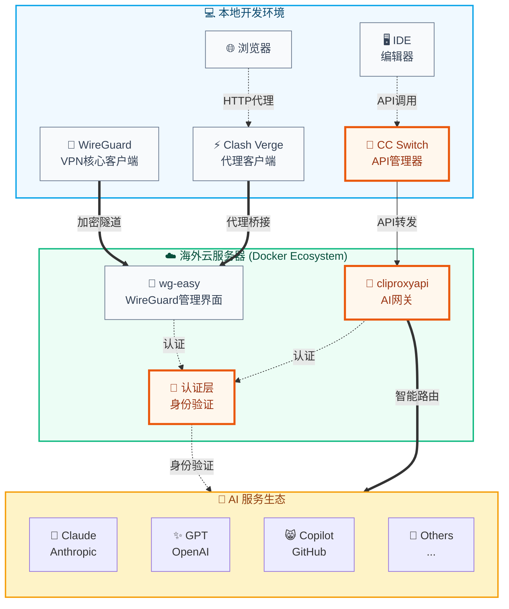

## 前言

在国内用 Claude Code、Copilot 这类工具，卡壳多半在链路上：不是编辑器不好用，是人在这头、API 在那头。我习惯把事拆两块：**先让网络稳定出去**（下面用 WireGuard），**再把各家 API 的入口和 key 收拢到代理**（cliproxyapi + CC Switch）。后文按实际搭过的顺序写，偏步骤和踩坑，少喊口号。

## 技术方案概览

整体是 **两条线**：

**网络接入**：`本地客户端 → WireGuard VPN → 海外服务器`
- 解决「能不能连上海外 VPS」
- 尽量稳定、可重连

**API 代理**：`IDE → CC Switch → cliproxyapi → AI 服务商`
- 统一 API 入口与 key 管理
- 转发与路由

网络管可达，代理管鉴权与转发，下面按搭建顺序写。

## 系统架构图



## 第一步：账号准备 🎫

俗话说"工欲善其事，必先利其器"。在开始搭建技术架构之前，我们需要准备相应的账号资源。这就像是获得进入"AI 开发者俱乐部"的会员卡一样重要。

**基础准备清单：**
- 🌍 海外邮箱服务（Gmail、Outlook 等）
- 📱 海外手机号码（用于接收验证码）
- 💳 支付工具（用于订阅 API 服务）
- 🔐 安全工具（二步验证、密码管理器）

关于注册和获取方式，每人渠道不同，这里不展开。**务必遵守**各服务 ToS，别碰灰产线路。

**📋 安全建议：**
- 使用独立的邮箱和密码
- 开启二步验证保护账号安全
- 定期检查和更新访问权限
- 仅用于合法的开发和学习目的

## 第二步：构建海外基地 🏗️

### 选择理想的"海外办公室" 🌏

要搭建稳定的海外开发环境，选择合适的VPC服务商就像选择办公室地址一样重要。我们需要的不仅是一台服务器，更是一个可靠的"海外基地"。

**推荐服务商：**
- **[WEPC.AU](https://wepc.au/aff.php?aff=2465)** - 澳洲优质服务商
  - ✅ 家庭 IP 段，天然规避风控
  - ✅ 多地区节点，延迟表现优秀
  - ✅ 带宽充足，价格合理
  - ✅ 技术支持响应及时

**选择标准：**
- 🌐 **IP 质量**：家庭 IP > 商业 IP > 数据中心 IP
- 📍 **地理位置**：优选美西、日本、香港、新加坡
- 🚀 **网络质量**：延迟 < 200ms，带宽 > 10Mbps
- 💰 **成本效益**：月费用控制在合理范围内

### 服务器环境初始化 ⚙️

```bash
# 更新系统
sudo apt update && sudo apt upgrade -y

# 安装必要软件
sudo apt install -y docker.io docker-compose git curl

# 启动Docker服务
sudo systemctl enable docker
sudo systemctl start docker

# 添加用户到docker组
sudo usermod -aG docker $USER
```

## 第三步：打通"任督二脉" 🚀

### 第一脉：网络隧道 - WireGuard 高速专线 🌐

**WireGuard** 是现代化的高性能VPN协议，就像是连接本地和海外的"专用高速公路"。**wg-easy** 则是基于 WireGuard 构建的 Web 界面管理工具，它将复杂的命令行配置封装成了友好的图形界面。

**技术关系解析：**
- **WireGuard**：VPN 协议，加密隧道
- **wg-easy**：Web 管理，生成配置/二维码
- 🚀 **协同工作**: wg-easy 简化配置流程，WireGuard 提供安全通道

#### 3.1.1 服务端部署 - wg-easy 管理界面

wg-easy 为 WireGuard 提供 Web 管理界面，让 VPN 配置变得简单。创建 `docker-compose.yml` 文件：

```yaml
version: '3.8'
services:
  wg-easy:
    environment:
      # 服务器公网IP
      - WG_HOST=${SERVER_IP}
      # WebUI密码
      - PASSWORD=${WG_PASSWORD}
      # 端口配置
      - WG_PORT=51820
      - WG_DEFAULT_DNS=1.1.1.1,8.8.8.8
      # 内网IP段
      - WG_DEFAULT_ADDRESS=10.8.0.x
      # 允许的IP范围
      - WG_ALLOWED_IPS=0.0.0.0/0
    image: weejewel/wg-easy:latest
    container_name: wg-easy
    volumes:
      - ./wg-easy:/etc/wireguard
    ports:
      # WebUI管理界面
      - "51821:51821"
      # WireGuard端口
      - "51820:51820/udp"
    restart: unless-stopped
    cap_add:
      - NET_ADMIN
      - SYS_MODULE
    sysctls:
      - net.ipv4.ip_forward=1
      - net.ipv4.conf.all.src_valid_mark=1
```

#### 3.1.2 部署脚本

```bash
#!/bin/bash
# deploy-wg.sh

# 创建项目目录
mkdir -p ~/wireguard && cd ~/wireguard

# 设置环境变量
export SERVER_IP="your.server.ip"
export WG_PASSWORD="your_secure_password"

# 启动服务
docker-compose up -d

# 查看状态
docker-compose logs -f wg-easy
```

#### 3.1.3 客户端配置

**Clash Verge 配置示例：**

Clash Verge 需要导入 WireGuard 配置，然后提供本地 HTTP/SOCKS 代理服务：

```yaml
# clash-config.yaml
port: 7890
socks-port: 7891
allow-lan: true
mode: rule
log-level: info

external-controller: 127.0.0.1:9090

# 导入从 wg-easy 管理界面下载的 WireGuard 配置
# Clash 会自动转换为内部代理节点

proxy-groups:
  - name: "海外节点"
    type: select
    proxies:
      - "WireGuard-节点"
      - "DIRECT"

rules:
  - DOMAIN-SUFFIX,claude.ai,海外节点
  - DOMAIN-SUFFIX,openai.com,海外节点
  - DOMAIN-SUFFIX,github.com,海外节点
  - DOMAIN-SUFFIX,anthropic.com,海外节点
  - MATCH,DIRECT
```

**配置流程：**
1. 通过 wg-easy 的 Web 界面生成 WireGuard 配置文件
2. 将配置文件导入 Clash Verge（支持 WireGuard 协议）
3. Clash 基于 WireGuard 隧道在本地 7890 端口提供 HTTP 代理服务

**WireGuard 原生客户端配置：**

使用 wg-easy 生成的配置文件，可直接导入 WireGuard 官方客户端：

```ini
# wg-client.conf (从 wg-easy 管理界面下载)
[Interface]
PrivateKey = your_private_key  # wg-easy 自动生成
Address = 10.8.0.2/24         # wg-easy 分配的内网IP
DNS = 1.1.1.1

[Peer]
PublicKey = server_public_key  # wg-easy 服务器公钥
Endpoint = your.server.ip:51820
AllowedIPs = 0.0.0.0/0
PersistentKeepalive = 25
```

### 第二脉：智能代理 - cliproxyapi 统一网关 🤖

如果说 WireGuard 解决了"能不能连"的问题，那么 cliproxyapi 就解决了"怎么连得更好"的问题。它是一款专业的 AI API 代理工具，能够统一管理多个 AI 服务商的认证和调用，为开发者提供透明的 API 访问体验。

#### 3.2.1 Docker Compose 部署方式

cliproxyapi 采用 Docker Compose 容器化部署，提供稳定的 AI API 代理服务：

```yaml
# docker-compose.yml
version: '3.8'
services:
  cliproxyapi:
    image: routerformecn/cliproxyapi:latest
    container_name: cliproxyapi
    environment:
      - LOG_LEVEL=info
    ports:
      - "8080:8080"
    volumes:
      - ./config:/app/config
      - ./logs:/app/logs
    restart: unless-stopped
    # 开启交互模式支持认证操作
    stdin_open: true
    tty: true
```

**注意**：cliproxyapi 是一个轻量级的代理工具，不需要额外的 Redis 等依赖服务。

#### 3.2.2 容器内身份验证

部署完成后，需要在容器内执行登录认证：

```bash
# 进入容器
docker-compose exec cliproxyapi bash

# 在容器内执行登录（需要先启动VPN）
# 具体认证命令请参考官方文档
cliproxyapi auth --provider claude
cliproxyapi auth --provider openai

# 验证服务状态
cliproxyapi status

# 退出容器
exit
```

#### 3.2.3 配置文件

> **模型 ID**：Anthropic / OpenAI 会更新、下线快照版模型名。下列 JSON 中的 `model_mapping`、`models`、`claude.model` **仅为示例**；请以各服务商 **控制台与 API 文档**（或 Claude Code 当前默认）中的 **model** 字符串为准，勿照搬已退役 ID。

```json
{
  "server": {
    "port": 8080,
    "cors": true
  },
  "auth": {
    "mode": "browser",
    "auto_refresh": true
  },
  "providers": [
    {
      "name": "claude",
      "endpoint": "https://api.anthropic.com",
      "model_mapping": {
        "claude-3": "claude-3-5-sonnet-20241022"
      }
    },
    {
      "name": "openai",
      "endpoint": "https://api.openai.com",
      "model_mapping": {
        "gpt-4": "gpt-4o"
      }
    }
  ]
}
```

#### 3.2.4 客户端配置 - CC Switch

CC Switch 运行在本地 9000 端口，统一管理多个 AI 服务提供商：

```json
{
  "server": {
    "port": 9000,
    "host": "127.0.0.1"
  },
  "providers": [
    {
      "name": "cliproxyapi-Claude",
      "type": "anthropic",
      "endpoint": "http://your.server.ip:8080/v1",
      "api_key": "your_proxy_token",
      "models": ["claude-3-5-sonnet-20241022", "claude-3-5-haiku-20241022", "claude-3-opus-20240229"]
    },
    {
      "name": "cliproxyapi-OpenAI",
      "type": "openai",
      "endpoint": "http://your.server.ip:8080/v1",
      "api_key": "your_proxy_token",
      "models": ["gpt-4o", "gpt-4o-mini", "gpt-4-turbo"]
    }
  ],
  "default_provider": "cliproxyapi-Claude",
  "load_balance": true
}
```

## 第四步：IDE 无缝集成 💻

### IDE 工具集成配置

IDE/编辑器通过 CC Switch 连接到 cliproxyapi，形成完整的代理链路：

**Claude Code 配置：**
```json
{
  "claude.provider": "ccswitch",
  "claude.endpoint": "http://localhost:9000/api",
  "claude.model": "claude-3-5-sonnet-20241022"
}
```

**其他 AI 插件配置：**
```json
{
  "ai.endpoint": "http://localhost:9000/api/v1",
  "ai.provider": "ccswitch-unified"
}
```

### 环境变量配置

```bash
# ~/.bashrc 或 ~/.zshrc
# 网络代理配置（通过本地 Clash）
export HTTP_PROXY=http://127.0.0.1:7890
export HTTPS_PROXY=http://127.0.0.1:7890
export ALL_PROXY=socks5://127.0.0.1:7891

# AI 工具配置（通过本地 CC Switch）
export OPENAI_API_BASE=http://localhost:9000/api/v1
export ANTHROPIC_API_BASE=http://localhost:9000/api/v1
export GITHUB_COPILOT_API_BASE=http://localhost:9000/api/v1
```

## 安全建议

1. **网络安全**
   - 定期更新服务器系统
   - 配置防火墙规则
   - 使用强密码和密钥认证

2. **服务安全**
   - 限制管理界面访问IP
   - 定期备份配置文件
   - 监控服务运行状态

3. **合规使用**
   - 遵守当地法律法规
   - 仅用于开发和学习目的
   - 避免滥用API配额

## 故障排除

### 常见问题

1. **连接失败**
```bash
# 检查端口开放
sudo ufw status
sudo netstat -tulpn | grep :51820

# 检查Docker服务
docker ps
docker-compose logs
```

2. **认证问题**
```bash
# 重新生成配置
docker-compose down
rm -rf ./wg-easy
docker-compose up -d
```

3. **代理不稳定**
```bash
# 重启代理服务
docker-compose restart cliproxyapi
# 检查日志
docker-compose logs -f cliproxyapi
```

## 关键软件文档与资源

### 官方文档链接

- **WireGuard**: https://www.wireguard.com/quickstart/
- **wg-easy**: https://github.com/wg-easy/wg-easy
- **Clash Verge**: https://github.com/clash-verge-rev/clash-verge-rev
- **WireGuard Tools**: https://www.wireguard.com/install/
- **Docker Compose**: https://docs.docker.com/compose/
- **cliproxyapi**: https://help.router-for.me/cn/introduction/what-is-cliproxyapi.html
- **CC Switch**: https://github.com/ccswitch/ccswitch

### 服务商资源

- **WEPC.AU**: https://wepc.au/aff.php?aff=2465 (海外VPC服务)
- **其他推荐VPC服务商**：
  - Vultr: https://www.vultr.com/
  - DigitalOcean: https://www.digitalocean.com/
  - Linode: https://www.linode.com/

### 客户端工具下载

- **Clash Verge**: https://github.com/clash-verge-rev/clash-verge-rev/releases
- **WireGuard 官方客户端**: https://www.wireguard.com/install/
- **CC Switch**: https://github.com/ccswitch/ccswitch/releases

## 总结：迈向 AI 开发新时代 🎯

经过以上四个步骤的精心搭建，我们已经成功构建了一条从本地 IDE 直达海外 AI 服务的"高速通道"。这不仅仅是一套技术方案，更是现代开发者拥抱 AI 时代的必备基础设施。

**🏆 方案优势：**
- **🛡️ 稳定可靠**：基于 WireGuard + Docker 成熟技术栈，7x24 小时稳定运行
- **⚡ 高效便捷**：一次配置，终身受益，告别繁琐的网络配置
- **🔧 易于维护**：容器化架构，可视化管理，运维成本极低
- **🚀 高度扩展**：支持多用户、多服务，可随业务增长平滑扩容
- **🔒 安全防护**：端到端加密，多层安全防护，数据传输更安心

**🌟 技术链路梳理：**
```
本地开发 → CC Switch → cliproxyapi → AI 服务商
    ↓           ↓          ↓           ↓
  IDE 编辑器  统一 API 管理  智能网关    Claude/GPT
```

现在，你可以在熟悉的 IDE 中享受 AI 助手的强大能力，就像使用本地工具一样自然流畅。AI 开发的新时代已经到来，而你已经准备就绪！

**免责声明**：本文仅从技术角度探讨网络代理的实现方案，请读者在使用时严格遵守相关法律法规，合理合法使用相关技术。