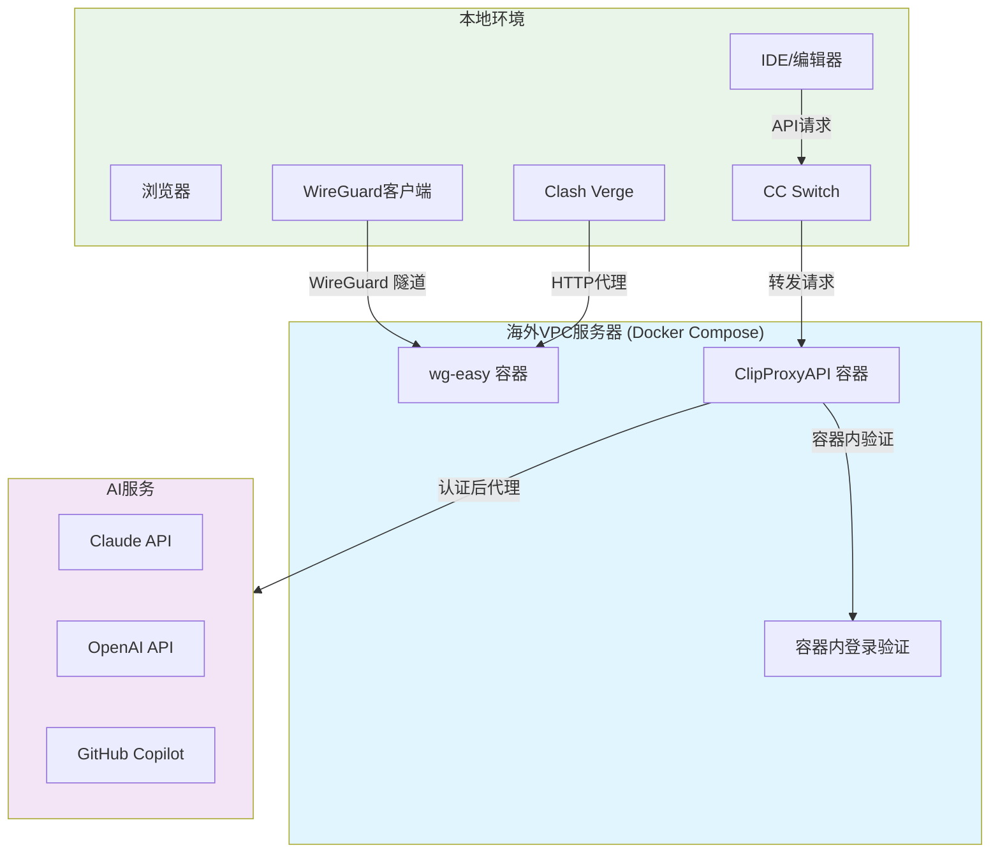

## 概述

随着现代软件开发的全球化，开发者经常需要访问海外的开发工具和AI编程助手，如 Claude Code、GitHub Copilot 等。本文将从技术角度介绍如何搭建稳定的海外开发环境，主要包括基础设施、网络代理和AI工具配置三个部分。

## 架构图



## 第一部分：账号准备

关于账号注册和获取的具体方式，本文不便详述。开发者需要：

- 准备海外邮箱服务
- 了解相关服务的注册流程
- 确保账号安全和合规使用

**注意**：请务必遵守相关服务的使用条款，仅用于合法的开发用途。

## 第二部分：基础设施 - VPC服务器搭建

### 2.1 选择合适的VPC服务商

推荐使用专业的海外VPC服务，如 [WEPC.AU](https://wepc.au/) 等，特点：
- 提供家庭IP段，降低风控风险
- 支持多地区节点选择
- 带宽和延迟表现优秀
- 价格相对合理

### 2.2 VPC基础配置

```bash
# 更新系统
sudo apt update && sudo apt upgrade -y

# 安装必要软件
sudo apt install -y docker.io docker-compose git curl

# 启动Docker服务
sudo systemctl enable docker
sudo systemctl start docker

# 添加用户到docker组
sudo usermod -aG docker $USER
```

## 第三部分：软件配置

### 3.1 VPN线路 - WireGuard + wg-easy

#### 3.1.1 服务端部署

创建 `docker-compose.yml` 文件：

```yaml
version: '3.8'
services:
  wg-easy:
    environment:
      # 服务器公网IP
      - WG_HOST=${SERVER_IP}
      # WebUI密码
      - PASSWORD=${WG_PASSWORD}
      # 端口配置
      - WG_PORT=51820
      - WG_DEFAULT_DNS=1.1.1.1,8.8.8.8
      # 内网IP段
      - WG_DEFAULT_ADDRESS=10.8.0.x
      # 允许的IP范围
      - WG_ALLOWED_IPS=0.0.0.0/0
    image: weejewel/wg-easy:latest
    container_name: wg-easy
    volumes:
      - ./wg-easy:/etc/wireguard
    ports:
      # WebUI管理界面
      - "51821:51821"
      # WireGuard端口
      - "51820:51820/udp"
    restart: unless-stopped
    cap_add:
      - NET_ADMIN
      - SYS_MODULE
    sysctls:
      - net.ipv4.ip_forward=1
      - net.ipv4.conf.all.src_valid_mark=1
```

#### 3.1.2 部署脚本

```bash
#!/bin/bash
# deploy-wg.sh

# 创建项目目录
mkdir -p ~/wireguard && cd ~/wireguard

# 设置环境变量
export SERVER_IP="your.server.ip"
export WG_PASSWORD="your_secure_password"

# 启动服务
docker-compose up -d

# 查看状态
docker-compose logs -f wg-easy
```

#### 3.1.3 客户端配置

**Clash Verge HTTP代理配置示例：**

```yaml
# clash-config.yaml
port: 7890
socks-port: 7891
allow-lan: true
mode: rule
log-level: info

external-controller: 127.0.0.1:9090

proxies:
  - name: "WG-HTTP"
    type: http
    server: your.server.ip
    port: 8888  # wg-easy HTTP代理端口
    username: ""
    password: ""

proxy-groups:
  - name: "Auto"
    type: select
    proxies:
      - "WG-HTTP"
      - "DIRECT"

rules:
  - DOMAIN-SUFFIX,claude.ai,Auto
  - DOMAIN-SUFFIX,openai.com,Auto
  - DOMAIN-SUFFIX,github.com,Auto
  - MATCH,DIRECT
```

**注意：** Clash Verge 通过 HTTP 代理方式连接到 wg-easy 服务，而不是直接使用 WireGuard 协议。

**WireGuard Tools 配置：**

```ini
# wg-client.conf
[Interface]
PrivateKey = your_private_key
Address = 10.8.0.2/24
DNS = 1.1.1.1

[Peer]
PublicKey = server_public_key
Endpoint = your.server.ip:51820
AllowedIPs = 0.0.0.0/0
PersistentKeepalive = 25
```

### 3.2 AI代理线路 - ClipProxyAPI

#### 3.2.1 Docker Compose 部署方式

ClipProxyAPI 同样采用 Docker Compose 容器化部署，并在容器内执行身份验证：

```yaml
# clipproxy-compose.yml
version: '3.8'
services:
  clipproxy:
    image: clipproxy/clipproxy:latest
    container_name: clipproxy
    environment:
      - MODE=headless
      - BROWSER_AUTH=false
      - API_PORT=8080
      - LOG_LEVEL=info
    ports:
      - "8080:8080"
    volumes:
      - ./data:/app/data
      - ./config:/app/config
      - ./auth:/app/auth
    restart: unless-stopped
    depends_on:
      - redis
    # 开启交互模式支持容器内登录
    stdin_open: true
    tty: true

  redis:
    image: redis:alpine
    container_name: clipproxy-redis
    volumes:
      - ./redis-data:/data
    restart: unless-stopped
```

#### 3.2.2 容器内身份验证

部署完成后，需要在容器内执行登录命令：

```bash
# 进入容器
docker-compose exec clipproxy bash

# 在容器内执行登录（需要先启动VPN）
clipproxy auth login --provider claude
clipproxy auth login --provider openai

# 验证登录状态
clipproxy auth status

# 退出容器
exit
```

#### 3.2.2 配置文件

```json
{
  "server": {
    "port": 8080,
    "cors": true
  },
  "auth": {
    "mode": "browser",
    "auto_refresh": true
  },
  "providers": [
    {
      "name": "claude",
      "endpoint": "https://api.anthropic.com",
      "model_mapping": {
        "claude-3": "claude-3-sonnet-20240229"
      }
    },
    {
      "name": "openai",
      "endpoint": "https://api.openai.com",
      "model_mapping": {
        "gpt-4": "gpt-4-turbo-preview"
      }
    }
  ]
}
```

#### 3.2.3 客户端配置 - CC Switch

**统一供应商模式配置：**

```json
{
  "providers": [
    {
      "name": "ClipProxy-Claude",
      "type": "openai",
      "endpoint": "http://your.server.ip:8080/v1",
      "api_key": "your_proxy_token",
      "models": ["claude-3-sonnet", "claude-3-opus"]
    },
    {
      "name": "ClipProxy-OpenAI",
      "type": "openai",
      "endpoint": "http://your.server.ip:8080/v1",
      "api_key": "your_proxy_token",
      "models": ["gpt-4", "gpt-3.5-turbo"]
    }
  ],
  "default_provider": "ClipProxy-Claude"
}
```

## 开发工具集成

### IDE 工具集成配置

IDE/编辑器通过 CC Switch 连接到 ClipProxyAPI，形成完整的代理链路：

**Claude Code 配置：**
```json
{
  "claude.provider": "ccswitch",
  "claude.endpoint": "http://localhost:9000/api",
  "claude.model": "claude-3-sonnet"
}
```

**其他 AI 插件配置：**
```json
{
  "ai.endpoint": "http://localhost:9000/api/v1",
  "ai.provider": "ccswitch-unified"
}
```

### 环境变量配置

```bash
# ~/.bashrc 或 ~/.zshrc
export HTTP_PROXY=http://127.0.0.1:7890
export HTTPS_PROXY=http://127.0.0.1:7890
export ALL_PROXY=socks5://127.0.0.1:7891

# AI工具配置
export OPENAI_API_BASE=http://localhost:8080/v1
export CLAUDE_API_BASE=http://localhost:8080/v1
```

## 安全建议

1. **网络安全**
   - 定期更新服务器系统
   - 配置防火墙规则
   - 使用强密码和密钥认证

2. **服务安全**
   - 限制管理界面访问IP
   - 定期备份配置文件
   - 监控服务运行状态

3. **合规使用**
   - 遵守当地法律法规
   - 仅用于开发和学习目的
   - 避免滥用API配额

## 故障排除

### 常见问题

1. **连接失败**
```bash
# 检查端口开放
sudo ufw status
sudo netstat -tulpn | grep :51820

# 检查Docker服务
docker ps
docker-compose logs
```

2. **认证问题**
```bash
# 重新生成配置
docker-compose down
rm -rf ./wg-easy
docker-compose up -d
```

3. **代理不稳定**
```bash
# 重启代理服务
docker-compose restart clipproxy
# 检查日志
docker-compose logs -f clipproxy
```

## 关键软件文档与资源

### 官方文档链接

- **WireGuard**: https://www.wireguard.com/quickstart/
- **wg-easy**: https://github.com/wg-easy/wg-easy
- **Clash Verge**: https://github.com/clash-verge-rev/clash-verge-rev
- **WireGuard Tools**: https://www.wireguard.com/install/
- **Docker Compose**: https://docs.docker.com/compose/
- **ClipProxyAPI**: https://github.com/clipproxy/clipproxy-api
- **CC Switch**: https://github.com/ccswitch/ccswitch

### 服务商资源

- **WEPC.AU**: https://wepc.au/ (海外VPC服务)
- **其他推荐VPC服务商**：
  - Vultr: https://www.vultr.com/
  - DigitalOcean: https://www.digitalocean.com/
  - Linode: https://www.linode.com/

### 客户端工具下载

- **Clash Verge**: https://github.com/clash-verge-rev/clash-verge-rev/releases
- **WireGuard 官方客户端**: https://www.wireguard.com/install/
- **CC Switch**: https://github.com/ccswitch/ccswitch/releases

## 总结

通过合理的架构设计和工具选择，可以构建一个稳定高效的海外开发环境。本方案的核心优势：

- **稳定性**：基于成熟的开源技术栈
- **可维护性**：容器化部署，易于管理
- **扩展性**：支持多用户和多服务
- **安全性**：端到端加密，安全可控

关键技术流程：`IDE → CC Switch → ClipProxyAPI（容器内认证）→ AI服务`

**免责声明**：本文仅从技术角度探讨网络代理的实现方案，请读者在使用时严格遵守相关法律法规，合理合法使用相关技术。