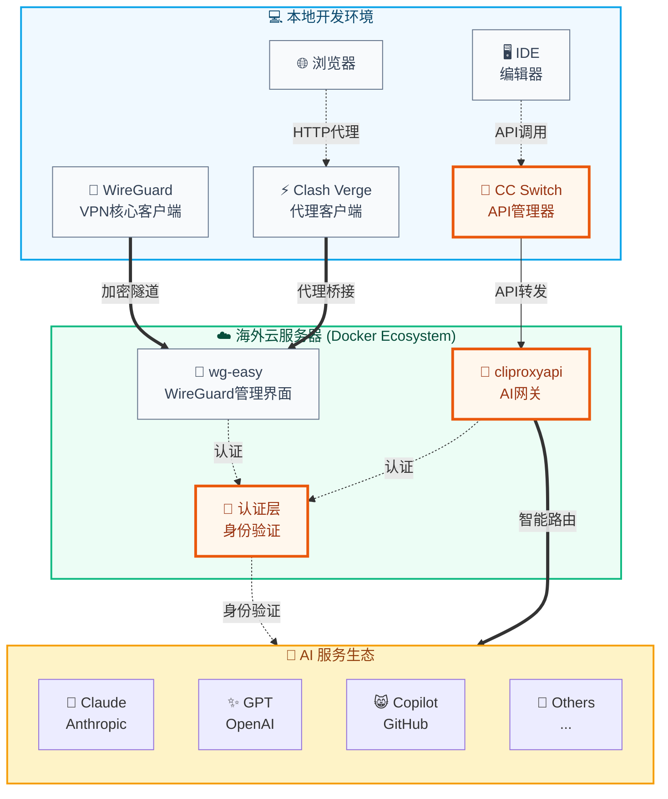

## 前言

在国内用 Claude Code、Copilot 这类工具，卡壳多半在链路上：不是编辑器不好用，是人在这头、API 在那头。我习惯把事拆两块：**先让网络稳定出去**（下面用 WireGuard），**再把各家 API 的入口和 key 收拢到代理**（cliproxyapi + CC Switch）。后文按实际搭过的顺序写，偏步骤和踩坑，少喊口号。

## 技术方案概览

整体是 **两条线**：

**网络接入**：`本地客户端 → WireGuard VPN → 海外服务器`
- 解决「能不能连上海外 VPS」
- 尽量稳定、可重连

**API 代理**：`IDE → CC Switch → cliproxyapi → AI 服务商`
- 统一 API 入口与 key 管理
- 转发与路由

网络管可达，代理管鉴权与转发，下面按搭建顺序写。

## 系统架构图



## 第一步：账号准备

开搭之前先把账号备齐：海外邮箱、能收短信的号码、付 API 订阅用的支付方式、2FA。没有「标准路径」，各凭渠道；**遵守 ToS，别碰灰产线路**。

**清单：**
- 海外邮箱（Gmail、Outlook 等）
- 海外手机号（验证码）
- 支付工具（API 订阅）
- 2FA / 密码管理器

**安全习惯：** 专用邮箱密码、开 2FA、定期查权限；只用于合法开发学习。

## 第二步：海外 VPS

### 选服务商

需要一台 **IP 质量过得去** 的 VPS 当 WireGuard 服务端。下文示例用过 [WEPC.AU](https://wepc.au/aff.php?aff=2465)（澳洲、家庭 IP 段）；你也可以换熟悉的厂商。

**我选型时会看：**
- **IP 类型**：家庭 IP 通常比纯机房 IP 少踩风控
- **地域**：美西、日本、香港、新加坡（看延迟）
- **线路**：延迟 < 200ms、带宽够用即可
- **价格**：月费在可接受范围

### 初始化系统（Docker）

```bash
# 更新系统
sudo apt update && sudo apt upgrade -y

# 安装必要软件
sudo apt install -y docker.io docker-compose git curl

# 启动Docker服务
sudo systemctl enable docker
sudo systemctl start docker

# 添加用户到docker组
sudo usermod -aG docker $USER
```

## 第三步：WireGuard + API 代理

### 3.1 网络：WireGuard + wg-easy

**WireGuard** 跑加密隧道；**wg-easy** 给 Web UI，生成客户端配置/二维码，省得手写 key。

- **WireGuard**：协议层
- **wg-easy**：管理界面
- 二者配合：UI 出配置，WG 扛流量

#### 3.1.1 服务端：wg-easy

在 VPS 上建 `docker-compose.yml`：

```yaml
version: '3.8'
services:
  wg-easy:
    environment:
      # 服务器公网IP
      - WG_HOST=${SERVER_IP}
      # WebUI密码
      - PASSWORD=${WG_PASSWORD}
      # 端口配置
      - WG_PORT=51820
      - WG_DEFAULT_DNS=1.1.1.1,8.8.8.8
      # 内网IP段
      - WG_DEFAULT_ADDRESS=10.8.0.x
      # 允许的IP范围
      - WG_ALLOWED_IPS=0.0.0.0/0
    image: ghcr.io/wg-easy/wg-easy:latest
    container_name: wg-easy
    volumes:
      - ./wg-easy:/etc/wireguard
    ports:
      # WebUI管理界面
      - "51821:51821"
      # WireGuard端口
      - "51820:51820/udp"
    restart: unless-stopped
    cap_add:
      - NET_ADMIN
      - SYS_MODULE
    sysctls:
      - net.ipv4.ip_forward=1
      - net.ipv4.conf.all.src_valid_mark=1
```

#### 3.1.2 部署脚本

```bash
#!/bin/bash
# deploy-wg.sh

# 创建项目目录
mkdir -p ~/wireguard && cd ~/wireguard

# 设置环境变量
export SERVER_IP="your.server.ip"
export WG_PASSWORD="your_secure_password"

# 启动服务
docker-compose up -d

# 查看状态
docker-compose logs -f wg-easy
```

#### 3.1.3 客户端配置

::: warning 两条路径，别混

**路径 A**：WireGuard 官方客户端 / 系统 VPN —— 直接导入 `wg-client.conf`，全隧道或分路由由 `AllowedIPs` 决定。

**路径 B**：Clash Verge Rev 等 —— 在 **已能出海的网络环境** 上配 HTTP/SOCKS 上游或规则分流；**不能把 `wg-client.conf` 当 YAML 节点一行粘贴就完事**。WireGuard 与 Clash 的集成方式因 **客户端版本** 而异，以 [Clash Verge Rev](https://github.com/clash-verge-rev/clash-verge-rev) 当期文档为准。

:::

**路径 A：WireGuard 原生客户端（推荐先跑通）**

使用 wg-easy 生成的配置文件，可直接导入 WireGuard 官方客户端：

```ini
# wg-client.conf (从 wg-easy 管理界面下载)
[Interface]
PrivateKey = your_private_key  # wg-easy 自动生成
Address = 10.8.0.2/24         # wg-easy 分配的内网IP
DNS = 1.1.1.1

[Peer]
PublicKey = server_public_key  # wg-easy 服务器公钥
Endpoint = your.server.ip:51820
AllowedIPs = 0.0.0.0/0
PersistentKeepalive = 25
```

导入后系统层 VPN 连通，终端里 `curl`、Git、Claude Code 走隧道即可。

**路径 B：Clash Verge 规则分流（可选）**

在 WG 已连通或另有 HTTP 代理的前提下，用 Clash 做 **按域名分流**（示例骨架，节点名需换成你环境里的）：

```yaml
# clash-rules-example.yaml — 示意，非 wg.conf 直导
port: 7890
socks-port: 7891
mode: rule

proxy-groups:
  - name: PROXY
    type: select
    proxies:
      - your-upstream-name

rules:
  - DOMAIN-SUFFIX,claude.ai,PROXY
  - DOMAIN-SUFFIX,anthropic.com,PROXY
  - DOMAIN-SUFFIX,openai.com,PROXY
  - MATCH,DIRECT
```

**配置流程（路径 A）**

1. wg-easy Web 界面生成客户端配置
2. 导入 WireGuard 官方客户端并连接
3. 需要分流时再单独配置 Clash，勿与 `wg-client.conf` 混写

### 3.2 API 网关：cliproxyapi

WireGuard 解决 **能不能连上海外**；**cliproxyapi** 解决 **多家 AI API 怎么统一鉴权、转发**（配合 CC Switch 给 IDE 一个入口）。

#### 3.2.1 Docker Compose 部署方式

cliproxyapi 采用 Docker Compose 容器化部署，提供稳定的 AI API 代理服务：

```yaml
# docker-compose.yml
version: '3.8'
services:
  cliproxyapi:
    image: routerformecn/cliproxyapi:latest
    container_name: cliproxyapi
    environment:
      - LOG_LEVEL=info
    ports:
      - "8080:8080"
    volumes:
      - ./config:/app/config
      - ./logs:/app/logs
    restart: unless-stopped
    # 开启交互模式支持认证操作
    stdin_open: true
    tty: true
```

**注意**：cliproxyapi 是一个轻量级的代理工具，不需要额外的 Redis 等依赖服务。

#### 3.2.2 容器内身份验证

部署完成后，需要在容器内执行登录认证：

```bash
# 进入容器
docker-compose exec cliproxyapi bash

# 在容器内执行登录（需要先启动VPN）
# 具体认证命令请参考官方文档
cliproxyapi auth --provider claude
cliproxyapi auth --provider openai

# 验证服务状态
cliproxyapi status

# 退出容器
exit
```

#### 3.2.3 配置文件

> **模型 ID**：Anthropic / OpenAI 会更新、下线快照版模型名。下列 JSON 中的 `model_mapping`、`models`、`claude.model` **仅为示例**；请以各服务商 **控制台与 API 文档**（或 Claude Code 当前默认）中的 **model** 字符串为准，勿照搬已退役 ID。

```json
{
  "server": {
    "port": 8080,
    "cors": true
  },
  "auth": {
    "mode": "browser",
    "auto_refresh": true
  },
  "providers": [
    {
      "name": "claude",
      "endpoint": "https://api.anthropic.com",
      "model_mapping": {
        "claude-3": "claude-3-5-sonnet-20241022"
      }
    },
    {
      "name": "openai",
      "endpoint": "https://api.openai.com",
      "model_mapping": {
        "gpt-4": "gpt-4o"
      }
    }
  ]
}
```

#### 3.2.4 客户端配置 - CC Switch

CC Switch 运行在本地 9000 端口，统一管理多个 AI 服务提供商：

```json
{
  "server": {
    "port": 9000,
    "host": "127.0.0.1"
  },
  "providers": [
    {
      "name": "cliproxyapi-Claude",
      "type": "anthropic",
      "endpoint": "http://your.server.ip:8080/v1",
      "api_key": "your_proxy_token",
      "models": ["claude-3-5-sonnet-20241022", "claude-3-5-haiku-20241022", "claude-3-opus-20240229"]
    },
    {
      "name": "cliproxyapi-OpenAI",
      "type": "openai",
      "endpoint": "http://your.server.ip:8080/v1",
      "api_key": "your_proxy_token",
      "models": ["gpt-4o", "gpt-4o-mini", "gpt-4-turbo"]
    }
  ],
  "default_provider": "cliproxyapi-Claude",
  "load_balance": true
}
```

## 第四步：IDE 无缝集成 💻

### IDE 工具集成配置

IDE/编辑器通过 CC Switch 连接到 cliproxyapi，形成完整的代理链路：

**Claude Code 配置：**
```json
{
  "claude.provider": "ccswitch",
  "claude.endpoint": "http://localhost:9000/api",
  "claude.model": "claude-3-5-sonnet-20241022"
}
```

**其他 AI 插件配置：**
```json
{
  "ai.endpoint": "http://localhost:9000/api/v1",
  "ai.provider": "ccswitch-unified"
}
```

### 环境变量配置

```bash
# ~/.bashrc 或 ~/.zshrc
# 网络代理配置（通过本地 Clash）
export HTTP_PROXY=http://127.0.0.1:7890
export HTTPS_PROXY=http://127.0.0.1:7890
export ALL_PROXY=socks5://127.0.0.1:7891

# AI 工具配置（通过本地 CC Switch）
export OPENAI_API_BASE=http://localhost:9000/api/v1
export ANTHROPIC_API_BASE=http://localhost:9000/api/v1
export GITHUB_COPILOT_API_BASE=http://localhost:9000/api/v1
```

## 安全建议

1. **网络安全**
   - 定期更新服务器系统
   - 配置防火墙规则
   - 使用强密码和密钥认证

2. **服务安全**
   - 限制管理界面访问IP
   - 定期备份配置文件
   - 监控服务运行状态

3. **合规使用**
   - 遵守当地法律法规
   - 仅用于开发和学习目的
   - 避免滥用API配额

## 故障排除

### 常见问题

1. **连接失败**
```bash
# 检查端口开放
sudo ufw status
sudo netstat -tulpn | grep :51820

# 检查Docker服务
docker ps
docker-compose logs
```

2. **认证问题**
```bash
# 重新生成配置
docker-compose down
rm -rf ./wg-easy
docker-compose up -d
```

3. **代理不稳定**
```bash
# 重启代理服务
docker-compose restart cliproxyapi
# 检查日志
docker-compose logs -f cliproxyapi
```

## 关键软件文档与资源

### 官方文档链接

- **WireGuard**: https://www.wireguard.com/quickstart/
- **wg-easy**: https://github.com/wg-easy/wg-easy
- **Clash Verge**: https://github.com/clash-verge-rev/clash-verge-rev
- **WireGuard Tools**: https://www.wireguard.com/install/
- **Docker Compose**: https://docs.docker.com/compose/
- **cliproxyapi**: https://help.router-for.me/cn/introduction/what-is-cliproxyapi.html
- **CC Switch**: https://github.com/ccswitch/ccswitch

### 服务商资源

- **WEPC.AU**: https://wepc.au/aff.php?aff=2465 (海外VPC服务)
- **其他推荐VPC服务商**：
  - Vultr: https://www.vultr.com/
  - DigitalOcean: https://www.digitalocean.com/
  - Linode: https://www.linode.com/

### 客户端工具下载

- **Clash Verge**: https://github.com/clash-verge-rev/clash-verge-rev/releases
- **WireGuard 官方客户端**: https://www.wireguard.com/install/
- **CC Switch**: https://github.com/ccswitch/ccswitch/releases

## 总结

四步下来：**账号 → VPS → WireGuard → cliproxyapi + CC Switch**。本地 IDE 走 CC Switch 打 localhost 代理，出站流量经 WireGuard 到海外，再访问 Claude/OpenAI 等 API。

**链路：**

```text
本地 IDE → CC Switch → cliproxyapi → AI 服务商
         ↘ Clash/WireGuard 客户端 → 海外 VPS
```

容器化部署后，改配置多半在 compose 和 CC Switch 里完成；版本升级以各项目 Release 为准。

**免责声明**：本文只讨论技术搭建；请遵守当地法规与各服务 ToS，合法使用。