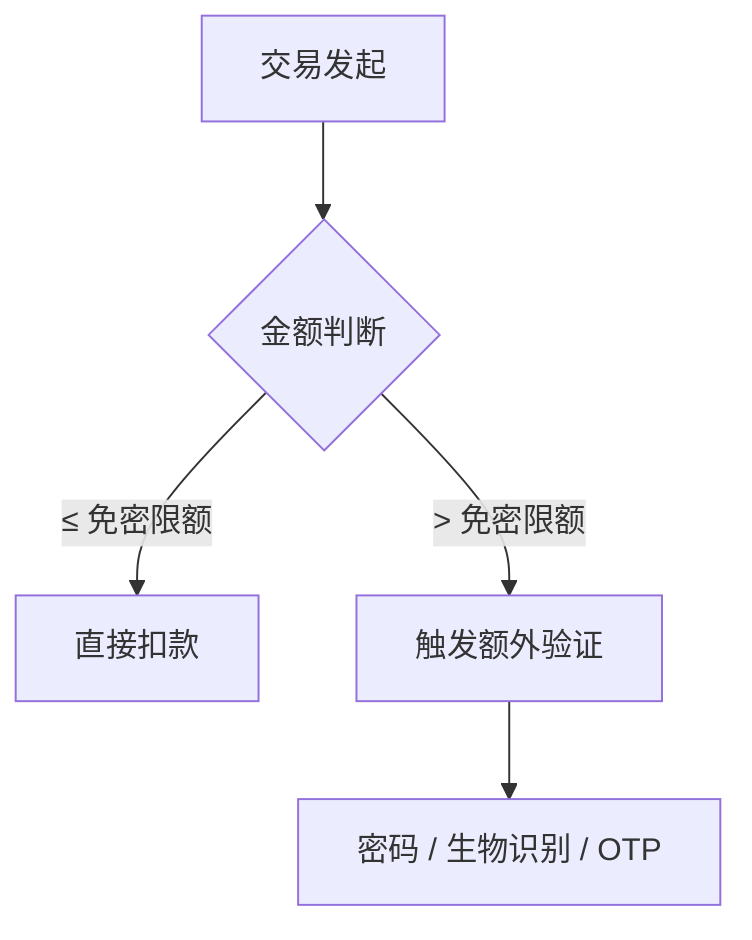
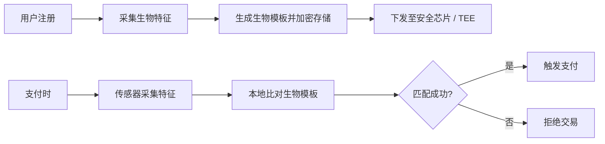
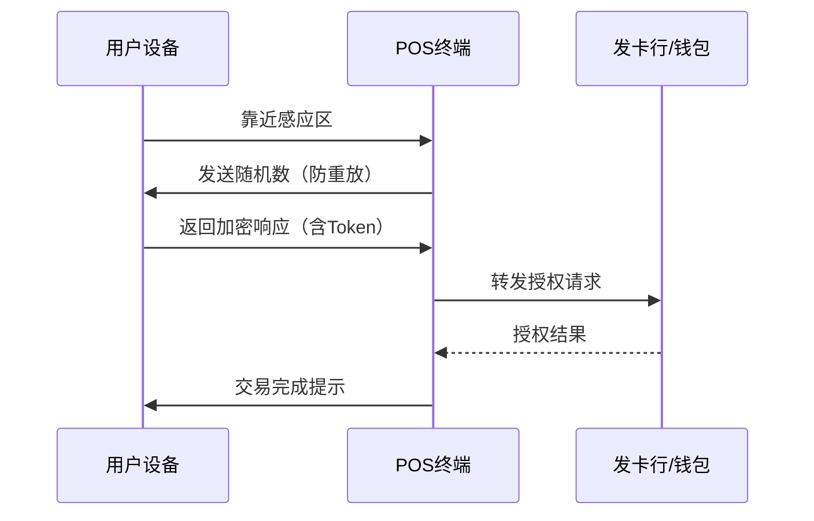
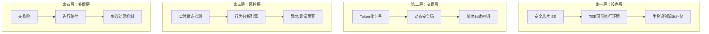
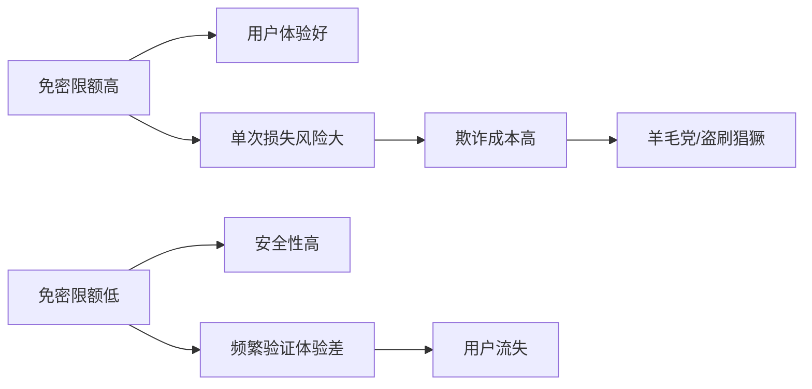
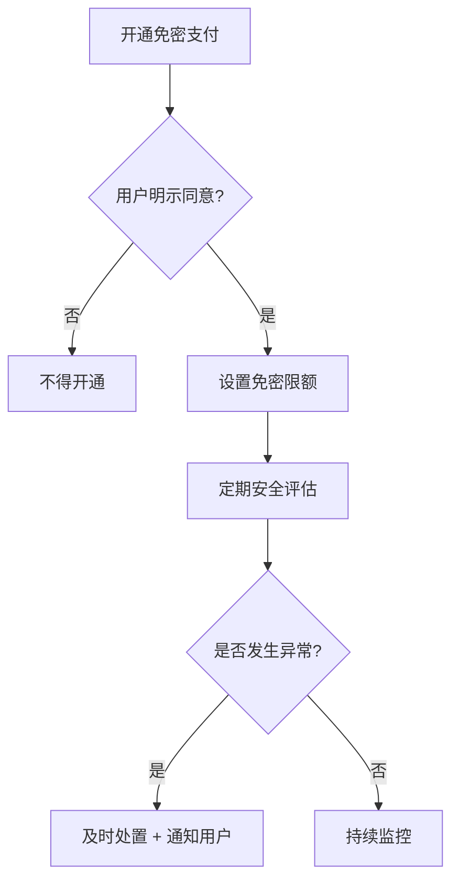

在日常消费中，你可能已经习惯了"滴滴一下，支付完成"的体验——无需输入密码，无需签名，只需指纹或人脸验证，甚至在某些场景下连生物识别都省略了。这种「免密支付」模式的普及，极大提升了交易效率，但也引发了广泛的安全讨论。本文从技术原理、安全机制、风险防控、合规要求四个维度，对免密支付进行全面解析。

## 什么是免密支付？

免密支付（Passwordless Payment）指用户在交易过程中，无需输入传统密码即可完成的支付行为。其核心逻辑是**用其他认证因子替代密码**，常见的替代因子包括：

- **生物识别**：指纹、虹膜、人脸、声纹
- **设备验证**：手机SIM卡、NFC芯片、设备证书
- **行为特征**：笔迹、压力感应、滑动轨迹
- **一次性凭证**：短信验证码、推送确认（本质上仍是"something you have"）

### 免密 vs. 传统密码支付

| 对比维度 | 传统密码支付 | 免密支付 |
|----------|-------------|---------|
| 认证方式 | 静态密码 | 动态生物识别/设备绑定 |
| 体验 | 输入慢、需记忆 | 快、"无感" |
| 安全边界 | 密码可泄露/猜测 | 生物特征难以伪造 |
| 适用场景 | 所有支付 | 小额/线下/高频场景 |

## 免密支付的类型

### 1. 小额免密

在一定额度（如1000元）以下的交易，无需密码即可完成。常见于公交卡、便利店、停车场等高频小额场景。

**代表产品**： Visa payWave、Mastercard Contactless、银联闪付QuickPass

### 2. 扫码免密

用户提前授权绑定支付账户（如微信、支付宝），出示付款码由商户扫描。交易过程中用户只需展示手机屏幕（甚至在网络离线时）。

**安全机制**：
- 每分钟自动更新动态码
- 离线码基于安全芯片实时生成
- 金额超过限额需验证密码

### 3. 生物识别支付

将生物特征与支付账户绑定，支付时通过传感器验证身份。

**代表产品**： Apple Pay Face ID、微信/支付宝指纹支付

### 4. 线下非接支付（NFC）

手机或穿戴设备通过NFC技术与POS终端通信，完成"一挥即付"。

## 免密支付的安全机制

免密支付的「免密」并非「无安全」，而是通过其他维度构建防护。

### 分层风控模型

### 关键技术手段

**Tokenization（令牌化）**：真实卡号不上送、不存储，以Token替代。即使Token泄露也无法还原真实卡号。

**动态安全码（Dynamic CVV）**：每次交易生成不同的CVV2，有效防止卡号泄露后的复制盗刷。

**设备绑定**：支付能力与特定设备强关联，换设备需重新认证。

**行为分析**：基于用户历史行为模式（如常用设备、地理位置、消费时段）实时评估风险。

## 免密支付的风险与挑战

### 1. 生物特征泄露的不可逆性

密码泄露可以更改，但生物特征（如指纹）一旦泄露，无法"吊销"。2019年某快递柜被曝出用人脸照片即可解锁，就是典型案例。

**缓解措施**：
- 活体检测（3D结构光、红外泛光）
- 特征模板分布式存储
- 本地比对，结果不上传

### 2. 免密额度的"双刃剑"

高免密限额带来便捷，但也意味着更大的潜在损失。

**行业实践**：一般将免密限额设在300-1000元区间，并根据用户信用等级动态调整。

### 3. 社会工程学攻击

攻击者通过诈骗、诱导等方式，利用免密支付的便捷性实施盗刷。例如：

- 诱骗用户扫描伪装二维码
- 劫持短信验证码
- 冒充客服诱导关闭风控

### 4. 互连互通带来的系统性风险

不同平台、钱包、银行之间的互连，使得风险可以在整个生态中快速传导。

## 免密支付的合规要求

### PCI DSS对免密支付的规范

PCI DSS（支付卡行业数据安全标准）对免密支付有明确的合规要求：

| 合规要求 | 说明 |
|---------|------|
| **生物特征存储** | 生物模板必须加密存储于SCE（安全执行环境）或安全芯片中 |
| **传输安全** | 生物特征在传输过程中必须加密，不能明文上送服务器 |
| **比对策略** | 本地比对优先，必要时可上传脱敏特征用于风控 |
| **设备认证** | 支持免密支付的设备需通过EMVCo认证 |

### 监管要求

中国监管机构对免密支付有以下核心要求：

1. **用户授权**：免密服务必须经用户明示同意，不得默认开通
2. **限额管理**：单笔/日累计免密限额须经用户确认
3. **损失赔付**：因机构原因导致的损失，平台应承担先行赔付责任
4. **信息透明**：免密规则、风险提示须显著告知用户

## 免密支付的未来趋势

### 1. 零信任支付认证

借鉴零信任架构理念，每次交易都进行动态风险评估，不再依赖"已登录/已验证"的隐式信任。

### 2. 隐私增强计算

利用联邦学习、安全多方计算等技术，在不暴露用户生物特征的前提下完成身份认证。

### 3. 行为生物识别的融合

将击键节奏、步态、触控压力等行为特征与生理特征融合，构建更难伪造的多因子认证体系。

### 4. 离线免密能力的增强

提升设备在离线状态下的安全支付能力，减少对网络连接的依赖。

## 总结

免密支付是支付体验演进的重要方向，其核心价值在于通过技术创新，将安全从「用户责任」转化为「系统能力」。

**对用户**：享受便捷的同时，应了解免密规则、妥善保管设备、警惕社会工程学攻击。

**对商户**：接入免密支付需评估通道合规性、交易风险监控能力、资金损失兜底机制。

**对行业**：免密支付的普及降低了交易摩擦，但也扩大了攻击面。构建「便捷与安全并重」的支付生态，需要技术、监管、用户教育多管齐下。

---

*相关话题： [Token支付详解](./token-payment-guide.html)、 [移动支付Apple Pay与Google Pay](./mobile-wallets-apple-google-pay.html)、 [3D Secure支付验证](./3ds-overview.html)、 [PCI DSS合规概述](./pci-dss-overview.html)*