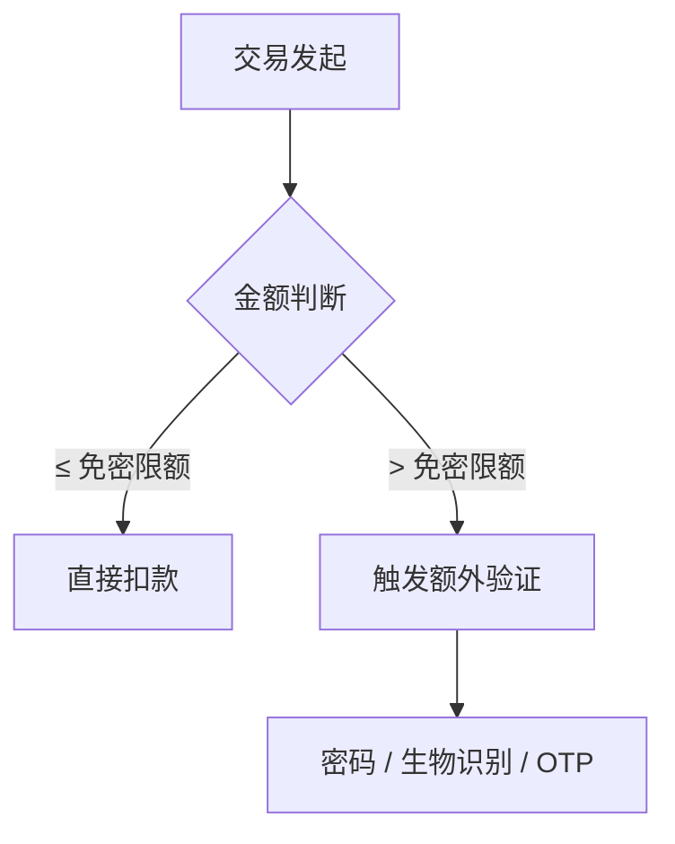
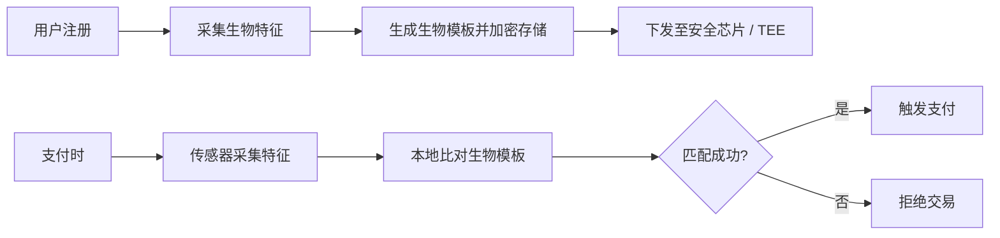
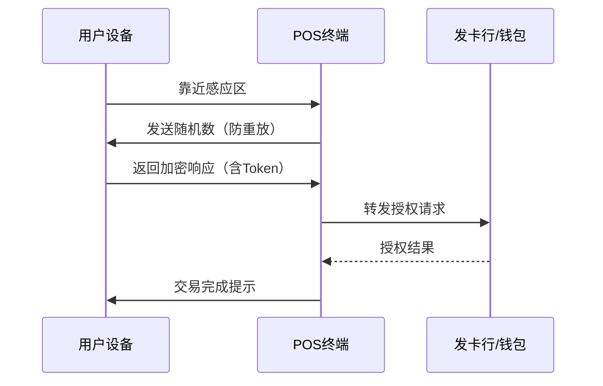
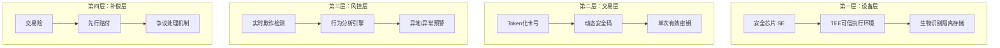
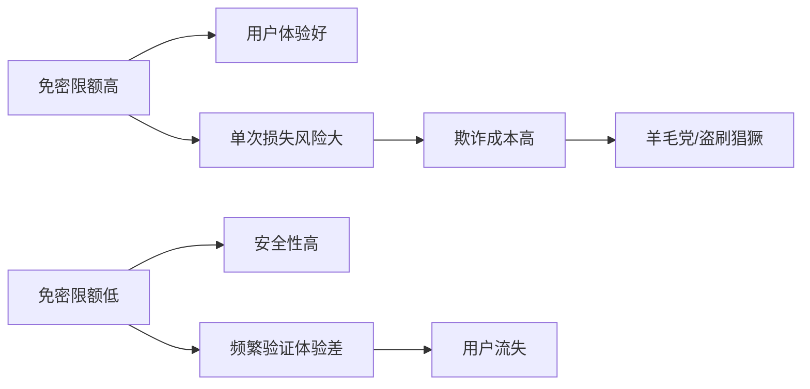
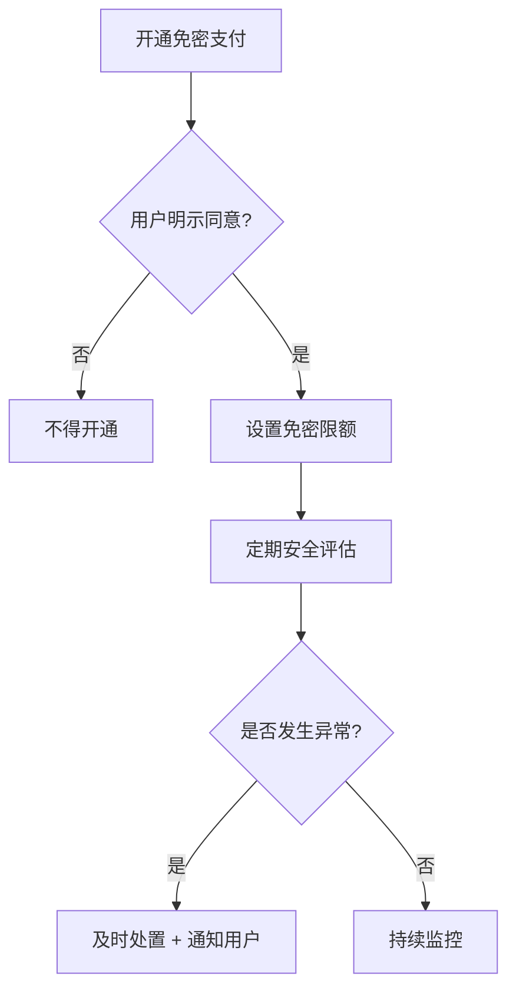

打车、扫码里常见「不输密码就扣款」：小额免密、事先代扣协议、或者生物识别在背后挡了一刀。行业里名字一堆，核心都是 **用别的东西顶替「输密码」这一步**。下面写 **钱怎么出去、风控卡在哪、监管在盯什么** —— 不替你做开不开启用决策。

## 什么是免密支付？

英文名常叫 Passwordless Payment，说白了：**结账时不要你敲支付密码**，换成下面某一类东西顶上（有的算强认证，有的只是设备信任）：

- **生物识别**：指纹、虹膜、人脸、声纹
- **设备验证**：手机SIM卡、NFC芯片、设备证书
- **行为特征**：笔迹、压力感应、滑动轨迹
- **一次性凭证**：短信验证码、推送确认（本质上仍是"something you have"）

### 免密 vs. 传统密码支付

| 对比维度 | 传统密码支付 | 免密支付 |
|----------|-------------|---------|
| 认证方式 | 静态密码 | 动态生物识别/设备绑定 |
| 体验 | 输入慢、需记忆 | 快、"无感" |
| 安全边界 | 密码可泄露/猜测 | 生物特征泄露难吊销，需配合设备与风控 |
| 适用场景 | 所有支付 | 小额/线下/高频场景 |

## 免密支付的类型

### 1. 小额免密

在一定额度以下的交易，无需密码即可完成（国内常见区间约 300～1000 元，**以当期银行/钱包公示为准**）。常见于公交卡、便利店、停车场等高频小额场景。

**代表产品**： Visa payWave、Mastercard Contactless、银联闪付QuickPass

### 2. 扫码免密

用户提前授权绑定支付账户（如微信、支付宝），出示付款码由商户扫描。交易过程中用户只需展示手机屏幕（甚至在网络离线时）。

**安全机制**：
- 每分钟自动更新动态码
- 离线码基于安全芯片实时生成
- 金额超过限额需验证密码

### 3. 生物识别支付

将生物特征与支付账户绑定，支付时通过传感器验证身份。

**代表产品**： Apple Pay Face ID、微信/支付宝指纹支付

### 4. 线下非接支付（NFC）

手机或穿戴设备通过NFC技术与POS终端通信，完成"一挥即付"。

## 免密支付的安全机制

「免密」不是裸奔，是把 **密码那一棒** 交给设备、生物特征或限额策略去扛。

### 分层风控模型

### 关键技术手段

**Tokenization（令牌化）**：真实卡号不上送、不存储，以Token替代。即使Token泄露也无法还原真实卡号。

**动态安全码（Dynamic CVV）**：每次交易生成不同的CVV2，有效防止卡号泄露后的复制盗刷。

**设备绑定**：支付能力与特定设备强关联，换设备需重新认证。

**行为分析**：基于用户历史行为模式（如常用设备、地理位置、消费时段）实时评估风险。

## 免密支付的风险与挑战

### 1. 生物特征泄露的不可逆性

密码泄露可以更改，但生物特征（如指纹）一旦泄露，无法"吊销"。2019年某快递柜被曝出用人脸照片即可解锁，就是典型案例。

**缓解措施**：
- 活体检测（3D结构光、红外泛光）
- 特征模板分布式存储
- 本地比对，结果不上传

### 2. 免密额度的"双刃剑"

高免密限额带来便捷，但也意味着更大的潜在损失。

**行业实践**：一般将免密限额设在300-1000元区间，并根据用户信用等级动态调整。

### 3. 社会工程学攻击

攻击者通过诈骗、诱导等方式，利用免密支付的便捷性实施盗刷。例如：

- 诱骗用户扫描伪装二维码
- 劫持短信验证码
- 冒充客服诱导关闭风控

### 4. 互连互通带来的系统性风险

钱包、银行、商户 API 一串打通之后，**一处风控松了，脏流量会顺着接口扩散**，别指望单点能挡住。

## 免密支付的合规要求

「合规」常被混成一张表，其实 **PCI DSS、EMV/卡组织、国内监管** 各管一段——别全贴成「PCI 条文」。

### 各框架各管什么

| 框架 | 主要管什么 | 与免密的关系 |
| --- | --- | --- |
| **PCI DSS** | 持卡人数据（PAN、SAD 等）的存储、传输、访问控制 | 商户/收单若碰 CHD，须按 SAQ 类型达标；**不单独开「生物识别一章」** |
| **EMV / 卡组织** | 非接、Token、3DS、终端认证 | 闪付、Apple Pay 等走 EMV 路线与终端/钱包认证 |
| **国内监管（人行、网联等）** | 限额、授权、赔付、信息披露 | 小额免密、扫码代扣的 **明示同意与限额** |

### EMV 与设备侧（非 PCI 专属条文）

钱包/终端实现里常见要求（具体以 **EMVCo、收单行** 文档为准）：

| 要求 | 说明 |
| --- | --- |
| **生物模板存储** | 优先在 SE / TEE 等安全环境，避免明文落盘 |
| **传输** | 生物特征不上送明文；线上多用 Token / cryptogram，非传统 CVV2 |
| **比对策略** | 本地比对优先；风控侧可用脱敏信号 |
| **终端认证** | 非接/钱包方案常要求 **EMVCo L1/L2** 等认证 |

### 国内监管要求

中国监管机构对免密支付有以下核心要求：

1. **用户授权**：免密服务必须经用户明示同意，不得默认开通
2. **限额管理**：单笔/日累计免密限额须经用户确认
3. **损失赔付**：因机构原因导致的损失，平台应承担先行赔付责任
4. **信息透明**：免密规则、风险提示须显著告知用户

## 行业里还在试的方向

下面这些 **PPT 和论文里常见**，落地节奏因地区和通道差很多：

### 1. 每笔都过一遍风控（零信任口吻）

少信「登录过一次就永远可信」，交易级评分权重大了，**误杀和体验**要自己权衡。

### 2. 生物特征少出设备

联邦学习、MPC 一类说法多，工程上先看 **模板是不是死在 SE/TEE 里**。

### 3. 行为特征当辅因子

击键、步态之类 **当甜点可以，当主菜慎重**，隐私和误报都是坑。

### 4. 离线也能付

公交、地铁场景爱提；**密钥轮换和重放**要比在线场景更难搞。

## 总结

免密省的是 **手指**，不是 **责任**：用户侧看紧设备和短信；商户侧把 **限额、对账、拒付** 和通道条款对齐；行业侧——摩擦小了，攻击面也会变大，技术、监管、用户教育几头往往一起擦屁股。

---

*相关话题： [Token支付详解](./token-payment-guide.html)、 [移动支付Apple Pay与Google Pay](./mobile-wallets-apple-google-pay.html)、 [3D Secure支付验证](./3ds-overview.html)、 [PCI DSS合规概述](./pci-dss-overview.html)*