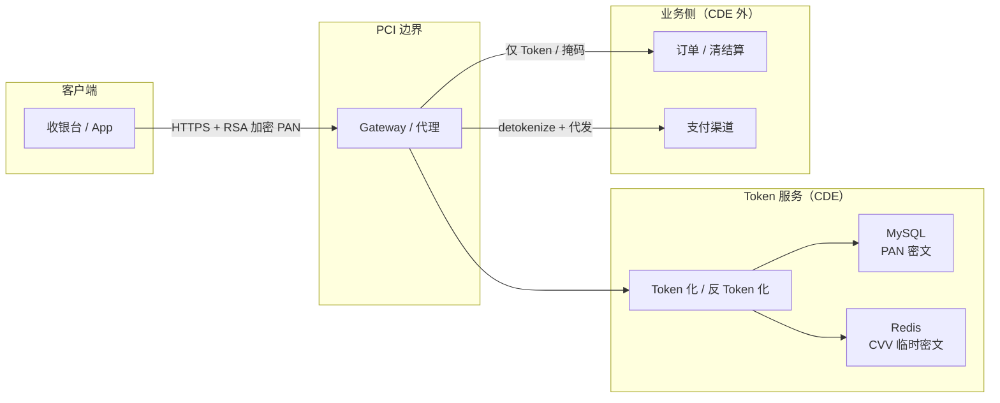
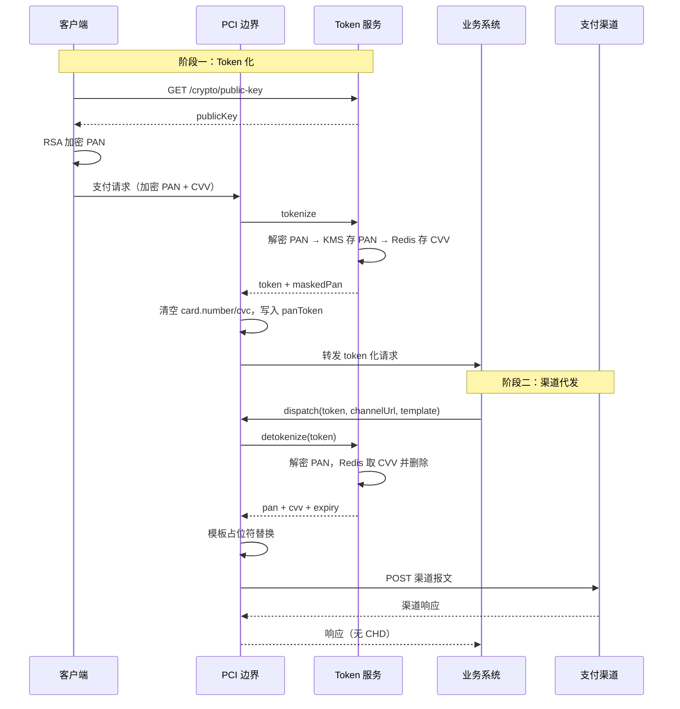

自建支付链路时，最难的不是接渠道 API，而是 **把 PAN/CVV 关在 CDE 里**：订单、清结算、风控都想碰卡信息，但 PCI 要求 **尽可能缩小接触明文卡数据的系统范围**。很多团队做到「数据库里 PAN 加密了」就停——CVV 还在 MySQL、业务日志里偶尔打出完整 request body、下游拿到的所谓 Token 其实是可逆密文，审计一戳就穿。

姊妹篇：[PCI DSS 入门](./pci-dss-overview.html) 讲标准地图；[PCI DSS 支付系统技术实现指南](./pci-dss-implementation.html) 用 Go/React 串了一遍前后端落点。本文只抠 **隔离模型**：PCI 边界怎么画、Token 服务管什么、PAN 和 CVV 为什么必须分开存、渠道代发时明文只在哪存活几毫秒。

> 官方参考：[PCI SSC](https://www.pcisecuritystandards.org/) · [PCI DSS v4.0](https://www.pcisecuritystandards.org/document_library/)  
> 下文为 **工程讨论稿**，不能替代 QSA 意见；CDE 范围与 SAQ 选型以收单机构为准。

## 先分清：Token、加密 PAN、掩码

| 概念 | 是什么 | 常见误区 |
| --- | --- | --- |
| **Card Token** | 与 PAN 无推导关系的随机 ID（如 UUID） | 把 KMS 加密后的 PAN 当 Token 传给下游 |
| **加密 PAN** | 静态存储用的密文，只在 detokenize 路径解密 | 以为 Token 化 = 加密存库就完事 |
| **掩码（Masking）** | `411111******1111` 一类展示串 | 查询接口返回完整卡号「方便运营」 |
| **CVV 保险库** | 短 TTL 缓存 + 读后删除 | CVV 跟 PAN 一起落关系库 |

说白了：**Token 给业务用，密文给存储用，掩码给人看；CVV 单独一条生命周期，授权完就不该还在。**

## 为什么要做 PCI 隔离

PCI DSS 对持卡人数据（CHD）的核心要求，可以收成一句：**少碰、短留、强边界**。

| 数据 | 敏感级别 | 常见处理方式 |
| --- | --- | --- |
| PAN（主账号） | 高 | Token 化 + KMS/HSM 加密存储 |
| CVV/CVC | 极高 | 短生命周期、一次性使用 |
| 有效期 | 中 | 与 Token 绑定存储 |
| 持卡人姓名 | 中 | 可明文或轻度保护 |

理想状态下：

- 前端收银台、订单系统、清结算 **不长期持有 PAN/CVV**
- 专门的 **Token 服务（CDE 内）** 负责加密、存储与按需还原
- 渠道报文组装在受控边界内完成，明文驻留时间尽量压到毫秒～秒级

## 总体架构：边界 + 分层加密

一种常见且能落地的切法如下：



### 三层保护模型

| 层级 | 手段 | 保护对象 | 设计意图 |
| --- | --- | --- | --- |
| 传输层 | RSA / ECIES 等非对称加密 | 客户端 → 服务端的 PAN | 防止网络窃听 |
| 存储层 | 信封加密 / KMS | 数据库中的 PAN | 防止库泄露 |
| CVV 隔离层 | 独立存储 + 短 TTL + 读后删除 | CVV | 不可持久化、不可复用 |

三层 **缺一不可**：只做库加密不分离 CVV，或只做 Token 不加密传输，都构不成完整防护。

::: warning 注意
示例代码为 **教学骨架**。生产环境还需 HSM/KMS 集成、审计、限流、密钥轮换与完整异常体系；detokenize / dispatch 接口必须 **强鉴权**（API Key、mTLS 等）。
:::

## 核心概念

### Card Token

Card Token 是对 PAN 的 **不可逆替代标识**（实践中常用 UUID 或加密随机串）。对外只传 Token，不传 PAN。

```text
PAN: 4111 **** **** 1111  →  Token: tok_a8f3c2e1-7b4d-4f9a-9c6e-2d1f8a3b5c7e
```

Token 本身不含卡号信息；前提是 PAN 没有以可逆方式编码进 Token 字符串。

### PAN 与 CVV 分离

PCI 对 CVV 比 PAN 更严：**授权完成后不应存储 CVV**。

推荐做法：

- **PAN**：KMS 加密后写入关系库，与 Token 绑定，可长期存在
- **CVV**：加密后写入 Redis 等高速缓存，TTL 约 2～5 分钟，**首次读取后立即删除**

这样，查询类 API 可以返回掩码卡号；只有渠道代发路径才能一次性取出 CVV。

### 掩码（Masking）

对外展示用 `first6 + **** + last4`：

```text
411111******1111
```

BIN（前 6 位）和 Last4 可明文存，供风控、卡组织识别——风险相对可控。

## 五条关键业务流程

### 1. 获取公钥（客户端加密准备）

```text
客户端 ──GET /crypto/public-key──▶ Token 服务
       ◀── { publicKey } ────────
```

客户端本地用公钥加密 PAN，再提交 Token 化请求。明文 PAN **不应** 出现在业务服务器日志里。

### 2. Token 化（Tokenize）

```text
客户端 ──POST /tokens──▶ PCI 边界 ──▶ Token 服务
         { encryptedPan, cvv, expiry, holderName, userId }
```

Token 服务内部步骤：

1. 校验入参
2. 私钥解密 `encryptedPan` → 明文 PAN
3. KMS/主密钥加密 PAN，写入数据库
4. 生成 Token（UUID）
5. 计算 bin、last4、掩码
6. 加密 CVV，写入缓存并设 TTL
7. 返回 `{ token, maskedPan, expiry }` — **不含 CVV**

### 3. 代理改写（Edge Tokenization）

业务仍按「带 `card` 节点的 JSON」提交支付时，可在 **PCI 边界** 做请求体改写，完成 **卡数据截断**。

**改写前：**

```json
{
  "paymentMethod": {
    "card": {
      "number": "<encrypted-pan>",
      "cvc": "123",
      "expiryMonth": "12",
      "expiryYear": "2028",
      "holderName": "Alice"
    }
  }
}
```

**改写后：**

```json
{
  "paymentMethod": {
    "card": {
      "number": "",
      "cvc": "",
      "panToken": "tok_xxx",
      "bin": "411111",
      "last4": "1111",
      "expiryMonth": "12",
      "expiryYear": "2028",
      "holderName": "Alice"
    }
  }
}
```

下游从此只处理 Token；PAN/CVV 在边界被换掉。

### 4. 反 Token 化 + 渠道代发

收单机构 API 通常仍要明文 PAN/CVV——这一步 **必须在 PCI 边界内** 完成：

```text
业务系统 ──POST /channel/dispatch──▶ PCI 边界
           Header: X-Api-Key
           Body: { token, channelUrl, payloadTemplate }

PCI 边界:
  1. 鉴权
  2. detokenize(token) → { pan, cvv, expiry }
  3. 模板占位符替换为明文
  4. HTTP POST 到渠道 URL
  5. 返回渠道响应（不含 PAN/CVV）
```

模板占位符示例：

```text
@@cardNo@@       → PAN
@@cvv2@@         → CVV
@@expireMonth@@  → 月
@@expireYear@@   → 年
```

明文仅在内存中存在毫秒～秒级，**不写入日志、不落盘**。

### 5. 安全查询（Query without CHD）

按 Token 或用户 ID 查询时，**只返回掩码与元数据**：

```text
GET /tokens/by-user/{userId}
→ [{ token, maskedPan, cardType, expiry, holderName }]
```

## Java 示例：核心实现骨架

下面用 Java 把 **Token 服务 + 边界改写 + 渠道代发** 串起来；姊妹篇里的 Go 版 TokenizationService 可对照看语言差异，安全模型相同。

### 领域模型

```java
/** Token 化请求 */
public record TokenizeRequest(
    String userId,
    String encryptedPan,   // 客户端 RSA 加密后的 PAN
    String cvv,
    String holderName,
    String expiryMonth,
    String expiryYear,
    String cardType,
    String procMethod
) {}

/** Token 化响应 — 不含 CVV */
public record TokenizeResponse(
    String token,
    String maskedPan,
    String expiryMonth,
    String expiryYear
) {}

/** 反 Token 化 — 仅内部 / 渠道代发 */
public record DetokenizeResponse(
    String pan,
    String cvv,
    String holderName,
    String expiryMonth,
    String expiryYear
) {}
```

### 加密抽象

```java
/** 传输层：RSA 解密客户端提交的 PAN */
public interface TransportDecryptor {
    String decrypt(String ciphertext);
}

/** 存储层：PAN/CVV 对称加密（背后接 KMS / Vault） */
public interface FieldEncryptor {
    String encrypt(String plaintext);
    String decrypt(String ciphertext);
}

/** CVV 临时存储：短 TTL + 一次性读取 */
public interface CvvVault {
    void store(String token, String encryptedCvv, Duration ttl);
    Optional<String> takeAndDelete(String token);
}
```

### Token 服务核心逻辑

```java
public class CardTokenService {

    private final TransportDecryptor transportDecryptor;
    private final FieldEncryptor fieldEncryptor;
    private final CvvVault cvvVault;
    private final CardTokenRepository repository;
    private final Duration cvvTtl;

    public TokenizeResponse tokenize(TokenizeRequest req) {
        validate(req);

        String pan = transportDecryptor.decrypt(req.encryptedPan());
        String token = UUID.randomUUID().toString();
        String panCipher = fieldEncryptor.encrypt(pan);
        String bin = pan.substring(0, 6);
        String last4 = pan.substring(pan.length() - 4);
        String masked = bin + "******" + last4;

        repository.save(new CardTokenRecord(
            token, req.userId(), panCipher, bin, last4, masked,
            req.holderName(), req.expiryMonth(), req.expiryYear(),
            req.cardType(), req.procMethod()
        ));

        String cvvCipher = fieldEncryptor.encrypt(req.cvv());
        cvvVault.store(token, cvvCipher, cvvTtl);

        return new TokenizeResponse(token, masked, req.expiryMonth(), req.expiryYear());
    }

    public DetokenizeResponse detokenize(String token) {
        CardTokenRecord record = repository.findByToken(token)
            .orElseThrow(() -> new TokenNotFoundException(token));

        String pan = fieldEncryptor.decrypt(record.panCipher());
        String cvvCipher = cvvVault.takeAndDelete(token)
            .orElseThrow(() -> new CvvExpiredException(token));
        String cvv = fieldEncryptor.decrypt(cvvCipher);

        return new DetokenizeResponse(
            pan, cvv, record.holderName(),
            record.expiryMonth(), record.expiryYear()
        );
    }
}
```

### PCI 边界：请求体改写

```java
public class PaymentPayloadTokenizer {

    private final CardTokenService tokenService;
    private final ObjectMapper mapper = new ObjectMapper();

    public String rewrite(String rawJson) throws JsonProcessingException {
        JsonNode root = mapper.readTree(rawJson);
        JsonNode card = root.path("paymentMethod").path("card");
        if (card.isMissingNode()) return rawJson;

        TokenizeResponse resp = tokenService.tokenize(new TokenizeRequest(
            text(card, "externalId"), text(card, "number"), text(card, "cvc"),
            text(card, "name"), text(card, "expiryMonth"), text(card, "expiryYear"),
            text(card, "cardType"), text(card, "procMethod")
        ));

        ObjectNode cardNode = (ObjectNode) card;
        cardNode.put("number", "");
        cardNode.put("cvc", "");
        cardNode.put("panToken", resp.token());
        cardNode.put("bin", resp.maskedPan().substring(0, 6));
        cardNode.put("last4", resp.maskedPan().substring(resp.maskedPan().length() - 4));

        return mapper.writeValueAsString(root);
    }
}
```

### PCI 边界：渠道报文代发

```java
public class ChannelDispatcher {

    private final CardTokenService tokenService;
    private final HttpClient httpClient;

    public ChannelDispatchResult dispatch(ChannelDispatchCommand cmd) {
        DetokenizeResponse card = tokenService.detokenize(cmd.token());

        String payload = cmd.payloadTemplate()
            .replace("@@cardNo@@", card.pan())
            .replace("@@cvv2@@", card.cvv())
            .replace("@@expireMonth@@", card.expiryMonth())
            .replace("@@expireYear@@", card.expiryYear());

        HttpRequest request = HttpRequest.newBuilder()
            .uri(URI.create(cmd.channelUrl()))
            .header("Content-Type", "application/json")
            .headers(cmd.headers())
            .POST(HttpRequest.BodyPublishers.ofString(payload))
            .build();

        HttpResponse<String> response =
            httpClient.send(request, HttpResponse.BodyHandlers.ofString());
        return new ChannelDispatchResult(response.statusCode(), response.body());
        // payload / card 随栈帧销毁；日志禁止打印 body
    }
}
```

传输层解密示例（OAEP 优于 PKCS#1 v1.5；生产也可考虑 ECIES 或 mTLS）：

```java
Cipher cipher = Cipher.getInstance("RSA/ECB/OAEPWithSHA-256AndMGF1Padding");
cipher.init(Cipher.DECRYPT_MODE, privateKey);
byte[] plain = cipher.doFinal(Base64.getDecoder().decode(base64Ciphertext));
```

## 数据存储设计

### 关系表 `card_token`

| 列 | 类型 | 说明 |
| --- | --- | --- |
| token | VARCHAR(36) PK | UUID |
| user_id | VARCHAR(64) | 业务用户标识 |
| pan_cipher | TEXT | KMS 加密后的 PAN |
| bin | CHAR(6) | 明文，风控用 |
| last4 | CHAR(4) | 明文 |
| masked_pan | VARCHAR(19) | 展示用掩码 |
| holder_name | VARCHAR(128) | 持卡人 |
| expiry_month / expiry_year | CHAR | 有效期 |
| card_type | VARCHAR(16) | |
| created_at | TIMESTAMP | |

<strong>不应出现的列</strong>：`cvv`、`cvv_cipher`——CVV 不落关系库。

### CVV 缓存

```text
Key:   cvv:{token}
Value: {kms_encrypted_cvv}
TTL:   120s ~ 300s（按业务 SLA 调整）
```

读取策略：**GET + DEL** 原子操作，保证 CVV 只用一次。

## 端到端时序



## 安全 checklist

### 必须做

- [ ] PAN 传输加密（RSA/ECIES 或等价方案）
- [ ] PAN 静态加密（KMS/HSM）
- [ ] CVV 与 PAN 分离存储
- [ ] CVV 短 TTL + 读后删除
- [ ] 查询 API 不返回 CHD
- [ ] 渠道代发 API 独立鉴权
- [ ] 日志脱敏：禁止打印 PAN、CVV、完整 request body
- [ ] 密钥轮换与访问审计

### 常见误区

| 误区 | 正确做法 |
| --- | --- |
| Token 化后 CVV 也存数据库 | CVV 只进缓存，且一次性 |
| 把加密 PAN 当 Token 传给下游 | Token 应是无意义的随机 ID |
| 查询接口返回完整卡号 | 只返回掩码 |
| 渠道代发日志打印替换后的 body | 只记录 token、渠道、状态码 |
| 所有接口都不鉴权 | detokenize / dispatch 必须强鉴权 |

## 扩展方向

核心模型稳定后，可按需演进：

1. **Network Token**：对接 Visa VTS、Mastercard MDES，进一步减少自有环境内的 PAN 接触
2. **Format-Preserving Encryption (FPE)**：需要保留卡号格式的少数场景
3. **HSM 卸载**：私钥与 DEK 不出 HSM
4. **多区域 KMS**：跨境部署时的密钥属地合规
5. **Token 生命周期**：过期清理、用户删卡、合规留存策略

## 小结

- **截断**：在 PCI 边界把 PAN/CVV 换成 Token，下游不见明文
- **分离**：PAN 加密持久化，CVV 临时缓存且一次性消费
- **收敛**：只在渠道代发的最后一刻、受控代码路径内短暂还原明文

Gateway 用 Spring Cloud 还是 Kong、注册中心用 Eureka 还是 K8s Service，**都不改变** 上面三条。边界画清楚、数据生命周期管严格，比微服务组件选型更决定你能不能过 PCI 范围评估。

---

**延伸阅读**

- [PCI DSS 支付卡行业数据安全标准入门指南](./pci-dss-overview.html)
- [PCI DSS 支付系统技术实现指南](./pci-dss-implementation.html)
- [PCI Security Standards Council](https://www.pcisecuritystandards.org/)
