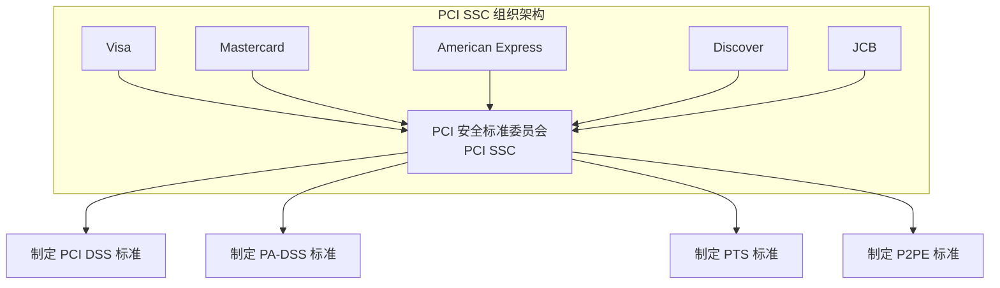
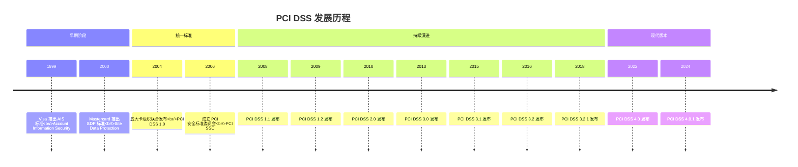
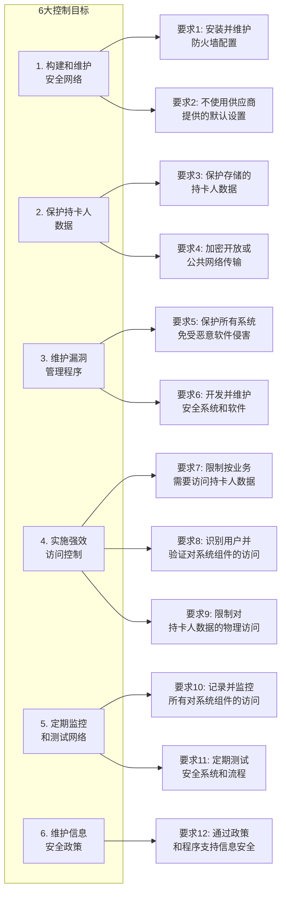
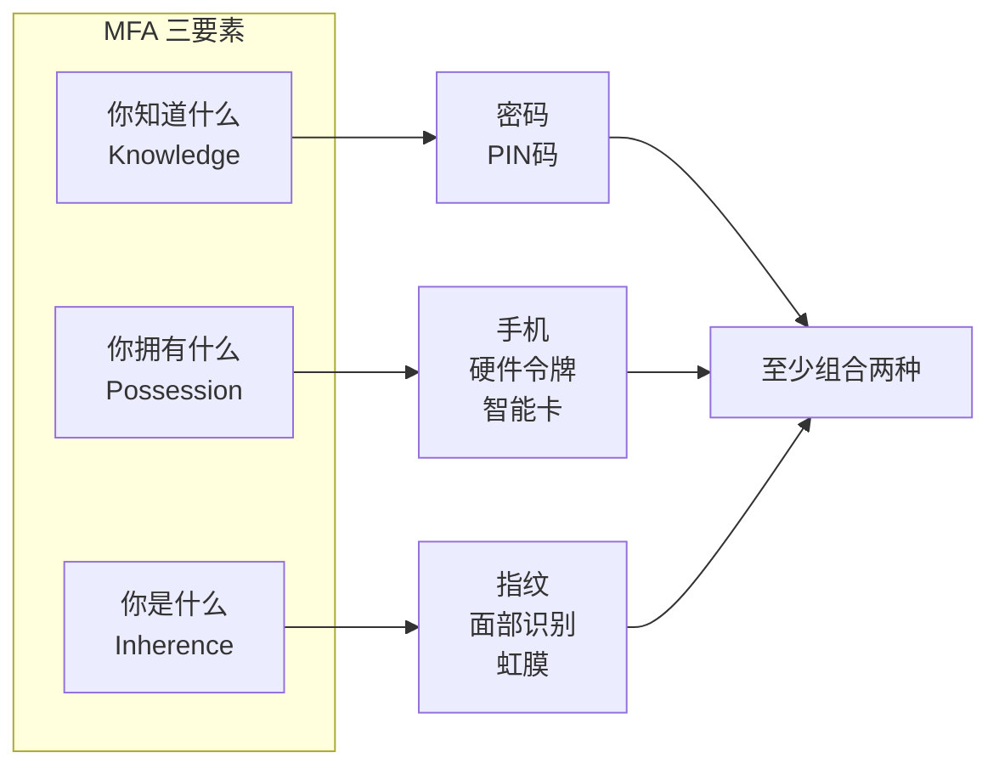
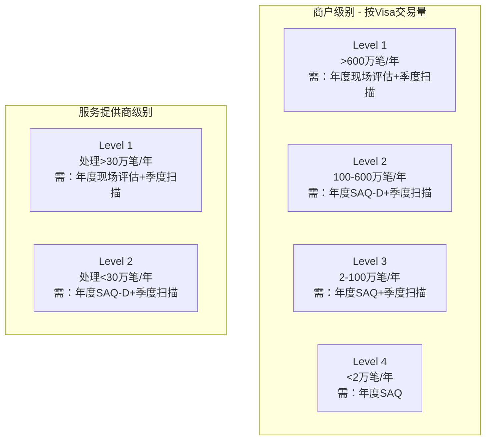
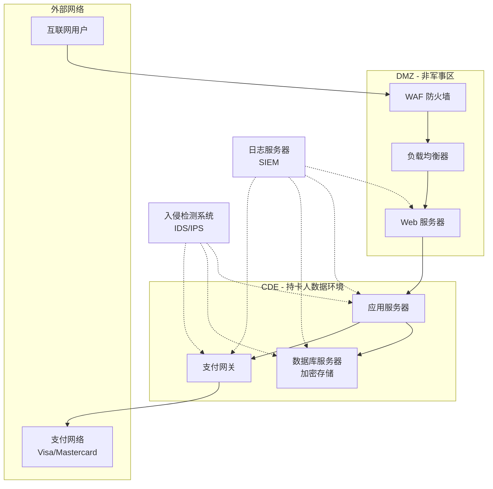
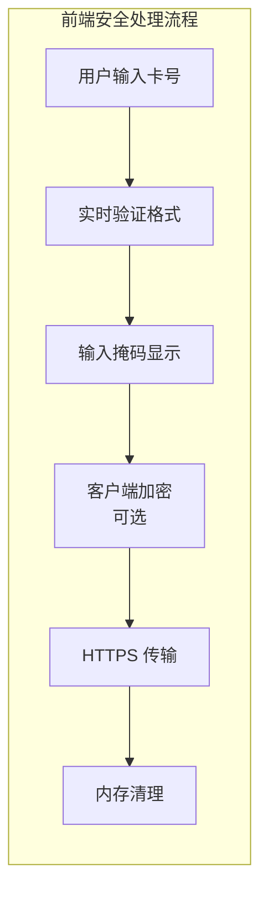
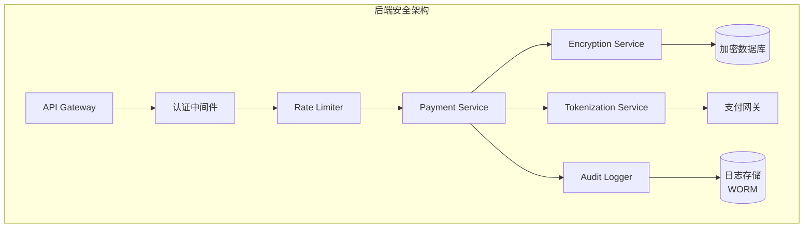
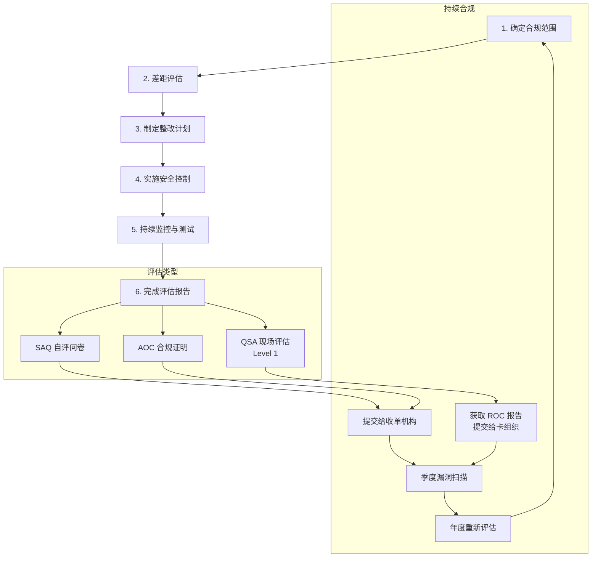
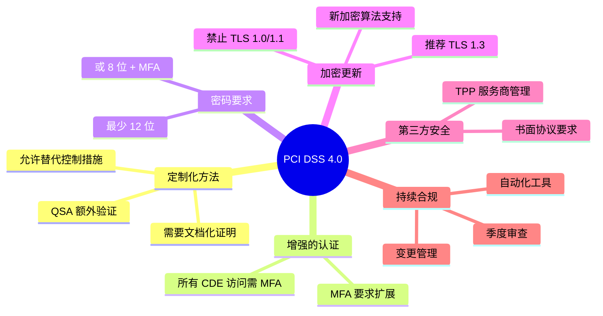

## 什么是 PCI DSS？

PCI DSS（Payment Card Industry Data Security Standard，支付卡行业数据安全标准）是一套由主要信用卡品牌（Visa、Mastercard、American Express、Discover、JCB）共同制定的安全标准，旨在保护持卡人数据安全。



## PCI DSS 的发展历史



### 版本演进关键变化

| 版本 | 发布时间 | 主要变化 |
|------|----------|----------|
| 1.0 | 2004 | 首次统一标准，12项核心要求 |
| 2.0 | 2010 | 强化虚拟化安全，明确范围界定 |
| 3.0 | 2013 | 增加恶意软件防护，强调持续合规 |
| 3.2 | 2016 | 新增多因素认证要求，强化 SSL/TLS 迁移 |
| 4.0 | 2022 | 全面更新，增加定制化方法，强化认证要求 |

## PCI DSS 4.0 核心要求

PCI DSS 4.0 包含 6 大控制目标，12 项核心要求，共计 250+ 项具体测试步骤。



### 关键要求详解

#### 要求 3：保护存储的持卡人数据

**3.1 数据保留策略**
- 定义数据保留政策
- 限制数据存储量
- 安全删除不需要的数据

**3.2 禁止存储敏感认证数据**
- 完整磁道数据（磁条或芯片数据）
- 卡验证码（CVV/CVC/CID）
- PIN 码或 PIN 块

**3.3-3.7 数据加密与掩码**

```
可接受的数据存储：
┌─────────────────────────────────────────────┐
│ PAN（主账号）：可存储，但需加密或标记化     │
│ 持卡人姓名：可存储                          │
│ 有效期：可存储                              │
├─────────────────────────────────────────────┤
│ 禁止存储：                                  │
│ ✗ 完整磁道数据                              │
│ ✗ CVV/CVC/CID（3-4位安全码）               │
│ ✗ PIN/PIN 块                               │
└─────────────────────────────────────────────┘
```

#### 要求 4：加密传输中的持卡人数据

**4.1 传输加密要求**
- 使用 TLS 1.2 或更高版本
- 禁用 SSL 和早期 TLS 版本
- 正确配置加密参数

**4.2 验证证书有效性**

```javascript
// Node.js 证书验证示例
const https = require('https');
const tls = require('tls');

// 创建安全的 HTTPS Agent
const secureAgent = new https.Agent({
  // 最低 TLS 1.2
  minVersion: 'TLSv1.2',
  // 推荐使用 TLS 1.3
  maxVersion: 'TLSv1.3',
  // 验证服务器证书
  rejectUnauthorized: true,
  // 检查证书吊销状态
  crl: await loadCRL(),
  // 证书固定（可选，增强安全性）
  checkServerIdentity: (host, cert) => {
    // 验证证书指纹
    const expectedFingerprint = 'sha256指纹';
    if (cert.fingerprint256 !== expectedFingerprint) {
      return new Error('证书验证失败');
    }
  }
});
```

#### 要求 8：身份识别与认证

**8.3 多因素认证（MFA）**



**8.4 密码策略**

```java
// Java 密码策略验证示例
public class PasswordPolicy {

    // PCI DSS 4.0 要求：至少12位，或8位+MFA
    private static final int MIN_PASSWORD_LENGTH = 12;
    private static final int MIN_PASSWORD_WITH_MFA = 8;

    public static boolean validatePassword(String password, boolean hasMFA) {
        int minLength = hasMFA ? MIN_PASSWORD_WITH_MFA : MIN_PASSWORD_LENGTH;

        if (password == null || password.length() < minLength) {
            return false;
        }

        // 检查复杂度：至少包含大写、小写、数字、特殊字符中的三种
        int complexityCount = 0;
        if (password.matches(".*[A-Z].*")) complexityCount++; // 大写
        if (password.matches(".*[a-z].*")) complexityCount++; // 小写
        if (password.matches(".*[0-9].*")) complexityCount++; // 数字
        if (password.matches(".*[!@#$%^&*()_+\\-=\\[\\]{};':\"\\\\|,.<>/?].*")) complexityCount++; // 特殊字符

        if (complexityCount < 3) {
            return false;
        }

        // 检查是否包含用户信息
        // 检查是否在历史密码中
        // 检查是否在常见密码黑名单中

        return true;
    }

    // 密码哈希存储（使用 Argon2 或 bcrypt）
    public static String hashPassword(String password) {
        // 使用 Argon2（推荐）
        Argon2 argon2 = Argon2Factory.create(
            Argon2Factory.Argon2Types.ARGON2id,
            32,  // 盐长度
            64   // 哈希长度
        );

        return argon2.hash(
            3,      // 迭代次数
            65536,  // 内存成本（64MB）
            4,      // 并行度
            password.toCharArray()
        );
    }
}
```

## PCI DSS 合规级别

根据年交易量，商户和服务提供商分为不同级别：



### SAQ 类型说明

| SAQ 类型 | 适用场景 | 评估要求 |
|----------|----------|----------|
| SAQ A | 完全外包支付（第三方托管） | 22 项要求 |
| SAQ A-EP | 电子商务，部分外包 | 77 项要求 |
| SAQ B | 仅使用终端（无电子存储） | 39 项要求 |
| SAQ C | 有网络连接的支付终端 | 63 项要求 |
| SAQ D | 所有其他商户/服务提供商 | 全部要求 |

## PCI DSS 实现框架

### 1. 安全架构设计



### 2. 前端实现（数据采集与传输）

前端主要负责支付数据的采集、验证和安全传输。关键原则是**最小化敏感数据处理**和**安全传输**。



#### 支付表单组件（React + TypeScript）

```typescript
// components/PaymentForm.tsx
import React, { useState, useCallback, useEffect } from 'react';

// PCI DSS 要求 3.3：显示时掩码 PAN（前6后4）
const maskPAN = (pan: string): string => {
  if (!pan || pan.length < 8) return '******';
  const cleaned = pan.replace(/\s/g, '');
  return `${cleaned.slice(0, 6)}${'*'.repeat(cleaned.length - 10)}${cleaned.slice(-4)}`;
};

// Luhn 算法验证卡号
const validateLuhn = (pan: string): boolean => {
  const cleaned = pan.replace(/\D/g, '');
  let sum = 0;
  let isEven = false;

  for (let i = cleaned.length - 1; i >= 0; i--) {
    let digit = parseInt(cleaned[i], 10);

    if (isEven) {
      digit *= 2;
      if (digit > 9) digit -= 9;
    }

    sum += digit;
    isEven = !isEven;
  }

  return sum % 10 === 0;
};

// 卡号格式化（每4位添加空格）
const formatPAN = (value: string): string => {
  const cleaned = value.replace(/\D/g, '');
  return cleaned.replace(/(.{4})/g, '$1 ').trim();
};

// CVV 验证（3-4位数字）
const validateCVV = (cvv: string): boolean => {
  return /^\d{3,4}$/.test(cvv);
};

interface PaymentFormData {
  pan: string;
  expiryMonth: string;
  expiryYear: string;
  cvv: string;
  cardholderName: string;
}

export const PaymentForm: React.FC = () => {
  const [formData, setFormData] = useState<PaymentFormData>({
    pan: '',
    expiryMonth: '',
    expiryYear: '',
    cvv: '',
    cardholderName: '',
  });

  const [errors, setErrors] = useState<Partial<PaymentFormData>>({});
  const [isSubmitting, setIsSubmitting] = useState(false);

  // PCI DSS 要求：CVV 不应存储，仅在内存中使用
  // 组件卸载时清理敏感数据
  useEffect(() => {
    return () => {
      // 清理内存中的敏感数据
      setFormData({
        pan: '',
        expiryMonth: '',
        expiryYear: '',
        cvv: '',
        cardholderName: '',
      });
    };
  }, []);

  // 处理卡号输入
  const handlePANChange = useCallback((e: React.ChangeEvent<HTMLInputElement>) => {
    const value = e.target.value.replace(/\D/g, '');

    // 限制最大长度（19位，含空格）
    if (value.length > 19) return;

    const formatted = formatPAN(value);
    setFormData(prev => ({ ...prev, pan: formatted }));

    // 实时验证
    if (value.length >= 13 && !validateLuhn(value)) {
      setErrors(prev => ({ ...prev, pan: '卡号无效' }));
    } else {
      setErrors(prev => ({ ...prev, pan: undefined }));
    }
  }, []);

  // 处理 CVV 输入
  const handleCVVChange = useCallback((e: React.ChangeEvent<HTMLInputElement>) => {
    const value = e.target.value.replace(/\D/g, '');

    // 限制最大长度
    if (value.length > 4) return;

    setFormData(prev => ({ ...prev, cvv: value }));
  }, []);

  // 表单验证
  const validateForm = (): boolean => {
    const newErrors: Partial<PaymentFormData> = {};

    const cleanedPAN = formData.pan.replace(/\s/g, '');
    if (cleanedPAN.length < 13 || cleanedPAN.length > 19) {
      newErrors.pan = '卡号长度无效';
    } else if (!validateLuhn(cleanedPAN)) {
      newErrors.pan = '卡号无效';
    }

    if (!validateCVV(formData.cvv)) {
      newErrors.cvv = 'CVV 无效';
    }

    if (!formData.expiryMonth || !formData.expiryYear) {
      newErrors.expiryMonth = '请选择有效期';
    }

    setErrors(newErrors);
    return Object.keys(newErrors).length === 0;
  };

  // 提交支付
  const handleSubmit = async (e: React.FormEvent) => {
    e.preventDefault();

    if (!validateForm()) return;

    setIsSubmitting(true);

    try {
      // 准备支付数据
      const paymentData = {
        pan: formData.pan.replace(/\s/g, ''),
        expiry_month: formData.expiryMonth,
        expiry_year: formData.expiryYear,
        cvv: formData.cvv, // 仅传输，不存储
        cardholder_name: formData.cardholderName,
      };

      // 发送到后端（通过 HTTPS）
      const response = await fetch('/api/v1/payments', {
        method: 'POST',
        headers: {
          'Content-Type': 'application/json',
          // CSRF 保护
          'X-CSRF-Token': getCSRFToken(),
        },
        body: JSON.stringify(paymentData),
        // 确保包含凭据
        credentials: 'include',
      });

      if (!response.ok) {
        throw new Error('支付请求失败');
      }

      const result = await response.json();

      // 处理支付结果
      console.log('支付成功:', result.transaction_id);

    } catch (error) {
      console.error('支付失败:', error);
      setErrors({ pan: '支付处理失败，请重试' });
    } finally {
      setIsSubmitting(false);

      // PCI DSS 最佳实践：提交后立即清除 CVV
      setFormData(prev => ({ ...prev, cvv: '' }));
    }
  };

  return (
    <form onSubmit={handleSubmit} className="payment-form">
      <div className="form-group">
        <label>卡号</label>
        <input
          type="text"
          value={formData.pan}
          onChange={handlePANChange}
          placeholder="1234 5678 9012 3456"
          maxLength={19}
          autoComplete="cc-number"
          className={errors.pan ? 'error' : ''}
        />
        {errors.pan && <span className="error-message">{errors.pan}</span>}
      </div>

      <div className="form-row">
        <div className="form-group">
          <label>有效期</label>
          <div className="expiry-inputs">
            <select
              value={formData.expiryMonth}
              onChange={(e) => setFormData(prev => ({ ...prev, expiryMonth: e.target.value }))}
            >
              <option value="">月</option>
              {Array.from({ length: 12 }, (_, i) => (
                <option key={i} value={String(i + 1).padStart(2, '0')}>
                  {String(i + 1).padStart(2, '0')}
                </option>
              ))}
            </select>
            <select
              value={formData.expiryYear}
              onChange={(e) => setFormData(prev => ({ ...prev, expiryYear: e.target.value }))}
            >
              <option value="">年</option>
              {Array.from({ length: 10 }, (_, i) => {
                const year = new Date().getFullYear() + i;
                return (
                  <option key={year} value={year}>
                    {year}
                  </option>
                );
              })}
            </select>
          </div>
        </div>

        <div className="form-group">
          <label>CVV</label>
          <input
            type="password"
            value={formData.cvv}
            onChange={handleCVVChange}
            placeholder="***"
            maxLength={4}
            autoComplete="cc-csc"
          />
        </div>
      </div>

      <div className="form-group">
        <label>持卡人姓名</label>
        <input
          type="text"
          value={formData.cardholderName}
          onChange={(e) => setFormData(prev => ({ ...prev, cardholderName: e.target.value }))}
          placeholder="ZHANG SAN"
          autoComplete="cc-name"
        />
      </div>

      <button type="submit" disabled={isSubmitting}>
        {isSubmitting ? '处理中...' : '确认支付'}
      </button>
    </form>
  );
};

// CSRF Token 获取
function getCSRFToken(): string {
  const meta = document.querySelector('meta[name="csrf-token"]');
  return meta?.getAttribute('content') || '';
}
```

#### 安全传输工具类

```typescript
// utils/secureTransport.ts

/**
 * PCI DSS 要求 4.1：加密传输中的持卡人数据
 */
export class SecureTransport {
  private static readonly API_BASE = '/api/v1';

  /**
   * 安全的 POST 请求
   */
  static async securePost<T>(endpoint: string, data: unknown): Promise<T> {
    // 检查是否使用 HTTPS
    if (window.location.protocol !== 'https:' && window.location.hostname !== 'localhost') {
      throw new Error('必须使用 HTTPS 连接');
    }

    const response = await fetch(`${this.API_BASE}${endpoint}`, {
      method: 'POST',
      headers: {
        'Content-Type': 'application/json',
        'X-Request-ID': crypto.randomUUID(),
        'X-Client-Version': APP_VERSION,
      },
      body: JSON.stringify(data),
      credentials: 'include',
      // 防止缓存敏感数据
      cache: 'no-store',
    });

    if (!response.ok) {
      const error = await response.json();
      throw new PaymentError(error.message, error.code);
    }

    return response.json();
  }

  /**
   * 敏感数据脱敏日志
   */
  static sanitizeForLog(data: Record<string, unknown>): Record<string, unknown> {
    const sensitiveFields = ['pan', 'cvv', 'cvc', 'cvv2', 'pin', 'card_number'];
    const sanitized = { ...data };

    for (const field of sensitiveFields) {
      if (sanitized[field] && typeof sanitized[field] === 'string') {
        const value = sanitized[field] as string;
        if (field === 'pan' || field === 'card_number') {
          sanitized[field] = maskPAN(value);
        } else {
          sanitized[field] = '***';
        }
      }
    }

    return sanitized;
  }
}

// 自定义错误类
export class PaymentError extends Error {
  constructor(
    message: string,
    public code: string,
    public statusCode?: number
  ) {
    super(message);
    this.name = 'PaymentError';
  }
}
```

#### Content Security Policy 配置

```typescript
// utils/csp.ts

/**
 * PCI DSS 要求 6.6：保护应用程序免受攻击
 * CSP 防止 XSS 和数据注入攻击
 */
export const cspDirectives = {
  'default-src': ["'self'"],
  'script-src': ["'self'", "https://js.stripe.com"],
  'style-src': ["'self'", "'unsafe-inline'"],
  'img-src': ["'self'", "data:", "https:"],
  'connect-src': ["'self'", "https://api.your-domain.com"],
  'frame-src': ["https://js.stripe.com", "https://hooks.stripe.com"],
  'form-action': ["'self'"],
  'base-uri': ["'self'"],
  'object-src': ["'none'"],
  'upgrade-insecure-requests': [],
};

export function generateCSPHeader(): string {
  return Object.entries(cspDirectives)
    .map(([directive, values]) => {
      if (values.length === 0) return directive;
      return `${directive} ${values.join(' ')}`;
    })
    .join('; ');
}
```

### 3. 后端实现（Golang）

后端负责系统架构、数据传输、存储和加密。核心原则是**最小权限**和**数据保护**。



#### 项目结构

```
payment-service/
├── cmd/
│   └── server/
│       └── main.go
├── internal/
│   ├── api/
│   │   ├── handler/
│   │   │   └── payment.go
│   │   └── middleware/
│   │       ├── auth.go
│   │       ├── ratelimit.go
│   │       └── audit.go
│   ├── service/
│   │   ├── payment.go
│   │   ├── tokenization.go
│   │   └── encryption.go
│   ├── repository/
│   │   └── payment.go
│   └── model/
│       └── payment.go
├── pkg/
│   ├── crypto/
│   │   └── aesgcm.go
│   └── audit/
│       └── logger.go
├── config/
│   └── config.yaml
└── go.mod
```

#### 数据模型（internal/model/payment.go）

```go
package model

import (
	"time"
)

// PaymentRequest 支付请求
// PCI DSS 要求 3.2.1：禁止存储敏感认证数据
type PaymentRequest struct {
	PAN            string `json:"pan" validate:"required,luhn"`
	ExpiryMonth    string `json:"expiry_month" validate:"required,len=2"`
	ExpiryYear     string `json:"expiry_year" validate:"required,len=4"`
	CVV            string `json:"cvv" validate:"required,len=3|len=4"` // 仅传输，不存储
	CardholderName string `json:"cardholder_name" validate:"required"`
	Amount         int64  `json:"amount" validate:"required,gt=0"`
	Currency       string `json:"currency" validate:"required,len=3"`
	MerchantID     string `json:"merchant_id" validate:"required"`
}

// PaymentResponse 支付响应
type PaymentResponse struct {
	TransactionID string    `json:"transaction_id"`
	Token         string    `json:"token"` // 标记化后的 PAN
	Status        string    `json:"status"`
	Amount        int64     `json:"amount"`
	Currency      string    `json:"currency"`
	MaskedPAN     string    `json:"masked_pan"` // 掩码后的 PAN
	CreatedAt     time.Time `json:"created_at"`
}

// Transaction 交易记录（存储到数据库）
// 敏感字段已加密或标记化
type Transaction struct {
	ID              string    `db:"id" json:"id"`
	MerchantID      string    `db:"merchant_id" json:"merchant_id"`
	EncryptedPAN    []byte    `db:"encrypted_pan" json:"-"` // 加密存储
	Token           string    `db:"token" json:"token"`     // 标记化 PAN
	ExpiryMonth     string    `db:"expiry_month" json:"expiry_month"`
	ExpiryYear      string    `db:"expiry_year" json:"expiry_year"`
	CardholderName  string    `db:"cardholder_name" json:"cardholder_name"`
	Amount          int64     `db:"amount" json:"amount"`
	Currency        string    `db:"currency" json:"currency"`
	Status          string    `db:"status" json:"status"`
	GatewayResponse string    `db:"gateway_response" json:"-"`
	CreatedAt       time.Time `db:"created_at" json:"created_at"`
	UpdatedAt       time.Time `db:"updated_at" json:"updated_at"`
}

// AuditLog 审计日志
// PCI DSS 要求 10.2：记录所有对持卡人数据的访问
type AuditLog struct {
	ID           string    `db:"id" json:"id"`
	EventType    string    `db:"event_type" json:"event_type"`
	UserID       string    `db:"user_id" json:"user_id"`
	MerchantID   string    `db:"merchant_id" json:"merchant_id"`
	Resource     string    `db:"resource" json:"resource"`
	Action       string    `db:"action" json:"action"`
	MaskedPAN    string    `db:"masked_pan" json:"masked_pan"` // 仅存储掩码
	SourceIP     string    `db:"source_ip" json:"source_ip"`
	UserAgent    string    `db:"user_agent" json:"user_agent"`
	Status       string    `db:"status" json:"status"`
	ErrorMessage string    `db:"error_message" json:"error_message,omitempty"`
	Checksum     string    `db:"checksum" json:"checksum"` // 完整性校验
	CreatedAt    time.Time `db:"created_at" json:"created_at"`
}
```

#### 加密服务（pkg/crypto/aesgcm.go）

```go
package crypto

import (
	"crypto/aes"
	"crypto/cipher"
	"crypto/rand"
	"crypto/sha256"
	"encoding/base64"
	"errors"
	"io"

	"golang.org/x/crypto/hkdf"
)

// AESGCMService AES-GCM 加密服务
// PCI DSS 要求 3.4：使用强加密保护存储的 PAN
type AESGCMService struct {
	keyProvider KeyProvider
}

// KeyProvider 密钥提供者接口
type KeyProvider interface {
	GetCurrentKey() ([]byte, uint32, error)
	GetKeyByVersion(version uint32) ([]byte, error)
}

// NewAESGCMService 创建加密服务
func NewAESGCMService(provider KeyProvider) *AESGCMService {
	return &AESGCMService{
		keyProvider: provider,
	}
}

// Encrypt 加密数据
// 返回格式: base64(version + iv + ciphertext + tag)
func (s *AESGCMService) Encrypt(plaintext string) (string, error) {
	if plaintext == "" {
		return "", nil
	}

	key, version, err := s.keyProvider.GetCurrentKey()
	if err != nil {
		return "", err
	}

	block, err := aes.NewCipher(key)
	if err != nil {
		return "", err
	}

	gcm, err := cipher.NewGCM(block)
	if err != nil {
		return "", err
	}

	// 生成随机 IV (12 bytes for GCM)
	iv := make([]byte, gcm.NonceSize())
	if _, err := io.ReadFull(rand.Reader, iv); err != nil {
		return "", err
	}

	// 加密
	ciphertext := gcm.Seal(nil, iv, []byte(plaintext), nil)

	// 组合: version(4) + iv(12) + ciphertext
	result := make([]byte, 4+len(iv)+len(ciphertext))
	result[0] = byte(version >> 24)
	result[1] = byte(version >> 16)
	result[2] = byte(version >> 8)
	result[3] = byte(version)
	copy(result[4:], iv)
	copy(result[4+len(iv):], ciphertext)

	return base64.StdEncoding.EncodeToString(result), nil
}

// Decrypt 解密数据
func (s *AESGCMService) Decrypt(encrypted string) (string, error) {
	if encrypted == "" {
		return "", nil
	}

	data, err := base64.StdEncoding.DecodeString(encrypted)
	if err != nil {
		return "", err
	}

	if len(data) < 4 {
		return "", errors.New("invalid encrypted data")
	}

	// 提取版本号
	version := uint32(data[0])<<24 | uint32(data[1])<<16 | uint32(data[2])<<8 | uint32(data[3])

	// 获取对应版本的密钥
	key, err := s.keyProvider.GetKeyByVersion(version)
	if err != nil {
		return "", err
	}

	block, err := aes.NewCipher(key)
	if err != nil {
		return "", err
	}

	gcm, err := cipher.NewGCM(block)
	if err != nil {
		return "", err
	}

	ivSize := gcm.NonceSize()
	if len(data) < 4+ivSize {
		return "", errors.New("invalid encrypted data length")
	}

	iv := data[4 : 4+ivSize]
	ciphertext := data[4+ivSize:]

	plaintext, err := gcm.Open(nil, iv, ciphertext, nil)
	if err != nil {
		return "", err
	}

	return string(plaintext), nil
}

// DeriveKey 从主密钥派生子密钥
func DeriveKey(masterKey []byte, context string, keyLen int) ([]byte, error) {
	hkdf := hkdf.New(sha256.New, masterKey, nil, []byte(context))
	key := make([]byte, keyLen)
	if _, err := io.ReadFull(hkdf, key); err != nil {
		return nil, err
	}
	return key, nil
}
```

#### 标记化服务（internal/service/tokenization.go）

```go
package service

import (
	"crypto/rand"
	"crypto/sha256"
	"encoding/hex"
	"errors"
	"fmt"
	"sync"
	"time"

	"github.com/your-org/payment-service/internal/model"
	"github.com/your-org/payment-service/pkg/crypto"
)

// TokenizationService 标记化服务
// PCI DSS 要求 3.4：使用标记化保护 PAN
type TokenizationService struct {
	encryption   *crypto.AESGCMService
	tokenStore   TokenStore
	mu           sync.RWMutex
	tokenPrefix  string // Token 前缀，如 "tok_"
}

// TokenStore Token 存储接口
type TokenStore interface {
	SaveTokenMapping(token, encryptedPAN string) error
	GetEncryptedPAN(token string) (string, error)
	DeleteToken(token string) error
}

// NewTokenizationService 创建标记化服务
func NewTokenizationService(
	encryption *crypto.AESGCMService,
	store TokenStore,
	prefix string,
) *TokenizationService {
	return &TokenizationService{
		encryption:  encryption,
		tokenStore:  store,
		tokenPrefix: prefix,
	}
}

// Tokenize 将 PAN 转换为 Token
func (s *TokenizationService) Tokenize(pan string) (string, error) {
	if pan == "" {
		return "", errors.New("PAN cannot be empty")
	}

	// 加密 PAN
	encryptedPAN, err := s.encryption.Encrypt(pan)
	if err != nil {
		return "", fmt.Errorf("encrypt PAN failed: %w", err)
	}

	// 生成 Token
	token, err := s.generateToken()
	if err != nil {
		return "", fmt.Errorf("generate token failed: %w", err)
	}

	// 存储 Token-PAN 映射
	if err := s.tokenStore.SaveTokenMapping(token, encryptedPAN); err != nil {
		return "", fmt.Errorf("save token mapping failed: %w", err)
	}

	return token, nil
}

// Detokenize 从 Token 还原 PAN
func (s *TokenizationService) Detokenize(token string) (string, error) {
	if token == "" {
		return "", errors.New("token cannot be empty")
	}

	// 获取加密的 PAN
	encryptedPAN, err := s.tokenStore.GetEncryptedPAN(token)
	if err != nil {
		return "", fmt.Errorf("token not found: %w", err)
	}

	// 解密 PAN
	pan, err := s.encryption.Decrypt(encryptedPAN)
	if err != nil {
		return "", fmt.Errorf("decrypt PAN failed: %w", err)
	}

	return pan, nil
}

// generateToken 生成安全 Token
func (s *TokenizationService) generateToken() (string, error) {
	// 使用加密安全的随机数生成器
	timestamp := time.Now().UnixNano()
	randomBytes := make([]byte, 16)
	if _, err := rand.Read(randomBytes); err != nil {
		return "", err
	}

	// 组合时间戳和随机数生成唯一 Token
	data := fmt.Sprintf("%d-%x-%d", timestamp, randomBytes, time.Now().UnixNano())
	hash := sha256.Sum256([]byte(data))
	token := hex.EncodeToString(hash[:])

	return s.tokenPrefix + token[:32], nil
}

// MaskPAN 掩码 PAN（前6后4）
// PCI DSS 要求 3.3：显示时掩码
func MaskPAN(pan string) string {
	if len(pan) < 8 {
		return "******"
	}
	return pan[:6] + "******" + pan[len(pan)-4:]
}
```

#### 支付服务（internal/service/payment.go）

```go
package service

import (
	"context"
	"errors"
	"fmt"
	"time"

	"github.com/google/uuid"
	"github.com/your-org/payment-service/internal/model"
	"github.com/your-org/payment-service/pkg/audit"
	"github.com/your-org/payment-service/pkg/crypto"
	"go.uber.org/zap"
)

// PaymentService 支付服务
type PaymentService struct {
	repo          PaymentRepository
	encryption    *crypto.AESGCMService
	tokenization  *TokenizationService
	auditLogger   *audit.Logger
	gateway       PaymentGateway
	logger        *zap.Logger
}

// PaymentRepository 支付存储接口
type PaymentRepository interface {
	CreateTransaction(ctx context.Context, tx *model.Transaction) error
	GetTransaction(ctx context.Context, id string) (*model.Transaction, error)
	UpdateTransactionStatus(ctx context.Context, id, status string) error
}

// PaymentGateway 支付网关接口
type PaymentGateway interface {
	ProcessPayment(ctx context.Context, req *PaymentGatewayRequest) (*PaymentGatewayResponse, error)
}

// PaymentGatewayRequest 网关请求
type PaymentGatewayRequest struct {
	PAN         string
	ExpiryMonth string
	ExpiryYear  string
	CVV         string
	Amount      int64
	Currency    string
}

// PaymentGatewayResponse 网关响应
type PaymentGatewayResponse struct {
	TransactionID string
	Status        string
	AuthCode      string
	ResponseCode  string
	Message       string
}

// NewPaymentService 创建支付服务
func NewPaymentService(
	repo PaymentRepository,
	encryption *crypto.AESGCMService,
	tokenization *TokenizationService,
	auditLogger *audit.Logger,
	gateway PaymentGateway,
	logger *zap.Logger,
) *PaymentService {
	return &PaymentService{
		repo:         repo,
		encryption:   encryption,
		tokenization: tokenization,
		auditLogger:  auditLogger,
		gateway:      gateway,
		logger:       logger,
	}
}

// ProcessPayment 处理支付
// PCI DSS 要求 3.2.1：禁止存储 CVV
func (s *PaymentService) ProcessPayment(
	ctx context.Context,
	req *model.PaymentRequest,
	clientIP string,
	userAgent string,
) (*model.PaymentResponse, error) {
	startTime := time.Now()
	transactionID := uuid.New().String()

	// 记录支付开始（不记录敏感数据）
	s.auditLogger.Log(ctx, &model.AuditLog{
		EventType:  "PAYMENT_ATTEMPT",
		Resource:   fmt.Sprintf("transaction/%s", transactionID),
		Action:     "process_payment",
		MaskedPAN:  MaskPAN(req.PAN),
		SourceIP:   clientIP,
		UserAgent:  userAgent,
		Status:     "started",
	})

	// 1. 加密 PAN
	encryptedPAN, err := s.encryption.Encrypt(req.PAN)
	if err != nil {
		s.logger.Error("encrypt PAN failed", zap.Error(err))
		return nil, fmt.Errorf("encryption failed")
	}

	// 2. 标记化 PAN
	token, err := s.tokenization.Tokenize(req.PAN)
	if err != nil {
		s.logger.Error("tokenize PAN failed", zap.Error(err))
		return nil, fmt.Errorf("tokenization failed")
	}

	// 3. 创建交易记录
	transaction := &model.Transaction{
		ID:             transactionID,
		MerchantID:     req.MerchantID,
		EncryptedPAN:   []byte(encryptedPAN),
		Token:          token,
		ExpiryMonth:    req.ExpiryMonth,
		ExpiryYear:     req.ExpiryYear,
		CardholderName: req.CardholderName,
		Amount:         req.Amount,
		Currency:       req.Currency,
		Status:         "pending",
		CreatedAt:      time.Now(),
		UpdatedAt:      time.Now(),
	}

	if err := s.repo.CreateTransaction(ctx, transaction); err != nil {
		s.logger.Error("create transaction failed", zap.Error(err))
		return nil, fmt.Errorf("create transaction failed")
	}

	// 4. 发送到支付网关（CVV 仅在此使用，不存储）
	gatewayResp, err := s.gateway.ProcessPayment(ctx, &PaymentGatewayRequest{
		PAN:         req.PAN,
		ExpiryMonth: req.ExpiryMonth,
		ExpiryYear:  req.ExpiryYear,
		CVV:         req.CVV, // 仅传输，不存储
		Amount:      req.Amount,
		Currency:    req.Currency,
	})

	if err != nil {
		// 更新交易状态为失败
		_ = s.repo.UpdateTransactionStatus(ctx, transactionID, "failed")

		s.auditLogger.Log(ctx, &model.AuditLog{
			EventType:    "PAYMENT_FAILED",
			Resource:     fmt.Sprintf("transaction/%s", transactionID),
			Action:       "process_payment",
			MaskedPAN:    MaskPAN(req.PAN),
			SourceIP:     clientIP,
			Status:       "failed",
			ErrorMessage: err.Error(),
		})

		return nil, fmt.Errorf("gateway error: %w", err)
	}

	// 5. 更新交易状态
	if err := s.repo.UpdateTransactionStatus(ctx, transactionID, gatewayResp.Status); err != nil {
		s.logger.Error("update transaction status failed", zap.Error(err))
	}

	// 6. 记录支付成功
	s.auditLogger.Log(ctx, &model.AuditLog{
		EventType: "PAYMENT_SUCCESS",
		Resource:  fmt.Sprintf("transaction/%s", transactionID),
		Action:    "process_payment",
		MaskedPAN: MaskPAN(req.PAN),
		SourceIP:  clientIP,
		Status:    "success",
	})

	s.logger.Info("payment processed",
		zap.String("transaction_id", transactionID),
		zap.String("masked_pan", MaskPAN(req.PAN)),
		zap.Int64("amount", req.Amount),
		zap.Duration("duration", time.Since(startTime)),
	)

	return &model.PaymentResponse{
		TransactionID: transactionID,
		Token:         token,
		Status:        gatewayResp.Status,
		Amount:        req.Amount,
		Currency:      req.Currency,
		MaskedPAN:     MaskPAN(req.PAN),
		CreatedAt:     time.Now(),
	}, nil
}
```

#### 审计日志服务（pkg/audit/logger.go）

```go
package audit

import (
	"context"
	"crypto/hmac"
	"crypto/sha256"
	"encoding/hex"
	"time"

	"github.com/google/uuid"
	"github.com/your-org/payment-service/internal/model"
	"go.uber.org/zap"
)

// Logger 审计日志记录器
// PCI DSS 要求 10：记录和监控所有对持卡人数据的访问
type Logger struct {
	repo      AuditRepository
	siem      SIEMForwarder
	hmacKey   []byte
	logger    *zap.Logger
}

// AuditRepository 审计日志存储接口
type AuditRepository interface {
	Append(ctx context.Context, log *model.AuditLog) error
}

// SIEMForwarder SIEM 转发接口
// PCI DSS 要求 10.5.3：将日志发送到远程服务器
type SIEMForwarder interface {
	Forward(ctx context.Context, log *model.AuditLog) error
}

// NewLogger 创建审计日志记录器
func NewLogger(
	repo AuditRepository,
	siem SIEMForwarder,
	hmacKey []byte,
	logger *zap.Logger,
) *Logger {
	return &Logger{
		repo:    repo,
		siem:    siem,
		hmacKey: hmacKey,
		logger:  logger,
	}
}

// Log 记录审计日志
func (l *Logger) Log(ctx context.Context, log *model.AuditLog) error {
	// 生成 ID
	if log.ID == "" {
		log.ID = uuid.New().String()
	}

	// 设置时间
	if log.CreatedAt.IsZero() {
		log.CreatedAt = time.Now()
	}

	// 清理敏感数据（确保不记录完整 PAN）
	l.sanitizeLog(log)

	// 计算完整性校验和
	log.Checksum = l.calculateChecksum(log)

	// 存储到 WORM 存储
	if err := l.repo.Append(ctx, log); err != nil {
		l.logger.Error("failed to append audit log", zap.Error(err))
		return err
	}

	// 转发到 SIEM
	if l.siem != nil {
		if err := l.siem.Forward(ctx, log); err != nil {
			// SIEM 转发失败不应影响主流程
			l.logger.Warn("failed to forward to SIEM", zap.Error(err))
		}
	}

	return nil
}

// sanitizeLog 清理日志中的敏感数据
func (l *Logger) sanitizeLog(log *model.AuditLog) {
	// 确保日志中的 PAN 是掩码格式
	if len(log.MaskedPAN) > 10 {
		// 如果看起来是完整 PAN，进行掩码
		if !l.isMasked(log.MaskedPAN) {
			log.MaskedPAN = log.MaskedPAN[:6] + "******" + log.MaskedPAN[len(log.MaskedPAN)-4:]
		}
	}
}

// isMasked 检查是否已掩码
func (l *Logger) isMasked(pan string) bool {
	return len(pan) > 6 && pan[6] == '*'
}

// calculateChecksum 计算日志完整性校验和
// PCI DSS 要求 10.5：保护审计日志不被篡改
func (l *Logger) calculateChecksum(log *model.AuditLog) string {
	data := fmt.Sprintf("%s|%s|%s|%s|%s",
		log.EventType,
		log.UserID,
		log.Resource,
		log.Action,
		log.CreatedAt.Format(time.RFC3339Nano),
	)

	h := hmac.New(sha256.New, l.hmacKey)
	h.Write([]byte(data))
	return hex.EncodeToString(h.Sum(nil))
}
```

#### HTTP Handler（internal/api/handler/payment.go）

```go
package handler

import (
	"encoding/json"
	"net/http"
	"strings"

	"github.com/go-playground/validator/v10"
	"github.com/your-org/payment-service/internal/model"
	"github.com/your-org/payment-service/internal/service"
	"go.uber.org/zap"
)

// PaymentHandler 支付处理器
type PaymentHandler struct {
	payment   *service.PaymentService
	validator *validator.Validate
	logger    *zap.Logger
}

// NewPaymentHandler 创建支付处理器
func NewPaymentHandler(
	payment *service.PaymentService,
	logger *zap.Logger,
) *PaymentHandler {
	return &PaymentHandler{
		payment:   payment,
		validator: validator.New(),
		logger:    logger,
	}
}

// ProcessPayment 处理支付请求
// POST /api/v1/payments
func (h *PaymentHandler) ProcessPayment(w http.ResponseWriter, r *http.Request) {
	ctx := r.Context()

	// 1. 解析请求
	var req model.PaymentRequest
	if err := json.NewDecoder(r.Body).Decode(&req); err != nil {
		h.writeError(w, http.StatusBadRequest, "invalid request body")
		return
	}

	// 2. 验证请求
	if err := h.validator.Struct(req); err != nil {
		h.writeError(w, http.StatusBadRequest, err.Error())
		return
	}

	// 3. 验证 Luhn 算法
	if !h.validateLuhn(req.PAN) {
		h.writeError(w, http.StatusBadRequest, "invalid card number")
		return
	}

	// 4. 获取客户端信息
	clientIP := h.getClientIP(r)
	userAgent := r.UserAgent()

	// 5. 处理支付
	resp, err := h.payment.ProcessPayment(ctx, &req, clientIP, userAgent)
	if err != nil {
		h.logger.Error("payment failed",
			zap.Error(err),
			zap.String("merchant_id", req.MerchantID),
		)
		h.writeError(w, http.StatusInternalServerError, "payment processing failed")
		return
	}

	// 6. 返回响应
	h.writeJSON(w, http.StatusOK, resp)
}

// validateLuhn Luhn 算法验证
func (h *PaymentHandler) validateLuhn(pan string) bool {
	pan = strings.ReplaceAll(pan, " ", "")
	if len(pan) < 13 || len(pan) > 19 {
		return false
	}

	sum := 0
	isEven := false

	for i := len(pan) - 1; i >= 0; i-- {
		digit := int(pan[i] - '0')

		if isEven {
			digit *= 2
			if digit > 9 {
				digit -= 9
			}
		}

		sum += digit
		isEven = !isEven
	}

	return sum%10 == 0
}

// getClientIP 获取客户端 IP
func (h *PaymentHandler) getClientIP(r *http.Request) string {
	// 检查 X-Forwarded-For
	if xff := r.Header.Get("X-Forwarded-For"); xff != "" {
		ips := strings.Split(xff, ",")
		if len(ips) > 0 {
			return strings.TrimSpace(ips[0])
		}
	}

	// 检查 X-Real-IP
	if xri := r.Header.Get("X-Real-IP"); xri != "" {
		return xri
	}

	return r.RemoteAddr
}

// writeJSON 写入 JSON 响应
func (h *PaymentHandler) writeJSON(w http.ResponseWriter, status int, data interface{}) {
	w.Header().Set("Content-Type", "application/json")
	w.WriteHeader(status)
	json.NewEncoder(w).Encode(data)
}

// writeError 写入错误响应
func (h *PaymentHandler) writeError(w http.ResponseWriter, status int, message string) {
	h.writeJSON(w, status, map[string]string{
		"error": message,
	})
}
```

#### 中间件（internal/api/middleware/）

```go
// middleware/auth.go
package middleware

import (
	"context"
	"net/http"
	"strings"
)

// AuthMiddleware 认证中间件
func AuthMiddleware(next http.Handler) http.Handler {
	return http.HandlerFunc(func(w http.ResponseWriter, r *http.Request) {
		// 获取 Authorization header
		authHeader := r.Header.Get("Authorization")
		if authHeader == "" {
			http.Error(w, `{"error":"missing authorization header"}`, http.StatusUnauthorized)
			return
		}

		// 验证 Bearer token
		parts := strings.Split(authHeader, " ")
		if len(parts) != 2 || parts[0] != "Bearer" {
			http.Error(w, `{"error":"invalid authorization format"}`, http.StatusUnauthorized)
			return
		}

		token := parts[1]

		// 验证 token（这里应该调用 JWT 验证服务）
		userID, err := validateToken(token)
		if err != nil {
			http.Error(w, `{"error":"invalid token"}`, http.StatusUnauthorized)
			return
		}

		// 将用户信息添加到 context
		ctx := context.WithValue(r.Context(), "user_id", userID)
		next.ServeHTTP(w, r.WithContext(ctx))
	})
}

// middleware/ratelimit.go
package middleware

import (
	"net/http"
	"sync"
	"time"
)

// RateLimiter 速率限制器
type RateLimiter struct {
	requests map[string]*clientInfo
	mu       sync.RWMutex
	limit    int           // 每分钟最大请求数
	window   time.Duration // 时间窗口
}

type clientInfo struct {
	count     int
	resetTime time.Time
}

// NewRateLimiter 创建速率限制器
func NewRateLimiter(limit int, window time.Duration) *RateLimiter {
	limiter := &RateLimiter{
		requests: make(map[string]*clientInfo),
		limit:    limit,
		window:   window,
	}

	// 定期清理过期记录
	go limiter.cleanup()

	return limiter
}

// Middleware 速率限制中间件
func (rl *RateLimiter) Middleware(next http.Handler) http.Handler {
	return http.HandlerFunc(func(w http.ResponseWriter, r *http.Request) {
		clientIP := getClientIP(r)

		if !rl.allow(clientIP) {
			http.Error(w, `{"error":"rate limit exceeded"}`, http.StatusTooManyRequests)
			return
		}

		next.ServeHTTP(w, r)
	})
}

func (rl *RateLimiter) allow(ip string) bool {
	rl.mu.Lock()
	defer rl.mu.Unlock()

	now := time.Now()

	info, exists := rl.requests[ip]
	if !exists || now.After(info.resetTime) {
		rl.requests[ip] = &clientInfo{
			count:     1,
			resetTime: now.Add(rl.window),
		}
		return true
	}

	if info.count >= rl.limit {
		return false
	}

	info.count++
	return true
}

func (rl *RateLimiter) cleanup() {
	ticker := time.NewTicker(time.Minute)
	for range ticker.C {
		rl.mu.Lock()
		now := time.Now()
		for ip, info := range rl.requests {
			if now.After(info.resetTime) {
				delete(rl.requests, ip)
			}
		}
		rl.mu.Unlock()
	}
}
```

#### 主程序（cmd/server/main.go）

```go
package main

import (
	"context"
	"fmt"
	"net/http"
	"os"
	"os/signal"
	"syscall"
	"time"

	"github.com/your-org/payment-service/internal/api/handler"
	"github.com/your-org/payment-service/internal/api/middleware"
	"github.com/your-org/payment-service/internal/service"
	"github.com/your-org/payment-service/pkg/audit"
	"github.com/your-org/payment-service/pkg/crypto"
	"go.uber.org/zap"
)

func main() {
	// 初始化日志
	logger, _ := zap.NewProduction()
	defer logger.Sync()

	// 初始化加密服务
	keyProvider := NewHSMKeyProvider() // 从 HSM 获取密钥
	encryption := crypto.NewAESGCMService(keyProvider)

	// 初始化标记化服务
	tokenStore := NewRedisTokenStore()
	tokenization := service.NewTokenizationService(encryption, tokenStore, "tok_")

	// 初始化审计日志
	auditRepo := NewElasticsearchAuditRepo()
	siemForwarder := NewSplunkForwarder()
	auditLogger := audit.NewLogger(auditRepo, siemForwarder, getHMACKey(), logger)

	// 初始化支付网关
	gateway := NewStripeGateway()

	// 初始化支付服务
	paymentRepo := NewPostgresPaymentRepo()
	paymentService := service.NewPaymentService(
		paymentRepo,
		encryption,
		tokenization,
		auditLogger,
		gateway,
		logger,
	)

	// 初始化 Handler
	paymentHandler := handler.NewPaymentHandler(paymentService, logger)

	// 配置路由
	mux := http.NewServeMux()
	mux.HandleFunc("/api/v1/payments", paymentHandler.ProcessPayment)

	// 配置中间件
	rateLimiter := middleware.NewRateLimiter(100, time.Minute)

	handler := middleware.LoggingMiddleware(logger)(
		middleware.RecoveryMiddleware(
			middleware.CORSMiddleware(
				middleware.SecurityHeadersMiddleware(
					middleware.AuthMiddleware(
						rateLimiter.Middleware(mux),
					),
				),
			),
		),
	)

	// 配置服务器
	srv := &http.Server{
		Addr:         ":8080",
		Handler:      handler,
		ReadTimeout:  10 * time.Second,
		WriteTimeout: 10 * time.Second,
		IdleTimeout:  60 * time.Second,
	}

	// 启动服务器
	go func() {
		logger.Info("starting server", zap.String("addr", srv.Addr))
		if err := srv.ListenAndServeTLS("cert.pem", "key.pem"); err != nil && err != http.ErrServerClosed {
			logger.Fatal("server failed", zap.Error(err))
		}
	}()

	// 优雅关闭
	quit := make(chan os.Signal, 1)
	signal.Notify(quit, syscall.SIGINT, syscall.SIGTERM)
	<-quit

	logger.Info("shutting down server...")

	ctx, cancel := context.WithTimeout(context.Background(), 30*time.Second)
	defer cancel()

	if err := srv.Shutdown(ctx); err != nil {
		logger.Fatal("server forced to shutdown", zap.Error(err))
	}

	logger.Info("server exited")
}
```

### 3. Web 应用防火墙（WAF）配置

```yaml
# PCI DSS 要求 6.6：解决公共 Web 应用程序中的安全漏洞
# ModSecurity WAF 规则示例

SecRuleEngine On
SecRequestBodyAccess On
SecResponseBodyAccess Off

# OWASP Core Rule Set 基础规则
Include /etc/modsecurity/crs/crs-setup.conf
Include /etc/modsecurity/crs/rules/*.conf

# PCI DSS 特定规则

# 阻止信用卡号泄露（响应体检测）
SecRule RESPONSE_BODY "@verifyCC \d{13,16}" \
    "id:100001,phase:4,deny,log,msg:'Possible Credit Card Number Leak in Response'"

# 阻止 SQL 注入
SecRule REQUEST_URI|REQUEST_BODY "@rx (?i:union.*select|select.*from|insert.*into|delete.*from)" \
    "id:100002,phase:2,deny,log,msg:'SQL Injection Attempt'"

# 阻止 XSS 攻击
SecRule REQUEST_URI|REQUEST_BODY "@rx (?i:<script|javascript:|onerror=|onload=)" \
    "id:100003,phase:2,deny,log,msg:'XSS Attack Attempt'"

# 限制请求大小（防止 DoS）
SecRequestBodyLimit 131072
SecRequestBodyNoFilesLimit 65536

# 记录所有支付相关请求
SecRule REQUEST_URI "@contains /payment" \
    "id:100004,phase:1,pass,log,msg:'Payment Request Logged',chain"
    SecRule REMOTE_ADDR "^.*$" "logdata:'IP: %{REMOTE_ADDR}, User: %{SESSION.USER}'"
```

## PCI DSS 合规流程



## 常见违规与处罚

### 违规后果

| 违规类型 | 可能后果 |
|----------|----------|
| 数据泄露 | 每张卡 $50-$90 罚款，品牌处罚 $5,000-$100,000/月 |
| 未能合规 | 交易处理权限受限，罚款增加 |
| 虚假报告 | 永久禁止处理支付卡交易 |

### 常见违规项

1. **存储禁止数据**：存储 CVV、完整磁道数据
2. **弱加密**：使用已废弃的 SSL/TLS 版本
3. **默认密码**：未更改系统默认凭据
4. **缺乏日志**：未记录或未保护审计日志
5. **范围界定不清**：未正确识别 CDE 边界

## PCI DSS 4.0 新特性

### 主要变化



### 新增关键要求

| 新要求 | 描述 |
|--------|------|
| 5.2.3 | 自动化机制检测和阻止恶意软件 |
| 8.3.6 | MFA 扩展到所有 CDE 访问 |
| 8.6.3 | 密码至少 12 位（或 8 位 + MFA） |
| 11.6.1 | 变更检测机制 |
| 12.6.2 | 安全意识培训每年至少一次 |

## 合规工具与资源

### 开源组件推荐

#### 支付处理与标记化

| 项目 | 语言 | 描述 | GitHub |
|------|------|------|--------|
| **Hyperswitch** | Rust | 开源支付路由器，支持授权、捕获和标记化 | [juspay/hyperswitch](https://github.com/juspay/hyperswitch) |
| **Stripe SDKs** | 多语言 | 官方 SDK，支持客户端标记化 | [stripe](https://github.com/stripe) |
| **PayPal Checkout** | JS | 客户端支付集成，避免敏感数据接触服务器 | [paypal/paypal-checkout-components](https://github.com/paypal/paypal-checkout-components) |
| **Square SDK** | 多语言 | 支付 SDK，内置 PCI 合规支持 | [square](https://github.com/square) |

#### 密钥管理与加密

| 项目 | 语言 | 描述 | GitHub |
|------|------|------|--------|
| **HashiCorp Vault** | Go | 密钥管理、加密服务、动态凭证 | [hashicorp/vault](https://github.com/hashicorp/vault) |
| **OpenBao** | Go | Vault 的开源分支（BSL 许可证替代） | [openbao/openbao](https://github.com/openbao/openbao) |
| **Sealed Secrets** | Go | Kubernetes 密钥加密 | [bitnami-labs/sealed-secrets](https://github.com/bitnami-labs/sealed-secrets) |
| **SOPS** | Go | 密钥加密文件编辑器 | [getsops/sops](https://github.com/getsops/sops) |
| **age** | Go | 简单现代的加密工具 | [FiloSottile/age](https://github.com/FiloSottile/age) |

#### 审计与日志

| 项目 | 语言 | 描述 | GitHub |
|------|------|------|--------|
| **Elastic Stack (ELK)** | Java/Go | 日志聚合、分析、可视化 | [elastic](https://github.com/elastic) |
| **Grafana Loki** | Go | 轻量级日志聚合系统 | [grafana/loki](https://github.com/grafana/loki) |
| **Fluentd** | Ruby | 日志收集与转发 | [fluent/fluentd](https://github.com/fluent/fluentd) |
| **Auditd** | C | Linux 审计系统 | 内核自带 |
| **OpenAudit** | PHP | IT 资产审计 | [OCSInventory-NG/OCSInventory-Server](https://github.com/OCSInventory-NG/OCSInventory-Server) |

#### 漏洞扫描与安全测试

| 项目 | 语言 | 描述 | GitHub |
|------|------|------|--------|
| **OWASP ZAP** | Java | Web 应用安全扫描 | [zaproxy/zaproxy](https://github.com/zaproxy/zaproxy) |
| **Trivy** | Go | 容器/文件系统漏洞扫描 | [aquasecurity/trivy](https://github.com/aquasecurity/trivy) |
| **OWASP Dependency-Check** | Java | 依赖漏洞检测 | [jeremylong/DependencyCheck](https://github.com/jeremylong/DependencyCheck) |
| **Clair** | Go | 容器漏洞静态分析 | [quay/clair](https://github.com/quay/clair) |
| **Grype** | Go | 容器/文件系统漏洞扫描 | [anchore/grype](https://github.com/anchore/grype) |

#### Web 应用防火墙

| 项目 | 语言 | 描述 | GitHub |
|------|------|------|--------|
| **ModSecurity** | C | 开源 WAF 引擎 | [SpiderLabs/ModSecurity](https://github.com/SpiderLabs/ModSecurity) |
| **OWASP CRS** | Lua | ModSecurity 核心规则集 | [coreruleset/coreruleset](https://github.com/coreruleset/coreruleset) |
| **NAXSI** | C | Nginx WAF 模块 | [nbs-system/naxsi](https://github.com/nbs-system/naxsi) |
| **BunkerWeb** | Python | 现代化 Web 应用防火墙 | [bunkerity/bunkerweb](https://github.com/bunkerity/bunkerweb) |

#### 密码与认证

| 项目 | 语言 | 描述 | GitHub |
|------|------|------|--------|
| **Keycloak** | Java | 身份与访问管理 | [keycloak/keycloak](https://github.com/keycloak/keycloak) |
| **Authentik** | Python | 身份提供商 | [goauthentik/authentik](https://github.com/goauthentik/authentik) |
| **Dex** | Go | OIDC 身份提供商 | [dexidp/dex](https://github.com/dexidp/dex) |
| **Casbin** | Go | 访问控制库 | [casbin/casbin](https://github.com/casbin/casbin) |
| **Argon2** | 多语言 | 密码哈希算法实现 | 各语言有对应实现 |

#### 网络安全

| 项目 | 语言 | 描述 | GitHub |
|------|------|------|--------|
| **Caddy** | Go | 自动 HTTPS 的 Web 服务器 | [caddyserver/caddy](https://github.com/caddyserver/caddy) |
| **Traefik** | Go | 云原生边缘路由器 | [traefik/traefik](https://github.com/traefik/traefik) |
| **WireGuard** | C | 现代 VPN 协议 | [WireGuard/wireguard-go](https://github.com/WireGuard/wireguard-go) |
| **Netmaker** | Go | WireGuard 网络管理 | [gravitl/netmaker](https://github.com/gravitl/netmaker) |

### 开源组件集成示例

#### HashiCorp Vault + Golang 集成

```go
package vault

import (
	"context"
	"fmt"

	vault "github.com/hashicorp/vault/api"
)

// VaultClient Vault 客户端
type VaultClient struct {
	client *vault.Client
}

// NewVaultClient 创建 Vault 客户端
func NewVaultClient(addr, token string) (*VaultClient, error) {
	config := vault.DefaultConfig()
	config.Address = addr

	client, err := vault.NewClient(config)
	if err != nil {
		return nil, fmt.Errorf("create vault client: %w", err)
	}

	client.SetToken(token)

	return &VaultClient{client: client}, nil
}

// Encrypt 使用 Transit 引擎加密数据
// PCI DSS 要求 3.4：使用强加密
func (v *VaultClient) Encrypt(ctx context.Context, keyName string, plaintext []byte) (string, error) {
	path := fmt.Sprintf("transit/encrypt/%s", keyName)

	resp, err := v.client.Logical().WriteWithContext(ctx, path, map[string]interface{}{
		"plaintext": plaintext,
	})
	if err != nil {
		return "", fmt.Errorf("encrypt: %w", err)
	}

	return resp.Data["ciphertext"].(string), nil
}

// Decrypt 使用 Transit 引擎解密数据
func (v *VaultClient) Decrypt(ctx context.Context, keyName, ciphertext string) ([]byte, error) {
	path := fmt.Sprintf("transit/decrypt/%s", keyName)

	resp, err := v.client.Logical().WriteWithContext(ctx, path, map[string]interface{}{
		"ciphertext": ciphertext,
	})
	if err != nil {
		return nil, fmt.Errorf("decrypt: %w", err)
	}

	// Base64 解码
	plaintext := resp.Data["plaintext"].(string)
	return []byte(plaintext), nil
}

// GenerateToken 生成支付令牌
// 使用 Vault 的格式保留加密 (FPE)
func (v *VaultClient) GenerateToken(ctx context.Context, pan string) (string, error) {
	// 使用 Transit 引擎的 FPE 功能
	// 保持 PAN 格式（16位数字）
	path := "transit/encode/payment-fpe"

	resp, err := v.client.Logical().WriteWithContext(ctx, path, map[string]interface{}{
		"plaintext":  pan,
		"tweak":      "pci-dss-token",
		"format":     "token", // 返回格式保留的令牌
	})
	if err != nil {
		return "", fmt.Errorf("generate token: %w", err)
	}

	return resp.Data["ciphertext"].(string), nil
}

// RotateKey 轮换加密密钥
// PCI DSS 要求 3.6.4：定期轮换密钥
func (v *VaultClient) RotateKey(ctx context.Context, keyName string) error {
	path := fmt.Sprintf("transit/keys/%s/rotate", keyName)

	_, err := v.client.Logical().WriteWithContext(ctx, path, nil)
	if err != nil {
		return fmt.Errorf("rotate key: %w", err)
	}

	return nil
}
```

#### OWASP ZAP 自动化扫描

```yaml
# .github/workflows/security-scan.yml
name: Security Scan

on:
  push:
    branches: [main]
  schedule:
    - cron: '0 2 * * 1' # 每周一凌晨 2 点

jobs:
  zap-scan:
    runs-on: ubuntu-latest
    name: OWASP ZAP Security Scan

    steps:
      - name: Checkout
        uses: actions/checkout@v4

      - name: ZAP Full Scan
        uses: zaproxy/action-full-scan@v0.7.0
        with:
          target: 'https://staging.your-domain.com'
          rules_file_name: '.zap/rules.tsv'
          cmd_options: '-a'
          issue_title: 'ZAP Security Scan'
          fail_action: false

      - name: Upload ZAP Report
        uses: actions/upload-artifact@v4
        with:
          name: zap-report
          path: report_html.html
```

#### Trivy 容器漏洞扫描

```yaml
# .github/workflows/trivy-scan.yml
name: Container Security Scan

on:
  push:
    tags: ['v*']

jobs:
  trivy-scan:
    runs-on: ubuntu-latest
    steps:
      - name: Checkout
        uses: actions/checkout@v4

      - name: Build Image
        run: docker build -t payment-service:${{ github.sha }} .

      - name: Run Trivy vulnerability scanner
        uses: aquasecurity/trivy-action@master
        with:
          image-ref: 'payment-service:${{ github.sha }}'
          format: 'sarif'
          output: 'trivy-results.sarif'
          severity: 'CRITICAL,HIGH'

      - name: Upload Trivy scan results
        uses: github/codeql-action/upload-sarif@v2
        with:
          sarif_file: 'trivy-results.sarif'
```

#### ModSecurity WAF 配置

```nginx
# /etc/nginx/modsecurity.conf

# 加载 OWASP 核心规则集
Include /etc/modsecurity/crs/crs-setup.conf
Include /etc/modsecurity/crs/rules/*.conf

# PCI DSS 特定规则

# 阻止信用卡号泄露
SecRule RESPONSE_BODY "@verifyCC \d{13,16}" \
    "id:100001,phase:4,deny,log,msg:'Possible Credit Card Leak'"

# 强制 HTTPS
SecRule SERVER_PORT "@eq 80" \
    "id:100002,phase:1,deny,log,msg:'HTTP not allowed',redirect:https://%{HTTP_HOST}%{REQUEST_URI}"

# 阻止 SQL 注入
SecRule REQUEST_URI|REQUEST_BODY "@rx (?i:union.*select|select.*from|insert.*into)" \
    "id:100003,phase:2,deny,log,msg:'SQL Injection Attempt'"

# 限制支付接口请求频率
SecAction "id:100004,phase:1,nolog,initcol:ip=%{REMOTE_ADDR},setvar:ip.pay_rate=+1,expirevar:ip.pay_rate=60"
SecRule IP:PAY_RATE "@gt 10" \
    "id:100005,phase:1,deny,log,msg:'Rate limit exceeded'"
```

### 商业工具

| 类别 | 工具 | 用途 |
|------|------|------|
| 漏洞扫描 | Nessus, Qualys | ASV 合规扫描 |
| 渗透测试 | Burp Suite Pro | 应用安全测试 |
| 日志管理 | Splunk | SIEM 日志聚合 |
| 密钥管理 | AWS KMS, Azure Key Vault | 托管密钥服务 |
| WAF | Cloudflare, AWS WAF | 托管 Web 应用防护 |
| 合规监控 | Vanta, Drata | 自动化合规监控 |

### 官方资源

- [PCI Security Standards Council](https://www.pcisecuritystandards.org/)
- [PCI DSS Documents](https://www.pcisecuritystandards.org/document_library/)
- [PCI SAQ](https://www.pcisecuritystandards.org/merchants/self_assessment_form/)
- [OWASP Cheat Sheet Series](https://cheatsheetseries.owasp.org/)
- [NIST Cybersecurity Framework](https://www.nist.gov/cyberframework)

## 总结

PCI DSS 合规不是一次性任务，而是持续的安全实践。核心要点：

1. **最小化数据存储**：不存储不需要的数据
2. **纵深防御**：多层安全控制
3. **持续监控**：实时检测和响应
4. **定期审计**：保持合规状态
5. **员工培训**：人是安全的关键

> 安全是一个过程，而不是一个产品。保持合规需要持续的投入和关注。
