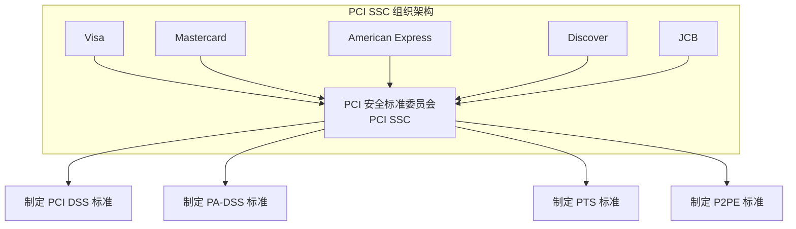
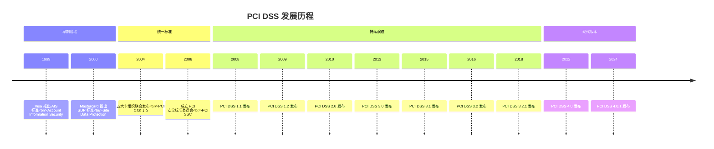
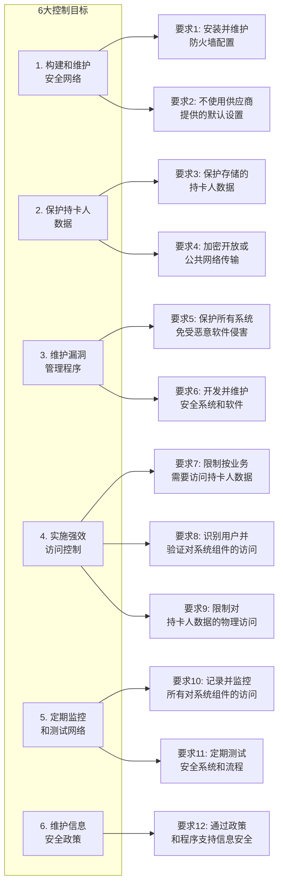
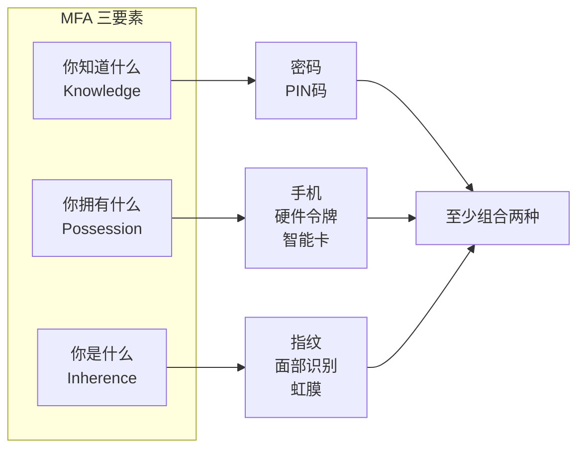
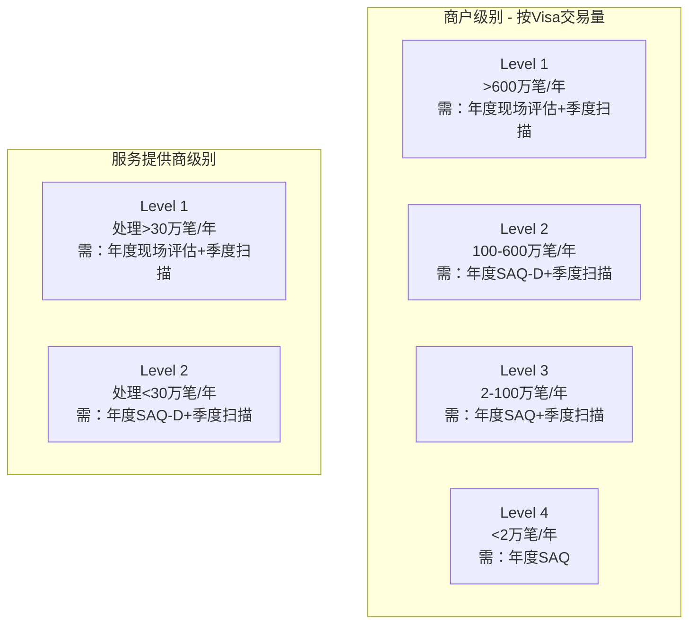
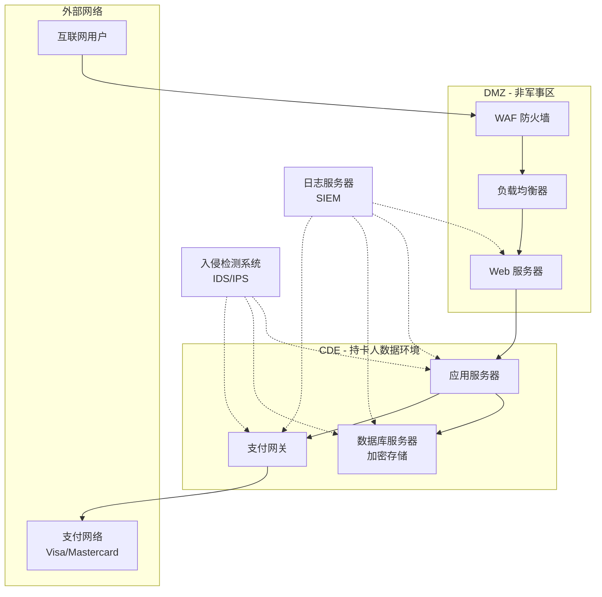
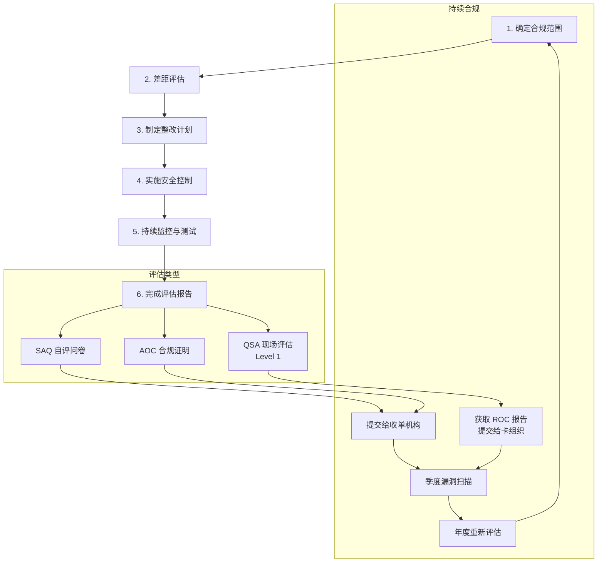
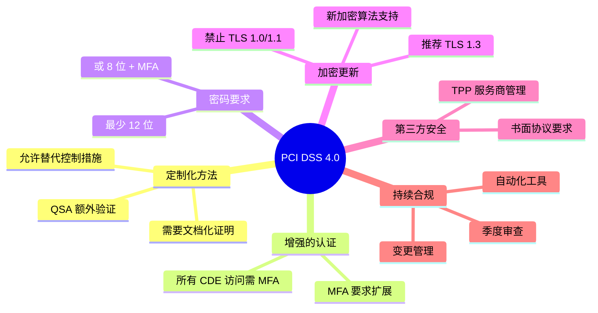

## 什么是 PCI DSS？

PCI DSS（Payment Card Industry Data Security Standard，支付卡行业数据安全标准）是一套由主要信用卡品牌（Visa、Mastercard、American Express、Discover、JCB）共同制定的安全标准，旨在保护持卡人数据安全。



## PCI DSS 的发展历史



### 版本演进关键变化

| 版本 | 发布时间 | 主要变化 |
|------|----------|----------|
| 1.0 | 2004 | 首次统一标准，12项核心要求 |
| 2.0 | 2010 | 强化虚拟化安全，明确范围界定 |
| 3.0 | 2013 | 增加恶意软件防护，强调持续合规 |
| 3.2 | 2016 | 新增多因素认证要求，强化 SSL/TLS 迁移 |
| 4.0 | 2022 | 全面更新，增加定制化方法，强化认证要求 |

## PCI DSS 4.0 核心要求

PCI DSS 4.0 包含 6 大控制目标，12 项核心要求，共计 250+ 项具体测试步骤。



### 关键要求详解

#### 要求 3：保护存储的持卡人数据

**3.1 数据保留策略**
- 定义数据保留政策
- 限制数据存储量
- 安全删除不需要的数据

**3.2 禁止存储敏感认证数据**
- 完整磁道数据（磁条或芯片数据）
- 卡验证码（CVV/CVC/CID）
- PIN 码或 PIN 块

**3.3-3.7 数据加密与掩码**

```
可接受的数据存储：
┌─────────────────────────────────────────────┐
│ PAN（主账号）：可存储，但需加密或标记化     │
│ 持卡人姓名：可存储                          │
│ 有效期：可存储                              │
├─────────────────────────────────────────────┤
│ 禁止存储：                                  │
│ ✗ 完整磁道数据                              │
│ ✗ CVV/CVC/CID（3-4位安全码）               │
│ ✗ PIN/PIN 块                               │
└─────────────────────────────────────────────┘
```

#### 要求 4：加密传输中的持卡人数据

**4.1 传输加密要求**
- 使用 TLS 1.2 或更高版本
- 禁用 SSL 和早期 TLS 版本
- 正确配置加密参数

**4.2 验证证书有效性**

```javascript
// Node.js 证书验证示例
const https = require('https');
const tls = require('tls');

// 创建安全的 HTTPS Agent
const secureAgent = new https.Agent({
  // 最低 TLS 1.2
  minVersion: 'TLSv1.2',
  // 推荐使用 TLS 1.3
  maxVersion: 'TLSv1.3',
  // 验证服务器证书
  rejectUnauthorized: true,
  // 检查证书吊销状态
  crl: await loadCRL(),
  // 证书固定（可选，增强安全性）
  checkServerIdentity: (host, cert) => {
    // 验证证书指纹
    const expectedFingerprint = 'sha256指纹';
    if (cert.fingerprint256 !== expectedFingerprint) {
      return new Error('证书验证失败');
    }
  }
});
```

#### 要求 8：身份识别与认证

**8.3 多因素认证（MFA）**



**8.4 密码策略**

```java
// Java 密码策略验证示例
public class PasswordPolicy {

    // PCI DSS 4.0 要求：至少12位，或8位+MFA
    private static final int MIN_PASSWORD_LENGTH = 12;
    private static final int MIN_PASSWORD_WITH_MFA = 8;

    public static boolean validatePassword(String password, boolean hasMFA) {
        int minLength = hasMFA ? MIN_PASSWORD_WITH_MFA : MIN_PASSWORD_LENGTH;

        if (password == null || password.length() < minLength) {
            return false;
        }

        // 检查复杂度：至少包含大写、小写、数字、特殊字符中的三种
        int complexityCount = 0;
        if (password.matches(".*[A-Z].*")) complexityCount++; // 大写
        if (password.matches(".*[a-z].*")) complexityCount++; // 小写
        if (password.matches(".*[0-9].*")) complexityCount++; // 数字
        if (password.matches(".*[!@#$%^&*()_+\\-=\\[\\]{};':\"\\\\|,.<>/?].*")) complexityCount++; // 特殊字符

        if (complexityCount < 3) {
            return false;
        }

        // 检查是否包含用户信息
        // 检查是否在历史密码中
        // 检查是否在常见密码黑名单中

        return true;
    }

    // 密码哈希存储（使用 Argon2 或 bcrypt）
    public static String hashPassword(String password) {
        // 使用 Argon2（推荐）
        Argon2 argon2 = Argon2Factory.create(
            Argon2Factory.Argon2Types.ARGON2id,
            32,  // 盐长度
            64   // 哈希长度
        );

        return argon2.hash(
            3,      // 迭代次数
            65536,  // 内存成本（64MB）
            4,      // 并行度
            password.toCharArray()
        );
    }
}
```

## PCI DSS 合规级别

根据年交易量，商户和服务提供商分为不同级别：



### SAQ 类型说明

| SAQ 类型 | 适用场景 | 评估要求 |
|----------|----------|----------|
| SAQ A | 完全外包支付（第三方托管） | 22 项要求 |
| SAQ A-EP | 电子商务，部分外包 | 77 项要求 |
| SAQ B | 仅使用终端（无电子存储） | 39 项要求 |
| SAQ C | 有网络连接的支付终端 | 63 项要求 |
| SAQ D | 所有其他商户/服务提供商 | 全部要求 |

## PCI DSS 实现框架

### 1. 安全架构设计



### 2. 代码实现示例

#### 安全的支付数据处理（Java）

```java
// PCI DSS 合规的支付服务
@Service
public class PaymentService {

    private final EncryptionService encryptionService;
    private final TokenizationService tokenService;
    private final AuditLogger auditLogger;

    // 禁止存储 CVV
    private static final Set<String> FORBIDDEN_FIELDS =
        Set.of("cvv", "cvv2", "cvc", "cid", "pin", "pinBlock");

    /**
     * 处理支付请求
     * PCI DSS 要求 3.2.1：禁止存储敏感认证数据
     */
    public PaymentResponse processPayment(PaymentRequest request) {
        // 验证请求不包含禁止存储的字段
        validateNoSensitiveData(request);

        // 记录审计日志（不包含 PAN）
        auditLogger.logPaymentAttempt(
            maskPAN(request.getPan()),
            request.getAmount(),
            request.getMerchantId()
        );

        // 标记化 PAN
        String token = tokenService.tokenize(request.getPan());

        // 发送到支付网关
        PaymentResponse response = sendToGateway(request);

        // 返回响应（使用 token 替代 PAN）
        response.setToken(token);
        response.setPan(null); // 确保不返回完整 PAN

        return response;
    }

    /**
     * PAN 掩码显示
     * PCI DSS 要求 3.3：显示时掩码（最多显示前6后4）
     */
    private String maskPAN(String pan) {
        if (pan == null || pan.length() < 8) {
            return "******";
        }
        int length = pan.length();
        return pan.substring(0, 6) + "*".repeat(length - 10) + pan.substring(length - 4);
    }

    /**
     * 验证不包含禁止存储的数据
     */
    private void validateNoSensitiveData(PaymentRequest request) {
        Map<String, Object> dataMap = requestToMap(request);
        for (String forbidden : FORBIDDEN_FIELDS) {
            if (dataMap.containsKey(forbidden)) {
                auditLogger.logSecurityViolation("Attempt to store forbidden field: " + forbidden);
                throw new SecurityViolationException("Forbidden field detected");
            }
        }
    }
}
```

#### 数据加密实现

```java
// PCI DSS 要求 3.4：使用强加密保护存储的 PAN
@Component
public class EncryptionService {

    private static final String ALGORITHM = "AES/GCM/NoPadding";
    private static final int GCM_TAG_LENGTH = 128; // 位
    private static final int GCM_IV_LENGTH = 12;   // 字节

    private final SecretKey secretKey;

    public EncryptionService(@Value("${encryption.key-hsm-path}") String hsmPath) {
        // 从 HSM 获取密钥（推荐）或使用密钥管理系统
        this.secretKey = getKeyFromHSM(hsmPath);
    }

    /**
     * 加密 PAN
     */
    public String encrypt(String plainText) throws Exception {
        // 每次加密使用新的 IV
        byte[] iv = new byte[GCM_IV_LENGTH];
        SecureRandom.getInstanceStrong().nextBytes(iv);

        Cipher cipher = Cipher.getInstance(ALGORITHM);
        GCMParameterSpec spec = new GCMParameterSpec(GCM_TAG_LENGTH, iv);
        cipher.init(Cipher.ENCRYPT_MODE, secretKey, spec);

        byte[] encrypted = cipher.doFinal(plainText.getBytes(StandardCharsets.UTF_8));

        // IV + 密文 组合存储
        ByteBuffer buffer = ByteBuffer.allocate(iv.length + encrypted.length);
        buffer.put(iv);
        buffer.put(encrypted);

        return Base64.getEncoder().encodeToString(buffer.array());
    }

    /**
     * 解密 PAN
     */
    public String decrypt(String encryptedText) throws Exception {
        byte[] decoded = Base64.getDecoder().decode(encryptedText);

        ByteBuffer buffer = ByteBuffer.wrap(decoded);
        byte[] iv = new byte[GCM_IV_LENGTH];
        buffer.get(iv);

        byte[] encrypted = new byte[buffer.remaining()];
        buffer.get(encrypted);

        Cipher cipher = Cipher.getInstance(ALGORITHM);
        GCMParameterSpec spec = new GCMParameterSpec(GCM_TAG_LENGTH, iv);
        cipher.init(Cipher.DECRYPT_MODE, secretKey, spec);

        byte[] decrypted = cipher.doFinal(encrypted);
        return new String(decrypted, StandardCharsets.UTF_8);
    }
}
```

#### 日志与监控实现

```java
// PCI DSS 要求 10：记录和监控所有访问
@Aspect
@Component
public class SecurityAuditAspect {

    private final AuditLogger auditLogger;

    /**
     * 记录所有对敏感数据的访问
     * PCI DSS 要求 10.2：记录所有个人用户对持卡人数据的访问
     */
    @Around("@annotation(SensitiveDataAccess)")
    public Object auditDataAccess(ProceedingJoinPoint joinPoint) throws Throwable {
        String userId = SecurityContext.getCurrentUserId();
        String action = joinPoint.getSignature().getName();
        String resource = extractResourceId(joinPoint.getArgs());
        Instant timestamp = Instant.now();

        // 记录访问尝试
        auditLogger.log(AuditEvent.builder()
            .eventType("DATA_ACCESS_ATTEMPT")
            .userId(userId)
            .action(action)
            .resource(resource)
            .timestamp(timestamp)
            .sourceIp(SecurityContext.getCurrentIp())
            .userAgent(SecurityContext.getUserAgent())
            .build());

        try {
            Object result = joinPoint.proceed();

            // 记录成功访问
            auditLogger.log(AuditEvent.builder()
                .eventType("DATA_ACCESS_SUCCESS")
                .userId(userId)
                .action(action)
                .resource(resource)
                .timestamp(timestamp)
                .build());

            return result;
        } catch (Exception e) {
            // 记录失败访问
            auditLogger.log(AuditEvent.builder()
                .eventType("DATA_ACCESS_FAILURE")
                .userId(userId)
                .action(action)
                .resource(resource)
                .errorMessage(e.getMessage())
                .timestamp(timestamp)
                .build());

            throw e;
        }
    }
}

// 审计日志服务
@Service
public class AuditLogger {

    private final AuditRepository repository;

    /**
     * 写入审计日志
     * PCI DSS 要求 10.5：保护审计日志不被篡改
     */
    public void log(AuditEvent event) {
        // 确保日志不包含完整的 PAN 或敏感数据
        sanitizeEvent(event);

        // 添加完整性校验
        event.setChecksum(calculateChecksum(event));

        // 存储到只追加存储（WORM）
        repository.append(event);

        // 同时发送到远程日志服务器（要求 10.5.3）
        sendToRemoteSIEM(event);
    }

    /**
     * 计算日志完整性校验和
     */
    private String calculateChecksum(AuditEvent event) {
        String data = String.format("%s|%s|%s|%s",
            event.getEventType(),
            event.getUserId(),
            event.getResource(),
            event.getTimestamp());

        return DigestUtils.sha256Hex(data + getHMACKey());
    }
}
```

### 3. Web 应用防火墙（WAF）配置

```yaml
# PCI DSS 要求 6.6：解决公共 Web 应用程序中的安全漏洞
# ModSecurity WAF 规则示例

SecRuleEngine On
SecRequestBodyAccess On
SecResponseBodyAccess Off

# OWASP Core Rule Set 基础规则
Include /etc/modsecurity/crs/crs-setup.conf
Include /etc/modsecurity/crs/rules/*.conf

# PCI DSS 特定规则

# 阻止信用卡号泄露（响应体检测）
SecRule RESPONSE_BODY "@verifyCC \d{13,16}" \
    "id:100001,phase:4,deny,log,msg:'Possible Credit Card Number Leak in Response'"

# 阻止 SQL 注入
SecRule REQUEST_URI|REQUEST_BODY "@rx (?i:union.*select|select.*from|insert.*into|delete.*from)" \
    "id:100002,phase:2,deny,log,msg:'SQL Injection Attempt'"

# 阻止 XSS 攻击
SecRule REQUEST_URI|REQUEST_BODY "@rx (?i:<script|javascript:|onerror=|onload=)" \
    "id:100003,phase:2,deny,log,msg:'XSS Attack Attempt'"

# 限制请求大小（防止 DoS）
SecRequestBodyLimit 131072
SecRequestBodyNoFilesLimit 65536

# 记录所有支付相关请求
SecRule REQUEST_URI "@contains /payment" \
    "id:100004,phase:1,pass,log,msg:'Payment Request Logged',chain"
    SecRule REMOTE_ADDR "^.*$" "logdata:'IP: %{REMOTE_ADDR}, User: %{SESSION.USER}'"
```

## PCI DSS 合规流程



## 常见违规与处罚

### 违规后果

| 违规类型 | 可能后果 |
|----------|----------|
| 数据泄露 | 每张卡 $50-$90 罚款，品牌处罚 $5,000-$100,000/月 |
| 未能合规 | 交易处理权限受限，罚款增加 |
| 虚假报告 | 永久禁止处理支付卡交易 |

### 常见违规项

1. **存储禁止数据**：存储 CVV、完整磁道数据
2. **弱加密**：使用已废弃的 SSL/TLS 版本
3. **默认密码**：未更改系统默认凭据
4. **缺乏日志**：未记录或未保护审计日志
5. **范围界定不清**：未正确识别 CDE 边界

## PCI DSS 4.0 新特性

### 主要变化



### 新增关键要求

| 新要求 | 描述 |
|--------|------|
| 5.2.3 | 自动化机制检测和阻止恶意软件 |
| 8.3.6 | MFA 扩展到所有 CDE 访问 |
| 8.6.3 | 密码至少 12 位（或 8 位 + MFA） |
| 11.6.1 | 变更检测机制 |
| 12.6.2 | 安全意识培训每年至少一次 |

## 合规工具与资源

### 推荐工具

| 类别 | 工具 | 用途 |
|------|------|------|
| 漏洞扫描 | Nessus, Qualys | ASV 合规扫描 |
| 渗透测试 | Burp Suite, Metasploit | 应用安全测试 |
| 日志管理 | Splunk, ELK Stack | SIEM 日志聚合 |
| 密钥管理 | HashiCorp Vault, AWS KMS | 密钥生命周期管理 |
| WAF | Cloudflare, AWS WAF | Web 应用防护 |

### 官方资源

- [PCI Security Standards Council](https://www.pcisecuritystandards.org/)
- [PCI DSS Documents](https://www.pcisecuritystandards.org/document_library/)
- [PCI SAQ](https://www.pcisecuritystandards.org/merchants/self_assessment_form/)

## 总结

PCI DSS 合规不是一次性任务，而是持续的安全实践。核心要点：

1. **最小化数据存储**：不存储不需要的数据
2. **纵深防御**：多层安全控制
3. **持续监控**：实时检测和响应
4. **定期审计**：保持合规状态
5. **员工培训**：人是安全的关键

> 安全是一个过程，而不是一个产品。保持合规需要持续的投入和关注。
