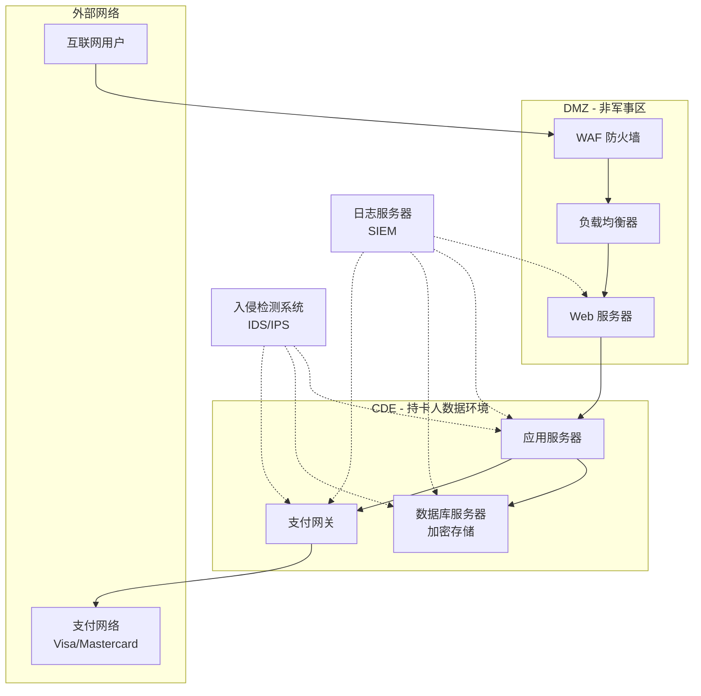
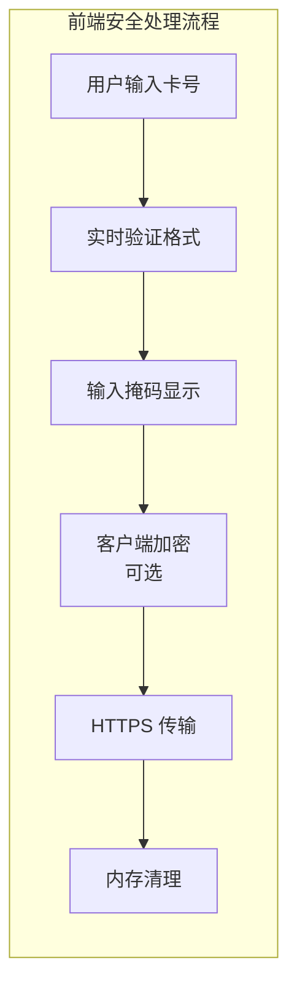
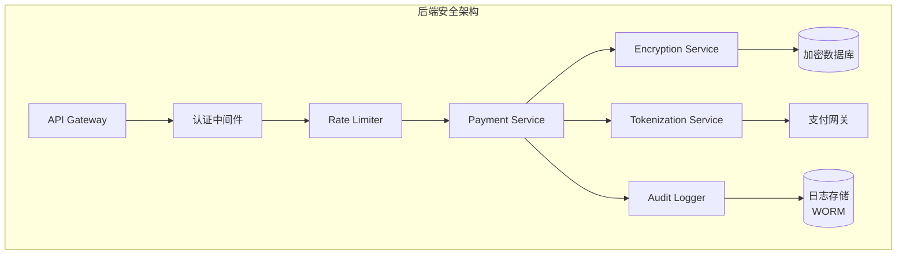

本文是 [PCI DSS 入门指南](/posts/pci-dss-overview.html) 的技术实现篇，主要介绍如何从技术层面实现 PCI DSS 合规的支付系统。

## 安全架构设计



## 前端实现（数据采集与传输）

前端主要负责支付数据的采集、验证和安全传输。关键原则是**最小化敏感数据处理**和**安全传输**。



### 支付表单组件（React + TypeScript）

```typescript
// components/PaymentForm.tsx
import React, { useState, useCallback, useEffect } from 'react';

// PCI DSS 要求 3.3：显示时掩码 PAN（前6后4）
const maskPAN = (pan: string): string => {
  if (!pan || pan.length < 8) return '******';
  const cleaned = pan.replace(/\s/g, '');
  return `${cleaned.slice(0, 6)}${'*'.repeat(cleaned.length - 10)}${cleaned.slice(-4)}`;
};

// Luhn 算法验证卡号
const validateLuhn = (pan: string): boolean => {
  const cleaned = pan.replace(/\D/g, '');
  let sum = 0;
  let isEven = false;

  for (let i = cleaned.length - 1; i >= 0; i--) {
    let digit = parseInt(cleaned[i], 10);

    if (isEven) {
      digit *= 2;
      if (digit > 9) digit -= 9;
    }

    sum += digit;
    isEven = !isEven;
  }

  return sum % 10 === 0;
};

// 卡号格式化（每4位添加空格）
const formatPAN = (value: string): string => {
  const cleaned = value.replace(/\D/g, '');
  return cleaned.replace(/(.{4})/g, '$1 ').trim();
};

// CVV 验证（3-4位数字）
const validateCVV = (cvv: string): boolean => {
  return /^\d{3,4}$/.test(cvv);
};

interface PaymentFormData {
  pan: string;
  expiryMonth: string;
  expiryYear: string;
  cvv: string;
  cardholderName: string;
}

export const PaymentForm: React.FC = () => {
  const [formData, setFormData] = useState<PaymentFormData>({
    pan: '',
    expiryMonth: '',
    expiryYear: '',
    cvv: '',
    cardholderName: '',
  });

  const [errors, setErrors] = useState<Partial<PaymentFormData>>({});
  const [isSubmitting, setIsSubmitting] = useState(false);

  // PCI DSS 要求：CVV 不应存储，仅在内存中使用
  // 组件卸载时清理敏感数据
  useEffect(() => {
    return () => {
      setFormData({
        pan: '',
        expiryMonth: '',
        expiryYear: '',
        cvv: '',
        cardholderName: '',
      });
    };
  }, []);

  // 处理卡号输入
  const handlePANChange = useCallback((e: React.ChangeEvent<HTMLInputElement>) => {
    const value = e.target.value.replace(/\D/g, '');
    if (value.length > 19) return;

    const formatted = formatPAN(value);
    setFormData(prev => ({ ...prev, pan: formatted }));

    if (value.length >= 13 && !validateLuhn(value)) {
      setErrors(prev => ({ ...prev, pan: '卡号无效' }));
    } else {
      setErrors(prev => ({ ...prev, pan: undefined }));
    }
  }, []);

  // 处理 CVV 输入
  const handleCVVChange = useCallback((e: React.ChangeEvent<HTMLInputElement>) => {
    const value = e.target.value.replace(/\D/g, '');
    if (value.length > 4) return;
    setFormData(prev => ({ ...prev, cvv: value }));
  }, []);

  // 表单验证
  const validateForm = (): boolean => {
    const newErrors: Partial<PaymentFormData> = {};
    const cleanedPAN = formData.pan.replace(/\s/g, '');

    if (cleanedPAN.length < 13 || cleanedPAN.length > 19) {
      newErrors.pan = '卡号长度无效';
    } else if (!validateLuhn(cleanedPAN)) {
      newErrors.pan = '卡号无效';
    }

    if (!validateCVV(formData.cvv)) {
      newErrors.cvv = 'CVV 无效';
    }

    if (!formData.expiryMonth || !formData.expiryYear) {
      newErrors.expiryMonth = '请选择有效期';
    }

    setErrors(newErrors);
    return Object.keys(newErrors).length === 0;
  };

  // 提交支付
  const handleSubmit = async (e: React.FormEvent) => {
    e.preventDefault();
    if (!validateForm()) return;

    setIsSubmitting(true);

    try {
      const paymentData = {
        pan: formData.pan.replace(/\s/g, ''),
        expiry_month: formData.expiryMonth,
        expiry_year: formData.expiryYear,
        cvv: formData.cvv, // 仅传输，不存储
        cardholder_name: formData.cardholderName,
      };

      const response = await fetch('/api/v1/payments', {
        method: 'POST',
        headers: {
          'Content-Type': 'application/json',
          'X-CSRF-Token': getCSRFToken(),
        },
        body: JSON.stringify(paymentData),
        credentials: 'include',
      });

      if (!response.ok) throw new Error('支付请求失败');
      const result = await response.json();
      console.log('支付成功:', result.transaction_id);

    } catch (error) {
      console.error('支付失败:', error);
      setErrors({ pan: '支付处理失败，请重试' });
    } finally {
      setIsSubmitting(false);
      // PCI DSS 最佳实践：提交后立即清除 CVV
      setFormData(prev => ({ ...prev, cvv: '' }));
    }
  };

  return (
    <form onSubmit={handleSubmit} className="payment-form">
      {/* 表单字段省略，见完整示例 */}
    </form>
  );
};

function getCSRFToken(): string {
  const meta = document.querySelector('meta[name="csrf-token"]');
  return meta?.getAttribute('content') || '';
}
```

### 安全传输工具类

```typescript
// utils/secureTransport.ts

/**
 * PCI DSS 要求 4.1：加密传输中的持卡人数据
 */
export class SecureTransport {
  private static readonly API_BASE = '/api/v1';

  static async securePost<T>(endpoint: string, data: unknown): Promise<T> {
    // 检查是否使用 HTTPS
    if (window.location.protocol !== 'https:' && window.location.hostname !== 'localhost') {
      throw new Error('必须使用 HTTPS 连接');
    }

    const response = await fetch(`${this.API_BASE}${endpoint}`, {
      method: 'POST',
      headers: {
        'Content-Type': 'application/json',
        'X-Request-ID': crypto.randomUUID(),
      },
      body: JSON.stringify(data),
      credentials: 'include',
      cache: 'no-store',
    });

    if (!response.ok) {
      const error = await response.json();
      throw new PaymentError(error.message, error.code);
    }

    return response.json();
  }

  /**
   * 敏感数据脱敏日志
   */
  static sanitizeForLog(data: Record<string, unknown>): Record<string, unknown> {
    const sensitiveFields = ['pan', 'cvv', 'cvc', 'cvv2', 'pin', 'card_number'];
    const sanitized = { ...data };

    for (const field of sensitiveFields) {
      if (sanitized[field] && typeof sanitized[field] === 'string') {
        const value = sanitized[field] as string;
        if (field === 'pan' || field === 'card_number') {
          sanitized[field] = value.slice(0, 6) + '******' + value.slice(-4);
        } else {
          sanitized[field] = '***';
        }
      }
    }

    return sanitized;
  }
}

export class PaymentError extends Error {
  constructor(
    message: string,
    public code: string,
    public statusCode?: number
  ) {
    super(message);
    this.name = 'PaymentError';
  }
}
```

### Content Security Policy 配置

```typescript
// utils/csp.ts

/**
 * PCI DSS 要求 6.6：保护应用程序免受攻击
 * CSP 防止 XSS 和数据注入攻击
 */
export const cspDirectives = {
  'default-src': ["'self'"],
  'script-src': ["'self'", "https://js.stripe.com"],
  'style-src': ["'self'", "'unsafe-inline'"],
  'img-src': ["'self'", "data:", "https:"],
  'connect-src': ["'self'", "https://api.your-domain.com"],
  'frame-src': ["https://js.stripe.com", "https://hooks.stripe.com"],
  'form-action': ["'self'"],
  'base-uri': ["'self'"],
  'object-src': ["'none'"],
  'upgrade-insecure-requests': [],
};

export function generateCSPHeader(): string {
  return Object.entries(cspDirectives)
    .map(([directive, values]) => {
      if (values.length === 0) return directive;
      return `${directive} ${values.join(' ')}`;
    })
    .join('; ');
}
```

## 后端实现（Golang）

后端负责系统架构、数据传输、存储和加密。核心原则是**最小权限**和**数据保护**。



### 项目结构

```
payment-service/
├── cmd/
│   └── server/
│       └── main.go
├── internal/
│   ├── api/
│   │   ├── handler/
│   │   │   └── payment.go
│   │   └── middleware/
│   │       ├── auth.go
│   │       ├── ratelimit.go
│   │       └── audit.go
│   ├── service/
│   │   ├── payment.go
│   │   ├── tokenization.go
│   │   └── encryption.go
│   ├── repository/
│   │   └── payment.go
│   └── model/
│       └── payment.go
├── pkg/
│   ├── crypto/
│   │   └── aesgcm.go
│   └── audit/
│       └── logger.go
├── config/
│   └── config.yaml
└── go.mod
```

### 数据模型

```go
package model

import "time"

// PaymentRequest 支付请求
// PCI DSS 要求 3.2.1：禁止存储敏感认证数据
type PaymentRequest struct {
	PAN            string `json:"pan" validate:"required,luhn"`
	ExpiryMonth    string `json:"expiry_month" validate:"required,len=2"`
	ExpiryYear     string `json:"expiry_year" validate:"required,len=4"`
	CVV            string `json:"cvv" validate:"required,len=3|len=4"` // 仅传输，不存储
	CardholderName string `json:"cardholder_name" validate:"required"`
	Amount         int64  `json:"amount" validate:"required,gt=0"`
	Currency       string `json:"currency" validate:"required,len=3"`
	MerchantID     string `json:"merchant_id" validate:"required"`
}

// Transaction 交易记录（存储到数据库）
type Transaction struct {
	ID              string    `db:"id"`
	MerchantID      string    `db:"merchant_id"`
	EncryptedPAN    []byte    `db:"encrypted_pan"` // 加密存储
	Token           string    `db:"token"`         // 标记化 PAN
	ExpiryMonth     string    `db:"expiry_month"`
	ExpiryYear      string    `db:"expiry_year"`
	CardholderName  string    `db:"cardholder_name"`
	Amount          int64     `db:"amount"`
	Currency        string    `db:"currency"`
	Status          string    `db:"status"`
	CreatedAt       time.Time `db:"created_at"`
	UpdatedAt       time.Time `db:"updated_at"`
}

// AuditLog 审计日志
type AuditLog struct {
	ID           string    `db:"id"`
	EventType    string    `db:"event_type"`
	UserID       string    `db:"user_id"`
	MerchantID   string    `db:"merchant_id"`
	Resource     string    `db:"resource"`
	Action       string    `db:"action"`
	MaskedPAN    string    `db:"masked_pan"` // 仅存储掩码
	SourceIP     string    `db:"source_ip"`
	UserAgent    string    `db:"user_agent"`
	Status       string    `db:"status"`
	ErrorMessage string    `db:"error_message"`
	Checksum     string    `db:"checksum"` // 完整性校验
	CreatedAt    time.Time `db:"created_at"`
}
```

### AES-GCM 加密服务

```go
package crypto

import (
	"crypto/aes"
	"crypto/cipher"
	"crypto/rand"
	"crypto/sha256"
	"encoding/base64"
	"errors"
	"io"

	"golang.org/x/crypto/hkdf"
)

// AESGCMService AES-GCM 加密服务
// PCI DSS 要求 3.4：使用强加密保护存储的 PAN
type AESGCMService struct {
	keyProvider KeyProvider
}

type KeyProvider interface {
	GetCurrentKey() ([]byte, uint32, error)
	GetKeyByVersion(version uint32) ([]byte, error)
}

func NewAESGCMService(provider KeyProvider) *AESGCMService {
	return &AESGCMService{keyProvider: provider}
}

// Encrypt 加密数据
func (s *AESGCMService) Encrypt(plaintext string) (string, error) {
	if plaintext == "" {
		return "", nil
	}

	key, version, err := s.keyProvider.GetCurrentKey()
	if err != nil {
		return "", err
	}

	block, err := aes.NewCipher(key)
	if err != nil {
		return "", err
	}

	gcm, err := cipher.NewGCM(block)
	if err != nil {
		return "", err
	}

	iv := make([]byte, gcm.NonceSize())
	if _, err := io.ReadFull(rand.Reader, iv); err != nil {
		return "", err
	}

	ciphertext := gcm.Seal(nil, iv, []byte(plaintext), nil)

	// 组合: version(4) + iv(12) + ciphertext
	result := make([]byte, 4+len(iv)+len(ciphertext))
	result[0] = byte(version >> 24)
	result[1] = byte(version >> 16)
	result[2] = byte(version >> 8)
	result[3] = byte(version)
	copy(result[4:], iv)
	copy(result[4+len(iv):], ciphertext)

	return base64.StdEncoding.EncodeToString(result), nil
}

// Decrypt 解密数据
func (s *AESGCMService) Decrypt(encrypted string) (string, error) {
	if encrypted == "" {
		return "", nil
	}

	data, err := base64.StdEncoding.DecodeString(encrypted)
	if err != nil {
		return "", err
	}

	version := uint32(data[0])<<24 | uint32(data[1])<<16 | uint32(data[2])<<8 | uint32(data[3])

	key, err := s.keyProvider.GetKeyByVersion(version)
	if err != nil {
		return "", err
	}

	block, err := aes.NewCipher(key)
	if err != nil {
		return "", err
	}

	gcm, err := cipher.NewGCM(block)
	if err != nil {
		return "", err
	}

	ivSize := gcm.NonceSize()
	iv := data[4 : 4+ivSize]
	ciphertext := data[4+ivSize:]

	plaintext, err := gcm.Open(nil, iv, ciphertext, nil)
	if err != nil {
		return "", err
	}

	return string(plaintext), nil
}

// DeriveKey 从主密钥派生子密钥
func DeriveKey(masterKey []byte, context string, keyLen int) ([]byte, error) {
	hkdf := hkdf.New(sha256.New, masterKey, nil, []byte(context))
	key := make([]byte, keyLen)
	if _, err := io.ReadFull(hkdf, key); err != nil {
		return nil, err
	}
	return key, nil
}
```

### 标记化服务

```go
package service

import (
	"crypto/rand"
	"crypto/sha256"
	"encoding/hex"
	"errors"
	"fmt"
	"time"

	"github.com/your-org/payment-service/pkg/crypto"
)

// TokenizationService 标记化服务
// PCI DSS 要求 3.4：使用标记化保护 PAN
type TokenizationService struct {
	encryption  *crypto.AESGCMService
	tokenStore  TokenStore
	tokenPrefix string
}

type TokenStore interface {
	SaveTokenMapping(token, encryptedPAN string) error
	GetEncryptedPAN(token string) (string, error)
	DeleteToken(token string) error
}

func NewTokenizationService(
	encryption *crypto.AESGCMService,
	store TokenStore,
	prefix string,
) *TokenizationService {
	return &TokenizationService{
		encryption:  encryption,
		tokenStore:  store,
		tokenPrefix: prefix,
	}
}

// Tokenize 将 PAN 转换为 Token
func (s *TokenizationService) Tokenize(pan string) (string, error) {
	if pan == "" {
		return "", errors.New("PAN cannot be empty")
	}

	encryptedPAN, err := s.encryption.Encrypt(pan)
	if err != nil {
		return "", fmt.Errorf("encrypt PAN failed: %w", err)
	}

	token, err := s.generateToken()
	if err != nil {
		return "", fmt.Errorf("generate token failed: %w", err)
	}

	if err := s.tokenStore.SaveTokenMapping(token, encryptedPAN); err != nil {
		return "", fmt.Errorf("save token mapping failed: %w", err)
	}

	return token, nil
}

// Detokenize 从 Token 还原 PAN
func (s *TokenizationService) Detokenize(token string) (string, error) {
	if token == "" {
		return "", errors.New("token cannot be empty")
	}

	encryptedPAN, err := s.tokenStore.GetEncryptedPAN(token)
	if err != nil {
		return "", fmt.Errorf("token not found: %w", err)
	}

	pan, err := s.encryption.Decrypt(encryptedPAN)
	if err != nil {
		return "", fmt.Errorf("decrypt PAN failed: %w", err)
	}

	return pan, nil
}

func (s *TokenizationService) generateToken() (string, error) {
	timestamp := time.Now().UnixNano()
	randomBytes := make([]byte, 16)
	if _, err := rand.Read(randomBytes); err != nil {
		return "", err
	}

	data := fmt.Sprintf("%d-%x-%d", timestamp, randomBytes, time.Now().UnixNano())
	hash := sha256.Sum256([]byte(data))
	token := hex.EncodeToString(hash[:])

	return s.tokenPrefix + token[:32], nil
}

// MaskPAN 掩码 PAN（前6后4）
func MaskPAN(pan string) string {
	if len(pan) < 8 {
		return "******"
	}
	return pan[:6] + "******" + pan[len(pan)-4:]
}
```

### 审计日志服务

```go
package audit

import (
	"context"
	"crypto/hmac"
	"crypto/sha256"
	"encoding/hex"
	"fmt"
	"time"

	"github.com/google/uuid"
	"github.com/your-org/payment-service/internal/model"
	"go.uber.org/zap"
)

// Logger 审计日志记录器
// PCI DSS 要求 10：记录和监控所有对持卡人数据的访问
type Logger struct {
	repo    AuditRepository
	siem    SIEMForwarder
	hmacKey []byte
	logger  *zap.Logger
}

type AuditRepository interface {
	Append(ctx context.Context, log *model.AuditLog) error
}

type SIEMForwarder interface {
	Forward(ctx context.Context, log *model.AuditLog) error
}

func NewLogger(
	repo AuditRepository,
	siem SIEMForwarder,
	hmacKey []byte,
	logger *zap.Logger,
) *Logger {
	return &Logger{
		repo:    repo,
		siem:    siem,
		hmacKey: hmacKey,
		logger:  logger,
	}
}

// Log 记录审计日志
func (l *Logger) Log(ctx context.Context, log *model.AuditLog) error {
	if log.ID == "" {
		log.ID = uuid.New().String()
	}

	if log.CreatedAt.IsZero() {
		log.CreatedAt = time.Now()
	}

	l.sanitizeLog(log)
	log.Checksum = l.calculateChecksum(log)

	if err := l.repo.Append(ctx, log); err != nil {
		l.logger.Error("failed to append audit log", zap.Error(err))
		return err
	}

	if l.siem != nil {
		if err := l.siem.Forward(ctx, log); err != nil {
			l.logger.Warn("failed to forward to SIEM", zap.Error(err))
		}
	}

	return nil
}

func (l *Logger) sanitizeLog(log *model.AuditLog) {
	if len(log.MaskedPAN) > 10 && log.MaskedPAN[6] != '*' {
		log.MaskedPAN = log.MaskedPAN[:6] + "******" + log.MaskedPAN[len(log.MaskedPAN)-4:]
	}
}

func (l *Logger) calculateChecksum(log *model.AuditLog) string {
	data := fmt.Sprintf("%s|%s|%s|%s|%s",
		log.EventType,
		log.UserID,
		log.Resource,
		log.Action,
		log.CreatedAt.Format(time.RFC3339Nano),
	)

	h := hmac.New(sha256.New, l.hmacKey)
	h.Write([]byte(data))
	return hex.EncodeToString(h.Sum(nil))
}
```

## 开源组件推荐

### 支付处理与标记化

| 项目 | 语言 | 描述 | GitHub |
|------|------|------|--------|
| **Hyperswitch** | Rust | 开源支付路由器，支持授权、捕获和标记化 | [juspay/hyperswitch](https://github.com/juspay/hyperswitch) |
| **Stripe SDKs** | 多语言 | 官方 SDK，支持客户端标记化 | [stripe](https://github.com/stripe) |
| **PayPal Checkout** | JS | 客户端支付集成 | [paypal/paypal-checkout-components](https://github.com/paypal/paypal-checkout-components) |

### 密钥管理与加密

| 项目 | 语言 | 描述 | GitHub |
|------|------|------|--------|
| **HashiCorp Vault** | Go | 密钥管理、加密服务、动态凭证 | [hashicorp/vault](https://github.com/hashicorp/vault) |
| **OpenBao** | Go | Vault 的开源分支 | [openbao/openbao](https://github.com/openbao/openbao) |
| **SOPS** | Go | 密钥加密文件编辑器 | [getsops/sops](https://github.com/getsops/sops) |
| **age** | Go | 简单现代的加密工具 | [FiloSottile/age](https://github.com/FiloSottile/age) |

### 审计与日志

| 项目 | 语言 | 描述 | GitHub |
|------|------|------|--------|
| **Elastic Stack** | Java/Go | 日志聚合、分析、可视化 | [elastic](https://github.com/elastic) |
| **Grafana Loki** | Go | 轻量级日志聚合系统 | [grafana/loki](https://github.com/grafana/loki) |
| **Fluentd** | Ruby | 日志收集与转发 | [fluent/fluentd](https://github.com/fluent/fluentd) |

### 漏洞扫描与安全测试

| 项目 | 语言 | 描述 | GitHub |
|------|------|------|--------|
| **OWASP ZAP** | Java | Web 应用安全扫描 | [zaproxy/zaproxy](https://github.com/zaproxy/zaproxy) |
| **Trivy** | Go | 容器/文件系统漏洞扫描 | [aquasecurity/trivy](https://github.com/aquasecurity/trivy) |
| **Grype** | Go | 容器漏洞扫描 | [anchore/grype](https://github.com/anchore/grype) |

### Web 应用防火墙

| 项目 | 语言 | 描述 | GitHub |
|------|------|------|--------|
| **ModSecurity** | C | 开源 WAF 引擎 | [SpiderLabs/ModSecurity](https://github.com/SpiderLabs/ModSecurity) |
| **OWASP CRS** | Lua | ModSecurity 核心规则集 | [coreruleset/coreruleset](https://github.com/coreruleset/coreruleset) |
| **BunkerWeb** | Python | 现代化 WAF | [bunkerity/bunkerweb](https://github.com/bunkerity/bunkerweb) |

### 身份与访问管理

| 项目 | 语言 | 描述 | GitHub |
|------|------|------|--------|
| **Keycloak** | Java | 身份与访问管理 | [keycloak/keycloak](https://github.com/keycloak/keycloak) |
| **Authentik** | Python | 身份提供商 | [goauthentik/authentik](https://github.com/goauthentik/authentik) |
| **Casbin** | Go | 访问控制库 | [casbin/casbin](https://github.com/casbin/casbin) |

### 网络安全

| 项目 | 语言 | 描述 | GitHub |
|------|------|------|--------|
| **Caddy** | Go | 自动 HTTPS 的 Web 服务器 | [caddyserver/caddy](https://github.com/caddyserver/caddy) |
| **Traefik** | Go | 云原生边缘路由器 | [traefik/traefik](https://github.com/traefik/traefik) |
| **WireGuard** | C | 现代 VPN 协议 | [WireGuard/wireguard-go](https://github.com/WireGuard/wireguard-go) |

## 开源组件集成示例

### HashiCorp Vault + Golang

```go
package vault

import (
	"context"
	"fmt"

	vault "github.com/hashicorp/vault/api"
)

type VaultClient struct {
	client *vault.Client
}

func NewVaultClient(addr, token string) (*VaultClient, error) {
	config := vault.DefaultConfig()
	config.Address = addr

	client, err := vault.NewClient(config)
	if err != nil {
		return nil, fmt.Errorf("create vault client: %w", err)
	}

	client.SetToken(token)
	return &VaultClient{client: client}, nil
}

// Encrypt 使用 Transit 引擎加密数据
func (v *VaultClient) Encrypt(ctx context.Context, keyName string, plaintext []byte) (string, error) {
	path := fmt.Sprintf("transit/encrypt/%s", keyName)

	resp, err := v.client.Logical().WriteWithContext(ctx, path, map[string]interface{}{
		"plaintext": plaintext,
	})
	if err != nil {
		return "", fmt.Errorf("encrypt: %w", err)
	}

	return resp.Data["ciphertext"].(string), nil
}

// RotateKey 轮换加密密钥
func (v *VaultClient) RotateKey(ctx context.Context, keyName string) error {
	path := fmt.Sprintf("transit/keys/%s/rotate", keyName)
	_, err := v.client.Logical().WriteWithContext(ctx, path, nil)
	return err
}
```

### OWASP ZAP 自动化扫描

```yaml
# .github/workflows/security-scan.yml
name: Security Scan

on:
  push:
    branches: [main]
  schedule:
    - cron: '0 2 * * 1'

jobs:
  zap-scan:
    runs-on: ubuntu-latest
    steps:
      - uses: actions/checkout@v4

      - name: ZAP Full Scan
        uses: zaproxy/action-full-scan@v0.7.0
        with:
          target: 'https://staging.your-domain.com'
          cmd_options: '-a'

      - uses: actions/upload-artifact@v4
        with:
          name: zap-report
          path: report_html.html
```

### Trivy 容器漏洞扫描

```yaml
# .github/workflows/trivy-scan.yml
name: Container Security Scan

on:
  push:
    tags: ['v*']

jobs:
  trivy-scan:
    runs-on: ubuntu-latest
    steps:
      - uses: actions/checkout@v4

      - name: Build Image
        run: docker build -t payment-service:${{ github.sha }} .

      - name: Run Trivy
        uses: aquasecurity/trivy-action@master
        with:
          image-ref: 'payment-service:${{ github.sha }}'
          format: 'sarif'
          output: 'trivy-results.sarif'
          severity: 'CRITICAL,HIGH'

      - uses: github/codeql-action/upload-sarif@v2
        with:
          sarif_file: 'trivy-results.sarif'
```

### ModSecurity WAF 配置

```nginx
# /etc/nginx/modsecurity.conf

# 加载 OWASP 核心规则集
Include /etc/modsecurity/crs/crs-setup.conf
Include /etc/modsecurity/crs/rules/*.conf

# 阻止信用卡号泄露
SecRule RESPONSE_BODY "@verifyCC \d{13,16}" \
    "id:100001,phase:4,deny,log,msg:'Possible Credit Card Leak'"

# 强制 HTTPS
SecRule SERVER_PORT "@eq 80" \
    "id:100002,phase:1,deny,redirect:https://%{HTTP_HOST}%{REQUEST_URI}"

# 阻止 SQL 注入
SecRule REQUEST_URI|REQUEST_BODY "@rx (?i:union.*select|select.*from)" \
    "id:100003,phase:2,deny,log,msg:'SQL Injection Attempt'"

# 速率限制
SecAction "id:100004,phase:1,nolog,initcol:ip=%{REMOTE_ADDR},setvar:ip.rate=+1,expirevar:ip.rate=60"
SecRule IP:RATE "@gt 10" \
    "id:100005,phase:1,deny,log,msg:'Rate limit exceeded'"
```

## 商业工具

| 类别 | 工具 | 用途 |
|------|------|------|
| 漏洞扫描 | Nessus, Qualys | ASV 合规扫描 |
| 渗透测试 | Burp Suite Pro | 应用安全测试 |
| 日志管理 | Splunk | SIEM 日志聚合 |
| 密钥管理 | AWS KMS, Azure Key Vault | 托管密钥服务 |
| WAF | Cloudflare, AWS WAF | 托管 Web 应用防护 |
| 合规监控 | Vanta, Drata | 自动化合规监控 |

## 总结

技术实现的核心要点：

1. **前端**：数据掩码、Luhn 验证、HTTPS 传输、内存清理
2. **后端**：AES-GCM 加密、PAN 标记化、审计日志、完整性校验
3. **基础设施**：WAF 防护、漏洞扫描、密钥管理、日志聚合

> 技术实现只是合规的一部分，还需要配合完善的流程和人员培训。

---

**相关文章**：[PCI DSS 入门指南](/posts/pci-dss-overview.html)
