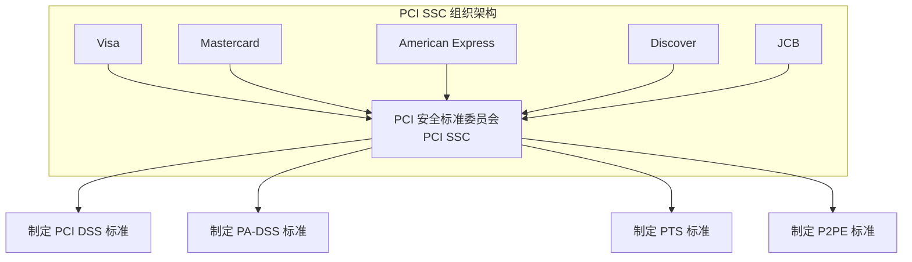
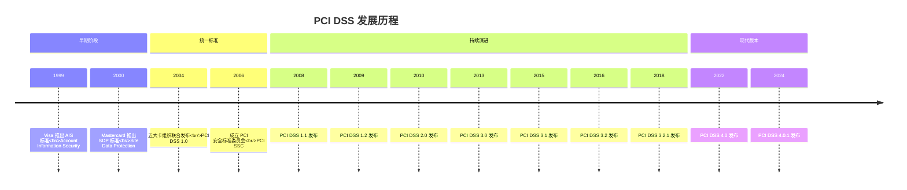
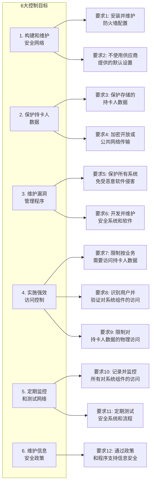
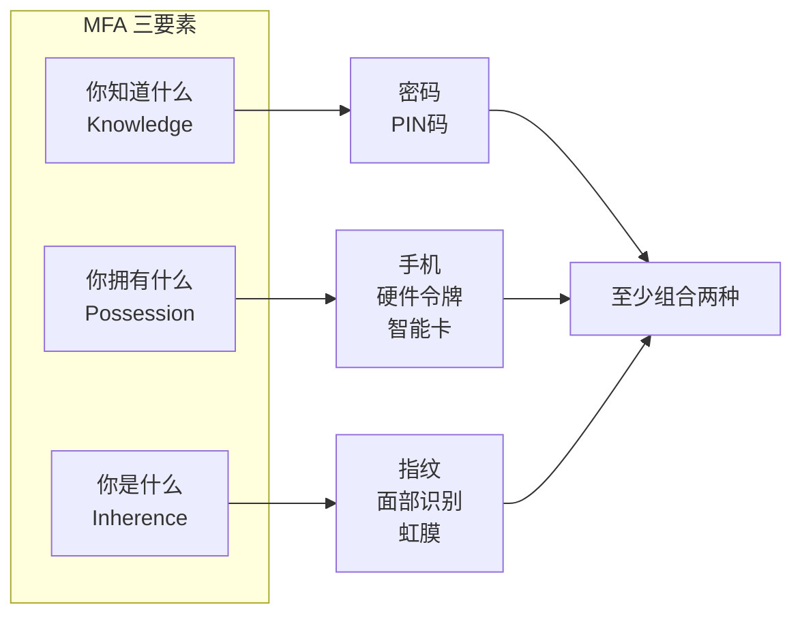
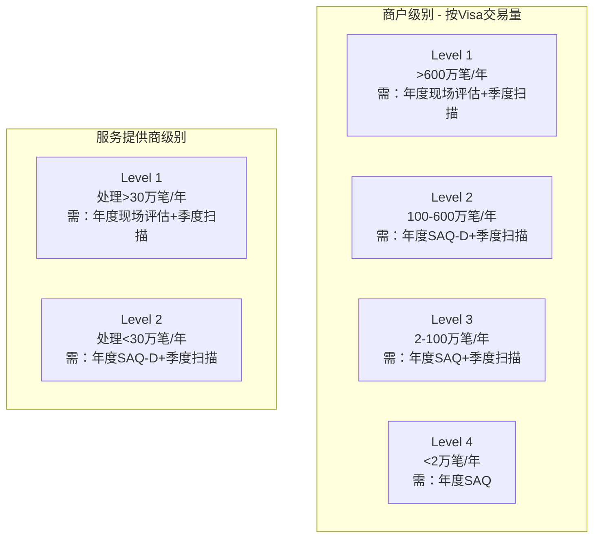
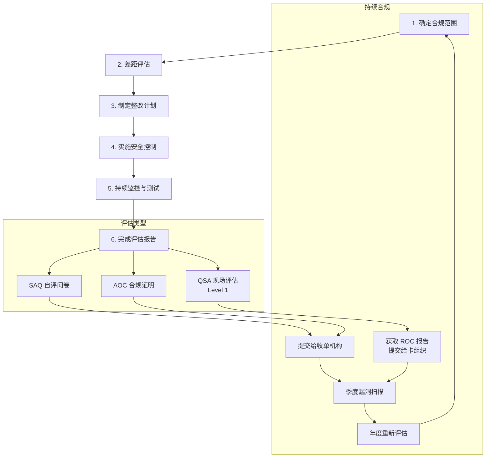
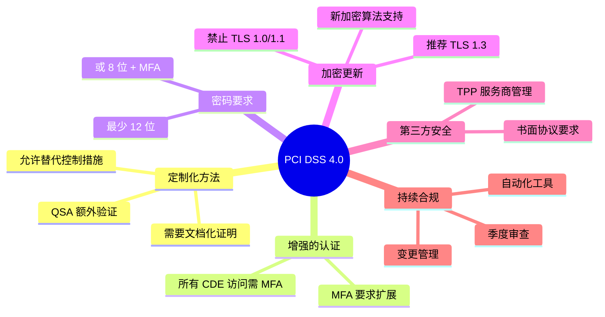

## 什么是 PCI DSS？

PCI DSS（Payment Card Industry Data Security Standard，支付卡行业数据安全标准）是一套由主要信用卡品牌（Visa、Mastercard、American Express、Discover、JCB）共同制定的安全标准，旨在保护持卡人数据安全。



## PCI DSS 的发展历史



### 版本演进关键变化

| 版本 | 发布时间 | 主要变化 |
|------|----------|----------|
| 1.0 | 2004 | 首次统一标准，12项核心要求 |
| 2.0 | 2010 | 强化虚拟化安全，明确范围界定 |
| 3.0 | 2013 | 增加恶意软件防护，强调持续合规 |
| 3.2 | 2016 | 新增多因素认证要求，强化 SSL/TLS 迁移 |
| 4.0 | 2022 | 全面更新，增加定制化方法，强化认证要求 |

## PCI DSS 4.0 核心要求

PCI DSS 4.0 包含 6 大控制目标，12 项核心要求，共计 250+ 项具体测试步骤。



### 数据存储规则

```
可接受的数据存储：
┌─────────────────────────────────────────────┐
│ PAN（主账号）：可存储，但需加密或标记化     │
│ 持卡人姓名：可存储                          │
│ 有效期：可存储                              │
├─────────────────────────────────────────────┤
│ 禁止存储：                                  │
│ ✗ 完整磁道数据                              │
│ ✗ CVV/CVC/CID（3-4位安全码）               │
│ ✗ PIN/PIN 块                               │
└─────────────────────────────────────────────┘
```

### MFA 多因素认证



## PCI DSS 合规级别

根据年交易量，商户和服务提供商分为不同级别：



### SAQ 类型说明

| SAQ 类型 | 适用场景 | 评估要求 |
|----------|----------|----------|
| SAQ A | 完全外包支付（第三方托管） | 22 项要求 |
| SAQ A-EP | 电子商务，部分外包 | 77 项要求 |
| SAQ B | 仅使用终端（无电子存储） | 39 项要求 |
| SAQ C | 有网络连接的支付终端 | 63 项要求 |
| SAQ D | 所有其他商户/服务提供商 | 全部要求 |

## PCI DSS 合规流程



## 常见违规与处罚

### 违规后果

| 违规类型 | 可能后果 |
|----------|----------|
| 数据泄露 | 每张卡 $50-$90 罚款，品牌处罚 $5,000-$100,000/月 |
| 未能合规 | 交易处理权限受限，罚款增加 |
| 虚假报告 | 永久禁止处理支付卡交易 |

### 常见违规项

1. **存储禁止数据**：存储 CVV、完整磁道数据
2. **弱加密**：使用已废弃的 SSL/TLS 版本
3. **默认密码**：未更改系统默认凭据
4. **缺乏日志**：未记录或未保护审计日志
5. **范围界定不清**：未正确识别 CDE 边界

## PCI DSS 4.0 新特性

### 主要变化



### 新增关键要求

| 新要求 | 描述 |
|--------|------|
| 5.2.3 | 自动化机制检测和阻止恶意软件 |
| 8.3.6 | MFA 扩展到所有 CDE 访问 |
| 8.6.3 | 密码至少 12 位（或 8 位 + MFA） |
| 11.6.1 | 变更检测机制 |
| 12.6.2 | 安全意识培训每年至少一次 |

## 推荐阅读

### 官方与权威资源

| 来源 | 文章 | 说明 |
|------|------|------|
| PCI SSC | [PCI DSS v4.0 标准文档](https://www.pcisecuritystandards.org/document_library/) | 官方标准文档，最权威 |
| PCI SSC | [PCI DSS v4.0 Summary of Changes](https://www.pcisecuritystandards.org/documents/PCI_DSS_v4-0_Summary_of_Changes.pdf) | 4.0 版本变更摘要 |
| Microsoft | [PCI DSS 合规指南](https://learn.microsoft.com/zh-cn/compliance/regulatory/offering-pci-dss) | Azure 合规性详解 |
| AWS | [AWS PCI DSS 合规](https://aws.amazon.com/compliance/pci-dss-level-1-faqs/) | AWS 云环境合规指南 |
| NIST | [SP 800-57 密钥管理建议](https://csrc.nist.gov/publications/detail/sp/800-57-part-1/rev-5/final) | 密钥管理最佳实践 |

### 技术深度文章

| 来源 | 文章 | 重点内容 |
|------|------|----------|
| Stripe | [Stripe PCI 合规指南](https://stripe.com/docs/security/guide) | 支付集成合规实践 |
| Cloudflare | [什么是 PCI DSS 合规](https://www.cloudflare.com/learning/privacy/what-is-pci-dss-compliance/) | 基础概念入门 |
| Datadog | [PCI DSS 监控指南](https://www.datadoghq.com/blog/pci-compliance-monitoring/) | 监控与日志最佳实践 |
| F5 | [PCI DSS v4.0 要求应对](https://www.f5.com/labs/education/pci-dss-4-0) | WAF 与安全控制 |
| Okta | [PCI DSS 身份认证要求](https://www.okta.com/blog/2022/05/pci-dss-4-0-identity/) | MFA 与访问控制 |

### 中文技术资源

| 来源 | 文章 | 说明 |
|------|------|------|
| 百度云 | [PCI DSS 认证全解析](https://cloud.baidu.com/article/4075816) | 认证流程与企业价值 |
| 腾讯云 | [PCI DSS 云上合规](https://cloud.tencent.com/document/product/282) | 云环境合规实践 |
| 阿里云 | [PCI DSS 合规白皮书](https://www.aliyun.com/activity/security/pci-dss) | 阿里云合规方案 |
| 华为云 | [支付卡行业安全合规](https://www.huaweicloud.com/product/hcs.html) | 云安全解决方案 |

### 书籍推荐

| 书名 | 作者 | 说明 |
|------|------|------|
| PCI DSS: A Pocket Guide | Steve Wright | 入门指南，简洁易懂 |
| PCI Compliance | Branden R. Williams | 全面介绍合规流程 |
| Information Security Management Principles | David Alexander | 信息安全管理基础 |
| Security Engineering | Ross Anderson | 安全工程权威著作 |

### 视频课程

| 平台 | 课程 | 说明 |
|------|------|------|
| Coursera | [PCI DSS Fundamentals](https://www.coursera.org/) | 基础课程 |
| Udemy | PCI DSS 4.0 Complete Guide | 4.0 完整指南 |
| YouTube | PCI SSC Official Channel | 官方视频资源 |
| B站 | PCI DSS 合规入门 | 中文入门视频 |

### 安全社区与论坛

| 社区 | 链接 | 说明 |
|------|------|------|
| PCI SSC Community | [community.pcisecuritystandards.org](https://community.pcisecuritystandards.org/) | 官方社区 |
| OWASP | [owasp.org](https://owasp.org/) | Web 安全资源 |
| Reddit r/security | [reddit.com/r/security](https://reddit.com/r/security) | 安全讨论社区 |
| Stack Exchange Security | [security.stackexchange.com](https://security.stackexchange.com/) | 安全问答 |

## 官方资源

- [PCI Security Standards Council](https://www.pcisecuritystandards.org/)
- [PCI DSS Documents](https://www.pcisecuritystandards.org/document_library/)
- [PCI SAQ](https://www.pcisecuritystandards.org/merchants/self_assessment_form/)
- [OWASP Cheat Sheet Series](https://cheatsheetseries.owasp.org/)
- [NIST Cybersecurity Framework](https://www.nist.gov/cyberframework)

## 总结

PCI DSS 合规不是一次性任务，而是持续的安全实践。核心要点：

1. **最小化数据存储**：不存储不需要的数据
2. **纵深防御**：多层安全控制
3. **持续监控**：实时检测和响应
4. **定期审计**：保持合规状态
5. **员工培训**：人是安全的关键

> 安全是一个过程，而不是一个产品。保持合规需要持续的投入和关注。

---

**相关文章**：[PCI DSS 技术实现指南](/posts/pci-dss-implementation.html)
