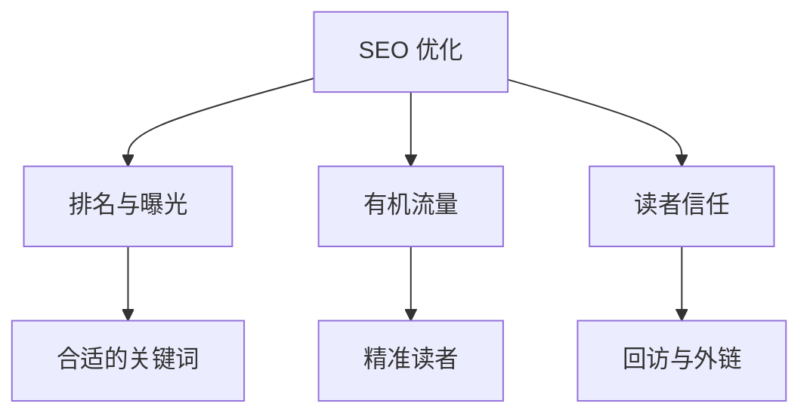
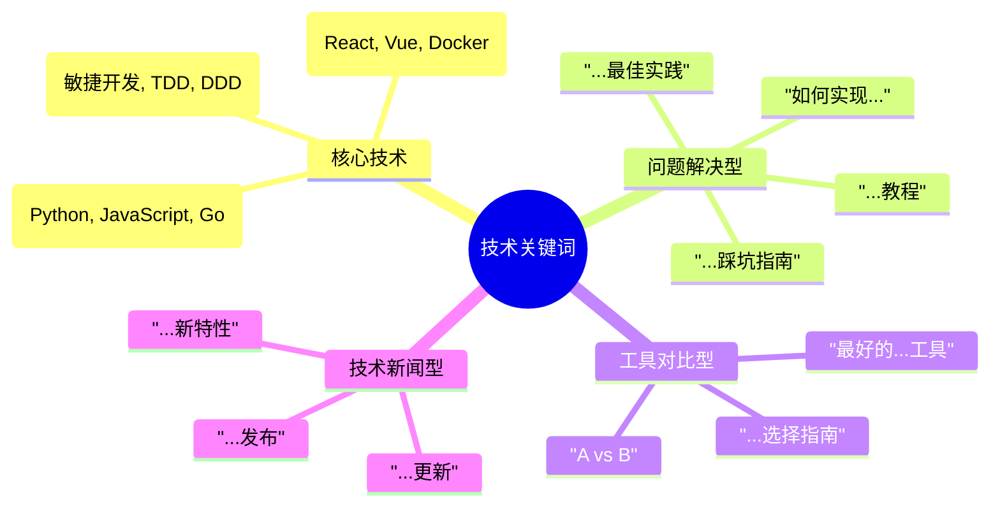
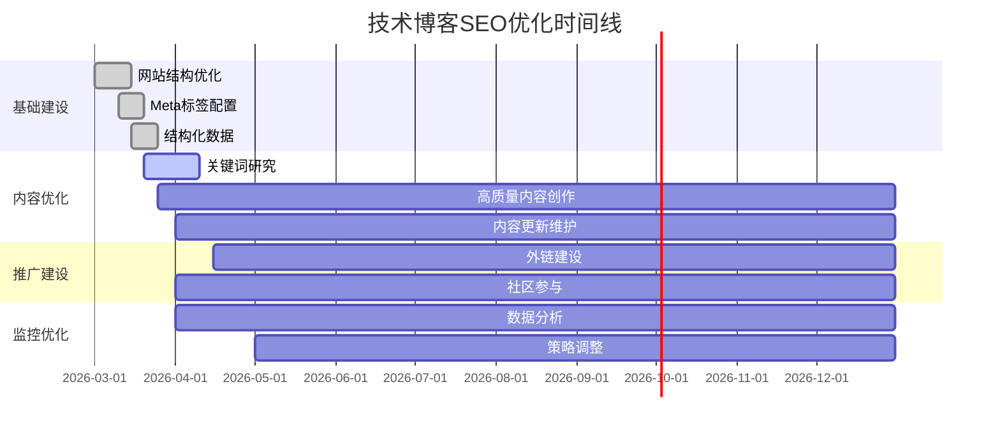

## 前言：技术博客还要不要管 SEO？

写得好≠能被人搜到：爬虫能不能进来、标题和摘要像不像人话、sitemap 和 canonical 有没有搞脏，都会直接影响「有没有曝光」。**SEO** 在这里不是堆关键词，而是把 **技术站该开的开关** 一项项对上。下面按我自己改博客时的顺序写；长文里夹了不少示例代码，可当清单用，不必一次读完。

## 一、SEO基础概念与原理

### 1.1 什么是 SEO？

**SEO** 在这里指：让爬虫能抓、索引能懂、搜索结果里标题摘要像人话，从而拿到 **有机点击**。技术博客不必追求泛流量，更重要的是 **问题搜得到、点进来能解决问题**。



### 1.2 搜索引擎怎么干活（极简版）

抓页面 → 建索引 → 按查询排序。下面三块对应你能动手的配置：

#### 爬取（Crawling）
搜索引擎通过爬虫程序发现和访问网页：

```javascript
// robots.txt 示例 - 控制爬虫行为
User-agent: *
Allow: /

# 优先爬取重要内容
Sitemap: https://www.yoursite.com/sitemap.xml

# 排除不必要的页面
Disallow: /admin/
Disallow: /*?*
```

#### 索引（Indexing）
爬取的内容被分析、分类并存储到搜索引擎的数据库中。

#### 排名（Ranking）
当用户搜索时，搜索引擎根据复杂的算法返回最相关的结果。

### 1.3 技术博客SEO的独特挑战

技术博客与其他类型网站相比，面临特殊的SEO挑战：

- **专业术语多**：技术关键词竞争激烈且变化快
- **受众精准**：目标用户群体相对较小但价值高
- **内容深度**：技术文章通常较长，需要良好的结构化
- **时效性强**：技术更新快，内容需要持续维护

## 二、技术SEO基础建设

### 2.1 网站结构优化

#### URL结构设计
技术博客的URL应该简洁、语义化且包含关键词：

```bash
# ✅ 良好的URL结构
https://www.yoursite.com/posts/react-hooks-best-practices/
https://www.yoursite.com/guides/kubernetes-deployment/
https://www.yoursite.com/tutorials/python-async-programming/

# ❌ 不好的URL结构
https://www.yoursite.com/p?id=12345
https://www.yoursite.com/posts/2026/03/15/article-1/
```

#### 网站导航设计
清晰的导航结构有助于用户和搜索引擎理解网站内容：

```markdown
首页
├── 技术分类
│   ├── 前端开发 (Frontend)
│   ├── 后端开发 (Backend)
│   ├── DevOps运维 (DevOps)
│   ├── 数据科学 (Data Science)
│   └── 移动开发 (Mobile)
├── 教程系列 (Tutorials)
├── 最佳实践 (Best Practices)
├── 工具推荐 (Tools)
└── 关于作者 (About)
```

### 2.2 Meta标签优化

每个页面都应该有独特且描述性的Meta标签：

```html
<!-- VuePress配置示例 -->
<template>
  <!-- 在Frontmatter中配置 -->
  ---
  title: React Hooks最佳实践：useState和useEffect深度解析
  description: 深入探讨React Hooks的使用技巧，包括useState状态管理和useEffect生命周期的最佳实践，提供实际项目案例。
  head:
    - - meta
      - name: keywords
        content: React Hooks,useState,useEffect,React最佳实践,前端开发,JavaScript
    - - meta
      - property: og:title
        content: React Hooks最佳实践：useState和useEffect深度解析
  ---
</template>
```

### 2.3 结构化数据实现

为技术文章添加结构化数据，帮助搜索引擎更好地理解内容：

```json
{
  "@context": "https://schema.org",
  "@type": "Article",
  "headline": "Docker容器化部署完全指南",
  "description": "从基础概念到生产环境部署的Docker完整教程",
  "author": {
    "@type": "Person",
    "name": "老Z",
    "url": "https://www.yoursite.com/about/"
  },
  "publisher": {
    "@type": "Person",
    "name": "老Z"
  },
  "datePublished": "2026-03-15",
  "dateModified": "2026-03-15",
  "programmingLanguage": "Docker",
  "about": [
    {
      "@type": "Thing",
      "name": "容器化"
    },
    {
      "@type": "Thing",
      "name": "DevOps"
    }
  ]
}
```

### 2.4 页面速度优化

技术博客通常包含代码块和图片，需要特别注意加载速度：

```javascript
// 代码高亮延迟加载
const loadPrism = () => {
  if (window.Prism) return;

  const script = document.createElement('script');
  script.src = 'https://cdnjs.cloudflare.com/ajax/libs/prism/1.24.1/prism.min.js';
  script.async = true;
  document.head.appendChild(script);
};

// 使用Intersection Observer延迟加载代码块
const observeCodeBlocks = () => {
  const codeBlocks = document.querySelectorAll('pre code');
  const observer = new IntersectionObserver((entries) => {
    entries.forEach(entry => {
      if (entry.isIntersecting) {
        loadPrism();
        observer.unobserve(entry.target);
      }
    });
  });

  codeBlocks.forEach(block => observer.observe(block));
};
```

## 三、内容SEO策略

### 3.1 关键词研究与策略

#### 技术关键词分类

技术博客的关键词可以分为以下几类：



#### 关键词研究工具

```bash
# 免费工具
1. Google Keyword Planner
2. Ubersuggest (免费版)
3. AnswerThePublic
4. Google Trends

# 付费工具
1. Ahrefs
2. SEMrush
3. Moz Keyword Explorer

# 技术社区研究
1. Stack Overflow 热门问题
2. GitHub Trending 项目
3. Reddit 技术社区讨论
4. Hacker News 热门话题
```

#### 长尾关键词策略

技术博客特别适合长尾关键词策略：

```markdown
# 主关键词: "React Hooks"
# 长尾关键词组合:
- React Hooks最佳实践
- React Hooks性能优化
- React Hooks vs Class Components
- 自定义React Hooks教程
- React Hooks常见错误
- React Hooks项目实战
```

### 3.2 技术文章结构优化

#### 标准技术文章结构

```markdown
# 主标题（H1）- 包含核心关键词

## 前言/背景（H2）
- 问题场景描述
- 解决方案概述
- 预期收获

## 技术原理（H2）
### 核心概念（H3）
### 工作机制（H3）
### 与其他技术的关系（H3）

## 实践教程（H2）
### 环境准备（H3）
### 步骤详解（H3）
### 代码实现（H3）

## 最佳实践（H2）
### 性能优化（H3）
### 安全考虑（H3）
### 常见错误（H3）

## 总结（H2）
## 参考资料（H2）
```

#### 代码块SEO优化

```html
<!-- 为代码块添加语言标识和描述 -->
<div class="code-block" data-lang="javascript" data-title="React Hook示例">
  <pre><code class="language-javascript">
    // useState基本用法示例
    import React, { useState } from 'react';

    function Counter() {
      const [count, setCount] = useState(0);

      return (
        <div>
          <p>当前计数: {count}</p>
          <button onClick={() => setCount(count + 1)}>
            增加
          </button>
        </div>
      );
    }

    export default Counter;
  </code></pre>
</div>
```

### 3.3 内容深度与权威性建设

#### E-A-T原则应用

Google的E-A-T（Expertise, Authoritativeness, Trustworthiness）原则对技术博客尤为重要：

**Expertise（专业性）**
```markdown
- 展示技术认证和证书
- 分享实际项目经验
- 提供详细的技术分析
- 参与开源项目贡献
```

**Authoritativeness（权威性）**
```markdown
- 建立技术专家个人品牌
- 获得行业认可和推荐
- 在技术会议和论坛发声
- 发表技术论文或书籍
```

**Trustworthiness（可信度）**
```markdown
- 提供准确的技术信息
- 及时更新过时内容
- 引用权威技术文档
- 开放源代码和示例
```

#### 内容更新策略

```javascript
// 内容版本管理示例
const contentVersioning = {
  article: {
    id: 'react-hooks-guide',
    title: 'React Hooks完全指南',
    versions: [
      {
        version: '1.0',
        publishDate: '2026-01-15',
        reactVersion: '17.0',
        changes: '初始版本'
      },
      {
        version: '2.0',
        publishDate: '2026-03-15',
        reactVersion: '18.2',
        changes: '更新到React 18，添加Concurrent特性'
      }
    ],
    nextReview: '2026-09-15'
  }
};
```

## 四、外部链接建设与权威性提升

### 4.1 技术社区链接建设

#### 开源项目贡献

```bash
# GitHub贡献策略
1. 为知名开源项目贡献代码
2. 在GitHub Profile添加博客链接
3. 在项目README中引用相关博客文章
4. 创建有价值的技术工具/库

# 贡献示例
git clone https://github.com/vuejs/vue-next
cd vue-next
# 修复bug或添加功能
git commit -m "fix: 修复响应式数据更新问题

详细说明见: https://yoursite.com/posts/vue3-reactivity-fix/"
```

#### 技术论坛参与

```markdown
# 优质技术社区平台
## 国外平台
- Stack Overflow: 回答技术问题
- Reddit (r/programming, r/webdev): 分享技术洞察
- Hacker News: 分享优质技术文章
- Dev.to: 发布技术教程

## 国内平台
- 掘金: 分享前端技术
- 知乎: 回答技术问题
- CSDN: 发布技术教程
- 开源中国: 参与开源讨论
```

### 4.2 Guest Posting策略

为其他技术博客写客座文章：

```markdown
# Guest Post提案模板
主题: 为 [博客名称] 贡献技术文章

您好 [编辑姓名],

我是 [你的姓名]，专注于 [技术领域] 的技术专家。
我关注您的博客已久，特别欣赏 [具体文章] 的深度。

我想为您的平台贡献一篇关于 [技术主题] 的文章，
内容将包括:
- 技术原理深度解析
- 实际项目应用案例
- 完整的代码示例
- 最佳实践总结

预计文章长度: [字数]
交付时间: [日期]

我的技术博客: [你的博客链接]
相关技术文章: [展示文章链接]

期待您的回复。

最好的祝愿,
[你的姓名]
```

### 4.3 技术会议与演讲

```markdown
# 技术演讲SEO策略
## 会议演讲
- 在演讲幻灯片中包含博客链接
- 将演讲内容转化为博客文章
- 在会议官网获得speaker profile链接

## 在线分享
- 技术直播和网络研讨会
- 播客节目guest访谈
- YouTube技术教程视频

## 内容复用
演讲主题 → 博客深度文章 → 技术教程系列 → 开源项目
```

## 五、技术SEO工具与监控

### 5.1 必备SEO工具

#### 免费工具集

```bash
# Google工具套件
1. Google Search Console - 监控搜索表现
2. Google Analytics - 流量分析
3. PageSpeed Insights - 页面速度测试
4. Mobile-Friendly Test - 移动端兼容性

# 开源SEO工具
1. Screaming Frog SEO Spider (免费版)
2. Yoast SEO (WordPress插件)
3. Lighthouse (Chrome DevTools)

# 在线工具
1. GTmetrix - 性能测试
2. Pingdom - 网站监控
3. W3C Validator - 代码验证
```

#### 付费专业工具

```javascript
// 工具对比分析
const seoTools = [
  {
    name: 'Ahrefs',
    pros: ['强大的外链分析', '关键词研究精准', '竞争对手分析'],
    cons: ['价格较高', '数据更新有延迟'],
    bestFor: '大型技术网站和专业SEO团队'
  },
  {
    name: 'SEMrush',
    pros: ['全面的SEO套件', 'PPC分析功能', '社交媒体监控'],
    cons: ['功能复杂', '学习成本高'],
    bestFor: '需要全方位营销分析的技术公司'
  },
  {
    name: 'Moz Pro',
    pros: ['用户友好', '权威性评估', '本地SEO强'],
    cons: ['关键词数据库较小', '外链分析一般'],
    bestFor: '中小型技术博客和本地技术服务'
  }
];
```

### 5.2 SEO监控仪表板

#### Google Data Studio自定义仪表板

```javascript
// 技术博客SEO监控指标
const seoMetrics = {
  // 流量指标
  organic_traffic: {
    source: 'Google Analytics',
    key_metrics: ['sessions', 'users', 'page_views'],
    segments: ['technical_content', 'tutorial_pages', 'tool_reviews']
  },

  // 排名指标
  keyword_rankings: {
    source: 'Google Search Console',
    key_metrics: ['average_position', 'impressions', 'clicks', 'ctr'],
    important_keywords: [
      'react hooks教程',
      'docker容器部署',
      'javascript最佳实践',
      'python异步编程'
    ]
  },

  // 技术性能指标
  core_web_vitals: {
    source: 'PageSpeed Insights API',
    key_metrics: ['LCP', 'INP', 'CLS'],
    thresholds: {
      LCP: 2.5, // 秒
      INP: 200, // 毫秒（交互延迟，替代已废弃的 FID）
      CLS: 0.1  // 评分
    }
  }
};
```

#### 自动化监控脚本

```python
#!/usr/bin/env python3
# SEO监控自动化脚本

import requests
from datetime import datetime
import smtplib
from email.mime.text import MIMEText

class SEOMonitor:
    def __init__(self, site_url):
        self.site_url = site_url
        self.alerts = []

    def check_site_performance(self):
        """检查网站性能"""
        try:
            response = requests.get(f"https://www.googleapis.com/pagespeedonline/v5/runPagespeed?url={self.site_url}")
            data = response.json()

            # 检查Core Web Vitals
            lcp = data['loadingExperience']['metrics']['LARGEST_CONTENTFUL_PAINT_MS']['percentile']

            if lcp > 2500:  # 2.5秒
                self.alerts.append(f"LCP过高: {lcp}ms")

        except Exception as e:
            self.alerts.append(f"性能检查失败: {str(e)}")

    def check_keyword_rankings(self):
        """检查关键词排名（需要配置Search Console API）"""
        # 这里需要实现Search Console API调用
        pass

    def send_alerts(self):
        """发送告警邮件"""
        if self.alerts:
            message = "\n".join(self.alerts)
            # 发送邮件逻辑
            print(f"SEO告警: {message}")

# 使用示例
if __name__ == "__main__":
    monitor = SEOMonitor("https://www.zhaofutao.cn")
    monitor.check_site_performance()
    monitor.send_alerts()
```

### 5.3 竞争对手分析

#### 技术博客竞品分析框架

```markdown
# 竞争对手SEO分析清单

## 1. 内容策略分析
- [ ] 主要技术领域覆盖
- [ ] 文章发布频率和质量
- [ ] 内容深度和实用性
- [ ] 独特价值主张

## 2. 技术SEO审计
- [ ] 网站结构和URL策略
- [ ] 页面加载速度对比
- [ ] 移动端友好性
- [ ] 结构化数据使用情况

## 3. 关键词策略
- [ ] 核心关键词重叠度
- [ ] 长尾关键词策略差异
- [ ] 排名表现对比
- [ ] 内容空白点识别

## 4. 外链建设策略
- [ ] 外链来源分析
- [ ] 权威网站合作情况
- [ ] 社交媒体表现
- [ ] 技术社区参与度
```

## 六、移动端与用户体验优化

### 6.1 移动端SEO优化

手机端流量一大，字号和代码横向滚动就得单独看一眼：

```css
/* 响应式代码块优化 */
.code-block {
  overflow-x: auto;
  background: #f6f8fa;
  border-radius: 8px;
  padding: 1rem;
  margin: 1rem 0;
}

@media (max-width: 768px) {
  .code-block {
    font-size: 14px;
    padding: 0.75rem;
    margin: 0.75rem -1rem; /* 延伸到屏幕边缘 */
  }

  /* 长代码行处理 */
  .code-block pre {
    white-space: pre;
    word-wrap: break-word;
    overflow-wrap: break-word;
  }
}
```

### 6.2 Core Web Vitals优化

```javascript
// 性能监控与优化
class PerformanceOptimizer {
  constructor() {
    this.observer = new PerformanceObserver((list) => {
      list.getEntries().forEach(entry => {
        if (entry.entryType === 'largest-contentful-paint') {
          console.log('LCP:', entry.startTime);
          // 发送到Analytics
          gtag('event', 'web_vitals', {
            name: 'LCP',
            value: Math.round(entry.startTime),
            event_category: 'performance'
          });
        }
      });
    });
  }

  startMonitoring() {
    // 监控LCP
    this.observer.observe({entryTypes: ['largest-contentful-paint']});

    // 监控 INP（或 legacy first-input，视浏览器支持）
    this.observer.observe({entryTypes: ['event']}); // 生产环境用 web-vitals 库更稳

    // 监控CLS
    this.observer.observe({entryTypes: ['layout-shift']});
  }

  optimizeImages() {
    // 延迟加载图片
    const images = document.querySelectorAll('img[data-src]');
    const imageObserver = new IntersectionObserver((entries) => {
      entries.forEach(entry => {
        if (entry.isIntersecting) {
          const img = entry.target;
          img.src = img.dataset.src;
          img.classList.remove('lazy');
          imageObserver.unobserve(img);
        }
      });
    });

    images.forEach(img => imageObserver.observe(img));
  }
}
```

## 七、本地SEO与技术社区建设

### 7.1 技术专家本地化策略

对于技术博客作者来说，建立本地技术社区影响力同样重要：

```json
{
  "@context": "https://schema.org",
  "@type": "Person",
  "name": "老Z",
  "jobTitle": "高级软件工程师",
  "description": "专注支付安全和AI技术的资深工程师",
  "address": {
    "@type": "PostalAddress",
    "addressLocality": "上海",
    "addressRegion": "上海市",
    "addressCountry": "CN"
  },
  "alumniOf": {
    "@type": "EducationalOrganization",
    "name": "某知名大学"
  },
  "knowsAbout": [
    "支付安全", "PCI DSS", "AI大模型", "密码学"
  ],
  "sameAs": [
    "https://github.com/zhaofutao04",
    "https://www.linkedin.com/in/zhaofutao/"
  ]
}
```

### 7.2 技术meetup与线下活动

```markdown
# 技术活动SEO策略

## 活动前
- 在技术社区发布活动预告
- 创建专门的活动页面（优化关键词）
- 邀请技术KOL参与并分享

## 活动中
- 记录精彩瞬间和技术讨论
- 收集参与者联系方式
- 现场直播或录制视频

## 活动后
- 发布活动总结博客文章
- 整理技术PPT和代码示例
- 维护参与者技术社群
- 计划下期活动内容
```

## 八、高级SEO策略与未来趋势

### 8.1 AI与SEO的融合

搜索引擎更看 **内容是否真有用**（而不只是关键词密度）。下面用伪代码列几个我会人工对照的维度——不是让你全自动 SEO，而是写完后自检：

```python
# AI辅助内容优化示例
def analyze_content_quality(article_content):
    """使用AI分析内容质量"""

    quality_factors = {
        'readability': calculate_readability_score(article_content),
        'technical_accuracy': verify_technical_facts(article_content),
        'code_quality': analyze_code_examples(article_content),
        'completeness': check_content_completeness(article_content),
        'uniqueness': detect_content_originality(article_content)
    }

    suggestions = generate_improvement_suggestions(quality_factors)
    return quality_factors, suggestions

def optimize_with_ai(article):
    """AI辅助内容优化"""

    # 1. 标题优化建议
    title_suggestions = generate_title_variants(article.title)

    # 2. 关键词密度优化
    keyword_optimization = analyze_keyword_density(article.content)

    # 3. 结构化建议
    structure_advice = suggest_content_structure(article.content)

    return {
        'titles': title_suggestions,
        'keywords': keyword_optimization,
        'structure': structure_advice
    }
```

### 8.2 语音搜索优化

技术内容的语音搜索优化策略：

```markdown
# 语音搜索关键词示例

## 传统文本搜索
- "React hooks教程"
- "Docker部署指南"
- "Python异步编程"

## 语音搜索优化
- "如何在React中使用hooks"
- "怎样用Docker部署应用程序"
- "Python异步编程是什么意思"
- "什么是最好的前端框架"

## 优化策略
1. 使用自然语言表达
2. 回答具体问题
3. 提供简洁明确的答案
4. 优化FAQ部分
```

### 8.3 视觉搜索与技术图表

```html
<!-- 技术图表SEO优化 -->
<figure itemscope itemtype="https://schema.org/ImageObject">
  
  <figcaption itemprop="caption">
    <h3>微服务架构设计模式</h3>
    <p>这个架构图展示了现代微服务系统的核心组件：
    API网关负责路由和认证，服务注册中心管理服务发现，
    每个微服务都有独立的数据库，通过消息队列实现异步通信。</p>
  </figcaption>
</figure>
```

## 九、实战案例：我的博客SEO优化历程

让我分享一下这个技术博客的实际SEO优化过程和效果：

### 9.1 优化前的问题诊断（历史对照）

以下为 **建站初期** 常见缺口；**本站当前** 已在 `config.ts` / Hope 主题中落地 OG、JSON-LD、sitemap、`public/robots.txt` 等。仍待办项见仓库根目录 `部署后SEO配置.md`（站长验证等）。

```bash
# 历史问题清单 → 现状
❌→✅ Meta / OG / 结构化数据（config head + 主题 SEO）
❌→✅ sitemap.xml（主题 plugins.sitemap）
❌→✅ robots.txt（public/ 手工维护，构建复制）
⏳ 图片 Alt、Core Web Vitals、全文检索体验 — 持续优化
```

### 9.2 具体优化措施

#### 技术SEO配置（本站：Hope 主题内插件）

本仓库 **不用** 根级 `seoPlugin()` / `sitemapPlugin()`，而在 `hopeTheme({ plugins: { ... } })` 里启用，并与 `config.ts` 的 `head` 叠加：

```typescript
// docs/.vuepress/config.ts 摘录
hopeTheme({
  hostname: 'https://www.zhaofutao.cn',
  plugins: {
    seo: { canonical: 'https://www.zhaofutao.cn' },
    sitemap: {
      hostname: 'https://www.zhaofutao.cn',
      exclude: ['/404.html'],
    },
    pwa: { /* ... */ },
  },
})

// 同文件 defineUserConfig({ head: [ /* OG、JSON-LD 等 */ ] })
```

`robots.txt` 在 `docs/.vuepress/public/robots.txt` **手工维护**（非主题自动生成）。

#### 内容优化策略
```markdown
# 文章结构标准化

## 标题层级优化
H1: 主标题（包含核心关键词）
H2: 主要段落标题
H3: 细分主题标题

## 内容结构
1. 引言（问题背景）
2. 技术原理（先讲清再贴代码）
3. 实践教程（代码示例）
4. 最佳实践（经验总结）
5. 总结（要点回顾）

## 关键词分布
- 标题中包含1-2个核心关键词
- 首段出现核心关键词
- 小标题中自然分布相关关键词
- 文末总结重复核心概念
```

### 9.3 优化效果监控

```javascript
// SEO效果跟踪代码
const seoTracking = {
  // 关键指标监控
  trackKeyMetrics: () => {
    // 1. 页面加载性能
    window.addEventListener('load', () => {
      const perfData = performance.getEntriesByType('navigation')[0];
      gtag('event', 'page_load_time', {
        value: Math.round(perfData.loadEventEnd - perfData.fetchStart),
        event_category: 'performance'
      });
    });

    // 2. 用户参与度
    let maxScroll = 0;
    window.addEventListener('scroll', () => {
      const scrollPercent = Math.round((window.scrollY / (document.body.scrollHeight - window.innerHeight)) * 100);
      if (scrollPercent > maxScroll) {
        maxScroll = scrollPercent;
        if (scrollPercent >= 25 && scrollPercent < 50) {
          gtag('event', 'scroll_depth_25');
        } else if (scrollPercent >= 50 && scrollPercent < 75) {
          gtag('event', 'scroll_depth_50');
        } else if (scrollPercent >= 75) {
          gtag('event', 'scroll_depth_75');
        }
      }
    });

    // 3. 代码复制行为
    document.querySelectorAll('.code-copy-button').forEach(button => {
      button.addEventListener('click', () => {
        gtag('event', 'code_copy', {
          event_category: 'engagement',
          event_label: button.dataset.language
        });
      });
    });
  }
};
```

## 十、SEO常见错误与避坑指南

### 10.1 技术博客常见SEO误区

#### 过度技术化的内容
```markdown
# ❌ 错误示例
标题: "基于React Fiber架构的reconciliation算法优化策略研究"

# ✅ 正确示例
标题: "React性能优化实战：深入理解Fiber架构提升应用速度"

说明: 保持技术深度的同时，使用更容易被搜索的自然语言
```

#### 忽视用户搜索意图
```bash
# 用户真实搜索意图分析

搜索词: "React hooks"
真实意图:
- 70% 学习如何使用 → 提供教程内容
- 20% 解决具体问题 → 提供故障排除
- 10% 了解最新特性 → 提供新闻更新

内容策略: 以教程为主，兼顾问题解答和新特性介绍
```

### 10.2 黑帽SEO陷阱

技术博客要特别避免的SEO作弊行为：

```markdown
# 绝对不要做的事情

❌ 关键词堆砌
错误: "React教程React学习React开发React入门React实战React项目"
正确: 自然地在内容中使用"React开发教程"等短语

❌ 复制粘贴技术文档
错误: 直接复制官方文档内容
正确: 基于官方文档进行个人理解和实践总结

❌ 隐藏文本或链接
错误: 使用CSS隐藏关键词文本
正确: 所有内容对用户可见

❌ 购买低质量外链
错误: 从链接农场购买大量垃圾外链
正确: 通过高质量内容自然获得外链
```

### 10.3 技术更新与SEO维护

```python
# 技术内容维护自动化脚本
import datetime
import requests
from bs4 import BeautifulSoup

class TechContentAuditor:
    def __init__(self, site_url):
        self.site_url = site_url
        self.outdated_threshold = 365  # 天

    def check_outdated_content(self):
        """检查过时的技术内容"""
        outdated_articles = []

        # 检查包含版本号的文章
        version_keywords = ['v1.', 'v2.', 'version', '版本']
        articles = self.get_all_articles()

        for article in articles:
            if self.is_outdated(article):
                outdated_articles.append({
                    'url': article['url'],
                    'title': article['title'],
                    'last_update': article['last_update'],
                    'reason': '包含可能过时的技术版本信息'
                })

        return outdated_articles

    def suggest_updates(self, article):
        """建议更新内容"""
        suggestions = []

        # 检查技术栈版本
        if 'react 16' in article['content'].lower():
            suggestions.append('考虑更新到React 18最新特性')

        if 'node 12' in article['content'].lower():
            suggestions.append('Node.js 12已EOL，建议更新示例')

        return suggestions
```

## 十一、结语与行动计划

### 11.1 SEO 是长期维护

没有「改一次就 forever 第一」—— sitemap、内链、旧文更新要持续做。下面甘特图是 **示意节奏**，日期按你自己站点改：



### 11.2 我自己用的权重（主观）

不是公式，只是排优先级时用：

```markdown
# 技术博客 SEO 优先级（老Z 版）

扎实内容 + 技术 SEO 底子 + 社区/外链 + 持续改旧文

## 内容 (约 4 成精力)
- 解决真实问题，代码能跑
- 示例别用过期栈糊弄
- 重要文定期核对日期与版本

## 技术 SEO (约 3 成)
- 标题层级、canonical、sitemap
- 移动端可读、Core Web Vitals 别太差

## 社区/外链 (约 2 成)
- 友链、演讲、复用内容到知乎/掘金等（别纯洗稿）

## 迭代 (约 1 成)
- Search Console 看点击与查询词，改标题/摘要
```

### 11.3 可按周拆的行动清单

下面 checklist 偏 **VuePress 技术站**；已有 Search Console / Analytics 的，跳过对应项即可。

#### 第一周：基础诊断
- [ ] 使用Google PageSpeed Insights测试网站性能
- [ ] 在Google Search Console中注册网站
- [ ] 安装Google Analytics并配置目标跟踪
- [ ] 审计现有内容的SEO友好程度

#### 第二周：技术SEO实施
- [ ] 配置robots.txt和sitemap.xml
- [ ] 为所有页面添加合适的Meta标签
- [ ] 实施结构化数据
- [ ] 优化URL结构和内部链接

#### 第三-四周：内容优化
- [ ] 进行关键词研究，确定目标关键词
- [ ] 优化现有文章的标题和结构
- [ ] 为重要页面添加FAQ部分
- [ ] 创建技术教程series

#### 第二个月：推广建设
- [ ] 在GitHub profile中添加博客链接
- [ ] 参与Stack Overflow和技术社区讨论
- [ ] 寻找guest posting机会
- [ ] 开始技术meetup或在线分享

#### 第三个月及以后：监控和优化
- [ ] 每月分析SEO数据和排名变化
- [ ] 根据用户行为优化用户体验
- [ ] 持续更新过时的技术内容
- [ ] 扩展到新的技术领域和关键词

记住，SEO是一个需要耐心和坚持的过程。专注于为读者提供真正有价值的技术内容，搜索引擎排名的提升自然会随之而来。

开始你的SEO优化之旅吧！如果在实施过程中遇到任何问题，欢迎在评论区讨论交流。

---

## 参考资料与延伸阅读

1. **官方文档**
   - [Google搜索引擎优化指南](https://developers.google.com/search/docs/beginner/seo-starter-guide)
   - [Google网站质量指南](https://developers.google.com/search/docs/advanced/guidelines/webmaster-guidelines)
   - [Core Web Vitals详解](https://web.dev/vitals/)

2. **技术SEO资源**
   - [Schema.org结构化数据](https://schema.org/)
   - [Open Graph Protocol](https://ogp.me/)
   - [Twitter Card文档](https://developer.twitter.com/en/docs/twitter-for-websites/cards/overview/abouts-cards)

3. **SEO工具推荐**
   - [Google Search Console](https://search.google.com/search-console)
   - [Google Analytics](https://analytics.google.com/)
   - [Screaming Frog SEO Spider](https://www.screamingfrog.co.uk/seo-spider/)

4. **技术社区平台**
   - [Stack Overflow](https://stackoverflow.com/)
   - [GitHub](https://github.com/)
   - [Dev.to](https://dev.to/)
   - [掘金](https://juejin.cn/)

**关键词标签**: #SEO #技术博客 #搜索引擎优化 #内容营销 #网站优化 #Google排名 #流量增长 #数字营销