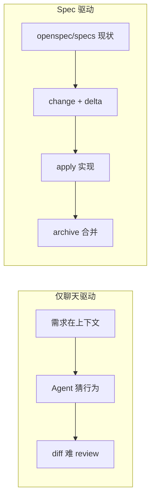
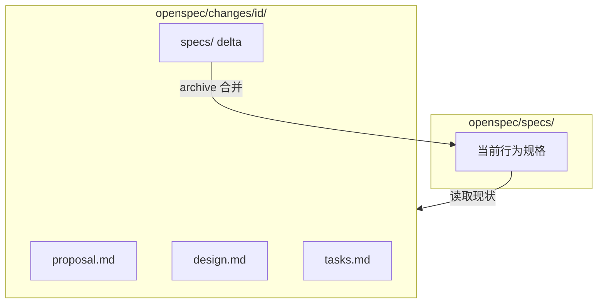

用 Cursor / Claude Code / Codex 写代码，翻车常见原因不是模型不够聪明，而是 **需求只活在聊天记录里**：上一会话说过的边界条件，换窗口就丢；PR 里 reviewer 只能对着 diff 猜意图；成熟代码库里 Agent 经常「猜」现有行为，而不是「读」现有行为。**Spec（规格）** 把「系统应该怎样表现」写成仓库里的结构化文档；**OpenSpec** 是社区里用得最广的开源工具链之一，把 Spec 驱动开发（SDD）落到 `openspec/` 目录、slash 命令和 Git 协作里。

下面先把 **Spec 是什么、不是什么** 对齐，再讲 OpenSpec 的目录模型、OPSX 工作流，以及它和 Plan 模式、Spec Kit、Skills 怎么叠。姊妹篇：[Superpowers ② 规划](./superpowers-part-02-planning.html)（任务级 plan）；[企业 Skills 治理](./enterprise-skills-governance-methodology.html)（Plan/Spec 在治理层级里的位置）。

> 官方参考：[OpenSpec 官网](https://openspec.dev/) · [GitHub](https://github.com/Fission-AI/OpenSpec) · [Concepts](https://github.com/Fission-AI/OpenSpec/blob/main/docs/concepts.md) · [OPSX Workflow](https://github.com/Fission-AI/OpenSpec/blob/main/docs/opsx.md)

## 先分清：Spec、Plan、Rule、Skill

| 概念 | 管什么 | 典型载体 | 生命周期 |
| --- | --- | --- | --- |
| **Spec** | 系统 **对外可观察的行为**（what） | `openspec/specs/*/spec.md` | 长期；随功能演进合并 delta |
| **Plan / Change** | **单次改动** 的方案与任务（why / how / steps） | `openspec/changes/<id>/` | 任务级；归档后进 `archive/` |
| **Rule** | 仓库级硬约束 | `.cursor/rules/`、`CLAUDE.md` | 始终生效 |
| **Skill** | 某类任务的 SOP | `SKILL.md` | 可复用流程，按需加载 |
| **Agent Plan 模式** | 当前会话里的实施计划 | 聊天上下文 | 会话结束即散 |

**Spec 是行为合同，不是实现说明书。** 好的 spec 写：输入输出、错误条件、安全约束、Given/When/Then 场景。类名、框架选型、逐步改哪些文件——那些进 `design.md` 和 `tasks.md`。

和 [企业 Skills 治理](./enterprise-skills-governance-methodology.html) 里的表格一致：**Plan/Spec 是任务级**；跑顺了、可复用的流程再 **沉淀为 Skill**。

## 为什么又开始谈 Spec

Vibe coding 快，但难 **跑远**：需求在 chat 里漂移、多会话丢上下文、reviewer 看不懂「为什么要改」。行业里在收敛 **Spec-Driven Development（SDD，规格驱动开发）**——不是回到瀑布式大文档，而是：

1. **先对齐再写码** — 人和 AI 对「要什么行为」达成一致
2. **规格进 Git** — 和代码一起 PR、review、版本化
3. **brownfield 优先** — 改现有系统时用 **delta** 描述变更，而不是每次重写全书

OpenSpec 官方四原则可以记成四句：**fluid not rigid**（无阶段门禁）、**iterative not waterfall**（边做边改 spec）、**easy not complex**（秒级 init）、**brownfield-first**（delta 是一等公民）。



## OpenSpec 是什么

[OpenSpec](https://github.com/Fission-AI/OpenSpec)（Fission-AI，MIT）是一个 **轻量、Agent 无关** 的 SDD 框架：

- CLI：`@fission-ai/openspec`（需 Node.js 20.19+）
- 产物落在仓库 `openspec/`，无需 API Key、无需 MCP
- 通过 **slash 命令 / Skill** 接入 Cursor、Claude Code、Codex、Copilot 等 20+ 工具
- 当前标准工作流叫 **OPSX**（`/opsx:*`），替代早期偏线性的 `/openspec:proposal` 流程

和 GitHub [Spec Kit](https://github.com/github/spec-kit) 比：OpenSpec 更轻、迭代更自由；Spec Kit 更完整但 ceremony 更重。和 AWS Kiro 比：OpenSpec 不绑 IDE。和「啥也不用」比：多 10 分钟对齐，换更少幻觉和更可 review 的 PR。

## 目录模型：specs 与 changes

OpenSpec 把仓库里规划相关的东西分成两块：

```text
openspec/
├── specs/                    # 现状：系统当前应该怎样表现（source of truth）
│   ├── auth-session/
│   │   └── spec.md
│   └── checkout-payment/
│       └── spec.md
└── changes/                  # 进行中：每次改动一个文件夹
    └── add-remember-me/
        ├── proposal.md       # 为什么做、范围、大方向
        ├── design.md         # 技术方案与架构决策
        ├── tasks.md          # 可勾选实现清单
        └── specs/            # delta：相对主 spec 的增删改
            └── auth-session/
                └── spec.md
```

归档后，change 移到 `changes/archive/YYYY-MM-DD-<id>/`，**delta 合并进 `openspec/specs/`**，历史 proposal/design/tasks 仍保留可查。



## Spec 文件长什么样

按 **能力域** 分目录（`auth/`、`payments/`、`ui/`），每个 `spec.md` 大致结构：

```markdown
# auth-session Specification

## Purpose
管理用户会话的创建、校验与过期。

## Requirements

### Requirement: Session expiration
The system SHALL expire sessions after a configured duration.

#### Scenario: Default session timeout
- GIVEN a user has authenticated
- WHEN 24 hours pass without activity
- THEN invalidate the session token
- AND require re-authentication
```

要点：

| 元素 | 作用 |
| --- | --- |
| `## Purpose` | 这块能力解决什么问题 |
| `### Requirement:` | 必须满足的行为（用 SHALL/MUST/SHOULD，RFC 2119） |
| `#### Scenario:` | 可验证的例子，常用 GIVEN/WHEN/THEN |

**Delta spec** 在 change 里描述相对主 spec 的差异，分三节：

- `## ADDED Requirements` — 归档时追加
- `## MODIFIED Requirements` — 归档时替换同名 requirement
- `## REMOVED Requirements` — 归档时删除

示例（节选）：

```markdown
## MODIFIED Requirements

### Requirement: Session expiration
The system SHALL support configurable session expiration periods.

#### Scenario: Extended session with remember me
- GIVEN user checks "Remember me" at login
- WHEN 30 days have passed
- THEN invalidate the session token
```

OpenSpec 提倡 **渐进式严格**：大多数改动用 Lite spec 即可；跨团队、API 契约、安全合规再写 Full spec。

## OPSX 工作流：三条命令跑通一整个改动

2026 年起默认走 **OPSX**——强调 **动作而非阶段**，规划、实现、改 spec 可以交错进行。

### 安装与初始化

```bash
npm install -g @fission-ai/openspec@latest
cd your-project
openspec init
```

`init` 会在项目里生成 `openspec/` 骨架，并为当前 Agent 写入 slash 命令或 Skill（如 `.claude/skills/openspec-*/SKILL.md`）。可选配置 `openspec/config.yaml` 注入技术栈、测试约定、各 artifact 的 team rules。

升级后记得：

```bash
npm install -g @fission-ai/openspec@latest
openspec update    # 刷新各 Agent 的指令与命令
```

### 核心命令（default core profile）

| 命令 | 做什么 |
| --- | --- |
| `/opsx:propose <想法>` | 创建 change 并生成 proposal / delta specs / design / tasks |
| `/opsx:apply` | 按 `tasks.md` 逐项实现，可边做边改 artifact |
| `/opsx:archive` | 完成改动：合并 delta 到主 spec，change 进 archive |

典型对话（摘自官方 README）：

```text
You: /opsx:propose add-dark-mode
AI:  Created openspec/changes/add-dark-mode/
     ✓ proposal.md · specs/ · design.md · tasks.md

You: /opsx:apply
AI:  ✓ 1.1 ThemeContext · ✓ 2.1 Toggle …

You: /opsx:archive
AI:  Specs updated. Ready for the next feature.
```

### 扩展命令（`openspec config profile` 开启 expanded workflow）

| 命令 | 适合场景 |
| --- | --- |
| `/opsx:explore` | 还没想清楚，先探问题、比方案 |
| `/opsx:new` / `/opsx:continue` | 只要脚手架，或 **一次生成一个** artifact |
| `/opsx:ff` | 方案已清晰，一次性生成全部规划产物 |
| `/opsx:verify` | 对照 spec 检查实现是否对齐 |
| `/opsx:sync` | 把 delta 同步到主 spec（可选步骤） |
| `/opsx:onboard` | 新手端到端走一遍 |

Artifact 依赖关系（默认 `spec-driven` schema）：

```text
proposal → specs ─┐
         → design ┴→ tasks → implement
```

依赖是 **enabler 不是 gate**：可以跳过 `design.md`，也可以在 `/opsx:apply` 中途改 spec 再继续。

### 项目级配置示例

```yaml
# openspec/config.yaml
schema: spec-driven

context: |
  Tech stack: TypeScript, Vue 3, VuePress 2
  Testing: pnpm build 作为集成校验
  Style: 中文博文见 docs/_posts，站内链用 .html 后缀

rules:
  proposal:
    - 写清 in scope / out of scope
  specs:
    - Scenario 用 Given/When/Then
```

## 一次完整示例：给登录加「记住我」

**1. 提议**

```text
/opsx:propose Add remember-me checkbox with 30-day sessions
```

Agent 会先读 `openspec/specs/auth-session/spec.md` 和代码里现有 session 逻辑，再生成 change 文件夹。

**2. 人工 review（关键一步）**

打开 `openspec/changes/add-remember-me/proposal.md`：意图和范围对不对？  
看 `specs/auth-session/spec.md` delta：30 天、cookie 清理等场景是否齐全？  
看 `design.md`：方案是否贴合你栈（别在 spec 里写 React 细节，design 里写）。  
看 `tasks.md`：任务粒度是否适合一次 apply。

**3. 实现**

```text
/opsx:apply
```

**4. 归档**

```text
/opsx:archive
```

主 spec 更新，change 进 archive；下次 Agent 读 spec 就知道「记住我」已是正式行为。

## 和现有 AI 工作流怎么叠

### vs Agent 内置 Plan 模式

Plan 模式适合 **单次会话** 内的任务分解。OpenSpec 适合 **跨会话、可协作、可 review** 的功能规划——产物在 Git 里，换 Codex 换 Cursor 规格还在。官方 FAQ：specs shouldn't care which coding agent you use。

### vs Superpowers / Skills

| 层级 | OpenSpec | Superpowers |
| --- | --- | --- |
| 问什么 | 这个功能 **应该怎样表现** | 这类任务 **按什么顺序做** |
| 产物 | `spec.md`、delta、tasks | `SKILL.md` 工作流 |
| 关系 | 一次功能改动的 **真相源** | 可复用的 **交付纪律** |

不冲突：用 Superpowers 的 `brainstorming` / `writing-plans` 想清楚方向，用 OpenSpec 把 **行为规格** 写进仓库；重复三次的流程再写成 Skill。

### vs Rules / CLAUDE.md

Rule 说「在这个 repo 永远遵守什么」（包管理器、目录约定）。OpenSpec spec 说「这个 **能力** 对外承诺什么」。`openspec/config.yaml` 的 `context` 可以把 CLAUDE.md 里的栈信息 **注入到每次 artifact 生成**，减少 Agent 乱猜。

### vs Code Review

OpenSpec 的卖点之一是 **review intent, not just code**：PR 除了 diff，还可以附 `openspec/changes/<id>/` 或合并后的 spec delta，reviewer 先看行为变更再扫实现。这和 [Codex Hook 与 Review](./codex-hook-review-guide.html) 里「提交前审 diff」是互补——一个管 **意图**，一个管 **代码质量**。

## 常见误区与踩坑

**1. 把 spec 写成设计文档**  
Requirement 里出现 `ThemeContext`、`Redux` 就偏了。实现细节放 `design.md`。

**2. 指望一次性生成全库 spec**  
官方态度：brownfield 不要 upfront 全量生成；**随改动增量积累** spec 库。

**3. 归档后不 archive**  
delta 一直躺在 `changes/` 里，主 spec 和代码会 **漂移**。做完就 `/opsx:archive`。

**4. 发现漏需求怎么办**  
在 **同一 change** 里直接改 `proposal.md`、delta spec、`tasks.md`，然后继续 `/opsx:apply`——OPSX 就是为这种迭代设计的。若 intent 完全变了（「加个 checkbox」变成「重做主题系统」），**新开一个 change** 比硬 patch 更清晰。

**5. 模型与上下文**  
OpenSpec 文档建议高推理模型做规划与实现；apply 前 **清空脏上下文**，避免旧 chat 里的错误假设污染实现。

**6. 遥测**  
CLI 默认收集匿名命令名与版本；CI 自动关闭。本地可 `export OPENSPEC_TELEMETRY=0`。

## 什么时候值得上 OpenSpec

**适合：**

- 成熟代码库（brownfield）里做功能增量
- 团队要 PR review **需求变更**，不只 review 代码
- 经常换 Agent / 换模型，希望 **规划层可移植**
- 和 Git 流程深度绑定（spec 即文档）

**可以缓一缓：**

- 一次性脚本、探索性 spike、生命周期 < 1 天的改动
- 不愿意 review spec、只想要「魔法一键规划」——spec 需要你 **读、改、engage**

## 小结

- **Spec** 是仓库里的 **行为合同**（Requirements + Scenarios），不是 chat 里的长 prompt，也不是 `design.md` 里的类图。
- **OpenSpec** 用 `openspec/specs/` 存现状、`openspec/changes/` 存单次改动的 proposal / design / tasks / **delta**；归档后 spec 库 **有机长大**。
- **OPSX** 是当前标准流：`/opsx:propose` → `/opsx:apply` → `/opsx:archive`，中间可随时改 artifact。
- 与 **Plan 模式、Skills、Rules、codex review** 各管一层：规格对齐、流程纪律、仓库约束、代码质量。
- 起步成本：`npm i -g @fission-ai/openspec` + `openspec init`，然后对一个真实小功能走通全流程。

---

*参考资料：[OpenSpec Getting Started](https://github.com/Fission-AI/OpenSpec/blob/main/docs/getting-started.md) · [Commands](https://github.com/Fission-AI/OpenSpec/blob/main/docs/commands.md) · [GitHub Spec Kit](https://github.com/github/spec-kit)*
