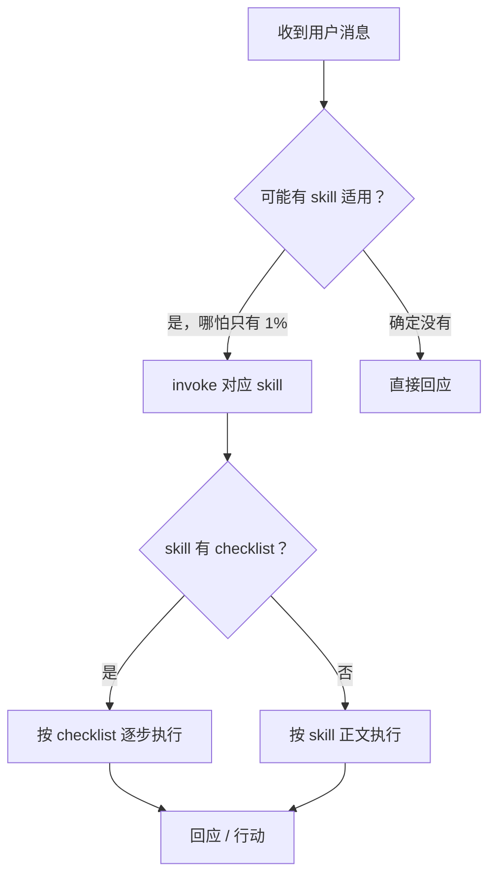

和 Agent 协作写代码，常见翻车不是模型不够聪明，而是 **没有固定工作流**：需求没对齐就改文件、bug 靠猜、做完不说怎么验证。Superpowers（[obra/superpowers](https://skills.sh/obra/superpowers)）把一套经过实战打磨的套路打包成 **14 个 Agent Skill**，用 `SKILL.md` 教 Agent **何时、如何** 做事。本文是系列第一篇：先讲清 Skill 是什么、整包 superpowers 长什么样，以及最核心的 **「先 invoke skill，再动手」** 纪律。

**系列导航**：[总目录](./superpowers-series-plan.html) · 下一篇 → [Part 2：规划](./superpowers-part-02-planning.html)

Skills 安装与目录结构详见姊妹篇：[Claude Code 进阶：MCP、Skills 与自用习惯](./claude-code-advanced-usage-guide.html)。本文不重复 MCP，只聚焦 **Skill 工作流**。

## 先分清：Skill、Rule、MCP

| 概念 | 是什么 | 典型载体 | 解决什么问题 |
| --- | --- | --- | --- |
| **Skill** | 可复用的 **流程 + 原则** 包，按需加载 | `SKILL.md` | 「这类任务该怎么一步步做」 |
| **Rule** | 持久约束，常默认生效 | `.cursor/rules/`、`CLAUDE.md` | 「在这个仓库里始终遵守什么」 |
| **MCP** | 接外部工具与数据的协议 | MCP Server | 「Agent 能调用哪些外部能力」 |

三者可以并存：Rule 定边界，MCP 接工具，Skill 在 **特定任务类型** 触发时注入完整工作流。Superpowers 属于第三层——不是替你想，而是 **约束 Agent 的做事顺序**。

## Superpowers 是什么

Superpowers 是 GitHub 上 [obra/superpowers](https://github.com/obra/superpowers) 维护的开源 skill 集合，在 [skills.sh](https://skills.sh/obra/superpowers) 上累计大量安装。14 个 skill 覆盖一次完整开发闭环：

```mermaid
flowchart TB
    subgraph plan ["规划"]
        B["brainstorming"]
        W["writing-plans"]
    end
    subgraph exec ["执行"]
        GW["using-git-worktrees"]
        EP["executing-plans"]
        SD["subagent-driven-development"]
        PA["dispatching-parallel-agents"]
    end
    subgraph qual ["质量"]
        TDD["test-driven-development"]
        DBG["systematic-debugging"]
        VBC["verification-before-completion"]
        RCR["requesting / receiving-code-review"]
    end
    subgraph end ["收尾与扩展"]
        FB["finishing-a-development-branch"]
        WS["writing-skills"]
    end
    US["using-superpowers\n（元 skill：何时调用）"] --> plan
    plan --> exec
    exec --> qual
    qual --> end
```

本系列按 **6 篇正文** 合并讲解（见 [总目录](./superpowers-series-plan.html)），阅读顺序与工作流一致。今天这篇只建立 **地图 + 纪律**；具体怎么 brainstorm、怎么写计划，从 Part 2 起展开。

## 核心纪律：1% 规则

`using-superpowers` 的出发点很硬：

> 只要觉得有 **1% 可能** 某个 skill 适用，就 **必须先 invoke 该 skill**，再回复或动手。

这不是形式主义。Agent 默认倾向是「先搜代码、先改一行试试」——对简单问答没问题，对 **规划、TDD、调试、合并前验证** 这类有明确顺序的任务，跳过 skill 就等于跳过检查清单。



### 指令优先级

当 skill 与默认行为冲突时，优先级是：

1. **用户明确指令**（`CLAUDE.md`、对话里的直接要求）——最高
2. **Superpowers skill**——覆盖 Agent 默认习惯
3. **系统默认 prompt**——最低

例如：项目 `CLAUDE.md` 写「不要用 TDD」，即使用户装了 superpowers，也应跟项目约定走。**Skill 管流程，用户管要不要这条流程。**

### 多 skill 同时适用时

优先 **过程类** skill（brainstorming、systematic-debugging），再 **实施类** skill（frontend-design 等）。  
「我们要做功能 X」→ 先 brainstorming；「这个测试红了」→ 先 systematic-debugging。

## Rigid 与 Flexible

Superpowers 里的 skill 分两类，对待方式不同：

| 类型 | 含义 | 例子 | 你的态度 |
| --- | --- | --- | --- |
| **Rigid** | 步骤不可省略 | TDD、systematic-debugging | 照做，不要「这次简单就跳过」 |
| **Flexible** | 原则不变，细节可适配 | 部分模式类 skill | 理解意图后再套到当前栈 |

skill 正文里会暗示属于哪一类；拿不准时 **当 Rigid 执行** 更安全。

## 反模式自检：这些念头出现就停

`using-superpowers` 列了一张 **自我合理化** 对照表。摘几条高频的：

| 你心里的念头 | 实际规则 |
| --- | --- |
| 「先看一下代码再说」 | 该用 debugging / brainstorming skill 时，**先看 skill，再看代码** |
| 「这个问题太简单不需要 skill」 | 简单任务最容易跳过对齐，反而浪费返工 |
| 「我记得这个 skill 内容」 | skill 会更新；应 invoke 当前版本 |
| 「我先把这一小步做了」 | **任何行动前** 先过 skill 检查 |

养成习惯的方式：在 Agent 对话里要求「用 superpowers 流程做 X」，或在 Cursor 里输入 `/brainstorming` 等显式触发——详见附录。

## 与姊妹篇的分工

| 文章 | 写什么 | 不写什么 |
| --- | --- | --- |
| [Claude Code 进阶](./claude-code-advanced-usage-guide.html) | MCP 架构、Skills 目录、社区 skill 安装 | superpowers 各 skill 的工作流细节 |
| 本系列 Part 1（本文） | superpowers 地图、调用纪律 | 具体 brainstorm / TDD 步骤 |
| 本系列 Part 2～6 | 各阶段合并讲解 | 重复 MCP 基础 |

## 小结

- **Agent Skill** 是按需加载的流程包；superpowers 是其中一套 **完整开发闭环** 的开源实现。
- **1% 规则**：可能适用就必须 invoke，再行动。
- 优先级：**用户指令 > skill > 默认行为**；过程类 skill 优先于实施类。
- **Rigid** skill 不要偷工减料；拿不准当 Rigid 处理。
- 下一篇 [Part 2](./superpowers-part-02-planning.html) 进入 **规划阶段**：`brainstorming` 如何把需求收成可批准的设计，以及 `writing-plans` 如何拆成可执行计划。

## 附录：安装与触发（命令速查）

正文以概念为主；以下命令便于对照环境操作。以 [skills.sh](https://skills.sh/obra/superpowers) 当期说明为准。

**安装 superpowers（全局，Cursor）：**

```bash
npx skills add obra/superpowers -g -a cursor -y
```

**常见 skill 目录（Agent 自动发现）：**

| 范围 | 路径 |
| --- | --- |
| 用户级 | `~/.agents/skills/`、`~/.cursor/skills/` |
| 项目级 | `.cursor/skills/`、`.agents/skills/` |

**Cursor 中手动触发：** 在 Agent 输入框输入 `/`，搜索 `brainstorming`、`using-superpowers` 等。

**Claude Code：** 通过 Skill 工具 invoke；skill 文件位于 `~/.claude/skills/` 或插件目录，机制与 Cursor 类似，工具名不同。

安装后 **新开 Agent 会话** 以便重新加载 skill 列表。

## 参考链接

- Superpowers 目录：<https://skills.sh/obra/superpowers>
- 源码仓库：<https://github.com/obra/superpowers>
- Agent Skills 开放标准（Cursor 文档）：<https://cursor.com/docs/skills>
