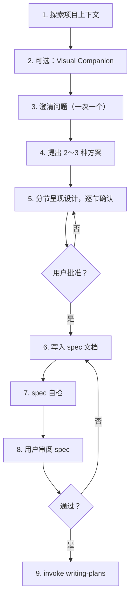
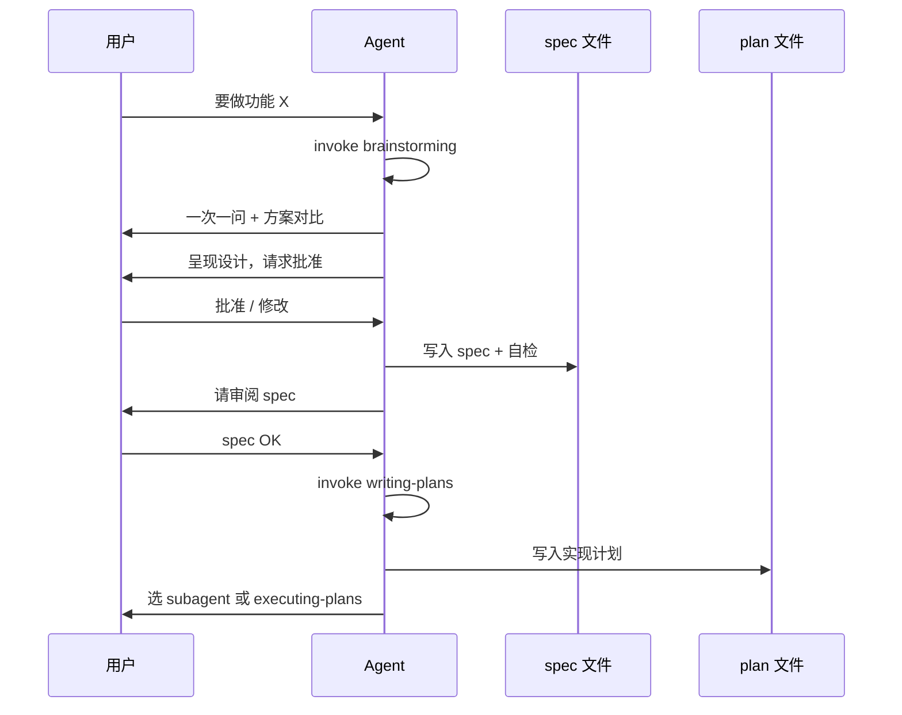

Part 1 讲了 **invoke skill 再动手**。从本篇起进入 superpowers 工作流的第一段：**规划**。很多 Agent 会话一上来就改文件，根因往往是跳过了 `brainstorming` 和 `writing-plans`——前者把「要做什么」收成 **你点头过的设计（spec）**，后者把 spec 拆成 **别人（或另一个会话里的 Agent）能照做的实现计划**。两篇 skill 是 **硬衔接**：brainstorm 的终点只能是 invoke writing-plans，中间不允许写代码。

**系列导航**：[总目录](./superpowers-series-plan.html) · [← Part 1](./superpowers-part-01-using-superpowers.html) · 下一篇 → [Part 3](./superpowers-part-03-execution-isolation.html)

## 先分清：brainstorming vs writing-plans

| 维度 | `brainstorming` | `writing-plans` |
| --- | --- | --- |
| **输入** | 模糊想法、功能需求、改行为 | 已批准的 spec / 明确需求 |
| **输出** | 设计文档（spec）+ 你的确认 | 实现计划（逐步任务 + 命令 + 代码片段） |
| **是否写代码** | **禁止**（HARD-GATE） | 仍不写代码，只写「怎么写」 |
| **对话风格** | 一问一答、多方案对比 | 假设执行者零上下文，步骤极细 |
| **下一环** | invoke `writing-plans` | Part 3/4 的执行 skill |

一句话：**brainstorm 定 WHAT，writing-plans 定 HOW 的步骤清单**。

## brainstorming：动手前的硬门槛

### 何时必须触发

创建功能、改组件、加行为、改交互——凡 **创造性 / 改行为** 的工作，**必须先** invoke `brainstorming`。skill 里写得很死：

> 在用户批准设计之前，**不得** invoke 任何实现类 skill、不得写代码、不得搭脚手架。

「就改一行配置」也适用——简单项目恰恰是 **假设最多、返工最贵** 的地方。设计可以只有几句话，但 **必须呈现并获批准**。

### 九步 checklist（顺序不可跳）



各步要点：

1. **探索上下文**：读现有文件、文档、近期 commit，别在不了解仓库的情况下开问。
2. **Visual Companion**（可选）：涉及 UI 布局、视觉对比时，可单独一条消息征求是否用浏览器 mockup；概念选择题仍用文本。用户拒绝则全程文本。
3. **澄清问题**：**一次只问一个**；优先选择题（A/B/C/D）。搞清目的、约束、成功标准。
4. **2～3 种方案**：带 trade-off，给出推荐项及理由。
5. **分节呈现设计**：架构、组件、数据流、错误处理、测试——按复杂度伸缩；每节后问「这样 OK 吗」。
6. **写 spec**：默认路径 `docs/superpowers/specs/YYYY-MM-DD-<topic>-design.md`（项目可自定位置，如博客系列用 `_posts/` 下的计划文）。
7. **spec 自检**：扫 TBD/TODO、内部矛盾、范围过大、歧义表述。
8. **用户审阅 gate**：明确请用户读 spec，改完再过一遍。
9. **唯一出口**：invoke `writing-plans`——**不要**在此之后直接 invoke frontend-design 等实现 skill。

### 范围过大怎么办

若需求横跨多个独立子系统（聊天 + 计费 + 存储 + 分析），**先拆子项目**，每个子项目走完整 spec → plan → 实现循环；不要在一个 brainstorm 里硬塞全部细节。

### 设计原则（写进 spec 时应体现）

- **边界清晰**：每个单元只做一件事，接口明确；改内部不应破坏调用方。
- **YAGNI**：狠砍非必要功能。
- **贴合现有代码库**：先跟项目既有模式，不为无关重构分心；若当前文件已臃肿，可在设计里 **有针对性地拆分**，但范围限于本次目标。

### 本系列是怎么走 brainstorming 的

写 Superpowers 系列本身就用过这套流程：先问读者画像（C：入门+实战）、写法（D：概念为主）、篇数（B：7 篇）、读法（A：线性）—— **一次一题**，再给出 2～3 种目录方案，你选 B 后才建 `superpowers-series-plan.md` 和 Part 1。这就是 brainstorming 的缩小版实例。

## writing-plans：把 spec 变成可执行任务

### 何时触发

已有 **多步骤任务** 的 spec 或明确需求，**在碰代码之前** invoke `writing-plans`。

### 计划长什么样

skill 假设执行者是 **熟练工程师，但对本仓库和问题域零上下文**，因此计划必须包含：

- **精确文件路径**（create / modify / test）
- **完整代码块**（不是「此处实现逻辑」）
- **精确命令** + **预期输出**（如 pytest FAIL 报什么）
- **TDD 节奏**：先失败测试 → 最小实现 → 绿 → commit
- **小步提交**：每 task 末尾常有 commit 步骤

计划默认保存：`docs/superpowers/plans/YYYY-MM-DD-<feature>.md`。

### 计划文档头（必填模板）

每份计划必须以类似结构开头：

```markdown
# [Feature Name] Implementation Plan

> **For agentic workers:** REQUIRED SUB-SKILL: Use superpowers:subagent-driven-development (recommended) or superpowers:executing-plans to implement this plan task-by-task. Steps use checkbox (`- [ ]`) syntax for tracking.

**Goal:** [一句话]

**Architecture:** [2～3 句]

**Tech Stack:** [关键技术栈]

---
```

### 任务粒度

**一步 = 一个动作，约 2～5 分钟**，例如：

- 写失败测试 → 跑确认红 → 写最小实现 → 跑确认绿 → commit

每个 Task 用 checkbox（`- [ ]`）跟踪，便于 Part 3/4 的执行 skill 逐条勾选。

### 禁止出现的「计划偷懒句」

以下视为 **计划失败**，必须改成具体内容：

| 偷懒写法 | 应改成 |
| --- | --- |
| TBD / TODO / implement later | 明确步骤或代码 |
| add appropriate error handling | 列出要处理的错误与代码 |
| Write tests for the above | 写出完整测试代码 |
| Similar to Task 3 | 重复粘贴相关代码 |
| 只写「加验证」 | 写出验证逻辑与断言 |

写完后 **自检**：spec 每条需求是否对应到某个 task；类型名、函数名前后是否一致。

### 计划完成后的分叉

计划保存后，Agent 应问你选哪种执行方式（对应 Part 3/4）：

| 选项 | 适用 skill | 特点 |
| --- | --- | --- |
| **Subagent-Driven（推荐）** | `subagent-driven-development` | 每 task 新 subagent + 任务间 review |
| **Inline / 跨会话** | `executing-plans` | 本计划会话或新会话分批执行 + 检查点 |

plan 里应写明 REQUIRED SUB-SKILL，避免执行阶段「自由发挥」。

## 两环如何衔接



**铁律**：brainstorming 结束后 **只** 接 writing-plans；writing-plans 结束后 **才** 进入执行篇（通常先 `using-git-worktrees` 隔离环境，见 Part 3）。

## 常见反模式

| 反模式 | 后果 | 正确做法 |
| --- | --- | --- |
| 跳过 brainstorm 直接写 plan | plan 基于未对齐假设 | 先 spec，再 plan |
| brainstorm 里先改一行试试 | 违反 HARD-GATE | 设计批准前零代码 |
| 一次抛 5 个问题 | 用户难答，信息仍乱 | 一次一问 |
| plan 里只有文件名没有代码 | 执行者猜实现 | 每步完整代码 + 命令 |
| spec 范围含三个子系统 | 一个 plan 做不完 | 拆子项目，各走一轮 |

::: tip 博客 / 文档类任务

写系列博文、改 VuePress 配置同样适用：brainstorm 定目录与读者，spec 可以是 `*-series-plan.md`，plan 可以是「Part 2～6 提纲 + 每篇 checklist」。不必生搬 `docs/superpowers/specs/` 路径，但 **两阶段分离** 不变。

:::

## 小结

- **brainstorming**：创造性工作前置；**禁止**未批准就写代码；一次一问、多方案、写 spec、用户 gate。
- **writing-plans**：spec 批准后；产出带 checkbox 的逐步计划；精确路径、代码、命令、预期输出。
- 衔接：brainstorm → spec OK → writing-plans → 选执行方式（Part 3/4）。
- 下一篇 **Part 3** 讲执行上半段：[隔离 workspace 与跨会话 executing-plans](./superpowers-part-03-execution-isolation.html)。

## 附录：触发与默认路径

| skill | 典型触发 | 默认产出路径 |
| --- | --- | --- |
| `brainstorming` | `/brainstorming` 或「先 brainstorm 再做 X」 | `docs/superpowers/specs/YYYY-MM-DD-<topic>-design.md` |
| `writing-plans` | spec 批准后自动 invoke | `docs/superpowers/plans/YYYY-MM-DD-<feature>.md` |

路径可按项目覆盖（如本博客系列计划放在 `docs/_posts/superpowers-series-plan.md`）。

**Cursor：** Agent 输入 `/brainstorming` 或 `/writing-plans`（安装 superpowers 后可见）。

**Claude Code：** 通过 Skill 工具 invoke，名称同上。

## 参考链接

- [Superpowers 系列总目录](./superpowers-series-plan.html)
- [Part 1：Skill 生态与调用纪律](./superpowers-part-01-using-superpowers.html)
- brainstorming：<https://skills.sh/obra/superpowers/brainstorming>
- writing-plans：<https://skills.sh/obra/superpowers/writing-plans>
