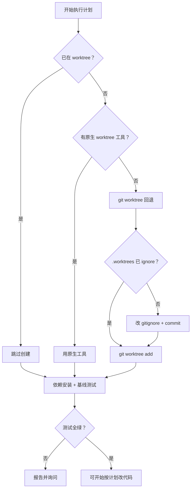
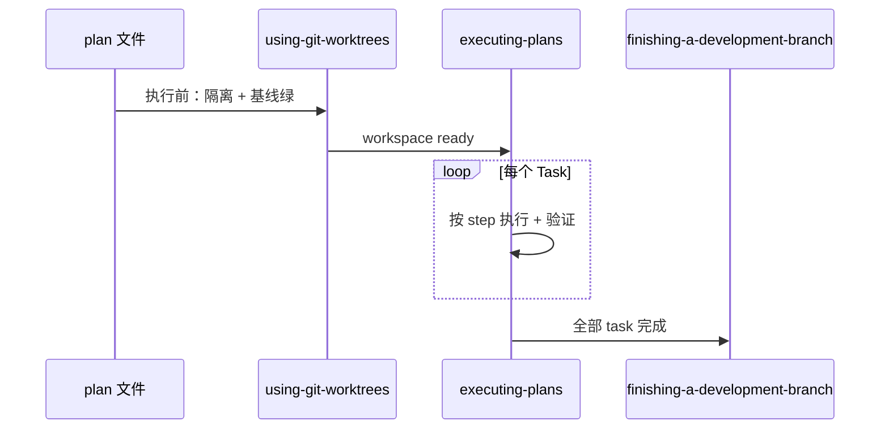

Part 2 产出了 **spec + 实现计划**。从本篇起进入 **执行阶段的上半段**：先在 **隔离的 workspace** 里开工（`using-git-worktrees`），再按计划在 **独立会话或分批检查点** 里落地（`executing-plans`）。为什么要隔离？因为 Agent 改文件不可预测——在 main 上直接动，容易污染当前分支、混淆「旧 bug」和「新改动」。为什么要跨会话执行？因为长计划塞在一个上下文里会丢步骤、跳验证；拆批 + 检查点更稳。

**系列导航**：[总目录](./superpowers-series-plan.html) · [← Part 2](./superpowers-part-02-planning.html) · 下一篇 → [Part 4](./superpowers-part-04-execution-agents.html)

::: tip 与 Part 4 的分工

本篇讲 **环境隔离 + 按计划逐步执行（executing-plans）**。若平台支持 subagent，writing-plans 完成后更推荐 Part 4 的 `subagent-driven-development`；executing-plans 适合 **无 subagent** 或 **刻意新开会话** 的场景。两者都依赖本篇的隔离原则。

:::

## 先分清：worktree vs executing-plans

| 维度 | `using-git-worktrees` | `executing-plans` |
| --- | --- | --- |
| **阶段** | 执行 **之前** | 有计划 **之后** |
| **目的** | 确保在隔离目录 / 分支上改代码 | 按 plan 逐步完成任务 |
| **产出** | 可开工的干净 workspace | 计划全部 task 完成 + 交接收尾 skill |
| **与 plan 关系** | 通常先于或与执行 skill 配合 | 读取 `docs/superpowers/plans/*.md` |
| **下一环** | 进入 executing-plans 或 subagent-driven | invoke `finishing-a-development-branch` |

## using-git-worktrees：执行前先隔离

### 核心原则

> **先检测是否已隔离 → 优先用平台原生 worktree 工具 → 没有再用 git worktree → 别跟 harness 对着干。**

Cursor、Claude Code 等环境可能自带「进入 worktree / 隔离工作区」能力。若已有 **原生工具**，不要手搓 `git worktree add`——否则会出现 harness 管不到的「幽灵目录」。

### Step 0：检测现有隔离

动手创建任何东西 **之前**，先判断当前是否已在 linked worktree 里：

- 比较 `git-dir` 与 `git-common-dir` 路径
- **子模块陷阱**：两者不等也可能是 submodule，不是 worktree——需额外用 `git rev-parse --show-superproject-working-tree` 排除

**若已在 worktree：** 跳过创建，直接进入项目 setup + 基线测试。

**若在普通 checkout：** 若用户未声明偏好，先 **征求同意** 再建 worktree；用户拒绝则在原地执行（风险自负，但至少知情）。

### Step 1：创建隔离 workspace

**优先级 1a — 原生工具**

平台提供的 `EnterWorktree`、`/worktree`、`--worktree` 等 → 直接用，跳到 setup。

**优先级 1b — git worktree 回退**

仅当 **没有** 原生工具时使用。目录选择优先级：

1. 用户 / 项目规则里 **已声明** 的路径
2. 项目内已有 `.worktrees/`（优于 `worktrees/`）
3. 全局遗留路径 `~/.config/superpowers/worktrees/<项目名>/`
4. 默认：项目根 `.worktrees/`

**项目内目录必须被 gitignore：**

```bash
git check-ignore -q .worktrees
```

若未 ignore → 先改 `.gitignore` 并 commit，再创建 worktree。否则 worktree 内容可能被误提交。

创建示例（概念）：

```bash
git worktree add .worktrees/feature-foo -b feature/foo
cd .worktrees/feature-foo
```

**沙箱失败：** 若权限被拒，告知用户并在 **当前目录** 继续，同时仍跑 setup 与基线测试。

### Step 3～4：Setup 与干净基线

进入隔离目录后：

1. **自动 setup**：`package.json` → install；`Cargo.toml` → build；`pyproject.toml` / `requirements.txt` → 装依赖；`go.mod` → download
2. **跑全量测试**，确认 **起点是绿的**

基线失败时 **不得默认继续**——应报告失败，问用户是修存量问题还是仍要在此基线上做功能。

### 决策速查



### 常见错误

| 错误 | 后果 | 正确做法 |
| --- | --- | --- |
| 已有 worktree 再建一个 | 嵌套混乱 | Step 0 先检测 |
| 有原生工具仍手搓 git | harness 状态不一致 | Step 1a 优先 |
| `.worktrees` 未 ignore | 脏文件进仓库 | check-ignore 必做 |
| 基线红仍开干 | 无法归因新 bug | 报告并获许可 |

## executing-plans：跨会话按计划执行

### 适用场景

- 已有一份 **writing-plans 写好的** 实现计划
- 打算在 **单独会话** 或 **分批检查点** 中执行（而非 Part 4 的 per-task subagent）
- 平台 **没有** subagent，或你 **刻意** 用新会话换干净上下文

skill 开头注明：若有 subagent 能力，**更推荐** `subagent-driven-development`（见 Part 4）。

### 三步流程


**Step 1 — 加载并审阅**

1. 读取 plan 文件
2. **批判性审阅**：有没有缺依赖、步骤矛盾、路径不存在
3. 有疑问 → **先问人**，不要猜
4. 无问题 → 建 Todo（或 checkbox）跟踪每个 task

**Step 2 — 执行 task**

对每个 task：

1. 标为 in_progress
2. **严格按 plan 小步**（写失败测试 → 跑红 → 最小实现 → 跑绿 → commit）
3. 跑 plan 里写的 **验证命令**，核对 **预期输出**
4. 标为 completed

**Step 3 — 完成开发**

全部 task 验证通过后：

- 声明 invoke `finishing-a-development-branch`（Part 6 详述）
- **禁止** 在 main/master 上未经用户同意直接实现（plan 执行同样遵守）

### 何时必须停下问人

- 缺依赖、测试失败、指令看不懂
- plan 有关键空洞，无法开工
- 验证 **反复失败**

**不要硬猜过关。** 可回到 Step 1 审阅（例如 partner 更新了 plan）。

### 与 Part 2 plan 格式的关系

Part 2 的计划带 checkbox、精确路径、完整代码与命令。executing-plans 的价值在于 **不发明新步骤**——plan 即合约。Agent 若跳过「跑红确认」或合并多个 step，就破坏了 TDD 与可追溯性。

## 两 skill 如何串联



典型对话顺序：

1. 「按计划 X 实现」→ invoke **using-git-worktrees**
2. 报告：`Worktree ready … Tests passing …`
3. invoke **executing-plans** → 逐 task
4. 完成后 → **finishing-a-development-branch**

## 执行路径选择（回顾 Part 2）

writing-plans 结束时会有分叉：

| 路径 | skill | 本篇是否核心 |
| --- | --- | --- |
| Subagent-Driven | Part 4 `subagent-driven-development` | 仍建议先做 worktree 隔离 |
| Inline / 跨会话 | 本篇 `executing-plans` | **本篇主角** |

博客、文档类任务若不做 git 分支，可 **简化** worktree 步骤，但 **「起点状态清楚 + 按 plan 逐步验证」** 仍适用。

## 常见反模式

| 反模式 | 问题 |
| --- | --- |
| 跳过 worktree 在 main 上长计划执行 | 难回滚、难 review |
| 不跑基线测试 | 把旧失败当成新引入 |
| 执行时「优化」plan 步骤 | 与 writing-plans 合约不一致 |
| 验证失败继续往下 task | 错误累积 |
| 有 subagent 仍强行 executing-plans | 错过任务间 review（Part 4） |

## 小结

- **using-git-worktrees**：执行前 **检测 → 原生优先 → git 回退 → ignore 校验 → setup → 基线全绿**。
- **executing-plans**： **审阅 plan → 逐 task 照做 → 验证 → 收尾 skill**；blocked 就停，不猜。
- 有 subagent 时优先 Part 4；本篇是 **跨会话 / 无 subagent** 的主路径。
- 下一篇 **Part 4**：[子 Agent 驱动与并行派发](./superpowers-part-04-execution-agents.html)。

## 附录：命令速查

**检测是否已在 worktree（概念命令）：**

```bash
GIT_DIR=$(cd "$(git rev-parse --git-dir)" && pwd -P)
GIT_COMMON=$(cd "$(git rev-parse --git-common-dir)" && pwd -P)
# GIT_DIR != GIT_COMMON 且非 submodule → 已在 worktree
git rev-parse --show-superproject-working-tree 2>/dev/null  # 有输出则在 submodule
```

**项目内 worktree 是否被 ignore：**

```bash
git check-ignore -q .worktrees && echo "ignored OK"
```

**创建 worktree（无原生工具时）：**

```bash
git worktree add .worktrees/my-feature -b feature/my-feature
cd .worktrees/my-feature
pnpm install   # 示例：Node 项目
pnpm test      # 基线须绿
```

**Cursor / Claude Code：** 若环境提供 worktree 或「新分支工作区」入口，优先用 UI/命令，不必手敲上述 git。

**触发 executing-plans：** 计划文件就绪后，「按 `docs/superpowers/plans/…` 执行」或 invoke `/executing-plans`（若已安装 superpowers）。

## 参考链接

- [Superpowers 系列总目录](./superpowers-series-plan.html)
- [Part 2：规划](./superpowers-part-02-planning.html)
- using-git-worktrees：<https://skills.sh/obra/superpowers/using-git-worktrees>
- executing-plans：<https://skills.sh/obra/superpowers/executing-plans>
