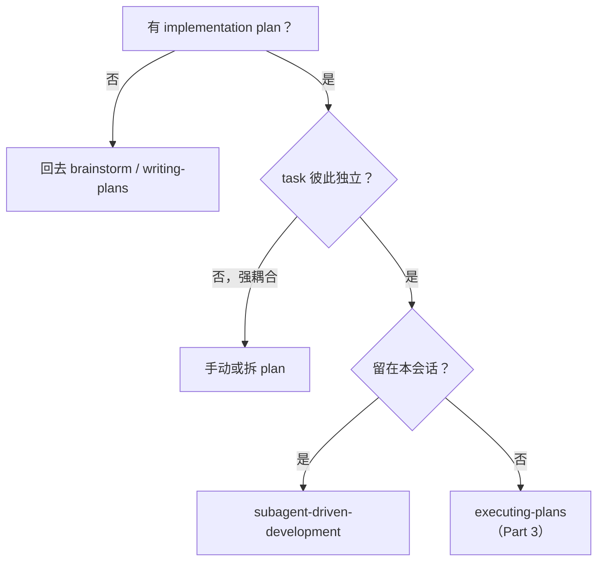
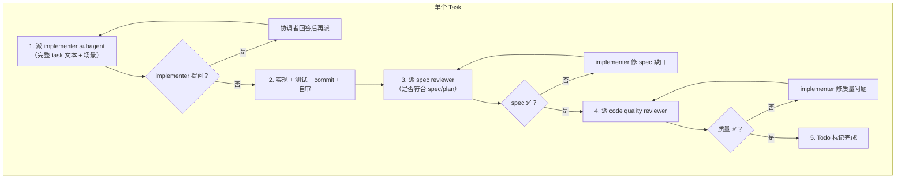
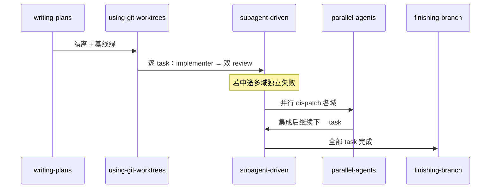

Part 3 讲了在隔离 workspace 里用 `executing-plans` **跨会话** 逐步执行。若你的平台支持 **subagent**（Cursor Agent、Claude Code、Codex 等），superpowers 更推荐本篇两条 skill：**同一计划、同一协调会话内**，每个 task 派 **全新 subagent** 实现，并做 **两阶段 review**（`subagent-driven-development`）；遇到 **多个互不相关的故障** 时，则 **并行** 派多个 agent 各攻一块（`dispatching-parallel-agents`）。核心都是：**subagent 不继承你的聊天历史，你只给它精心裁剪的上下文。**

**系列导航**：[总目录](./superpowers-series-plan.html) · [← Part 3](./superpowers-part-03-execution-isolation.html) · 下一篇 → [Part 5](./superpowers-part-05-quality.html)

## 先分清：三种执行方式

| 方式 | skill | 会话 | subagent | 典型场景 |
| --- | --- | --- | --- | --- |
| 跨会话逐步执行 | `executing-plans` | 可新开会话 | 否 | 无 subagent、或刻意换上下文 |
| 单会话逐 task 派 agent | `subagent-driven-development` | 同一协调会话 | 是，**每 task 一个** | 有 plan、task 相对独立 |
| 多问题并行排查 | `dispatching-parallel-agents` | 协调会话 | 是，**多路并发** | 3+ 独立失败域 |

**并行派发** 不替代 subagent-driven 的「按计划逐 task 实现」——它解决的是 **调试 / 多域失败** 类问题，可与前者在不同阶段各用一次。

## subagent-driven-development：每 task Fresh Agent + 双 review

### 为何用 subagent

协调者（主 Agent）保留 **全局计划与进度**；implementer subagent 只收到 **当前 task 全文 + 必要上下文**，不带整个聊天历史。好处：

- 上下文不污染，少混淆前面 task 的文件状态
- implementer 可在动手 **前** 提问（比做完再返工便宜）
- 协调者精力留给 **派活、答疑、review**

**铁律：** 不要让 subagent 自己去读 plan 文件——协调者应 **一次性提取所有 task 全文**，派 implementer 时 **粘贴完整 task 块**。

### 何时选用（相对 Part 3）

- 已有 writing-plans 产出的 plan
- task **大体独立**（非强耦合的一大坨）
- **留在当前会话** 连续跑完（中间不向人类「要不要继续」）

skill 明确：**task 之间不要停下来问用户「继续吗？」**——用户已授权执行 plan。唯一应停下的情况：`BLOCKED`、真正无法推进的歧义、或全部 task 完成。

### 每个 task 的循环

**Review 顺序不可颠倒：** 必须先 **spec 合规**，再 **代码质量**。spec 有问题时做质量 review 是浪费时间。

每个 task 结束后 **两关都 ✅** 才能进下一 task。

### implementer 四种状态

| 状态 | 含义 | 协调者动作 |
| --- | --- | --- |
| **DONE** | 完成 | 进入 spec review |
| **DONE_WITH_CONCERNS** | 完成但有疑虑 | 读疑虑；涉及正确性/范围先处理 |
| **NEEDS_CONTEXT** | 缺信息 | 补上下文后 **重新派** |
| **BLOCKED** | 无法完成 | 补上下文 / 换更强模型 / 拆 task / **升级给人** |

**禁止** 无视 BLOCKED 或用同一模型空 retry。

### 模型选型（成本与速度）

按 **角色与复杂度** 选模型，不必全程用最贵：

| 信号 | 建议 |
| --- | --- |
| 1～2 文件、spec 完整、机械实现 | 快 / 便宜模型 |
| 多文件集成、要判断模式 | 标准模型 |
| 架构、设计、review | 最强可用模型 |

### 全部 task 完成后

1. 可选：派 **final code reviewer** 扫一遍整体实现
2. **必须** invoke `finishing-a-development-branch`（Part 6）

### 与 subagent-driven **相对** 的 red flags

| 禁止 | 原因 |
| --- | --- |
| 并行派 **多个 implementer** 改同一仓库 | 冲突 |
| 跳过 spec 或 quality review | 质量门失效 |
| spec 未 ✅ 就做 quality review | 顺序错误 |
| 让 implementer 自审代替 review | 两阶段 review 都要 |
| 协调者亲手改 implementer 该改的 bug | 污染协调者上下文 |
| 在 main 上未经同意开干 | 与 Part 3 相同 |

**依赖 skill：** Part 3 的 `using-git-worktrees`、Part 2 的 `writing-plans`；implementer 应遵循 `test-driven-development`；review 模板来自 `requesting-code-review`。

## dispatching-parallel-agents：一域一 agent、同时开工

### 适用场景

- **3+** 处失败，且 **根因域独立**（不同测试文件、不同子系统、不同 bug）
- 每个问题 **不需要** 其他问题的上下文才能查
- **无共享状态**（不会同时改同一文件、抢同一资源）

### 不适用

| 情况 | 为何不用并行 |
| --- | --- |
| 失败彼此相关 | 修一个可能连带修其他 → 单 agent 先理清 |
| 还在探索性调试 | 不知域边界 → 先用 `systematic-debugging`（Part 5） |
| 需要全局系统状态 | 并行会缺全景 |
| 会改同一批文件 | 编辑冲突 |

### 四步模式

1. **划独立域**：按测试文件 / 子系统 / 症状分组
2. **写聚焦任务**：每 agent 一份自包含 prompt（范围、目标、约束、返回格式）
3. **并行 dispatch**：同时启动（Cursor 里可并行 Task / 多 Agent）
4. **集成验证**：读各 agent 摘要 → 查冲突 → **跑全量测试** → spot check

### 好 prompt vs 坏 prompt

| 维度 | ❌ 坏 | ✅ 好 |
| --- | --- | --- |
| 范围 | 「修所有测试」 | 「修 `agent-tool-abort.test.ts` 的 3 个失败」 |
| 上下文 | 「修 race condition」 | 贴失败用例名 + 错误信息 |
| 约束 | 无 | 「勿改生产代码」或「仅改测试」 |
| 输出 | 「修好就行」 | 「返回根因摘要 + 改动说明」 |

::: warning 勿用「加长 timeout」糊弄

skill 示例强调：timing 类失败应找 **事件等待 / 真 bug**，而不是把 sleep 调大。

:::

### 与 subagent-driven 的关系

| 维度 | subagent-driven | parallel dispatch |
| --- | --- | --- |
| 驱动 | **按计划** 顺序 task | **按故障域** 并行 |
| implementer 数量 | 同一时刻 **一个** task | 多个 **独立** 调查 |
| review | 每 task 双 review | 协调者集成 + 全量测试 |
| 典型阶段 | 功能实现 | CI 红、多文件各挂各的 |

可以：implement 用 subagent-driven 顺序做 feature；某次 CI 六处独立红，再用 parallel dispatch 同时查。

## 串联：从 plan 到并行排障

## 常见反模式

| 反模式 | 后果 |
| --- | --- |
| 有 subagent 仍全程 executing-plans | 少 task 间 review，上下文更易糊 |
| subagent-driven 里并行多个 implementer | merge 冲突 |
| 并行 dispatch 相关失败 | 重复劳动、互相覆盖 |
| 不跑全量测试就宣布集成完成 | 局部绿、整体红 |
| task 间频繁「要否继续」 | 违反 skill，拖慢执行 |

## 小结

- **subagent-driven-development**：plan → 每 task **新 implementer** → **spec review → quality review** → 下一 task；中间不问「继续吗」。
- **dispatching-parallel-agents**：**独立故障域** → 聚焦 prompt → **并行** → 集成 + 全 suite。
- 两者都强调：**subagent 只吃你裁剪的上下文，不吃整段聊天史**。
- 下一篇 **Part 5**：[质量闭环——TDD、调试、验证与 Code Review](./superpowers-part-05-quality.html)。

## 附录：触发与平台提示

**subagent-driven-development**

- writing-plans 结束时选 **Subagent-Driven（recommended）**
- 或明确说：「用 subagent-driven 执行 `docs/superpowers/plans/xxx.md`」
- Cursor：协调 Agent 使用 Task 工具派 subagent；subagent **readonly 与否** 由任务决定

**dispatching-parallel-agents**

- 「这三个测试文件各挂各的，并行查」
- Cursor：同一消息内发起多个 Task（explore / generalPurpose / shell 等按域选择）

**成本提示：** subagent-driven 每 task 约 **1 implementer + 2 reviewer** 次调用；换来更早发现 spec 偏差与质量问题。

## 参考链接

- [Superpowers 系列总目录](./superpowers-series-plan.html)
- [Part 3：执行（上）](./superpowers-part-03-execution-isolation.html)
- subagent-driven-development：<https://skills.sh/obra/superpowers/subagent-driven-development>
- dispatching-parallel-agents：<https://skills.sh/obra/superpowers/dispatching-parallel-agents>
