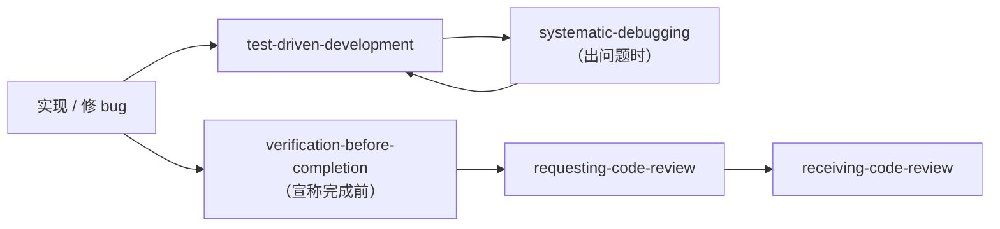
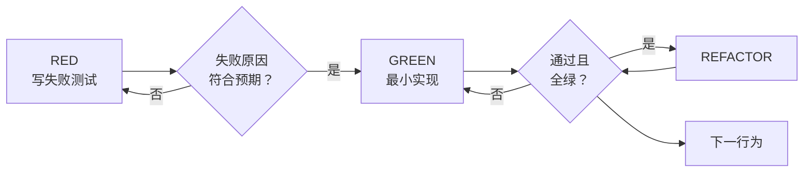
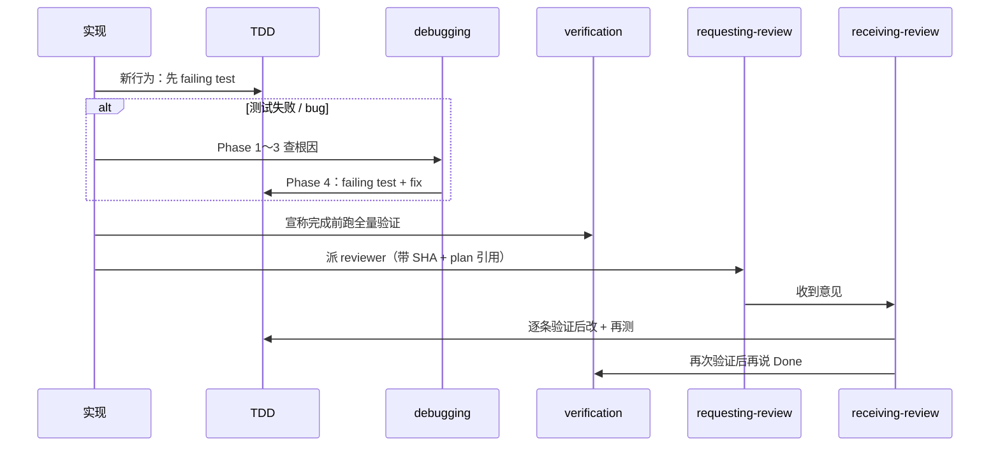

Part 4 把 plan **执行完** 只是 halfway。Superpowers 在「写代码 / 修 bug / 说完成 / 合并前」各设一道 **Rigid** 质量门——本篇合并讲五个 skill：`test-driven-development`、`systematic-debugging`、`verification-before-completion`、`requesting-code-review`、`receiving-code-review`。它们串起来是一条链：**先测再写 → 先查根因再改 → 先跑命令再宣称完成 → 主动要 review → 收到反馈先验证再改**。

**系列导航**：[总目录](./superpowers-series-plan.html) · [← Part 4](./superpowers-part-04-execution-agents.html) · 下一篇 → [Part 6：收尾与写 Skill](./superpowers-part-06-finish-and-write-skills.html)

## 质量五 skill 在流程中的位置



| skill | 触发时机 | 铁律（一句话） |
| --- | --- | --- |
| TDD | 写功能 / 修 bug **之前** | 没有 **先失败** 的测试，就不写生产代码 |
| systematic-debugging | 任何异常 / 测试红 **之前** | 没查根因，不许提 fix |
| verification-before-completion | 说「完成 / 通过 / 修好了」**之前** | 没在本轮跑过验证命令，不许下结论 |
| requesting-code-review | task 完成 / 大功能 / merge 前 | 早 review、常 review |
| receiving-code-review | 收到 review 意见 **之后** | 先验证再改，不表演式点头 |

Part 4 的 subagent-driven 已在 **每 task 后** 内嵌 review；本篇讲 **skill 本身的原则**，适用于人工协作与 Agent 自检。

## test-driven-development：先红后绿

### 铁律

```
NO PRODUCTION CODE WITHOUT A FAILING TEST FIRST
```

先写了实现再补测试？**删掉实现，重来。** 不许「留着当参考」「边写测试边改旧代码」——那就是测试后置，不是 TDD。

### Red → Green → Refactor



各步 **都必须跑命令看输出**：

1. **RED**：一个行为、名字清晰、尽量测真实代码（少 mock）
2. **Verify RED**：**强制**——必须亲眼看到 fail，且 fail 原因是「功能缺失」而非 typo
3. **GREEN**：只写让测试过的最少代码（YAGNI）
4. **Verify GREEN**：该测试 + 全 suite 都绿
5. **REFACTOR**：仅在绿之后整理结构，不加新行为

### 常见自我欺骗

| 借口 | 现实 |
| --- | --- |
| 「这次太简单不测」 | 简单也会坏；写一个测试很快 |
| 「写完再测一样」 | 一写就绿，证明不了测试有效 |
| 「手动测过了」 | 不可重复、无记录 |
| 「删 X 小时白干了」 | 沉没成本；无验证代码是债 |

修 bug：**先写复现失败的测试**，再 GREEN——与 `systematic-debugging` Phase 4 衔接。

::: tip Rigid skill

TDD 在 superpowers 里是 **Rigid**：不要「看情况跳过」。例外（原型、生成码、纯配置）需 **明确问人**。

:::

## systematic-debugging：四阶段，禁止猜修

### 铁律

```
NO FIXES WITHOUT ROOT CAUSE INVESTIGATION FIRST
```

未完成 Phase 1，**不得**提出修复方案。

### 四阶段

| 阶段 | 做什么 | 完成标准 |
| --- | --- | --- |
| **1 根因调查** | 读完整错误、稳定复现、查近期变更、多组件边界打日志 | 知道 **WHAT + WHY** |
| **2 模式分析** | 找同类正常代码、完整读参考实现、列差异 | 找到与 working case 的关键差 |
| **3 假设验证** | 单一假设、最小改动验证、一次只动一个变量 | 假设确认或换新假设 |
| **4 实施** | **先** failing test（TDD）→ 单点 fix → 验证 | bug 消失、suite 绿 |

**多组件系统：** 在每一层边界记录「进 / 出 / 配置」，**先Gather evidence 再猜**。

**3 次以上 fix 仍失败：** 停——可能是 **架构问题**，和人讨论 fundamentals，不要 Fix #4 盲试。

### 与 Part 4 并行 dispatch 的分工

- **还不清楚域边界** → 先用 systematic-debugging Phase 1～2
- **已确认 3 个独立测试文件各挂各的** → 可用 `dispatching-parallel-agents`

### 红旗（出现就回到 Phase 1）

「先 quick fix」「改几处试试」「大概是因为 X」「跳过测试手动验」——全部 **STOP**。

## verification-before-completion：证据先于结论

### 铁律

```
NO COMPLETION CLAIMS WITHOUT FRESH VERIFICATION EVIDENCE
```

「应该好了」「看起来对」「上次跑过是绿的」——**都不算**。

### 五步门控

1. **IDENTIFY**：哪条命令能证明这个结论？
2. **RUN**：**本轮对话里** 完整执行（不是历史输出）
3. **READ**：exit code、失败数、完整日志
4. **VERIFY**：输出是否支撑说法？
5. **ONLY THEN**：带 **证据** 下结论（例如「34/34 pass」）

| 想说 | 必须 | 不够 |
| --- | --- | --- |
| 测试通过 | 测试命令 0 fail | 上次结果、推断 |
| 构建成功 | build exit 0 | 仅 linter 绿 |
| bug 已修 | 原症状测试过 | 只改了代码 |
| 回归测试有效 | 红→绿→ revert 再红→ restore 再绿 | 写了个 pass 的测试 |
| Agent 做完了 | 看 VCS diff + 自己验证 | 信 Agent 口头 success |

**禁用词：** should、probably、seems、Great!/Done!（在跑验证 **之前**）。

与 TDD 的 **Verify RED/GREEN** 是同一精神在不同阶段的重复——Part 6 合并前还会再用一次。

## requesting-code-review：主动要 review

### 何时必做

- subagent-driven **每个 task 后**（Part 4 已嵌 spec + quality 两阶段）
- 大功能完成
- **merge 到 main 前**

可选：卡住时、重构前、复杂 bug 修完后。

### 怎么做（概念）

1. 取 **BASE_SHA / HEAD_SHA**（或 task 起止 commit）
2. 派 **reviewer subagent**，prompt **自包含**：做了什么、应对照 plan/spec 的哪条、diff 范围——**不要**塞整段聊天史
3. 按严重程度处理：**Critical** 立即修；**Important** 再继续前修；**Minor** 可记 backlog
4. reviewer 错了可以 **技术性 pushback**

Part 4 的 spec reviewer / code quality reviewer 即本 skill 在自动化流程里的实例化。

## receiving-code-review：先验证，不表演

### 原则

> 技术正确性 > 社交舒适。Verify before implementing.

### 六步响应

1. **READ**：读完，别急着表态  
2. **UNDERSTAND**：用自己的话复述，或提问  
3. **VERIFY**：对照代码库 reality  
4. **EVALUATE**：对 **本仓库** 是否成立？  
5. **RESPOND**：技术确认或有理有据的反对  
6. **IMPLEMENT**：一项一项改，每项带测试  

### 禁止

- 「你说得太对了！」式表演  
- 未验证就说「这就改」  
- 只懂 1,2,3,6 就先改这几条——**有任一条不清，整批停问**

### 对人 vs 对外部 reviewer

对人：信任但仍可问范围；**少废话多动作**。  
对外部：多一道「当前实现是否有历史原因」「是否破坏其他平台」。

## 五 skill 如何串联



## 常见反模式

| 反模式 | 触犯的 skill |
| --- | --- |
| 实现完再补测试 | TDD |
| 看 stack 第一行就改 | systematic-debugging |
| CI 红时说「我本地应该没问题」 | verification |
| 从不 review，直接 merge | requesting-code-review |
| review 说啥改啥，不核对 | receiving-code-review |
| subagent 报 success 就 merge | verification + requesting |

## 小结

- **TDD**：先红后绿再 refactor；先写实现 = 删除重来。
- **systematic-debugging**：四阶段；3 次 fix 失败要怀疑架构。
- **verification**：本轮跑命令 + 读输出 + 带证据说话。
- **requesting-review**：早、常、带 SHA 与 plan；subagent 流程里双 review。
- **receiving-review**：读懂 → 验证 → 再改；不清就问，不表演。
- 下一篇 **Part 6（系列终章）**：[收尾分支与写你自己的 Skill](./superpowers-part-06-finish-and-write-skills.html)。

## 附录：验证命令示例

按项目替换；**宣称结果前必须在本环境跑过**。

```bash
# 测试
pnpm test
pytest -q
go test ./...

# 构建（VuePress 示例）
pnpm run build

# 回归是否真测到 bug：改回坏代码应 FAIL
git stash && pnpm test   # 期望红
git stash pop && pnpm test   # 期望绿
```

**触发 skill：** `/test-driven-development`、`/systematic-debugging` 等；或在对话中「按 TDD 做」「先 systematic debug 再改」。

## 参考链接

- [Superpowers 系列总目录](./superpowers-series-plan.html)
- [Part 4：执行（下）](./superpowers-part-04-execution-agents.html)
- TDD：<https://skills.sh/obra/superpowers/test-driven-development>
- systematic-debugging：<https://skills.sh/obra/superpowers/systematic-debugging>
- verification-before-completion：<https://skills.sh/obra/superpowers/verification-before-completion>
- requesting-code-review：<https://skills.sh/obra/superpowers/requesting-code-review>
- receiving-code-review：<https://skills.sh/obra/superpowers/receiving-code-review>
