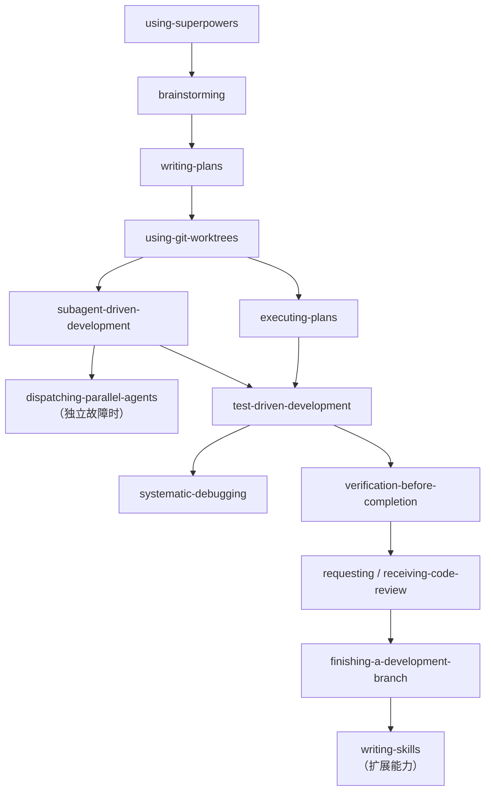
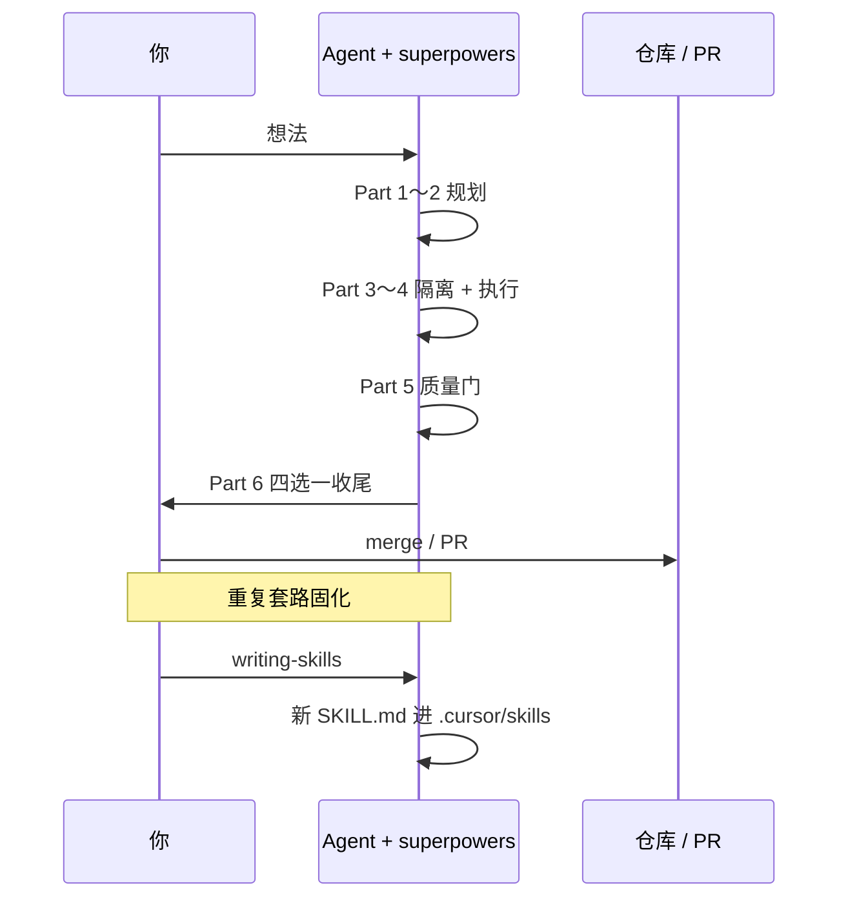

Part 3～5 在隔离 workspace 里 **按计划实现**，并用 TDD、调试、验证与 review 把质量关住。工作真正结束时，还差两件事：**怎么把分支收进主线**（`finishing-a-development-branch`），以及 **怎么把团队套路写成可复用 Skill**（`writing-skills`）。本篇是 Superpowers 系列终章——收束全链路，并说明如何用「对 Skill 做 TDD」扩展 superpowers 之外的能力。

**系列导航**：[总目录](./superpowers-series-plan.html) · [← Part 5](./superpowers-part-05-quality.html)

**全系列：** [① 调用纪律](./superpowers-part-01-using-superpowers.html) → [② 规划](./superpowers-part-02-planning.html) → [③ 执行上](./superpowers-part-03-execution-isolation.html) → [④ 执行下](./superpowers-part-04-execution-agents.html) → [⑤ 质量](./superpowers-part-05-quality.html) → **⑥ 本文**

## 全链路一图（14 skill → 6 篇）



## finishing-a-development-branch：验证通过后，四选一

### 何时触发

实现完成、测试通过、需要决定 **merge / PR / 暂存 / 丢弃** 时——Part 3 `executing-plans` 与 Part 4 `subagent-driven-development` 的 **规定终点** 都是 invoke 本 skill。

### 六步流程

| 步 | 动作 | 要点 |
|:---:|:---|:---|
| 1 | **验证测试** | 全 suite 跑过；失败则 **停**，不给选项 |
| 2 | **检测环境** | 普通 repo vs worktree vs detached HEAD |
| 3 | **确定 base 分支** | `merge-base` 或问用户 |
| 4 | **呈现选项** | 固定菜单，不问开放式「接下来干嘛」 |
| 5 | **执行选择** | 按选项跑 git / gh |
| 6 | **清理 workspace** | **仅** 部分选项需要 |

### 固定菜单（不要改措辞结构）

**普通 repo 或「具名分支」的 worktree — 恰好 4 项：**

1. 本地 merge 回 `<base-branch>`
2. Push 并创建 Pull Request
3. 保持现状（稍后自己处理）
4. 丢弃此工作

**detached HEAD — 恰好 3 项（无本地 merge）：**

1. Push 为新分支并开 PR
2. 保持现状
3. 丢弃

选项文案保持简短；**不要** 在菜单里加长篇解释。

### 各选项与 worktree 清理

| 选项 | merge | push | 保留 worktree | 清理 worktree | 删分支 |
| --- | --- | --- | --- | --- | --- |
| 1 本地 merge | ✓ | — | — | ✓（成功后） | ✓（`-d`） |
| 2 开 PR | — | ✓ | ✓ | **不清理** | — |
| 3 保持 | — | — | ✓ | **不清理** | — |
| 4 丢弃 | — | — | — | ✓ | ✓（`-D`） |

**Option 2 勿清 worktree**——用户还要在 PR 反馈上迭代。

**Option 4** 须用户 **输入 `discard` 确认**，并列出将删的分支、commit、worktree 路径。

### worktree 清理 provenance

只清理 **superpowers 自建** 路径下的 worktree：

- `.worktrees/`、`worktrees/`
- `~/.config/superpowers/worktrees/`

**平台 harness 创建的 workspace**（如 Cursor 原生 worktree）→ **不要** `git worktree remove`，避免 phantom state。

清理前 **`cd` 到 main repo 根目录**，再 `git worktree remove` + `git worktree prune`。**顺序：** merge 成功 → remove worktree → delete branch（勿先删分支）。

### 与 Part 5 verification 的关系

Step 1 的测试验证与 `verification-before-completion` 同源：**在本轮跑命令、读输出**，再进入菜单。Option 1 在 merge 后 **再跑一遍** 测试。

## writing-skills：对 Skill 文档做 TDD

### 核心类比

> 写 Skill = 对 **流程文档** 做 TDD。

| TDD | 写 Skill |
| --- | --- |
| 测试用例 | **压力场景**（让 subagent 在无 skill 时踩坑） |
| 生产代码 | `SKILL.md` |
| RED | 无 skill 时 Agent **违反** 你期望的纪律 |
| GREEN | 有 skill 后 Agent **遵守** |
| REFACTOR | 堵新漏洞（ rationalization 表） |

**前提：** 先理解 Part 5 的 `test-driven-development`。没看过 Agent 在无 skill 下怎么合理化跳过流程，就不知道 skill 该写什么。

### 何时该写 Skill

| 写 | 不写 |
| --- | --- |
| 跨项目可复用的套路 | 一次性解法 |
| 你以后会再查的技巧 | 别处已有标准文档 |
| 需要 **判断** 的流程 | 可用 lint/脚本机械约束的（自动化优先） |
| 团队应统一的工作流 | 仅本仓库约定（放 `CLAUDE.md` / Rules） |

本博客的 [zblog 写作 skills](https://github.com/zhaofutao04/zblog/tree/main/.cursor/skills) 即 **项目级** 范例；superpowers 是 **通用开发流** 范例。

### SKILL.md 最小结构

```markdown
---
name: your-skill-name
description: Use when [触发条件与症状，第三人称，不写流程摘要]
---

# 标题

## Overview
1～2 句核心原则

## When to Use
症状列表 + 何时 **不要** 用

## 正文（步骤 / 表 / 流程图）

## Common Mistakes

## Quick Reference（可选）
```

**description 的 CSO 规则（Critical）：**

- 以 **「Use when…」** 开头，只写 **何时触发**
- **不要** 在 description 里总结 workflow（Agent 可能只读 description 而跳过正文——subagent 双 review 曾因此失效）
- 第三人称；尽量 \<500 字符

```yaml
# ❌ 摘要了流程
description: Use for TDD - write test first, watch it fail, refactor

# ✅ 只写触发
description: Use when implementing any feature or bugfix, before writing implementation code
```

### 目录与安装

```
skill-name/
  SKILL.md          # 必需
  references/       # 长参考、可选
  scripts/          # 可执行工具，可选
```

| 范围 | 典型路径 |
| --- | --- |
| 用户级 | `~/.agents/skills/`、`~/.cursor/skills/` |
| 项目级 | `.cursor/skills/`、`.agents/skills/` |

安装社区 skill：`npx skills add owner/repo -g -a cursor -y`（见 [Part 1 附录](./superpowers-part-01-using-superpowers.html)）。

### 验证 Skill 是否有效

1. **Baseline（RED）**：无 skill 跑压力场景，记录 Agent 的 **合理化借口**
2. **写最小 SKILL.md**（GREEN）：只针对 baseline 里出现的漏洞
3. **再跑同场景**：应遵守 skill
4. **REFACTOR**：发现新借口 → 补 **Red Flags / 反模式表** → 再测

与 superpowers 自带 `writing-skills` 一致：**没看过 fail，就不知道 skill 教对了没有**。

### Skill 类型

| 类型 | 例子 |
| --- | --- |
| **Technique** | 有步骤的方法（condition-based-waiting） |
| **Pattern** | 思维模型（flatten-with-flags） |
| **Reference** | API / 工具速查 |

## 系列收尾：从想法到自定义 Skill



## 常见反模式

| 反模式 | 涉及 |
| --- | --- |
| 测试红仍给 merge 菜单 | finishing |
| 开 PR 后删掉 worktree | finishing |
| 在 worktree 目录内执行 `worktree remove` | finishing |
| description 写满流程摘要 | writing-skills |
| 没跑 baseline 就写 skill | writing-skills |
| 把项目约定塞进全局 skill | writing-skills → 用 Rules |

## 小结

- **finishing-a-development-branch**：测试绿 → 检测环境 → **固定 4/3 选项** → 执行 → 按 provenance 清理 worktree。
- **writing-skills**：Skill = 流程文档的 TDD；description 只写触发；baseline → 写 skill → 再验证。
- **全系列 14 个 skill** 已并入 6 篇；日常从 [Part 1 的 1% 规则](./superpowers-part-01-using-superpowers.html) 与 [总目录](./superpowers-series-plan.html) 进入即可。
- 扩展阅读：[Claude Code 进阶：MCP、Skills 与自用习惯](./claude-code-advanced-usage-guide.html)、[skills.sh/obra/superpowers](https://skills.sh/obra/superpowers)。

## 附录：收尾与安装命令

**finishing — 检测 worktree 状态（概念）：**

```bash
GIT_DIR=$(cd "$(git rev-parse --git-dir)" && pwd -P)
GIT_COMMON=$(cd "$(git rev-parse --git-common-dir)" && pwd -P)
# 不等且非 submodule → 已在 worktree
```

**Option 2 — 开 PR（示例）：**

```bash
git push -u origin feature/my-feature
gh pr create --title "feat: ..." --body "## Summary\n- ...\n\n## Test Plan\n- [ ] pnpm test"
```

**发布自定义 skill（项目级）：**

```bash
mkdir -p .cursor/skills/my-skill
# 编写 .cursor/skills/my-skill/SKILL.md
# 新开会话或重启 Cursor 后 /my-skill 可见
```

**分享 skill 包：**

```bash
npx skills init my-skill-pack   # 或自建 GitHub 仓库
npx skills add your/repo -g -a cursor -y
```

## 参考链接

- [Superpowers 系列总目录](./superpowers-series-plan.html)
- [Part 5：质量闭环](./superpowers-part-05-quality.html)
- finishing-a-development-branch：<https://skills.sh/obra/superpowers/finishing-a-development-branch>
- writing-skills：<https://skills.sh/obra/superpowers/writing-skills>
- Agent Skills 规范：<https://agentskills.io/specification>
