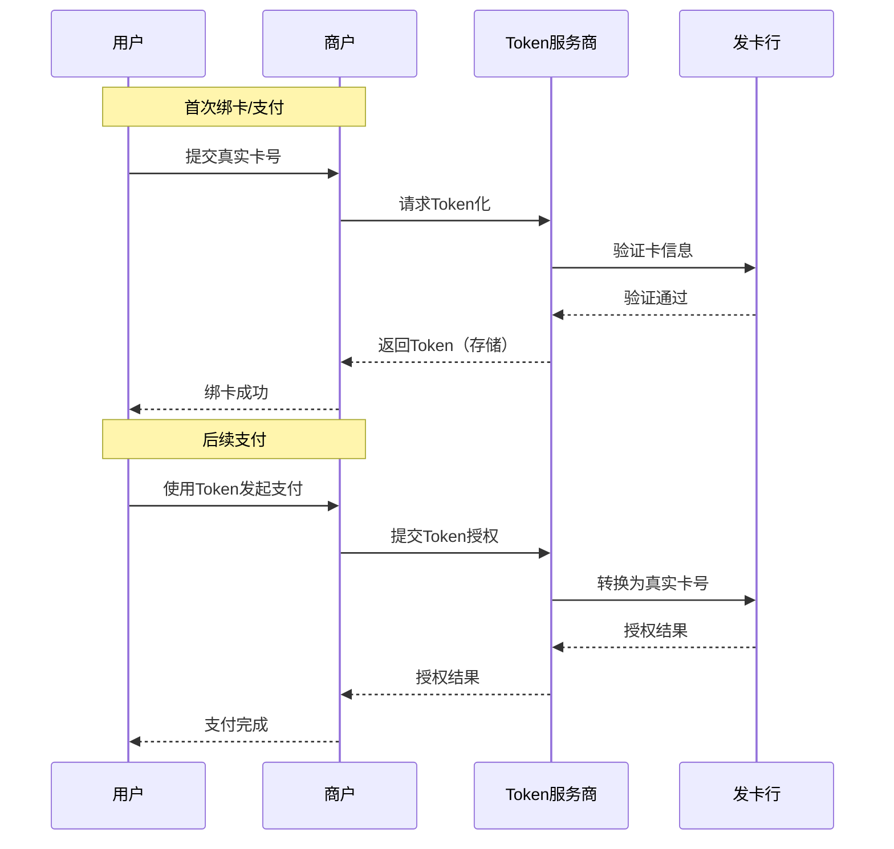
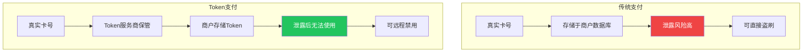
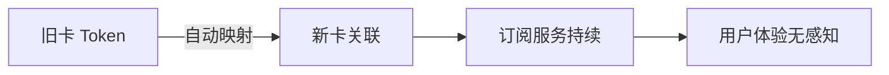
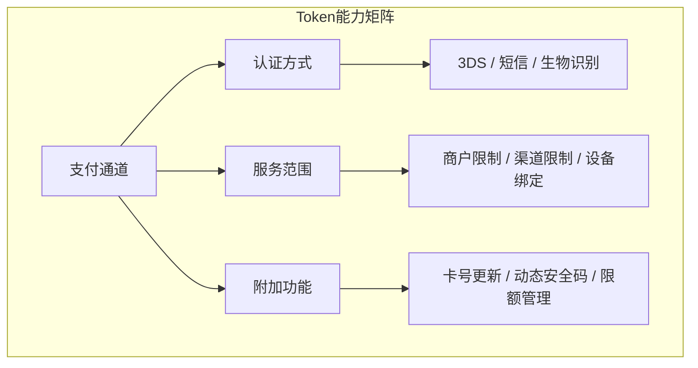

在数字支付日益普及的今天，如何在**安全性**与**便捷性**之间找到平衡，一直是支付行业的核心命题。Token支付（令牌化支付）正是为解决这一矛盾而诞生的关键技术。本文从概念原理、优势场景、技术架构三个维度，对Token支付做系统梳理。

## 什么是Token支付？

Token支付的核心是**令牌化（Tokenization）**技术。简单来说，就是将用户真实的银行卡号（PAN）替换为一个唯一的、无法被滥用的"数字令牌"。

### 典型工作流程

从流程可以看出，**商户和收单方全程不接触真实卡号**，这从根本上降低了数据泄露和盗刷风险。

## Token支付的核心优势

### 1. 风险转移

即使Token不幸泄露，由于它只能在特定场景下使用，无法在其它渠道套现或购物，其价值极为有限。万一发生问题，责任通常由Token服务商承担。

### 2. 支付便捷

首次绑定后，用户无需每次输入冗长的卡号、有效期、CVV等信息，支付流程大幅简化。

### 3. 基础安全

传统支付依赖静态卡号的保密性，一旦泄露后果严重。而Token具有**动态性**、**唯一性**和**使用范围限定**三大特性，安全性更高。

## 关键应用场景

### 免CVV支付（海外主流）

在海外市场，用户首次绑卡时通过发卡行强验证（如3DS）后，后续支付无需输入CVV码。这对于海淘等场景极大提升了体验。

### 一键支付（国内主流）

国内平台通常采用"短信验证码 + 支付密码"的轻量级验证方式。绑卡后，用户只需简单验证即可完成支付。

### 无缝订阅续费

当用户银行卡过期或换卡时，Token服务可自动将Token关联至新卡，用户无需手动更新，保障订阅服务不中断。

### 线下非接支付

将Token存储在手机等设备的安全芯片中（如Apple Pay、Huawei Pay），实现"一挥即付"的体验。这种场景要求Token与特定设备强绑定。

## Token支付的技术架构

### 三个核心角色

| 角色 | 职责 |
|------|------|
| **Token服务商** | 生成、存储、管理Token，负责与发卡行交互 |
| **商户/收单方** | 存储和使用Token，不接触真实卡号 |
| **发卡行** | 验证持卡人身份，授权交易 |

### 通道决定Token能力

Token的生效和能力**强烈依赖于特定的支付通道**（如银联、Visa、Mastercard），通道决定了：

- **认证方式**：绑卡认证（短信、3DS、生物识别）和支付认证（密码、指纹、无感）
- **服务范围**：商户范围（单商户/多商户/卡组织通用）、使用渠道（线上/线下）、设备绑定（设备级/云端账户级）
- **附加功能**：卡号自动更新、动态安全码、令牌状态管理、交易限额管理等

### 国际与国内差异

| 对比维度 | 国际卡组织 | 国内平台 |
|----------|-----------|---------|
| 认证偏好 | 3DS强验证 | 短信验证码 + 支付密码 |
| 主导标准 | EMVCo Tokenization | 银联Token标准 |
| 应用场景 | 海淘、跨境为主 | 国内一键支付、线下非接 |

## Token与PCI DSS

对于商户而言，使用Token支付可以大幅简化**PCI DSS**（支付卡行业数据安全标准）合规要求。

因为敏感数据（真实卡号）不在商户端存储，合规范围和审计边界大幅收缩。这也是Token支付在近年来快速普及的重要推动力。

## 总结

Token支付通过令牌化技术，在支付安全与用户体验之间取得了重要平衡：

- **对用户**：便捷的支付体验，同时获得更高的安全保障
- **对商户**：降低数据泄露风险，减少PCI DSS合规负担
- **对整个生态**：将敏感数据隔离在专属服务中，降低系统性风险

但需要认识到，Token支付的高效运行，依赖于**支付通道、Token服务商、发卡行**等共同构建的庞大生态系统的协同与升级。理解这一点，有助于更好地在实际项目中落地相关技术方案。

---

*相关话题： [3D Secure支付验证](./3ds-overview.html)、 [移动支付Apple Pay与Google Pay](./mobile-wallets-apple-google-pay.html)、 [PCI DSS合规概述](./pci-dss-overview.html)*