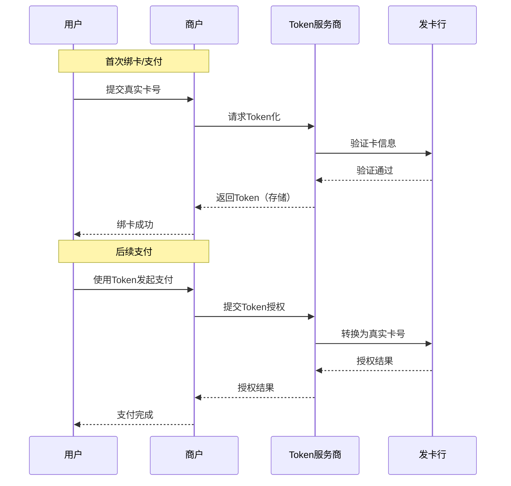
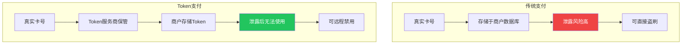
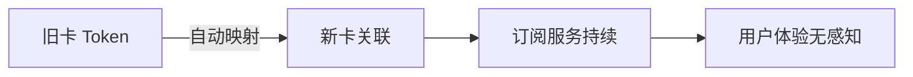
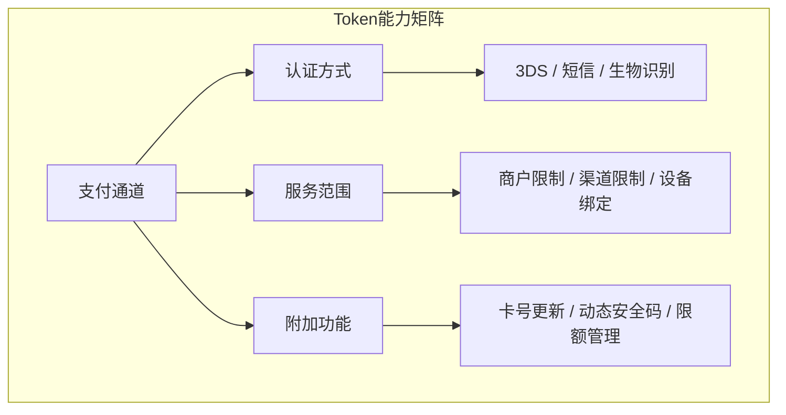

Token 支付（令牌化）干的事很具体：**真实卡号（PAN）尽量别在商户侧久留**，换成支付网络或 TSP 发的、用途受限的 token。PCI 压力能小一截，用户侧该绑卡还是绑卡。下面按流程、好处、常见架构写，少套「安全与便捷平衡」那种话。

## 什么是Token支付？

Token 支付的核心是 **令牌化（Tokenization）**：把真实 **PAN** 换成网络或 TSP 发的、用途受限的 **token**。

### 典型工作流程

从流程可以看出，**商户和收单方往往摸不到明文 PAN**，泄露面比「库里面躺一堆真卡号」小一截（具体仍取决于通道和实现）。

## 为啥要折腾 Token

### 1. 风险转移

Token 泄了，多半只能在原场景里用，换商户或换通道常常直接废；扯皮时 **TSP / 网络** 通常比小商户更能扛责任条款（以合同为准）。

### 2. 少敲几遍数

绑卡那一遍把卡号、有效期、CVV 走干净之后，后面能省掉重复输入（仍取决于通道是否允许免 CVV 等）。

### 3. 比静态卡号多几道箍

真卡号像一把 **万能钥匙**；Token 往往带 **场景、商户、设备** 一类限制，泄露后的可用窗口小一些。

## 关键应用场景

### 免CVV支付（海外主流）

海外常见套路：首绑走一遍 **3DS** 或同等强验证，后面同一通道里可省掉 **CVV**（是否允许看发卡行和网络规则）。

### 一键支付（国内主流）

国内多靠 **短信 + 支付密码** 这一档；绑卡之后单笔是否还要验，看钱包和银行的风控策略。

### 无缝订阅续费

卡到期或换卡时，有的网络支持 **Token 映射到新 PAN**，订阅方少改一次绑卡（同样以通道能力为准）。

### 线下非接支付

Token 落在手机 **SE / TEE** 里再配 NFC，就是 Apple Pay、Huawei Pay 一类「挥一下」；**设备和 Token 要强绑定**，换机一般要重新走绑卡。

## Token支付的技术架构

### 三个核心角色

| 角色 | 职责 |
|------|------|
| **Token服务商** | 生成、存储、管理Token，负责与发卡行交互 |
| **商户/收单方** | 存储和使用Token，不接触真实卡号 |
| **发卡行** | 验证持卡人身份，授权交易 |

### 通道决定Token能力

Token 能否用、能用在哪，**强烈依赖支付通道**（银联、Visa、Mastercard 等），通道决定：

- **认证方式**：绑卡认证（短信、3DS、生物识别）和支付认证（密码、指纹、无感）
- **服务范围**：商户范围（单商户/多商户/卡组织通用）、使用渠道（线上/线下）、设备绑定（设备级/云端账户级）
- **附加功能**：卡号自动更新、动态安全码、令牌状态管理、交易限额管理等

### 国际与国内差异

| 对比维度 | 国际卡组织 | 国内平台 |
|----------|-----------|---------|
| 认证偏好 | 3DS强验证 | 短信验证码 + 支付密码 |
| 主导标准 | EMVCo Tokenization | 银联Token标准 |
| 应用场景 | 海淘、跨境为主 | 国内一键支付、线下非接 |

## Token与PCI DSS

对于商户而言，使用Token支付可以大幅简化**PCI DSS**（支付卡行业数据安全标准）合规要求。

真卡号不进自家库，**PCI 的适用范围往往能收一截**（具体问 QSA / 通道，别凭感觉省审计）。

## 收个尾

Token 不是魔法：**通道规则**决定你能省哪几步验证、Token 能跟多远；**TSP / 发卡行** 决定映射和吊销怎么走。商户侧记住两件事就够：**别存 PAN**、**别假设所有网络能力一样**。

Token 要跑顺，离不开 **通道、TSP、发卡行** 几边协议和证书都对齐；落地时别只盯商户这一段。

---

*相关话题： [3D Secure支付验证](./3ds-overview.html)、 [移动支付Apple Pay与Google Pay](./mobile-wallets-apple-google-pay.html)、 [PCI DSS合规概述](./pci-dss-overview.html)*