Visa 是全球最主流的卡组织之一，日均处理超过 **2 亿笔**交易、金额超过 **550 亿美元**。但"刷卡成功"背后的链路远比想象中复杂——从报文格式到交换费分档，从 3DS 认证到 VCR 争议仲裁，每个环节都有大量技术细节。本文结合 Visa Core Rules、VCR Dispute Guidelines、Visa Developer Platform 文档和实际落地经验，把这套体系的底层逻辑拆开讲透。

## 一、VisaNet 基础架构

在讲交易流程之前，必须先理解 Visa 的网络架构，否则后面的流程会显得很"黑箱"。

### 1.1 VisaNet 的两大核心系统

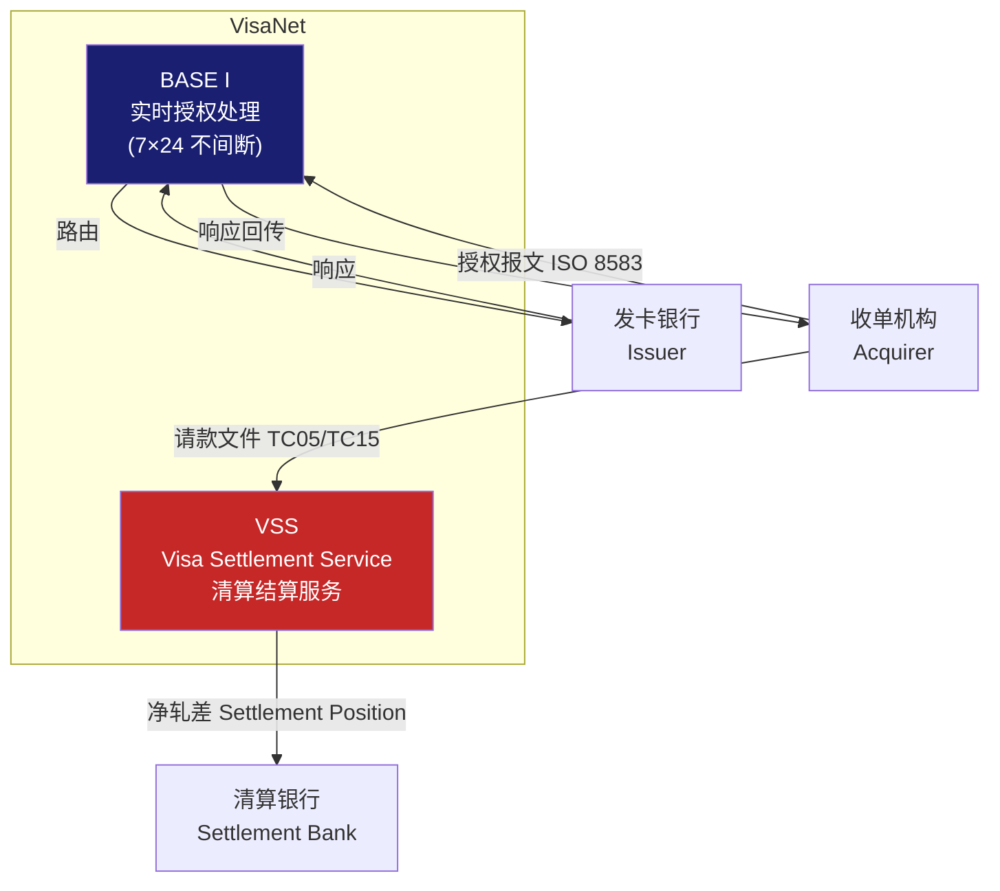

| 系统 | 全称 | 职责 |
|------|------|------|
| **BASE I** | Bank Authorization Settlement Environment I | 实时授权路由；7×24 处理授权、撤销；维护卡号-发卡行路由表（BIN 路由）|
| **VSS** | Visa Settlement Service | 批处理请款文件；计算净轧差（Net Settlement Position）；生成结算指令 |

### 1.2 VIP（Visa Integrated Processing）

VIP 是 BASE I 的现代化演进，支持：
- **实时欺诈评分**：每笔授权附带 Visa Advanced Authorization（VAA）风险评分（0-99）
- **令牌解析**：将 Network Token（DPAN）解析为 Primary Account Number（PAN/FPAN）后再路由
- **STIP**（Stand-In Processing）：当发卡行系统不可用时，Visa 代替发卡行做授权决策

> **STIP 细节**：发卡行需要事先向 Visa 提交 STIP 参数（如授权限额、拒绝高风险交易的阈值），Visa 会根据这些参数代为响应。发卡行系统恢复后需要核对 STIP 期间的交易，决定是否需要做追溯拒绝（Post Authorization）。

### 1.3 BIN（Bank Identification Number）与 IIN

卡号前 6~8 位是 BIN（部分资料叫 IIN），Visa 维护全球 BIN 路由表，根据 BIN 决定把授权请求路由给哪个发卡行。BIN 的范围：Visa 的 BIN 以 **4** 开头（Mastercard 以 5 或 2 开头，Amex 以 3 开头）。

---

## 二、交易涉及的核心角色

```mermaid
flowchart LR
    subgraph Cardholder["持卡人侧"]
        CH[持卡人\nCardholder]
        Device[支付设备\nPOS/手机/浏览器]
    end

    subgraph AcquirerSide["收单侧"]
        Merchant[商户\nMerchant]
        PSP[支付服务商\nPSP / Payment Processor]
        Acquirer[收单机构\nAcquirer]
    end

    subgraph Network["卡组织"]
        Visa[Visa\nVisaNet / VIP]
    end

    subgraph IssuerSide["发卡侧"]
        Issuer[发卡银行\nIssuer]
        TSP[令牌服务商\nTSP]
    end

    CH -->|刷/插/挥/扫| Device
    Device -->|加密报文| Merchant
    Merchant --> PSP --> Acquirer
    Acquirer -->|ISO 8583 授权请求| Visa
    Visa -->|路由| Issuer
    Issuer -.->|令牌解析| TSP
    TSP -.-> Issuer

    style Visa fill:#1a1f71,color:#fff
    style Issuer fill:#e53935,color:#fff
    style Acquirer fill:#43a047,color:#fff
```

| 角色 | 核心职责 | 代表企业 |
|------|----------|----------|
| **持卡人 (Cardholder)** | 使用 Visa 卡消费 | 消费者 |
| **发卡银行 (Issuer)** | 发行卡片、授权决策、垫资、管理持卡人账户 | 招行、工行、Chase 等 |
| **Visa (VisaNet)** | 制定规则、路由授权、清算轧差、风险监控 | Visa Inc. |
| **收单机构 (Acquirer)** | 与商户签约、上送报文、承担商户风险 | Adyen、收钱吧、拉卡拉 |
| **支付服务商 (PSP)** | 为收单机构提供技术处理能力 | Stripe、连连支付 |
| **商户 (Merchant)** | 接受卡支付，获得授权后提供商品/服务 | 各类线上线下商户 |
| **令牌服务商 (TSP)** | 将真实卡号（FPAN）映射为网络令牌（DPAN/Token PAN） | Visa TSP、Apple Pay TSP |

---

## 三、ISO 8583 报文格式

Visa 授权使用 **ISO 8583** 金融报文协议。理解报文结构是排查问题的基础。

### 3.1 报文结构

```
┌─────────────┬──────────────────┬──────────────────────────────────────┐
│  MTI (4位)  │  Bitmap (8/16字节)│  Data Elements                       │
│ Message Type│  位图，标记哪些字段│  各数据域按位图顺序排列              │
│  Indicator  │  存在            │                                      │
└─────────────┴──────────────────┴──────────────────────────────────────┘
```

**MTI（报文类型标识）** 决定这是哪类消息：

| MTI | 含义 |
|-----|------|
| `0100` | 授权请求（Acquirer → Visa → Issuer） |
| `0110` | 授权响应（Issuer → Visa → Acquirer） |
| `0120` | 授权请求重发（网络超时重试） |
| `0200` | 财务请求（部分场景） |
| `0400` | 撤销请求（Reversal） |
| `0420` | 撤销重发 |
| `0800` | 网络管理请求（心跳） |

### 3.2 关键数据域（DE）

| DE编号 | 字段名 | 长度 | 说明 |
|--------|--------|------|------|
| **DE 2** | Primary Account Number (PAN) | LLVAR≤19 | 卡号，传输时通常 Base64 加密或走 TLS |
| **DE 3** | Processing Code | 6 | 前两位区分消费/退款/查询；如 `000000` 消费，`200000` 退款 |
| **DE 4** | Transaction Amount | 12 | 金额，单位为货币最小单位（美元为美分） |
| **DE 6** | Cardholder Billing Amount | 12 | 持卡人账单金额（跨境时与 DE 4 不同） |
| **DE 7** | Transmission Date & Time | 10 | MMDDHHMMSS |
| **DE 11** | Systems Trace Audit Number (STAN) | 6 | 本次交易唯一流水号（Acquirer 生成） |
| **DE 12/13** | Local Transaction Time/Date | 6/4 | 商户本地时间 |
| **DE 14** | Expiration Date | 4 | YYMM |
| **DE 18** | Merchant Category Code (MCC) | 4 | 商户类别码，影响交换费分档 |
| **DE 22** | POS Entry Mode | 3 | 刷磁条/芯片/NFC/手工键入等 |
| **DE 25** | POS Condition Code | 2 | 是否持卡人本人、是否有卡在场等 |
| **DE 35** | Track 2 Data | LLVAR≤37 | 磁条信息（传统刷卡场景） |
| **DE 37** | Retrieval Reference Number (RRN) | 12 | 收单行生成的检索参考号 |
| **DE 38** | Authorization ID Response | 6 | 批准后由发卡行返回的授权码 |
| **DE 39** | Response Code | 2 | `00`=批准，`05`=拒绝，`51`=余额不足，`54`=卡过期… |
| **DE 41** | Card Acceptor Terminal ID | 8 | 终端编号（TID） |
| **DE 42** | Card Acceptor ID Code | 15 | 商户编号（MID） |
| **DE 43** | Card Acceptor Name/Location | 40 | 商户名称和城市（账单中显示的名称） |
| **DE 49** | Currency Code, Transaction | 3 | ISO 4217 货币码，如 840=USD，156=CNY |
| **DE 55** | EMV Chip Data | LLLVAR≤255 | EMV 芯片数据（含 TVR、IAD、ATC 等，用于离线认证） |
| **DE 60** | Visa-Defined (Private Use) | 可变 | Visa 私有字段，含 3DS 认证结果、AVS 结果等 |
| **DE 61** | POS Data | 可变 | 持卡人认证方式、PIN 输入等 |

### 3.3 响应码（Response Code，DE 39）

| 响应码 | 含义 | 建议处理 |
|--------|------|----------|
| `00` | 批准 | 交易成功 |
| `01` | 需要电话授权 | 人工核实 |
| `05` | 拒绝（通用） | 终止交易，提示持卡人联系银行 |
| `14` | 卡号无效 | 检查卡号是否有误 |
| `41` | 挂失卡（Pick Up） | 提示员工扣留卡片 |
| `43` | 被盗卡（Pick Up） | 同上，且报告给银行 |
| `51` | 余额/额度不足 | 提示持卡人更换付款方式 |
| `54` | 卡已过期 | 提示更换新卡 |
| `57` | 不允许该持卡人交易 | 卡功能限制 |
| `59` | 疑似欺诈 | 拒绝，建议持卡人联系银行 |
| `62` | 限制卡（服务代码限制） | 通常境外卡在境外 ATM 受限 |
| `65` | 交易次数超限 | 今日交易频率过高 |
| `75` | PIN 尝试次数超限 | 账户已锁 |
| `91` | 发卡行无法联系 | 由 STIP 接管，或直接拒绝 |
| `96` | 系统错误 | 网络或系统问题，可重试 |

---

## 四、EMV 与支付入口差异

同一张 Visa 卡，不同的支付入口（磁条、芯片、NFC、卡号输入）在安全级别和报文字段上差异显著，直接影响 **责任归属（Liability Shift）** 和 **交换费分档**。

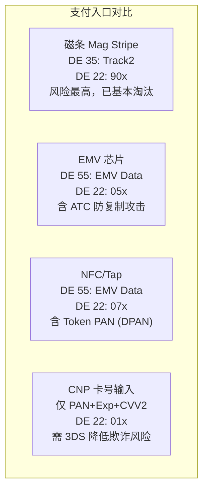

### 4.1 EMV 芯片关键字段

DE 55 中包含 EMV TLV 数据，核心标签：

| EMV 标签 | 名称 | 作用 |
|----------|------|------|
| `9F36` | Application Transaction Counter (ATC) | 单调递增计数器，防止交易重放 |
| `9F26` | Application Cryptogram (ARQC/TC/AAC) | 芯片生成的密文，发卡行验证 |
| `95` | Terminal Verification Results (TVR) | 终端离线验证结果，5字节位图 |
| `9F10` | Issuer Application Data (IAD) | 发卡行自定义数据（含风险分数） |
| `84` | Dedicated File Name | 选择的支付应用（如 Visa Credit） |

> **ATC 防重放**：芯片每次生成 ARQC 时 ATC+1，发卡行记录最大 ATC。如果收到比已知最大值小的 ATC，说明可能是重放攻击，直接拒绝。

### 4.2 责任归属（Liability Shift）

| 场景 | 风险承担方 | 说明 |
|------|------------|------|
| 芯片卡 + 芯片终端 | 发卡行 | 标准 EMV 交易，发卡行负责风控 |
| 芯片卡 + 磁条终端 | **收单机构** | 降级使用磁条，收单行承担欺诈损失 |
| 芯片卡 + 网络支付（CNP） | 收单机构 | 卡不在场，商户/收单行承担 |
| CNP + 3DS 认证通过 | **发卡行** | Liability Shift 至发卡行（持卡人认证通过） |
| CNP + 3DS 失败/豁免 | 收单机构/商户 | 未走认证，商户承担欺诈风险 |

---

## 五、3DS 2.x 认证流程

3D Secure 是针对 CNP（Card Not Present，无卡支付）场景的持卡人认证机制。3DS 1.0 基本废弃，现在主流是 **3DS 2.x**（EMVCo 3-D Secure 2.0/2.2）。

### 5.1 3DS 1.0 vs 3DS 2.x 核心差异

| 对比 | 3DS 1.0 | 3DS 2.x |
|------|---------|---------|
| 数据传递 | 极少，仅基础卡信息 | 100+ 个数据元素（设备指纹、浏览器信息、行为特征等） |
| 认证体验 | 强制弹窗输入密码 | 支持无感知认证（Frictionless Flow） |
| 移动端支持 | 差 | 原生 SDK，体验良好 |
| 欺诈识别 | 弱 | 基于 AI 模型的风险评分 |
| 支持场景 | 仅浏览器 | 浏览器 + App + IoT |

### 5.2 3DS 2.x 完整流程

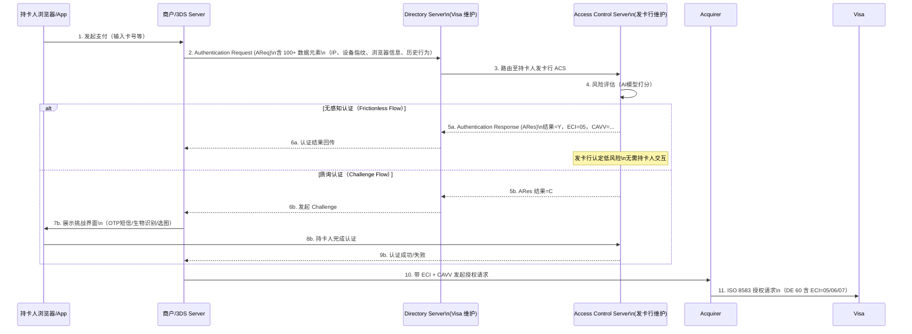

### 5.3 ECI 值含义

ECI（Electronic Commerce Indicator）是 3DS 认证结果在授权报文中的体现：

| ECI | 含义 | Liability Shift |
|-----|------|-----------------|
| `05` | 3DS 认证成功（Frictionless 或 Challenge 通过） | 转移至发卡行 |
| `06` | 3DS 尝试认证，持卡人未参与（Attempted） | 部分保护 |
| `07` | 未走 3DS（普通 CNP） | 商户/收单行承担 |

> **CAVV（Cardholder Authentication Verification Value）**：ACS 生成的认证密文，随授权请求一起送到发卡行，发卡行验证 CAVV 合法性后才给 Liability Shift 保护。商户侧保存好 CAVV + ECI + 3DS Server Transaction ID，拒付时作为关键证据。

---

## 六、网络令牌化（Network Tokenization）

### 6.1 为什么需要令牌化

传统支付把真实 PAN（FPAN）在网络中明文传递，一旦 Merchant 数据库被盗，卡号直接泄露。令牌化的核心思想：**用一个"替代值"（Token/DPAN）替代真实卡号在网络中流通**。

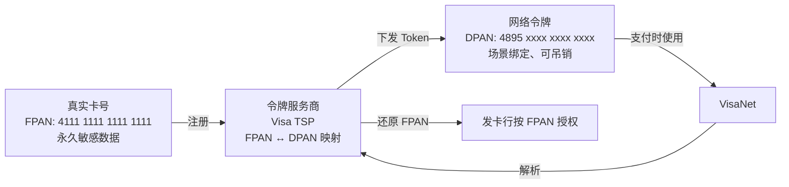

### 6.2 Token 的三种场景

| Token 类型 | 绑定维度 | 典型场景 |
|------------|----------|----------|
| **Device Token** | 卡 × 设备 | Apple Pay、Google Pay；仅该设备可用 |
| **Merchant Token** | 卡 × 商户 | 代扣/订阅场景；Token 仅对该商户有效 |
| **Provisioned Token** | 卡 × 设备 × 商户 | 最细粒度，安全性最高 |

### 6.3 令牌化对商户的价值

- 即使商户数据库被拖库，泄露的是 Token 而非真实卡号，Token 吊销后即失效
- Token 绑定商户，A 商户的 Token 在 B 商户无法使用
- 持卡人换卡（如挂失补卡）后，Token 通过 **DPAN Lifecycle Management** 自动更新，商户无感知，避免代扣失败

---

## 七、授权（Authorization）深度解析

### 7.1 授权请求完整路径

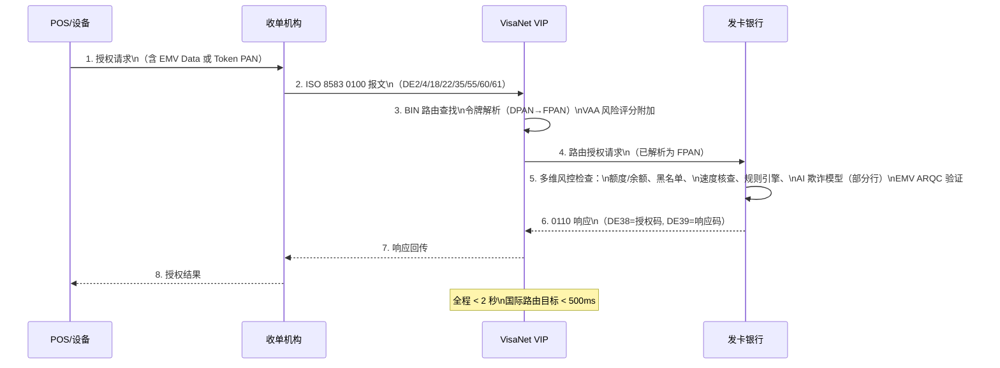

### 7.2 发卡行风控检查项

发卡行收到授权请求后，在毫秒级内完成以下检查：

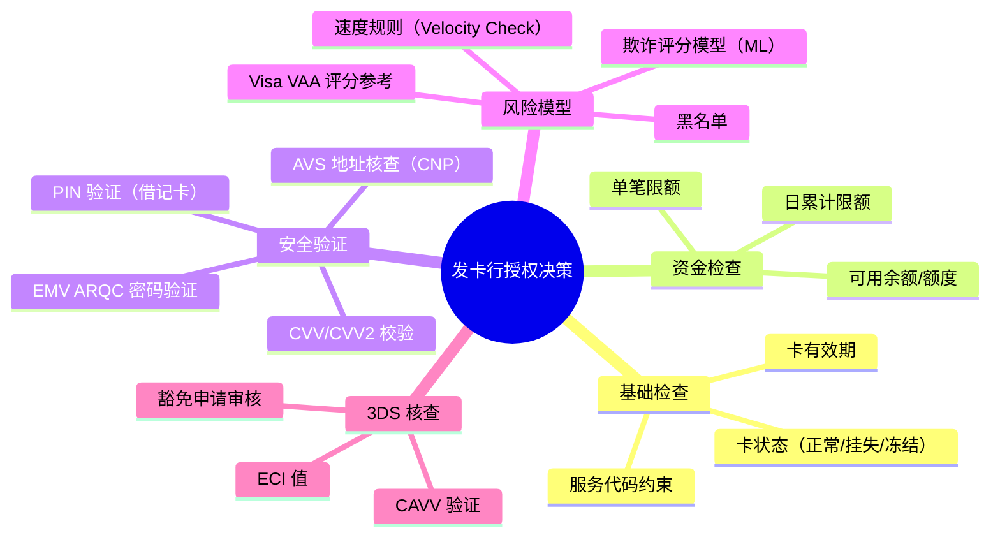

### 7.3 授权类型

| 类型 | 场景 | 说明 |
|------|------|------|
| **标准授权 (Authorization)** | 一般消费 | 冻结额度，等待请款 |
| **预授权 (Pre-Authorization)** | 酒店押金、租车 | 先冻结估算金额，结账时再做 Completion |
| **增量授权 (Incremental Auth)** | 酒店延住、加油 | 在原授权基础上追加金额，无需重新授权 |
| **部分授权 (Partial Auth)** | 礼品卡/预付卡余额不足 | 发卡行返回实际可批准金额，收单侧需处理 split tender |
| **账户验证 (Account Verification)** | 绑卡、开通代扣 | DE3 = `000000`，金额为 $0，仅验证卡有效性 |
| **Zero Dollar Auth** | 同账户验证 | 更规范的叫法，部分发卡行不支持 |

### 7.4 授权有效期与预授权完成

- 标准授权：**7 天**（不同收单行规则略有差异，建议 48h 内请款）
- 酒店/汽车租赁预授权：最长 **31 天**
- 超期未请款：授权自动释放，额度解冻；但商户仍可强制请款（Force Capture），风险由收单机构承担
- 预授权完成（Completion）时，金额可以与预授权金额**不同**，Visa 允许一定比例的调整（酒店 15%，加油无限制）

---

## 八、请款（Clearing/Presentment）

### 8.1 请款文件格式

收单机构每天批量向 Visa 提交请款文件（Clearing File），格式为 **TC（Transaction Code）记录**：

| TC 码 | 含义 |
|-------|------|
| `TC 05` | 普通消费请款（Credit） |
| `TC 06` | 退款请款（Debit to Issuer） |
| `TC 15` | 提前关卡交易（Pre-Auth Complete） |
| `TC 33` | 撤销请款 |

### 8.2 授权金额 vs 请款金额差异

Visa 规则允许请款金额与授权金额有偏差，但设有阈值：

| 商户类型 | 允许超授权金额比例 |
|----------|--------------------|
| **餐厅（MCC 5812/5813）** | +20%（含小费） |
| **加油站（MCC 5541/5542）** | 不限制（实际油量未知） |
| **酒店/租车（MCC 7011/7512）** | +15% |
| **其他** | ±0%（原则上金额一致） |

超出允许偏差提交的请款，会产生 **No Authorization 拒付风险**（Visa 原因码 11.1）。

### 8.3 Late Presentment 规则

请款必须在授权日后 **7 个日历日内**提交，超时提交将被视为 Late Presentment，发卡行有权发起拒付（原因码 12.1）。这是商户端常见的操作失误。

---

## 九、交换费（Interchange）深度解析

交换费是整个支付链路中金额最大、规则最复杂的费用，直接影响商户净收入。

### 9.1 费用结构

```
商户实收 = 交易金额
         - MDR（商户折扣率）
         = 交易金额
         - 交换费（Interchange）      ← 流向发卡行
         - 卡组织评估费（Assessment）  ← 流向 Visa
         - 收单机构溢价（Markup）      ← 收单机构收入
```

### 9.2 美国 Visa 交换费分档（Interchange Categories）

交换费不是固定的，根据多个维度分档：卡类型 × 商户 MCC × 交易渠道 × 认证方式。

| 分类 | 交换费率 | 典型条件 |
|------|----------|----------|
| **CPS/Retail** | 1.51% + $0.10 | 刷卡/芯片、普通信用卡、商户满足 CPS 标准 |
| **CPS/Supermarket** | 1.22% + $0.05 | MCC 5411（超市），信用卡 |
| **Rewards/Signature** | 1.65% + $0.10 | 签名级信用卡（带积分/里程） |
| **Infinite/Premium** | 2.10% + $0.10 | 白金/无限信用卡 |
| **Debit CPS/Retail** | 0.80% + $0.15 | 借记卡（Debit），芯片刷卡 |
| **Regulated Debit** | 0.05% + $0.22 | Durbin 法案管制的借记卡（大型银行发行）|
| **CNP/E-commerce** | 1.80% + $0.10 | 无卡网络支付 |
| **CNP/Rewards** | 2.30% + $0.10 | 无卡网络支付 + 积分卡 |
| **EIRF（降档）** | 2.30% + $0.10 | 不满足 CPS 标准时的惩罚档位 |
| **Standard（最高档）** | 2.70% + $0.10 | 未能满足任何优惠档位 |

> **降档（Downgrade）是商户最大的隐性成本**：如果商户未能在授权请求中传递 CVV2、AVS 数据，或晚于规定时间请款，交易会从 CPS/Retail 降至 EIRF 甚至 Standard，费率差可达 0.8~1.2 个点。高交易量商户每年因降档损失可达数十万美元。

### 9.3 影响档位的关键因素

| 因素 | 影响 | 如何优化 |
|------|------|----------|
| **请款时效** | 超 48h 可能降档 | 每日批量结算，不要积压 |
| **CVV2 传递** | CNP 必传，否则降档 | 确保支付表单采集 CVV2 |
| **AVS（地址核查）** | 部分档位要求 | CNP 场景传递持卡人账单邮编 |
| **MCC 准确性** | 不同 MCC 费率差异巨大 | 与收单机构确认正确 MCC |
| **授权码匹配** | 请款时必须带正确授权码 | 系统层面确保授权码存储 |
| **卡类型** | 借记卡 < 基础信用卡 < 高端卡 | 无法控制，但可引导用户 |
| **3DS 状态** | 部分档位要求 3DS | 接入 3DS 除了安全外还影响费率 |

### 9.4 Visa 评估费（Assessment Fees）

除交换费外，Visa 还收取评估费，直接从清算中扣除：

| 费用项 | 金额/费率 |
|--------|-----------|
| Visa Credit Assessment | 0.14% |
| Visa Debit Assessment | 0.13% |
| Visa Acquirer Processing Fee (APF) | $0.0195/笔 |
| Visa International Processing Fee | 0.45%（跨境） |
| Visa Currency Conversion Fee | 0.50%（货币转换时） |
| Fixed Acquirer Network Fee (FANF) | 按商户月交易量分级，约 $2~$40/月 |

---

## 十、清算（Settlement）

### 10.1 VisaNet 净额清算机制

Visa 采用**多边净额清算**，极大减少实际资金划转量：

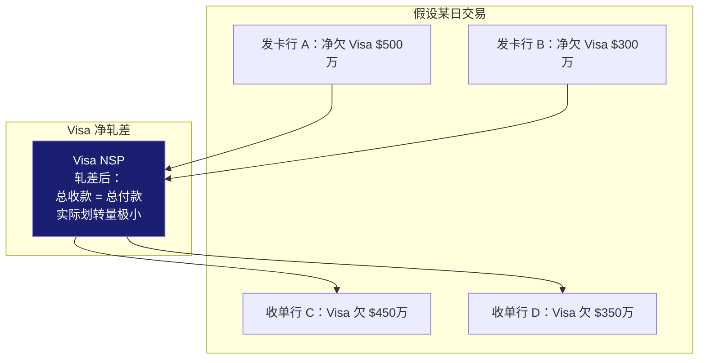

Visa 通过 **NSP（Net Settlement Position）** 每个清算周期（通常一天多次）计算各成员的净头寸：
- **Net Debit Position**：该机构欠 Visa 的净额
- **Net Credit Position**：Visa 欠该机构的净额

### 10.2 清算银行（Settlement Bank）

资金的实际划转不经过 Visa，而是通过各国的清算银行（Settlement Bank）完成：
- 美国：通过 **Fedwire**（美联储实时全额结算系统）
- 欧元区：通过 **TARGET2**
- 中国跨境：通过 **CIPS**（人民币跨境支付系统）

### 10.3 清算时间线

```mermaid
gantt
    title Visa 标准清算时间线（T 为交易日）
    dateFormat  D
    axisFormat Day %d

    section 交易日 T
    持卡人刷卡（实时授权）    :active, auth, 1, 1d

    section T+1
    商户批量提交请款文件       :clearing, 2, 1d
    Visa 汇总当日所有请款      :agg, 2, 1d

    section T+2
    Visa 完成净轧差计算        :netting, 3, 1d
    发送 Settlement Instruction :si, 3, 1d
    清算银行完成资金划转        :funding, 3, 1d

    section T+2/T+3
    收单机构将资金打入商户账户   :merchant, 4, 1d
```

> **T+1 垫资**：部分收单机构（如 Adyen、Stripe）提供 **T+1 甚至 T+0 垫资**给商户，但本质上是收单机构在 Visa 完成清算前自行垫付，商户享受的是收单机构的信用，不是 Visa 的信用。收单机构通过风控模型评估商户可靠性决定是否垫资。

---

## 十一、退款（Refund）与撤销（Void）

### 11.1 退款 vs 撤销

| 对比维度 | 撤销（Void） | 退款（Refund/Credit） |
|---------|------------|---------------------|
| 发起时机 | 授权之后、**请款之前**（当日） | 请款之后（资金已清算） |
| 报文类型 | ISO 8583 `0400` Reversal | TC 06（请款文件中的退款记录） |
| 资金操作 | 授权释放，**无资金划转** | 反向资金流动，等同于一笔收单行付给发卡行的新交易 |
| 手续费 | **不收**交换费和评估费 | 通常退还交换费，但 Visa 评估费**不退** |
| 持卡人到账 | 即时（额度立刻解冻） | 3~7 个工作日 |

> **实战**：商户当天发现错误，优先走 Void（发 `0400` 报文撤销）而非退款，可省下交换费。部分支付网关 Dashboard 的"撤销"按钮实际上发的是 `0400`，超过请款时间则自动转为 Credit Refund，要注意区分。

### 11.2 退款的时效限制

Visa 规定退款不得超过原交易日后 **365 天**。部分发卡行设有更短的接受期限。退款金额不能超过原交易金额（不允许超额退款，但可以部分退款）。

---

## 十二、拒付（Chargeback）—— VCR 流程

Visa 于 2018 年推出 **VCR（Visa Claims Resolution）** 替代旧版拒付流程，精简了时限和争议路径。

### 12.1 VCR 原因码体系

VCR 将拒付原因重新分为 **4 大类**，彻底取代了旧版 3 位数字响应码体系：

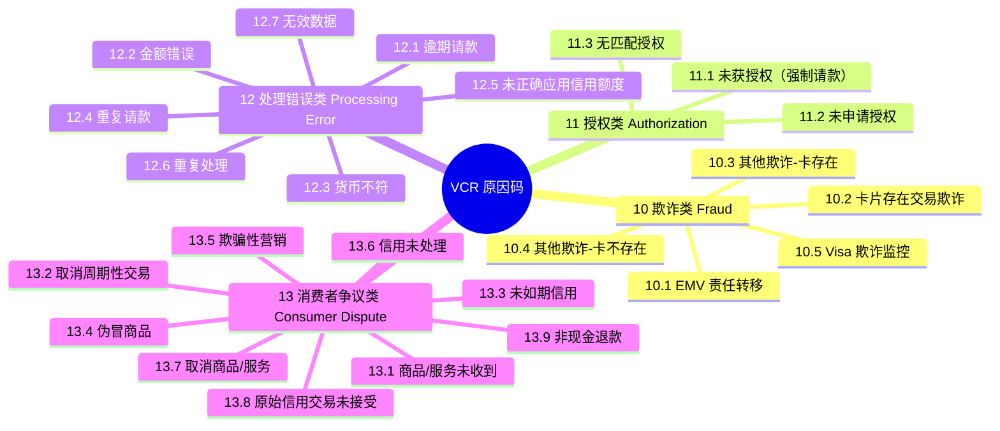

### 12.2 VCR 完整争议流程

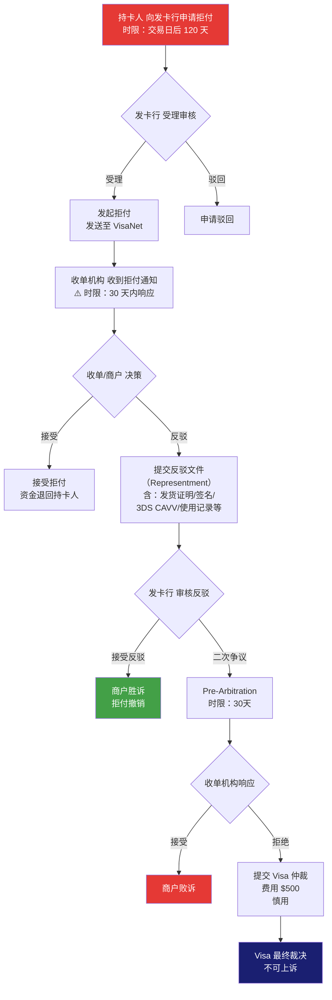

### 12.3 VCR 关键时限

| 节点 | 时限 |
|------|------|
| 持卡人发起拒付 | 交易日后 **120 天**内 |
| 收单机构响应拒付 | **30 天**（旧流程 45 天，VCR 已缩短） |
| 发卡行 Pre-Arbitration | 收单反驳后 **30 天** |
| 收单机构响应 Pre-Arb | **30 天** |
| 提交 Visa 仲裁 | 发生争议后规定期限内 |

> **时限 = 生死线**：任何一方超时未响应，视为自动输。收单机构需要有系统化的拒付管理流程（如 Chargeback Management Platform），确保在截止日前提交材料。

### 12.4 Compelling Evidence 3.0（CE 3.0）

Visa 2023 年推出的 **CE 3.0** 规则是应对"友好欺诈"（Friendly Fraud）的重要机制，主要针对 **10.4（CNP 欺诈）** 原因码。

**CE 3.0 核心逻辑**：如果商户能提供**同一持卡人此前已完成的、无争议的交易记录**，且关键特征一致，发卡行必须接受反驳或者接管责任。

匹配要素（以下 5 项中至少满足 2 项）：
1. 同一设备 ID 或设备指纹
2. 同一 IP 地址
3. 同一收货地址
4. 同一账户登录凭证（邮箱/用户名）
5. 同一设备关联账户

**历史交易要求**：
- 必须是**至少 2 笔**无争议历史交易
- 与被拒付交易时间差在 **120 天以内**
- 历史交易与当前交易共享至少 2 个匹配要素

> **CE 3.0 要求商户做什么**：在交易时系统性采集并存储设备指纹、IP、登录信息等数据，并与交易记录绑定。这对商户的数据采集和存储能力提出了新要求。

### 12.5 欺诈监控项目（FMP）

| 项目 | 触发阈值 | 后果 |
|------|----------|------|
| **VFMP（Visa Fraud Monitoring Program）** | 欺诈率 > 0.65% 且欺诈金额 > $75,000/月 | 警告 → 罚款 $25,000/月 → 关户 |
| **VDMP（Visa Dispute Monitoring Program）** | 拒付率 > 0.65% 或拒付笔数 > 100/月 | 警告 → 罚款 $25,000~$100,000/月 → 关户 |
| **High-Risk Merchant** | 综合评估 | MCC 5816/5912/7995 等高风险类被重点监控 |

> 拒付率计算公式：`拒付笔数（本月） / 交易笔数（本月）`，**不是金额比**。每月初 Visa 统计上月数据，超阈值发警告函，连续 3 个月超标开始罚款。

---

## 十三、分账（Split Funding）

### 13.1 分账模式选择

| 模式 | 实现机制 | 适用场景 | 主要限制 |
|------|----------|----------|----------|
| **Visa Direct（Push Payment）** | 原路推送资金至卖家卡号 | 实时分账，如二手交易平台 | 需要卖家持有 Visa 卡 |
| **多次请款（Multi-Capture）** | 一笔授权多次请款 | 分批发货、里程碑付款 | 每次请款仍需授权码；有时限 |
| **平台垫资 + 内部账本** | 收款后平台按合约转账 | 大多数国内平台分账 | 资金压力、合规要求 |
| **Marketplace/Sub-Merchant** | 收单机构为每个卖家开子商户 | 正规平台分账 | 合规成本高，需 KYC |

### 13.2 Visa Direct 实时支付流程

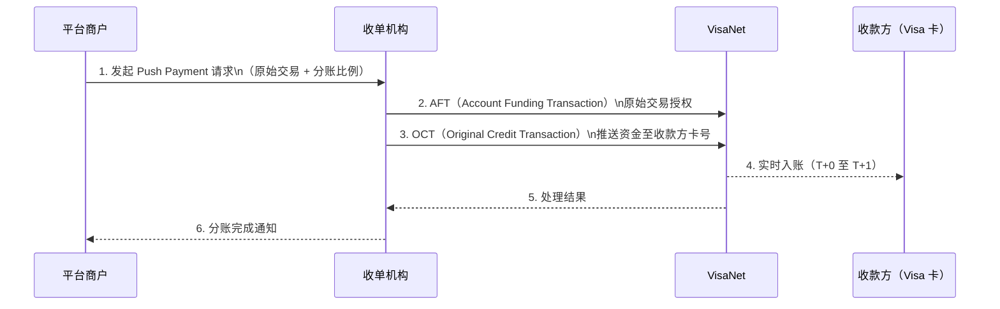

**AFT（Account Funding Transaction）** 和 **OCT（Original Credit Transaction）** 是 Visa Direct 的两个关键报文：AFT 从付款方账户取款，OCT 将资金推送到收款方账户，两者成对使用。

---

## 十四、完整资金流向与时序

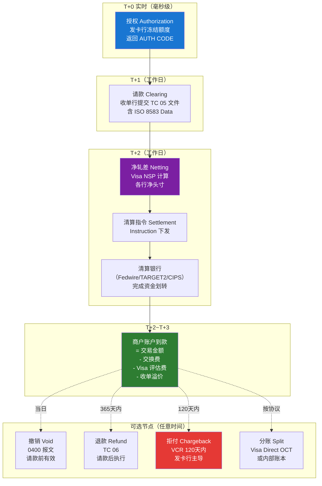

---

## 十五、总结：各阶段核心指标与实操要点

| 阶段 | 核心问题 | 关键技术点 | 常见坑 |
|------|----------|------------|--------|
| **授权** | 这笔钱能扣吗？ | ISO 8583 报文、EMV ARQC、3DS ECI | 响应码 91 未配置 STIP；响应超时未做 Reversal 导致双扣 |
| **请款** | 交易凭证汇总上报 | TC 05/06、请款时限、金额偏差容忍 | 超 48h 请款导致降档；金额超限被拒付 12.2 |
| **交换费** | 费率是否最优？ | CPS 档位标准、AVS/CVV2 传递 | 未传 CVV2 降档至 EIRF；MCC 填错导致费率飙升 |
| **清算** | 轧差后谁欠谁？ | VSS、净额清算、Settlement Bank | 清算银行节假日导致 T+3/T+4 到账，商户不理解 |
| **退款** | 商户主动退钱 | Void vs Refund 选择、时效限制 | 当天用退款而非撤销，多付交换费 |
| **拒付** | 持卡人发起争议 | VCR 原因码、CE 3.0、时限管理 | 超时未响应；无 3DS CAVV 难抵 10.4 欺诈 |
| **分账** | 多方资金分配 | Visa Direct AFT/OCT、Sub-Merchant | OCT 失败未重试导致卖家漏款 |

---

## 附：常用工具与资源

- **Visa Developer Platform**：[developer.visa.com](https://developer.visa.com)，可申请沙箱测试授权/VCR/Visa Direct API
- **VCR Dispute Guidelines**：Visa Merchant Services 后台可下载完整 PDF
- **交换费查询**：Visa Interchange Reimbursement Fees 文档（每年 4 月和 10 月更新）
- **BIN 查询**：Visa BIN Lookup API，用于判断卡类型和发卡国
- **3DS 2.x 测试**：EMVCo 提供测试卡号集合，覆盖 Frictionless/Challenge/Decline 场景

---

*如果你觉得这篇文章有帮助，欢迎分享给需要的朋友。*
